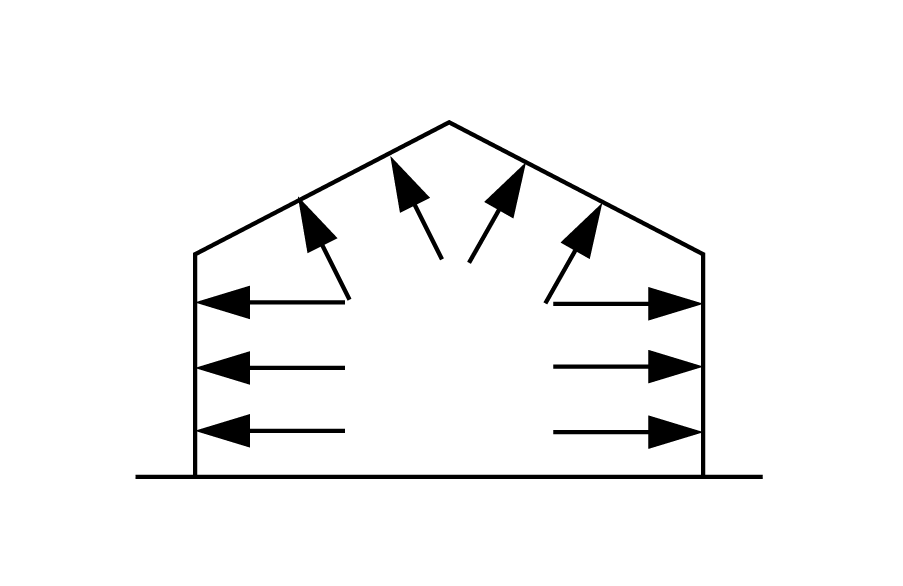
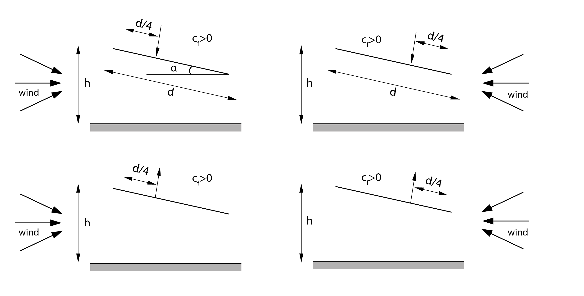
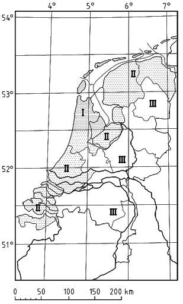

# Veranderlijke belastingen II, wind

De belastingen die worden veroorzaakt door wind zijn aanzienlijk en dienen dan ook met zorg te worden bestudeerd voor de berekeningen. In de Bachelor Bouwkunde mag echter met een vereenvoudigde windbelasting worden gerekend. Voor een meer gedetailleerde berekening of bij gebouwen met afwijkende vorm kan NEN-EN 1991-1-4 Algemene belastingen - Windbelasting geraadpleegd worden.

## Bepalen windbelasting (eenvoudige formule)

<br>

$$
F_i = c_sc_d \cdot c_f \cdot q_p(z_e) \cdot A_{ref}
$$

Zie NEN-EN 1991-1-4 sectie 5.3.

| Symbolen                  | Betekenis                                                      |
|---------------------------|---------------------------------------------------------------|
| $F_i$                   | Windkracht op een constructie of constructie-element          |
| $c_sc_d$                | Bouwwerkfactor¹                                              |
| $c_f$                   | Krachtcoëfficiënt voor de constructie of het constructie-element |
| $q_p(z_e)$              | Extreme stuwdruk op referentiehoogte \(z_e\)²                |
| $A_{ref}$               | Referentie-oppervlakte van de constructie of constructie-element |

*¹ Voor gebouwen met een hoogte kleiner dan 15 m mag voor $c_sc_d$ de waarde 1 zijn genomen. Voor meer informatie raadpleeg NEN-EN 1991-1-4.  
² Voor hoge gebouwen (h>b) mag aangenomen worden dat de stuwdruk afneemt naar de grond toe.*

## Krachtcoëfficiënt $C_f$ voor constructie of constructie-element: gevels en daken

De nettodruk op een wand, dak of element is het verschil tussen de druk op de vlakken aan weerszijden, rekening houdend met het teken van de druk. Overdruk, gericht naar het oppervlak, wordt positief gerekend en onderdruk, weg van het oppervlak, wordt negatief gerekend.

In deze paragraaf worden de krachtcoëfficiënten behandeld. De methode wordt hier uitgelegd aan de hand van een eenvoudig gebouw, gezien de Eurocode erg uitgebreid is. Gebruik NEN-EN 1991-1-4 voor meer gecompliceerde gebouwvormen.

Allereerst moeten de verschillende windbelastingen worden bepaald: de krachtcoëfficiënten die corresponderen met de verschillende windzones zijn afhankelijk van de geometrie van het gebouw. Krachtcoëfficiënten zijn gegeven voor bepaalde standaardwaarden, voor andere waarden is interpolatie toegestaan. In deze paragraaf zijn uitsluitend krachtcoëfficiënten gegeven die horen bij grote oppervlakken (>10m²). Zie NEN-EN-1999 1-1-4 voor kleinere oppervlakken.

| Positieve uitwendige druk | Positieve inwendige druk |
|---------------------------|---------------------------|
|  |  |

Beide krachten worden gecombineerd in een ongunstige situatie.

## Parameters constructie

- $h$ = referentiehoogte [m]
- $d$ = afmeting in windrichting [m]
- $b$ = afmeting loodrecht op de windrichting [m]
- $e$ = $b$ of $2h$, kleinste waarde is maatgevend

Let op dat voor beide windrichtingen verschillende parameters gelden.

```{figure} Images/543_parameters.png
---
scale: 25%
name: Parameters
---
```

## Windzones voor gevels

De verschillende windzones voor de gevels van een gebouw zijn hieronder weergegeven. Het aantal windzones op de gevel varieert van 1 tot 3, afhankelijk van de waardes van $e$ en $d$. Voor gebouwen met een zadeldak gelden dezelfde zones. De waarde van $h$ dient dan genomen te worden als de hoogte van de nok boven maaiveldniveau. De parameters $e$ en $d$jaa zijn hierboven gedefinieerd.

```{figure} Images/544_windzones_gevels.png
---
scale: 25%
---
```

```{figure} Images/544_windzones_gevels_2.png
---
scale: 25%
---
```


<div style="max-height: 400px; overflow-y: auto;">
    <table style="width: 100%; border-collapse: collapse;">
        <thead style="position: sticky; top: 0; background-color: #f2f2f2;">
            <tr>
                <th>Gevels</th>
                <th colspan="5" style="text-align: center;">Krachtcoëfficiënt C<sub>f</sub> voor zone</th>
            </tr>
            <tr>
                <th style="width: 250px;">h/d</th>
                <th>A</th>
                <th>B</th>
                <th>C</th>
                <th>D</th>
                <th>E</th>
            </tr>
        </thead>
        <tbody>
            <tr><td>5</td><td>-1,2</td><td>-0,8</td><td>-0,5</td><td>+0,8</td><td>-0,7</td></tr>
            <tr><td>1</td><td>-1,2</td><td>-0,8</td><td>-0,5</td><td>+0,8</td><td>-0,5</td></tr>
            <tr><td>&#x2265; 0,25</td><td>-1,2</td><td>-0,8</td><td>-0,5</td><td>+0,7</td><td>-0,3</td></tr>
        </tbody>
    </table>
</div>


## Windzones voor platte daken

```{figure} Images/545_windonzes_platte_daken.png
---
scale: 25%
name: Windzones platte daken
---
```

<div style="max-height: 400px; overflow-y: auto;">
    <table style="width: 100%; border-collapse: collapse;">
        <thead style="position: sticky; top: 0; background-color: #f2f2f2;">
            <tr>
                <th>Platte daken</th>
                <th colspan="4">Krachtcoëfficiënt C_f voor zone</th>
            </tr>
            <tr>
                <th style="width: 250px;">type</th>
                <th>F</th>
                <th>G</th>
                <th>H</th>
                <th>I</th>
            </tr>
        </thead>
        <tbody>
            <tr><td>scherpe dakranden</td><td>-1,8</td><td>-1,2</td><td>-0,7</td><td>+0,2/-0,2</td></tr>
        </tbody>
    </table>
</div>


Op andere randen zijn mogelijk lagere krachtcoëfficiënten van toepassing, zie NEN-EN-1991-1-4.

## Windzones voor zadeldaken

```{figure} Images/546_windzones_duopitched.png
---
scale: 25%
---
```


<div style="max-height: 400px; overflow-y: auto;">
    <table style="width: 100%; border-collapse: collapse;">
        <thead style="position: sticky; top: 0; background-color: #f2f2f2;">
            <tr>
                <th>Zadeldaken θ = 0</th>
                <th colspan="5">Krachtcoëfficiënt C<sub>f</sub> voor zone</th>
            </tr>
            <tr>
                <th style="width: 250px;">hellingshoek α</th>
                <th>F</th>
                <th>G</th>
                <th>H</th>
                <th>I</th>
                <th>J</th>
            </tr>
        </thead>
        <tbody>
            <tr><td>5°</td><td>-1,7</td><td>-1,2</td><td>-0,6</td><td>-0,6</td><td>+0,2</td></tr>
            <tr><td></td><td>+0,0</td><td>+0,0</td><td>+0,0</td><td>-0,6</td><td>-0,6</td></tr>
            <tr><td>15°</td><td>-0,9</td><td>-0,8</td><td>-0,3</td><td>-0,4</td><td>-1,0</td></tr>
            <tr><td></td><td>+0,2</td><td>+0,2</td><td>+0,2</td><td>0,0</td><td>0,0</td></tr>
            <tr><td>30°</td><td>-0,5</td><td>-0,5</td><td>-0,2</td><td>-0,4</td><td>-0,5</td></tr>
            <tr><td></td><td>+0,7</td><td>+0,7</td><td>+0,4</td><td>+0,0</td><td>+0,0</td></tr>
            <tr><td>45°</td><td>-0,0</td><td>-0,0</td><td>-0,0</td><td>-0,2</td><td>-0,3</td></tr>
            <tr><td></td><td>+0,7</td><td>+0,7</td><td>+0,6</td><td>+0,0</td><td>+0,0</td></tr>
            <tr><td>60°</td><td>+0,7</td><td>+0,7</td><td>+0,7</td><td>-0,2</td><td>-0,3</td></tr>
            <tr><td>75°</td><td>+0,8</td><td>+0,8</td><td>+0,8</td><td>-0,2</td><td>-0,3</td></tr>
        </tbody>
    </table>
</div>


<div style="max-height: 400px; overflow-y: auto;">
    <table style="width: 100%; border-collapse: collapse;">
        <thead style="position: sticky; top: 0; background-color: #f2f2f2;">
            <tr>
                <th>Zadeldaken θ = 90</th>
                <th colspan="4">Krachtcoëfficiënt C<sub>f</sub> voor zone</th>
            </tr>
            <tr>
                <th style="width: 250px;">hellingshoek α</th>
                <th>F</th>
                <th>G</th>
                <th>H</th>
                <th>I</th>
            </tr>
        </thead>
        <tbody>
            <tr><td>5°</td><td>-1,6</td><td>-2,2</td><td>-0,7</td><td>-0,6</td></tr>
            <tr><td>15°</td><td>-1,3</td><td>-2,0</td><td>-0,6</td><td>-0,5</td></tr>
            <tr><td>30°</td><td>-1,1</td><td>-1,5</td><td>-0,8</td><td>-0,5</td></tr>
            <tr><td>45°</td><td>-1,1</td><td>-1,5</td><td>-0,9</td><td>-0,5</td></tr>
            <tr><td>60°</td><td>-1,1</td><td>-1,5</td><td>-0,8</td><td>-0,5</td></tr>
            <tr><td>75°</td><td>-1,1</td><td>-1,5</td><td>-0,8</td><td>-0,5</td></tr>
        </tbody>
    </table>
</div>


## Windzones voor open overkappingen

Een open overkapping is een dak van een constructie die geen blijvende gevels heeft, zoals benzinestations en kapschuren. Een resultante kracht kan worden bepaald voor open overkappingen (zonder gebruik van windzones). Deze kracht vertegenwoordigt het effect van alle windzones op de totale constructie. De kracht werkt op de punten zoals hieronder weergegeven, en wordt berekend met dezelfde formule als voor andere windbelastingen. De plek waar de kracht op aangrijpt is afhankelijk van de geometrie en het teken van de gehele krachtcoëfficient.



Lokaal kan de winddruk of -zuiging op de overkapping natuurlijk groter zijn dan het gemiddelde. Voor het ontwerp van dakelementen en bevestigingen dienen deze lokale belastingen meegenomen te worden. Voor het rekenen aan lokale windkrachten wordt de overkapping onderverdeeld in verschillende windzones, zoals hieronder weergegeven.

```{figure} Images/547_windzones_canopies_2.png
---
scale: 25%
name: Windzones Canopies 2
---
```

De blokkeringsgraad onder een open overkapping is weergegeven in onderstaande figuur. Deze is afhankelijk van de blokkering $\varphi$, wat de verhouding beschrijft tussen de oppervlakte van werkelijk aannemelijke obstakels onder de overkapping en de oppervlakte onder de overkapping, dwars op de wind. Beide oppervlakten staan loodrecht op de windrichting. $\mathsf{\varphi=0}$ betekent een lege overkapping, $\mathsf{\varphi=1}$ betekent een overkapping volledig gevuld aan lijzijde van het dak (dit is geen gesloten gebouw).


<div style="max-height: 400px; overflow-y: auto;">
    <table style="width: 100%; border-collapse: collapse;">
        <thead style="position: sticky; top: 0; background-color: #f2f2f2;">
            <tr>
                <th>Lessenaarsdaken</th>
                <th> </th>
                <th> </th>
                <th colspan="3">Krachtcoëfficiënt C<sub>f</sub> voor zone</th>
            </tr>
            <tr>
                <th style="width: 100px;">Dakhelling α</th>
                <th style="width: 200px;">blokkering Φ</th>
                <th>globale kracht- <br> coëfficient C<sub>f</sub></th>
                <th>A</th>
                <th>B</th>
                <th>C</th>
            </tr>
        </thead>
        <tbody>
            <tr><td>0°</td><td>Maximaal voor alle Φ</td><td>+0,2</td><td>+0,5</td><td>+1,8</td><td>+1,1</td></tr>
            <tr><td></td><td>Minimaal voor Φ=0</td><td>-0,5</td><td>-0,6</td><td>-1,3</td><td>-1,4</td></tr>
            <tr><td></td><td>Minimaal voor Φ=1</td><td>-1,3</td><td>-1,5</td><td>-1,8</td><td>-2,2</td></tr>
            <tr><td>5°</td><td>Maximaal voor alle Φ</td><td>+0,4</td><td>+0,8</td><td>+2,1</td><td>+1,3</td></tr>
            <tr><td></td><td>Minimaal voor Φ=0</td><td>-0,7</td><td>-1,1</td><td>-1,7</td><td>-1,8</td></tr>
            <tr><td></td><td>Minimaal voor Φ=1</td><td>-1,4</td><td>-1,6</td><td>-2,2</td><td>-2,5</td></tr>
            <tr><td>10°</td><td>Maximaal voor alle Φ</td><td>+0,5</td><td>+1,2</td><td>+2,4</td><td>+1,6</td></tr>
            <tr><td></td><td>Minimaal voor Φ=0</td><td>-0,9</td><td>-1,5</td><td>-2,0</td><td>-2,1</td></tr>
            <tr><td></td><td>Minimaal voor Φ=1</td><td>-1,4</td><td>-2,1</td><td>-2,6</td><td>-2,7</td></tr>
            <tr><td>15°</td><td>Maximaal voor alle Φ</td><td>+0,7</td><td>+1,4</td><td>+2,7</td><td>+1,8</td></tr>
            <tr><td></td><td>Minimaal voor Φ=0</td><td>-1,1</td><td>-1,8</td><td>-2,4</td><td>-2,5</td></tr>
            <tr><td></td><td>Minimaal voor Φ=1</td><td>+1,4</td><td>-1,6</td><td>-2,9</td><td>-3,0</td></tr>
            <tr><td>20°</td><td>Maximaal voor alle Φ</td><td>+0,8</td><td>+1,7</td><td>+2,9</td><td>+2,1</td></tr>
            <tr><td></td><td>Minimaal voor Φ=0</td><td>-1,3</td><td>-2,2</td><td>-2,8</td><td>-2,9</td></tr>
            <tr><td></td><td>Minimaal voor Φ=1</td><td>-1,4</td><td>-1,6</td><td>-2,29</td><td>-3,0</td></tr>
            <tr><td>25°</td><td>Maximaal voor alle Φ</td><td>+1,0</td><td>+2,0</td><td>+3,1</td><td>+2,3</td></tr>
            <tr><td></td><td>Minimaal voor Φ=0</td><td>-1,6</td><td>-2,6</td><td>-3,2</td><td>-3,2</td></tr>
            <tr><td></td><td>Minimaal voor Φ=1</td><td>-1,4</td><td>-1,5</td><td>-2,5</td><td>-2,8</td></tr>
            <tr><td>30°</td><td>Maximaal voor alle Φ</td><td>+1,2</td><td>+2,2</td><td>+3,2</td><td>+2,4</td></tr>
            <tr><td></td><td>Minimaal voor Φ=0</td><td>-1,8</td><td>-3,0</td><td>-3,8</td><td>-3,6</td></tr>
            <tr><td></td><td>Minimaal voor Φ=1</td><td>-1,4</td><td>-1,5</td><td>-2,2</td><td>-2,7</td></tr>
        </tbody>
    </table>
</div>


Voor $\mathsf{\theta=0}$, tussen $\mathsf{\alpha=0°}$ en $\mathsf{\alpha=45°}$ varieert de winddruk snel tussen positieve en negatieve waarden. Voor deze daken dienen vier gevallen te worden beschouwd, waar de grootste of kleinste waarden van alle zones F, G en H worden gecombineerd met de grootste of kleinste waarden in gebieden I en J. Het is niet toegestaan om positieve en negatieve waarden te combineren op hetzelfde vlak.

### Krachtcoëfficienten C$\mathsf{_{fr}}$ voor wrijving

Op vlakken parallel aan de windrichting werkt windwrijving. Voor ontwerpdoeleinden mag het worden aangenomen dat deze kracht werkt langs alle vlakken parallel aan de windrichting. Volgens NEN-EN-1991-1-4 kan dit afhankelijk van de geometrie worden gereduceerd.

| oppervlakten        | wrijvingscoëfficiënt $\mathsf{c_{fr}}$ |
|---------------------|-------------------------------------|
| glad (bijvoorbeeld staal, glad beton) | 0,01 |
| ruw (bijvoorbeeld ruwe beton, beteerde boorden) | 0,02 |
| zeer ruw (bijvoorbeeld rimpels, rubben, kronkelingen) | 0,04 |

### Krachtcoëfficienten C$\mathsf{_f}$ voor inwendige druk

De krachtcoefficiënten voor inwendige druk zijn afhankelijk van het aantal openingen in de gevel en de geometrie van het gebouw. Om overgecompliceerde berekeningen tijdens het ontwerpen te vermijden, wordt in NEN-EN-1991-1-4 vermeld: *"Wanneer in ten minste twee zijden van het gebouw (gevels of dak) de totale oppervlakte van de openingen per zijde meer is dan 30% van de oppervlakte van deze zijde, behoren de belastingen op de constructie niet te zijn berekend volgens de regels gegeven in deze paragraaf, maar behoren in plaats daarvan de regels van 7.3 en 7.4 (open overkappingen) te zijn gebruikt."*

### Windregio's in Nederland

De grootte van de extreme stuwdruk wordt bepaald door de gebouwhoogte, de plaats waar het gebouw staat en of rond het bouwwerk al of niet is gebouwd. Nederland is opgedeeld in drie regio’s, waarvan de windstuwdruk varieert. In de kustprovincies waait het harder dan in de landprovincies. Voor een gebouw direct langs de kust geldt een nog grotere windbelasting. Hieronder is de kaart opgenomen waarin de verschillende windregio's zijn aangegeven.



### Extreme stuwdruk $q_p$ $(Z_e)$

De grootte van de windbelasting wordt bepaald door de windstuwdruk. Voor de basisstuwdruk geldt de formule 

$q_p = 0,5 \cdot \rho \cdot v^2$

Hierin is $\rho$ de dichtheid van de lucht en $v$ de windsnelheid. De luchtdichtheid is afhankelijk van de hoogte, de temperatuur en de luchtdruk. In de Nationale Bijlage bij de NEN-EN 1991 deel 1-4 wordt voor de luchtdichtheid van 1,25 kg/m^3 aangehouden. Bij het bepalen van de windbelasting moet worden gerekend met de extreme stuwdruk op de referentiehoogte z:

$q_p(z) = C_e(z) \cdot q_b$  
(*waarbij $C_e$ de blootstellingsfactor is*)

Onderstaand is een tabel opgenomen waarin de verschillende waarden voor de extreme stuwdruk zijn weergegeven.


<div style="max-height: 400px; overflow-y: auto;">
    <table style="width: 100%; border-collapse: collapse;">
        <thead style="position: sticky; top: 0; background-color: #f2f2f2;">
            <tr>
                <th > </th>
                <th colspan="3">Regio 1</th>
                <th colspan="3">Regio 2</th>
                <th colspan="2">Regio 3</th>
            </tr>
            <tr>
                <th>Z<sub>e</sub> [m]</th>           
                <th>kust</th>
                <th>onbebouwd</th>
                <th>bebouwd</th>
                <th>kust</th>
                <th>onbebouwd</th>
                <th>bebouwd</th>
                <th>onbebouwd</th>
                <th>bebouwd</th>
            </tr>
        </thead>
        <tbody>
            <tr><td>1</td><td>0,93</td><td>0,71</td><td>0,69</td><td>0,78</td><td>0,60</td><td>0,58</td><td>0,49</td><td>0,48</td></tr>
            <tr><td>2</td><td>1,11</td><td>0,71</td><td>0,69</td><td>0,93</td><td>0,60</td><td>0,58</td><td>0,49</td><td>0,48</td></tr>
            <tr><td>3</td><td>1,22</td><td>0,71</td><td>0,69</td><td>1,02</td><td>0,60</td><td>0,58</td><td>0,49</td><td>0,48</td></tr>
            <tr><td>4</td><td>1,30</td><td>0,71</td><td>0,69</td><td>1,09</td><td>0,60</td><td>0,58</td><td>0,49</td><td>0,48</td></tr>
            <tr><td>5</td><td>1,37</td><td>0,78</td><td>0,69</td><td>1,14</td><td>0,66</td><td>0,58</td><td>0,54</td><td>0,48</td></tr>
            <tr><td>6</td><td>1,42</td><td>0,84</td><td>0,69</td><td>1,19</td><td>0,71</td><td>0,58</td><td>0,58</td><td>0,48</td></tr>
            <tr><td>7</td><td>1,47</td><td>0,89</td><td>0,69</td><td>1,23</td><td>0,75</td><td>0,58</td><td>0,62</td><td>0,48</td></tr>
            <tr><td>8</td><td>1,51</td><td>0,94</td><td>0,73</td><td>1,26</td><td>0,79</td><td>0,62</td><td>0,65</td><td>0,51</td></tr>
            <tr><td>9</td><td>1,55</td><td>0,98</td><td>0,77</td><td>1,29</td><td>0,82</td><td>0,65</td><td>0,68</td><td>0,53</td></tr>
            <tr><td>10</td><td>1,58</td><td>1,02</td><td>0,81</td><td>1,32</td><td>0,85</td><td>0,68</td><td>0,70</td><td>0,56</td></tr>
            <tr><td>15</td><td>1,71</td><td>1,16</td><td>0,96</td><td>1,43</td><td>0,98</td><td>0,80</td><td>0,80</td><td>0,66</td></tr>
            <tr><td>20</td><td>1,80</td><td>1,27</td><td>1,07</td><td>1,51</td><td>1,07</td><td>0,90</td><td>0,88</td><td>0,74</td></tr>
            <tr><td>25</td><td>1,88</td><td>1,36</td><td>1,16</td><td>1,57</td><td>1,14</td><td>0,97</td><td>0,94</td><td>0,80</td></tr>
            <tr><td>30</td><td>1,94</td><td>1,43</td><td>1,23</td><td>1,63</td><td>1,20</td><td>1,03</td><td>0,99</td><td>0,85</td></tr>
            <tr><td>35</td><td>2,00</td><td>1,50</td><td>1,30</td><td>1,67</td><td>1,25</td><td>1,09</td><td>1,03</td><td>0,89</td></tr>
            <tr><td>40</td><td>2,04</td><td>1,55</td><td>1,35</td><td>1,71</td><td>1,30</td><td>1,13</td><td>1,07</td><td>0,93</td></tr>
            <tr><td>45</td><td>2,09</td><td>1,60</td><td>1,40</td><td>1,75</td><td>1,34</td><td>1,17</td><td>1,11</td><td>0,97</td></tr>
            <tr><td>50</td><td>2,21</td><td>1,65</td><td>1,45</td><td>1,78</td><td>1,38</td><td>1,21</td><td>1,14</td><td>1,00</td></tr>
            <tr><td>55</td><td>2,16</td><td>1,69</td><td>1,49</td><td>1,81</td><td>1,42</td><td>1,25</td><td>1,17</td><td>1,03</td></tr>
            <tr><td>60</td><td>2,19</td><td>1,73</td><td>1,53</td><td>1,83</td><td>1,45</td><td>1,28</td><td>1,19</td><td>1,05</td></tr>
            <tr><td>65</td><td>2,22</td><td>1,76</td><td>1,57</td><td>1,86</td><td>1,48</td><td>1,31</td><td>1,22</td><td>1,08</td></tr>
            <tr><td>70</td><td>2,25</td><td>1,80</td><td>1,60</td><td>1,88</td><td>1,50</td><td>1,34</td><td>1,24</td><td>1,10</td></tr>
            <tr><td>75</td><td>2,27</td><td>1,83</td><td>1,63</td><td>1,90</td><td>1,53</td><td>1,37</td><td>1,26</td><td>1,12</td></tr>
            <tr><td>80</td><td>2,30</td><td>1,87</td><td>1,67</td><td>1,92</td><td>1,56</td><td>1,39</td><td>1,28</td><td>1,14</td></tr>
            <tr><td>85</td><td>2,32</td><td>1,90</td><td>1,70</td><td>1,94</td><td>1,59</td><td>1,42</td><td>1,29</td><td>1,16</td></tr>
            <tr><td>90</td><td>2,34</td><td>1,92</td><td>1,73</td><td>1,95</td><td>1,61</td><td>1,44</td><td>1,30</td><td>1,17</td></tr>
        </tbody>
    </table>
</div>
