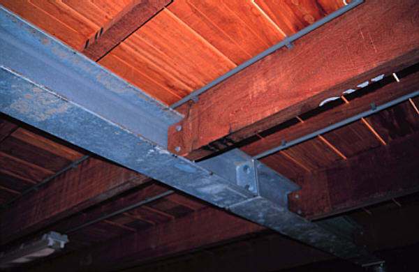
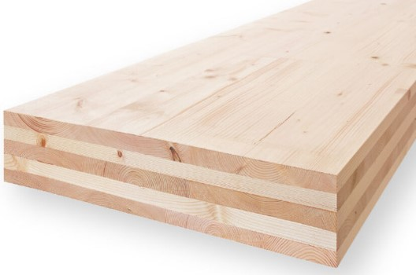

# Hout 

**Producten:**

| Rondhout | | |
|---|---|---|
|  |  |  |

**Rondhout** wordt gebruikt voor uiteenlopende constructies, zoals bruggen, houten torens, gebouwen en heipalen. In de architectuur van deze tijd zijn stammen terug te vinden in bijvoorbeeld de eiken kolommen van het expogebouw van MVRDV in Hannover.

<br>

| Gezaagd hout | | |
|---|---|---|
|  |  |  |

**Gezaagd hout** wordt in allerlei toepassingen gevonden, zoals kleinere constructies, daken van woningen, vloeren (balken en gordingen), en vakwerken. Hout wordt ook veel toegepast vanwege de gunstige eigenschappen bij brand (isolerend verkoolde laag).

<br>

| Gelijms gelamineerd hout | | |
|---|---|---|
|  |  |  |

**Gelijmd gelamineerd hout** wordt veel gebruikt vanwege de vele vormen en bijna oneindige lengtematen die te fabriceren zijn. Overigens moet altijd rekening gehouden worden met het vervoer van dergelijke lange elementen. Grote overspanningen, driescharnierspanten, en portaalspanten zijn mogelijk in hout.

<br>

| Cross Laminated Timber (CLT) | | |
|---|---|---|
|  |  |  |

**Cross Laminated Timber (CLT)** bestaat uit kruislings gelijmde houten delen en is geschikt als constructieve en woningscheidende wanden, binnenspouwblad en woningscheidende vloeren.

<br>

| Houtskeletbouw (HSB) | | |
|---|---|---|
|  |  |  |

**Houtskeletbouw (HSB)** bestaat uit houten frames met isolatie erin, geschikt om te gebruiken als constructieve, woningscheidende wanden en binnenspouwblad.

HSB-elementen zijn vaak een stuk goedkoper dan CLT, maar vanwege de geringere stabiliteit kan een gebouw met een HSB-constructie vaak niet uit meer dan 3 lagen bestaan.

Een combinatie van HSB en CLT is daarom zeer geschikt voor de seriematige woningbouw:

- Tot en met 4 lagen: HSB constructie met CLT vloeren
- Vanaf 4 lagen: “tunnelen” met CLT en de gevels dichtzetten met (prefab) HSB.


## Sterkteklassen

**Gezaagd hout**

<div style="max-height: 400px; overflow-y: auto;">
    <table style="width: 100%; border-collapse: collapse;">
        <thead style="position: sticky; top: 0; background-color: #f2f2f2;">
            <tr>
                <th style="width: 200px;">Materiaaleigenschap</th>
                <th></th>
                <th colspan="20" style="text-align: center;">Sterkteklasse</th>
            </tr>
            <tr>
                <th></th>
                <th></th>
                <th>C14</th>
                <th>C16</th>
                <th>C18</th>
                <th>C20</th>
                <th>C22</th>
                <th>C24</th>
                <th>C27</th>
                <th>C30</th>
                <th>C35</th>
                <th>C40</th>
                <th>C45</th>
                <th>C50</th>
                <th>D18</th>
                <th>D24</th>
                <th>D30</th>
                <th>D35</th>
                <th>D40</th>
                <th>D50</th>
                <th>D60</th>
                <th>D70</th>
            </tr>
        </thead>
        <tbody>
            <tr><td>buigsterkte</td><td>f<sub>m;k</sub></td><td>14</td><td>16</td><td>18</td><td>20</td><td>22</td><td>24</td><td>27</td><td>30</td><td>35</td><td>40</td><td>45</td><td>50</td><td>18</td><td>24</td><td>30</td><td>35</td><td>40</td><td>50</td><td>60</td><td>70</td></tr>
            <tr><td>treksterkte //</td><td>f<sub>t;0;k</sub></td><td>7,2</td><td>8,5</td><td>10</td><td>11,5</td><td>13</td><td>14,5</td><td>16,5</td><td>19</td><td>22,5</td><td>26</td><td>30</td><td>33,5</td><td>11</td><td>14</td><td>18</td><td>21</td><td>24</td><td>30</td><td>36</td><td>42</td></tr>
            <tr><td>treksterkte ⊥</td><td>f<sub>t;90;k</sub></td><td>0,4</td><td>0,4</td><td>0,4</td><td>0,4</td><td>0,4</td><td>0,4</td><td>0,4</td><td>0,4</td><td>0,4</td><td>0,4</td><td>0,4</td><td>0,4</td><td>0,6</td><td>0,6</td><td>0,6</td><td>0,6</td><td>0,6</td><td>0,6</td><td>0,6</td><td>0,6</td></tr>
            <tr><td>druksterkte //</td><td>f<sub>c;0;k</sub></td><td>16</td><td>17</td><td>18</td><td>19</td><td>20</td><td>21</td><td>22</td><td>24</td><td>25</td><td>27</td><td>29</td><td>30</td><td>18</td><td>21</td><td>24</td><td>25</td><td>27</td><td>30</td><td>33</td><td>36</td></tr>
            <tr><td>druksterkte ⊥</td><td>f<sub>c;90;k</sub></td><td>2,0</td><td>2,2</td><td>2,2</td><td>2,3</td><td>2,4</td><td>2,5</td><td>2,5</td><td>2,7</td><td>2,8</td><td>2,8</td><td>3,9</td><td>3,0</td><td>4,8</td><td>4,9</td><td>5,3</td><td>5,4</td><td>5,5</td><td>6,2</td><td>10,5</td><td>12,0</td></tr>
            <tr><td>schuifsterkte</td><td>f<sub>v;k</sub></td><td>3,0</td><td>3,2</td><td>3,4</td><td>3,6</td><td>3,8</td><td>4,0</td><td>4,0</td><td>4,0</td><td>4,0</td><td>4,0</td><td>4,0</td><td>4,0</td><td>3,5</td><td>3,7</td><td>3,9</td><td>4,1</td><td>4,2</td><td>4,5</td><td>4,8</td><td>5,0</td></tr>
            <tr><td>elasticiteitsmodulus //</td><td>E<sub>0;mean</sub></td><td>7000</td><td>8000</td><td>9000</td><td>9500</td><td>10000</td><td>11000</td><td>11500</td><td>12000</td><td>13000</td><td>14000</td><td>15000</td><td>16000</td><td>9500</td><td>10000</td><td>11000</td><td>12000</td><td>13000</td><td>14000</td><td>17000</td><td>20000</td></tr>
            <tr><td>5% elasticiteitsmodulus //</td><td>E<sub>0,05</sub></td><td>4700</td><td>5400</td><td>6000</td><td>6400</td><td>6700</td><td>7400</td><td>7700</td><td>8000</td><td>8700</td><td>9400</td><td>10100</td><td>10700</td><td>8000</td><td>8400</td><td>9200</td><td>10100</td><td>10900</td><td>11800</td><td>14300</td><td>16800</td></tr>
            <tr><td>elasticiteitsmodulus ⊥</td><td>E<sub>90;mean</sub></td><td>230</td><td>270</td><td>300</td><td>320</td><td>330</td><td>370</td><td>380</td><td>400</td><td>430</td><td>470</td><td>500</td><td>530</td><td>630</td><td>670</td><td>730</td><td>800</td><td>870</td><td>930</td><td>1130</td><td>1330</td></tr>
            <tr><td>afschuifmodulus</td><td>G<sub>mean</sub></td><td>440</td><td>500</td><td>560</td><td>590</td><td>630</td><td>690</td><td>720</td><td>750</td><td>810</td><td>880</td><td>940</td><td>1000</td><td>590</td><td>630</td><td>690</td><td>750</td><td>810</td><td>880</td><td>1060</td><td>1250</td></tr>
            <tr><td>5% volumieke massa</td><td>ρ</td><td>290</td><td>310</td><td>320</td><td>330</td><td>340</td><td>350</td><td>360</td><td>380</td><td>390</td><td>400</td><td>410</td><td>430</td><td>475</td><td>485</td><td>530</td><td>540</td><td>550</td><td>620</td><td>700</td><td>800</td></tr>
            <tr><td>volumieke massa</td><td>ρ</td><td>350</td><td>370</td><td>380</td><td>400</td><td>410</td><td>420</td><td>430</td><td>460</td><td>470</td><td>480</td><td>490</td><td>520</td><td>570</td><td>580</td><td>640</td><td>650</td><td>660</td><td>740</td><td>840</td><td>960</td></tr>
        </tbody>
    </table>
</div>

<br>

Tabel 1 - Sterkteklasses voor zachthout, gebaseerd op 'edgewise' buigtesten (aan de smalle rand) - sterkte-, stijfheid-, en dichtheidswaarden - NEN-EN 338:2016 hout voor constructieve toepassingen - Sterkteklassen. Dit zijn karakteristieke waardes, niet de rekenwaardes.

<br>

**Gelijmd gelamineerd hout**

<div style="max-height: 400px; overflow-y: auto;">
    <table style="width: 100%; border-collapse: collapse;">
        <thead style="position: sticky; top: 0; background-color: #f2f2f2;">
            <tr>
                <th style="width: 300px;">Materiaaleigenschap</th>
                <th></th>
                <th colspan="3">Sterkteklasse</th>
            </tr>
            <tr>
                <th style="width: 200px;"></th>
                <th style="width: 100px;"></th>
                <th style="width: 100px;">GL24h</th>
                <th style="width: 100px;">GL28h</th>
                <th style="width: 200px;">GL32h</th>
            </tr>
        </thead>
        <tbody>
            <tr><td>buigsterkte</td><td>f<sub>m;k</sub></td><td>24</td><td>28</td><td>32</td></tr>
            <tr><td>treksterkte //</td><td>f<sub>t;0;k</sub></td><td>19,2</td><td>22,3</td><td>25,6</td></tr>
            <tr><td>treksterkte ⊥</td><td>f<sub>t;90;k</sub></td><td>0,5</td><td>0,5</td><td>0,5</td></tr>
            <tr><td>druksterkte //</td><td>f<sub>c;0;k</sub></td><td>24</td><td>28</td><td>32</td></tr>
            <tr><td>druksterkte ⊥</td><td>f<sub>c;90;k</sub></td><td>2,5</td><td>2,5</td><td>2,5</td></tr>
            <tr><td>schuifsterkte</td><td>f<sub>v;k</sub></td><td>3,5</td><td>3,5</td><td>3,5</td></tr>
            <tr><td>elasticiteitsmodulus //</td><td>E<sub>0;gem</sub></td><td>11500</td><td>12600</td><td>14200</td></tr>
            <tr><td>5% elasticiteitsmodulus //</td><td>E<sub>0,05</sub></td><td>9600</td><td>10500</td><td>11800</td></tr>
            <tr><td>elasticiteitsmodulus ⊥</td><td>E<sub>90;gem</sub></td><td>550</td><td>600</td><td>650</td></tr>
            <tr><td>afschuifmodulus</td><td>G<sub>gem</sub></td><td>740</td><td>820</td><td>920</td></tr>
            <tr><td>5% volumieke massa</td><td>ρ<sub>k</sub></td><td>410</td><td>420</td><td>430</td></tr>
            <tr><td>volumieke massa</td><td>ρ<sub>m</sub></td><td>550</td><td>560</td><td>580</td></tr>
        </tbody>
    </table>
</div>

<br>

Tabel 2 - Sterkteklassen voor gelijmd gelamineerd hout, gebaseerd op 'edgewise' buigtesten (aan de smalle rand) - sterkte-, stijfheid-, en dichtheidswaarden - NEN-EN 14080:2013 hout voor constructieve toepassingen - Gelijmd gelamineerd hout. Dit zijn karakteristieke waardes, niet de rekenwaardes.

<br>

## Materiaal eigenschappen

Het vochtgehalte en de belastingsduur beïnvloeden de sterkte- en stijfheidseigenschappen van het hout. Om de vochtigheid van de omgeving in rekening te brengen moet de constructie in een klimaatklasse ingedeeld worden. Om de belastingsduur in rekening te brengen moet de constructie in een belastingsduurklasse ingedeeld worden.

<br>

| **Klimaatklasse** | **Omgeving** | **Relatieve Vochtigheid** | **Omschrijving** |
|---|---|---|---|
| 1 | Droog | 12% | Woningen, kantoren en andere omsloten ruimten, die centraal verwarmd zijn, of onverwarmd maar goed geventileerd zijn. |
| 2 | Buiten onder dak | 20% | Overdekte, maar rondom (gedeeltelijk) open ruimten als overdekte loodsen en luifels. |
| 3 | Buiten | >20% | Vochtige, slecht geventileerde ruimten en niet overdekte constructies. |

<br>

| **Belastingsduurklasse** | | **Referentieperiode Bouw** | | **Voorbeeld** |
|---|---|---|---|---|
| Blijvend | 10 jaar | $\leq$ t $<$ | $\infty$ | Eigengewicht |
| Lang | 6 maanden | $\leq$ t $<$ | 10 jaar | Opslag |
| Middellang | 1 week | $\leq$ t $<$ | 6 maanden | Opgelegde vloerbelasting |
| Kort | 0 | $\leq$ t $<$ | 1 week | Sneeuw en windbelasting |
| Zeer kort | | | | Alleen bijzondere belastingen |

<br>

## Uiterste grenstoestanden

```{note}
Zie NEN-EN 1995-1-1+C1+A1:2011 2.2.2 Uiterste grenstoestanden.
```

<br>

Het effect van het vochtgehalte en de belastingsduur worden met de $\mathsf{k_{mod}}$ in rekening gebracht. Onderstaande tabel geeft deze factor.

<br>

| **Materiaal** | **Norm** | **Klimaatklasse** | **Belastingsduurklasse Blijvend** | **Belastingsduurklasse Lang** | **Belastingsduurklasse Middellang** | **Belastingsduurklasse Kort** | **Belastingsduurklasse Zeer kort** |
|---|---|---|---|---|---|---|---|
| Gezaagd hout | EN 14081-1 | 1 | 0,60 | 0,70 | 0,80 | 0,90 | 1,10 |
|  |  | 2 | 0,60 | 0,70 | 0,80 | 0,90 | 1,10 |
|  |  | 3 | 0,50 | 0,55 | 0,65 | 0,70 | 0,90 |
| Gelijmd gelamineerd hout | EN 14080 | 1 | 0,60 | 0,70 | 0,80 | 0,90 | 1,10 |
|  |  | 2 | 0,60 | 0,70 | 0,80 | 0,90 | 1,10 |
|  |  | 3 | 0,50 | 0,55 | 0,65 | 0,70 | 0,90 |

*Waarden van $\mathsf{k_{mod}}$ - NEN-EN 1995-1-1+C1+A1:2011*

<br>

| **Materiaal Veiligheidsfactor** | **$\gamma_M$** |
|---|---|
| Gezaagd hout | 1,30 |
| Gelijmd, gelamineerd hout | 1,25 |
| OSB, multiplex | 1,20 |
| Vezelplaat, MDF | 1,30 |
| Verbindingen | 1,30 |
| Metalen hechtplaten | 1,25 |

*Waarden van materiaal veiligheidsfactor $\mathsf{\gamma_M}$*

<br>

De rekenwaardes voor de toets van de uiterste grenstoestand worden gegeven door:

$$
\mathsf{ f_d = k_{mod} \cdot \frac{f_k}{\gamma_M}}
$$

$$
\mathsf{ E_d = \frac{E_{mean}}{\gamma_M}}
$$

$$
\mathsf{ G_d = \frac{G_{mean}}{\gamma_M}}
$$

| Symbol | Definition |
|---|---|
| $f_d$ | = rekenwaarde van de materiaalsterkte |
| $k_{mod}$ | = modificatiefactor |
| $f_k$ | = karakteristieke waarde van de materiaalsterkte |
| $\gamma_M$ | = materiaal veiligheidsfactor |
| $E_d$ | = rekenwaarde van de E-modulus |
| $E_{mean}$ | = karakteristieke waarde van de E-modulus |
| $G_d$ | = rekenwaarde van de afschuivingsmodulus |
| $G_{mean}$ | = karakteristieke waarde van de afschuivingsmodulus |

<br>

## Bruikbaarheidsgrenstoestanden

De vervorming van een constructie die het gevolg is van belastingen moet binnen bepaalde limieten blijven. Bij hout treedt kruip op. Onderstaande tabel geeft de waarde voor de kruipfactor.

| **Materiaal** | **Norm** | **Klimaatklasse 1** | **Klimaatklasse 2** | **Klimaatklasse 3** |
|---|---|---|---|---|
| Gezaagd hout | EN 14081-1 | 0,60 | 0,80 | 2,00 |
| Gelijmd gelamineerd hout | EN 14080 | 0,60 | 0,80 | 2,00 |

*Tabel 3.2 — Waarden van $\mathsf{k_{def}}$ voor hout en houtachtige materialen - NEN-EN 1995-1-1+C1+A1:2011*

<br>

Voor het berekenen van de kruipvervorming wordt de quasi-permanente belastingscombinatie aangehouden. De kruipvervorming kan worden bepaald met onderstaande formule:

$$
\mathsf{ w_2 = k_{def} ( w_1+\psi_2 \cdot w_3 )}
$$

| Symbol | Definition |
|---|---|
| $w_1$ | = doorbuiging onder de blijvende belastingen: onmiddelijke doorbuiging. |
| $w_2$ | = langetermijn doorbuiging onder quasi-permanente belastingscombinatie: Kruip. |
| $w_3$ | = doorbuiging ten gevolge van de veranderlijke belastingen. |
| $k_{def}$ | = de kruipfactor |
| $\psi_2$ | = quasi-blijvende belastingsfactor |
| $\mathsf{w_c}$ | = zeeg van het onbelaste constructief element |
| $\mathsf{w_{tot}}$ | = totale doorbuiging als de som van $\mathsf{w_1, w_2}$ en $\mathsf{w_3}$ |
| $\mathsf{w_{max}}$ | = blijvende totale doorbuiging rekening houdend met de zeeg |

```{figure} Images/Definities_van_verticale_doorbuigingen.png
---
scale: 25%
name: Definities van verticale doorbuiging uit NEN-EN 1990 bijlage A.1.4.3
---
Definities van verticale doorbuiging uit NEN-EN 1990 bijlage A.1.4.3
```

