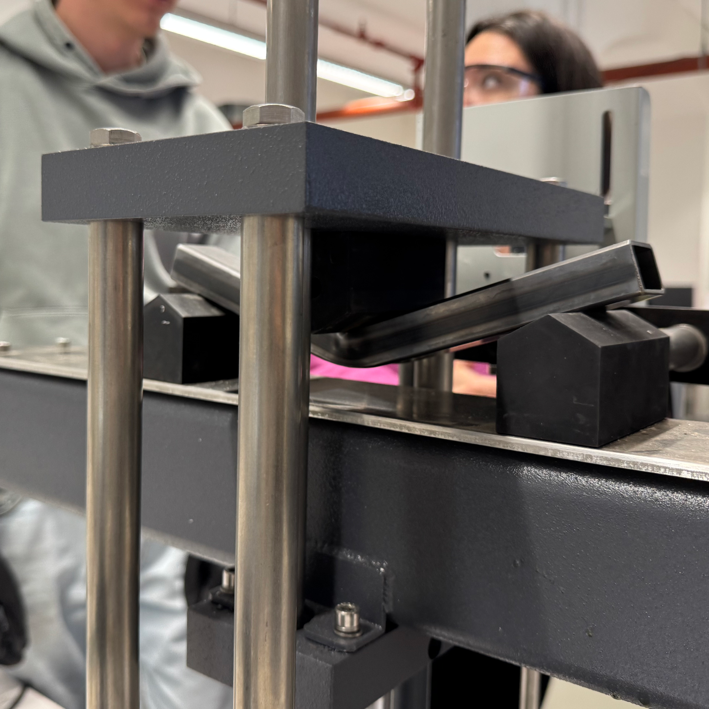
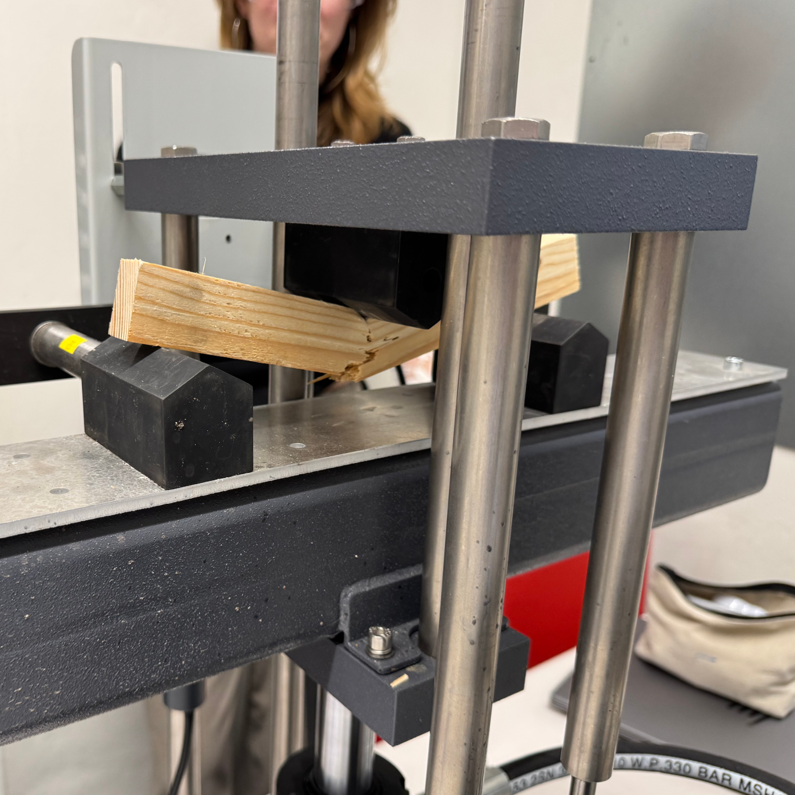

# Materiaaleigenschappen

In dit hoofdstuk worden de gegevens gepresenteerd die nodig zijn om de weerstanden en de stijfheden van materialen te bepalen. De gegevens zijn grotendeels overgenomen uit de normen NEN-EN 1992, NEN-EN 1993 en NEN-EN 1995. Eerst wordt staal behandeld, daarna hout en tenslotte beton. De NEN normen zijn te vinden op [Connect.NEN](https://connect.nen.nl/).

 
