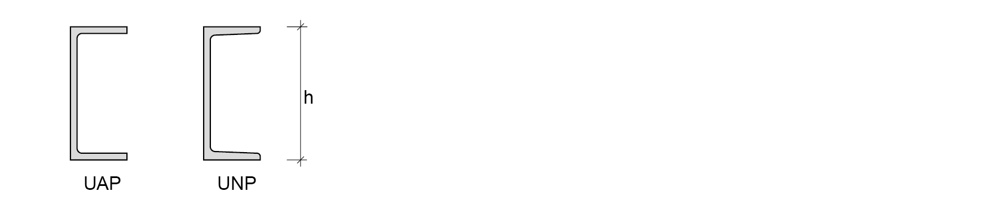
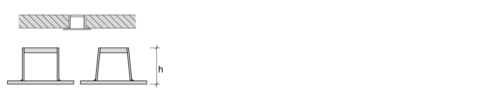

# Staal

## Producten I, warmgewalste profielen
**I-profielen**  
|  | 
| --- |
| IPE en INP profieldoorsneden & aansluiting balk-balk met behulp van een kopplaat & Balk (I-profiel)-kolom (H-profiel) verbinding met een verlengde kopplaat. | 

| type | grootte | h (mm) | b (mm) | $\mathsf{M_{z;el;d}}$ S235 (kNm) | $\mathsf{M_{z;el;d}}$ S355 (kNm) |
| --- | --- | --- | --- | --- | --- |
| IPE | 80 - 600 | 80 - 600 | 42 - 300 | 4,56 - 1076 | 6,89 - 1627 |
| INP | 80 - 750 | 80 - 750 | 46 - 263 | 4,71 - 1467 | 7,71 - 2216 |

**Toepassingen:**  
Licht belaste constructies voor de woning- en utiliteitsbouw. Veel toepassingen bij roostervloeren in de waterbouw, utiliteitsbouw en de procesindustrie. Ook worden hiervan raatliggers gemaakt door de liggers op een bepaalde manier door te snijden over de lengte.

<br>

**H-profielen**  
|  | 
| --- |
| HE-A, HE-B, HE-M profieldoorsneden, bij een serie van deze drie zijn de binnenmaten gelijk & aansluiting tussen HE ligger en IPE ligger op een HE kolom & HE-A kolom oplegging |

| type | grootte | h (mm) | b (mm) | $\mathsf{M_{z;el;d}}$ S235 (kNm) | $\mathsf{M_{z;el;d}}$ S355 (kNm) |
| --- | --- | --- | --- | --- | --- |
| HE A | 100 - 1000 | 96 - 990 | 100 - 300 | 17,1 - 2629 | 25,8 - 3972 |
| HE B | 100 - 1000 | 100 - 1000 | 100 - 300 | 21,1 - 3030 | 31,9 – 4578 |
| HE M | 100 - 1000 | 120 – 1008 | 106 - 302 | 44,8 - 3368 | 67,6 – 5088 |

**Toepassingen:**  
H-ligger voor op druk belaste kolommen en op buiging belaste liggers waarbij de constructiehoogte beperkt dient te worden. Het grotere traagheidsmoment wordt veroorzaakt door de toename van de flensdikte bij gelijkblijvende constructiehoogte. Door de grotere breedte zijn deze profielen zijdelings redelijk vormvast.

<br>

**U-profielen**  
|  | 
| --- |
| UP en UNP profieldoorsneden | 

| type | grootte | h (mm) | b (mm) | $\mathsf{M_{z;el;d}}$ S235 (kNm) | $\mathsf{M_{z;el;d}}$ S355 (kNm) |
| --- | --- | --- | --- | --- | --- |
| UAP | 80 - 400 | 80 - 400 | 45 - 100 | 6,29 - 128 | 9,51 - 193 |
| UNP | 80 - 400 | 80 - 400 | 45 - 100 | 6,22 - 239 | 9,4 - 361 |

**Toepassingen:**  
Vloerranden en bordessen. Moeilijke onderlinge verbindingen bij UNP-profielen door de schuine flenzen. Omdat de profielen niet symmetrisch zijn, treedt bij belasting op buiging vervorming op om beide hoofdtraagheidsassen.

<br>

**Buisprofielen**  
|  | 
| --- |
| CHS (circular hollow section) en RHS (rectangular hollow section) & knooppunt van ruimtelijk vakwerk vervaardigd uit holle buizen & vakwerk van rechthoekige koker-profielen. | 

| type | grootte | h (mm) | t (mm) |
| --- | --- | --- | --- |
| CHS | 42,4 - 610 | 42,4 - 610 | 2,6 - 30 |
| RHS | 40 - 400 | 40 - 400 | 3 - 16 |

**Toepassingen:**  
(ruimtelijke) vakwerken, kolommen.

<br>

**Damwandprofielen**  
|  | 
| --- |
| Toepassingen: | 
| Kelderwanden, funderingen, waterbouw. Damwandprofielen zijn er in uiteenlopende soorten en maten. Wanden van bouwputten en verdiepte objecten (verzonken infrastructuur) en kadewanden behoren tot de mogelijkheden voor grondkerende constructies. Ook verticale belastingen kunnen worden opgenomen. |

## Producten II, koudgewalste profielen
**U en C profielen**  
|  | 
| --- |
| Koudgevormde U met gelijke (eq) of ongelijke (eu) hoogte en breedte en C profielen met en zonder verstijvingen | 

| type | grootte | h (mm) | b (mm) |
| --- | --- | --- | --- |
| $\mathsf{CFU_{eq}}$ | 10 - 100 | 10 - 100 | 10 - 100 |
| $\mathsf{CFU_{ue}}$ | 10 - 160 | 10 - 160 | 10 - 70 |
| CFC | 25 - 100 | 25 - 100 | 25 - 50 |

**Toepassingen:**  
Wordt toegepast in woningbouw, cascobouw, opslagsystemen, afbouw. Staalframe-bouw: dakgordingen, wandliggers, vloerliggers. Wegens de vervormingen tijdens de fabricage zullen de materiaalkarakteristieken afwijken van warmgewalst staal.

<br>

**L en Z profielen**  
|  | 
| --- |
| Koudgevormde L met gelijke (eq) of ongelijke (eu) hoogte en breedte en Z profielen met en zonder verstijvingen | 

| type | grootte | h (mm) | b (mm) |
| --- | --- | --- | --- |
| CFL_{eq} | 15 - 80 | 15 - 80 | 15 - 80 |
| CFL_{ue} | 20 - 100 | 20 - 100 | 15 - 50 |
| CFZ | 30 - 50 | 30 - 50 | 38 - 57 |

**Toepassingen:**  
Zie koudgevormde U en C profielen.

<br>

## Producten III, gelaste profielen
**Raatliggers IPE/HEA/HEB**  
|  | 
| --- |
| Utiliteitsbouw. De onderdelen van een raatligger (met zeshoekige gaten) kunnen met een enkele snijbeweging worden gesneden zonder materiaalverlies. Raatliggers met ronde gaten zijn minder economisch vanwege het extra snijwerk en materiaalverlies | 

| type | grootte | h (mm) | b (mm) |
| --- | --- | --- | --- |
| IPE | 180 - 600 | 270 - 900 | 91 - 220 |
| HEA | 180 - 1000 | 257 - 1485 | 180 - 300 |
| HEB | 180 - 1000 | 270 - 1500 | 180 - 300 |

**Toepassingen:**  
Grote lichte overspanningen, mogelijkheden voor leidingen doorvoer. De doorsnede heeft een toegenomen momentcapaciteit, een hogere stijfheid en sterkte bij gelijkblijvend gewicht. Daarentegen zijn dwarskrachtcapaciteit en kipstabiliteit substantieel afgenomen. (kip is zijwaartse instabiliteit van de flenzen)

<br>

**Hoedliggers**  
|  | 
| --- |
| Gelaste geïntegreerde liggers (hoedliggers) | 

**Toepassingen:**  
Wordt voornamelijk toegepast bij (onder)grondse constructies en overspanningen, met name bij de aanleg van snelwegen.

## Sterkte en stijfheid

| Materiaaleigenschap |   | Staalkwaliteit: | S235 | S275 | S355 | S420* | S460* |
|---|---|---|---|---|---|---|---|
| volumieke massa | $\mathsf{\rho_{rep}}$ | $\mathsf{[kg/m^3]}$ | 7850 | 7850 | 7850 | 7850 | 7850 |
| elasticiteitsmodulus | $\mathsf{E_{rep}}$ | $\mathsf{[N/mm^2]}$ | $\mathsf{210 \cdot 10^3}$ | $\mathsf{210 \cdot 10^3}$ | $\mathsf{210 \cdot 10^3}$ | $\mathsf{210 \cdot 10^3}$ | $\mathsf{210 \cdot 10^3}$ |
| rekenwaarde vloeigrens | $\mathsf{f_{y;d}}$ | $\mathsf{[N/mm^2]}$ | 235 | 275 | 355 | 420 | 460 |
| rekenwaarde treksterkte | $\mathsf{f_{t;d}}$ | $\mathsf{[N/mm^2]}$ | 360 | 430 | 510 | -- | -- |
| vloergrens | $\mathsf{\epsilon_{y;d}}$ | [\%] | 1,12 | 1,31 | 1,69 | -- | -- |
| afschuifmodulus | $\mathsf{G_{rep}}$ | $\mathsf{[N/mm^2]}$ | $\mathsf{8,1 \cdot 10^4}$ | $\mathsf{8,1 \cdot 10^4}$ | $\mathsf{8,1 \cdot 10^4}$ | $\mathsf{8,1 \cdot 10^4}$ | $\mathsf{8,1 \cdot 10^4}$ |
| uitzettingscoëfficient | $\mathsf{\alpha}$ | $\mathsf{[K^{-1}]}$ | $\mathsf{12 \cdot 10^{-6}}$ | $\mathsf{12 \cdot 10^{-6}}$ | $\mathsf{12 \cdot 10^{-6}}$ | $\mathsf{12 \cdot 10^{-6}}$ | $\mathsf{12 \cdot 10^{-6}}$ |

```{note}
Volgens de norm 6770 mag men voor de vloeigrens geen hogere waarde aanhouden dan 355 N/mm². Wil men echter gebruik maken van S420 en S460 dan moeten de berekeningen extra getoetst worden. Bovenstaande waarden voor de vloeigrens en de treksterkte zijn van toepassing voor platen, flenzen, etc. met een dikte t<40 mm volgens NEN-EN 10025.
```

<br>

## Spannings-rek diagram

| **Diagram** | | **Toelichting** |
|---|---|---|
|  | $\mathsf{\epsilon_{y;d}}$ <br> $\mathsf{f_{t;d}}$ <br> $\mathsf{f_{y;d}}$ <br> tan $\mathsf{\alpha}$ | : rekenwaarde rek <br> : rekenwaarde treksterkte <br> : rekenwaarde vloeigrens <br> : $\mathsf{E_{d}}$ (elasticiteitsmodulus) |

In eenvoudige berekeningen en toetsing van de constructie wordt er lineair elastisch gerekend. Praktisch gezien betekent dit dat als het staal begint te vloeien, de constructie of het constructieonderdeel als bezweken beschouwd dient te worden. Er wordt dus alleen met het eerste lineaire gedeelte van het spannings-rekdiagram gerekend. Er mogen dus geen grotere rekken optreden dan in de tabel per staalsoort weergegeven.

<br>

## Dimensietabellen

De staalprofielen app van 'Bouwen met Staal' bevat alle gangbare profielafmetingen met bijbehorende doorsnede grootheden. 

## IPE doorsnede (IPE 100 - IPE 300)

```{figure} Images/IPE.png
---
---
IPE axo
```

| Profiel | $G \\ [kg/m]$ | $h \\ [mm]$ | $b \\ [mm]$ | $t_w \\ [mm]$ | $t_f \\ [mm]$ | $A_{tot} \\\cdot 10^2 \\ [mm²]$ | $I_y \\\cdot 10^4 \\ [mm^4]$ | $I_z \\\cdot 10^4 \\ [mm^4]$ | $W_{y;el} \\\cdot 10^3 \\ [mm^3]$ | $W_{z;el} \\\cdot 10^3 \\ [mm^3]$ | $i_y \\ [mm]$ | $i_z \\ [mm]$ |
|------------|--------|--------|--------|----------|----------|---------|----------|----------|---------|---------|--------------|--------------|
| IPE 100A   | 6.9    | 98.0   | 55.0   | 3.60     | 4.70     | 8.78    | 141      | 13.1     | 28.8    | 4.77    | 40.1         | 12.2         |
| IPE 100    | 8.1    | 100.0  | 55.0   | 4.10     | 5.70     | 10.3    | 171      | 15.9     | 34.2    | 5.79    | 40.7         | 12.4         |
| IPE 120 A  | 8.7    | 117.6  | 64.0   | 3.80     | 5.10     | 11.0    | 257      | 22.4     | 43.8    | 7.00    | 48.3         | 14.2         |
| IPE 120    | 10.4   | 120.0  | 64.0   | 4.40     | 6.30     | 13.2    | 318      | 27.7     | 53.0    | 8.65    | 49.0         | 14.5         |
| IPE 140 A  | 10.5   | 137.4  | 73.0   | 3.80     | 5.60     | 13.4    | 435      | 36.4     | 63.3    | 9.98    | 57.0         | 16.5         |
| IPE 140    | 12.9   | 140.0  | 73.0   | 4.70     | 6.90     | 16.4    | 541      | 44.9     | 77.3    | 12.3    | 57.4         | 16.5         |
| IPE 140 R  | 14.4   | 142.0  | 72.0   | 5.30     | 7.80     | 18.4    | 611      | 48.8     | 86.1    | 13.5    | 57.7         | 16.3         |
| IPE 160 A  | 12.7   | 157.0  | 82.0   | 4.00     | 5.90     | 16.2    | 689      | 54.4     | 87.8    | 13.3    | 65.3         | 18.3         |
| IPE 160    | 15.8   | 160.0  | 82.0   | 5.00     | 7.40     | 20.1    | 869      | 68.3     | 109     | 16.7    | 65.8         | 18.4         |
| IPE 160 R  | 17.7   | 162.0  | 81.0   | 5.60     | 8.50     | 22.6    | 989      | 75.7     | 122     | 18.7    | 66.2         | 18.3         |
| IPE 180 A  | 15.4   | 177.0  | 91.0   | 4.30     | 6.50     | 19.6    | 1063     | 81.9     | 120     | 18.0    | 73.7         | 20.5         |
| IPE 180    | 18.8   | 180.0  | 91.0   | 5.30     | 8.00     | 23.9    | 1317     | 101      | 146     | 22.2    | 74.2         | 20.5         |
| IPE 180 O  | 21.3   | 182.0  | 92.0   | 6.00     | 9.00     | 27.1    | 1505     | 117      | 165     | 25.5    | 74.5                 | 20.8                 |
| IPE 180 R  | 22.1   | 183.0  | 89.0   | 6.40     | 9.50     | 28.1    | 1554     | 112      | 170     | 25.2    | 74.4                 | 20.0                 |
| IPE 200 A  | 18.4   | 197.0  | 100.0  | 4.50     | 7.00     | 23.5    | 1591     | 117      | 162     | 23.4    | 82.3                 | 22.3                 |
| IPE 200    | 22.4   | 200.0  | 100.0  | 5.60     | 8.50     | 28.5    | 1943     | 142      | 194     | 28.5    | 82.6                 | 22.4                 |
| IPE 200 O  | 25.1   | 202.0  | 102.0  | 6.20     | 9.50     | 32.0    | 2211     | 169      | 219     | 33.1    | 83.2                 | 23.0                 |
| IPE 200 R  | 26.6   | 204.0  | 98.0   | 6.60     | 10.5     | 33.9    | 2363     | 166      | 232     | 33.8    | 83.5                 | 22.1                 |
| IPE 220 A  | 22.2   | 217.0  | 110.0  | 5.00     | 7.70     | 28.3    | 2317     | 171      | 214     | 31.2    | 90.5                 | 24.6                 |
| IPE 220    | 26.2   | 220.0  | 110.0  | 5.90     | 9.20     | 33.4    | 2772     | 205      | 252     | 37.3    | 91.1                 | 24.8                 |
| IPE 220 O  | 29.4   | 222.0  | 112.0  | 6.60     | 10.2     | 37.4    | 3134     | 240      | 282     | 42.8    | 91.6                 | 25.3                 |
| IPE 220 R  | 31.6   | 225.0  | 108.0  | 6.70     | 11.8     | 40.2    | 3474     | 249      | 309     | 46.1    | 92.9                 | 24.9                 |
| IPE 240 A  | 26.2   | 237.0  | 120.0  | 5.20     | 8.30     | 33.3    | 3290     | 240      | 278     | 40.0    | 74.5      | 99.4      |
| IPE 240    | 30.7   | 240.0  | 120.0  | 6.20     | 9.80     | 39.1    | 3892     | 284      | 324     | 47.3    | 74.4      | 99.7      |
| IPE 240 O  | 34.3   | 242.0  | 122.0  | 7.00     | 10.8     | 43.7    | 4369     | 329      | 361     | 53.9    | 82.3      | 100.0     |
| IPE 240 R  | 37.3   | 245.0  | 118.0  | 7.50     | 12.3     | 47.5    | 4823     | 339      | 394     | 57.4    | 82.6      | 101.0     |
| IPE 270 A  | 30.7   | 267.0  | 135.0  | 5.50     | 8.70     | 39.1    | 4917     | 358      | 368     | 53.0    | 83.2      | 112.0     |
| IPE 270    | 36.1   | 270.0  | 135.0  | 6.60     | 10.2     | 45.9    | 5790     | 420      | 429     | 62.2    | 83.5      | 112.0     |
| IPE 270 O  | 42.3   | 274.0  | 136.0  | 7.50     | 12.2     | 53.8    | 6947     | 513      | 507     | 75.5    | 90.5      | 114.0     |
| IPE 270 R  | 44.0   | 276.0  | 133.0  | 7.70     | 13.1     | 56.0    | 7312     | 516      | 530     | 77.6    | 91.1      | 114.0     |
| IPE 300 A  | 36.5   | 297.0  | 150.0  | 6.10     | 9.20     | 46.5    | 7173     | 519      | 483     | 69.2    | 91.6      | 124.0     |
| IPE 300    | 42.2   | 300.0  | 150.0  | 7.10     | 10.7     | 53.8    | 8356     | 604      | 557     | 80.5    | 92.9      | 125.0     |
| IPE 300O   | 49.3   | 304.0  | 152.0  | 8.00     | 12.7     | 62.8    | 9994     | 746      | 658     | 98.1    |           | 126.0     |
| IPE 300 R  | 51.7   | 306.0  | 147.0  | 8.50     | 13.7     | 65.9    | 10500    | 728      | 686     | 99.0    |           | 126.0     |

## IPE doorsnede (IPE 330 - IPE 750)

```{figure} Images/IPE.png
---
---
IPE axo
```

| Profiel | $G \\ [kg/m]$ | $h \\ [mm]$ | $b \\ [mm]$ | $t_w \\ [mm]$ | $t_f \\ [mm]$ | $A_{tot} \\\cdot 10^2 \\ [mm²]$ | $I_y \\\cdot 10^4 \\ [mm^4]$ | $I_z \\\cdot 10^4 \\ [mm^4]$ | $W_{y;el} \\\cdot 10^3 \\ [mm^3]$ | $W_{z;el} \\\cdot 10^3 \\ [mm^3]$ | $i_y \\ [mm]$ | $i_z \\ [mm]$ |
|------------|--------|--------|--------|----------|----------|---------|----------|----------|---------|---------|-----|-----|
| IPE 330 A  | 43.0   | 327.0  | 160.0  | 6.50     | 10.0     | 54.7    | 10230    | 685      | 626     | 85.6    |137.0| 35.4|
| IPE 330    | 49.1   | 330.0  | 160.0  | 7.50     | 11.5     | 62.6    | 11770    | 788      | 713     | 98.5    |137.0| 35.5|
| IPE 330 O | 57.0   | 334.0  | 162.0  | 8.50     | 13.5     | 72.6    | 13910    | 960      | 833     | 119     |138.0| 36.4|
| IPE 330 R  | 60.3   | 336.0  | 158.0  | 9.20     | 14.5     | 76.8    | 14690    | 958      | 874     | 121     |138.0| 35.3
| IPE 360 A  | 50.2   | 357.6  | 170.0  | 6.60     | 11.5     | 64.0    | 14520    | 944      | 812     | 111     |151.0| 38.4
| IPE 360    | 57.1   | 360.0  | 170.0  | 8.00     | 12.7     | 72.7    | 16270    | 1043     | 904     | 123     |150.0| 37.9
| IPE 360 O  | 66.0   | 364.0  | 172.0  | 9.20     | 14.7     | 84.1    | 19050    | 1251     | 1047    | 145     |150.0| 38.6
| IPE 360 R  | 70.3   | 366.0  | 168.0  | 9.90     | 16.0     | 89.6    | 20290    | 1270     | 1109    | 151     |150.0| 37.6
| IPE 400 A  | 57.4   | 397.0  | 180.0  | 7.00     | 12.0     | 73.1    | 20290    | 1171     | 1022    | 130     |167.0| 40.0
| IPE 400    | 66.3   | 400.0  | 180.0  | 8.60     | 13.5     | 84.5    | 23130    | 1318     | 1156    | 146     |165.0| 39.5
| IPE 400 O  | 75.7   | 404.0  | 182.0  | 9.70     | 15.5     | 96.4    | 26750    | 1564     | 1324    | 172     |167.0| 40.3
| IPE 400 R  | 81.5   | 407.0  | 178.0  | 10.6     | 17.0     | 104     | 28860    | 1606     | 1418    | 180     |167.0| 39.3
| IPE 400 V  | 84.0   | 408.0  | 182.0  | 10.6     | 17.5     | 107     | 30140    | 1766     | 1477    | 194     |168.0| 40.6
| IPE 450 A | 67.2   | 447.0  | 190.0  | 7.60     | 13.1     | 85.5    | 29760    | 1502     | 1331    | 158     |187.0| 41.9
| IPE 450   | 77.6   | 450.0  | 190.0  | 9.40     | 14.6     | 98.8    | 33740    | 1676     | 1500    | 176     |185.0| 41.2
| IPE 450 O | 92.4   | 456.0  | 192.0  | 11.0     | 17.6     | 118     | 40920    | 2085     | 1795    | 217     |186.0| 42.1
| IPE 450 R | 95.2   | 458.0  | 188.0  | 11.3     | 18.6     | 121     | 42400    | 2070     | 1851    | 220     |187.0| 41.3
| IPE 450 V | 103.6  | 460.0  | 194.0  | 12.4     | 19.6     | 132     | 46200    | 2397     | 2009    | 247     |187.0| 42.6
| IPE 500 A | 79.4   | 497.0  | 200.0  | 8.40     | 14.5     | 101     | 42930    | 1939     | 1728    | 194     |206.0| 43.8
| IPE 500   | 90.7   | 500.0  | 200.0  | 10.2     | 16.0     | 116     | 48200    | 2142     | 1928    | 214     |204.0| 43.1
| IPE 500 O | 107.3  | 506.0  | 202.0  | 12.0     | 19.0     | 137     | 57780    | 2622     | 2284    | 260     |206.0| 43.8
| IPE 500 R | 111.4  | 508.0  | 198.0  | 12.6     | 20.0     | 142     | 59930    | 2600     | 2360    | 263     |205.0| 42.8
| IPE 500 V | 128.8  | 514.0  | 204.0  | 14.2     | 23.0     | 164     | 70720    | 3271     | 2752    | 321     |208.0| 44.7
| IPE 550 A | 92.1   | 547.0  | 210.0  | 9.00     | 15.7     | 117     | 59980    | 2432     | 2193    | 232     |226.0| 45.5
| IPE 550   | 105.5  | 550.0  | 210.0  | 11.1     | 17.2     | 134     | 67120    | 2668     | 2441    | 254     |223.0| 44.5
| IPE 550 O | 122.5  | 556.0  | 212.0  | 12.7     | 20.2     | 156     | 79160    | 3224     | 2847    | 304     |225.0| 45.5
| IPE 550 R  | 133.7  | 560.0  | 210.0  | 14.0     | 22.2     | 170     | 86600    | 3447     | 3093    | 328     | 225.0        | 45.0         
| IPE 550 V  | 158.6  | 566.0  | 216.0  | 17.1     | 25.2     | 202     | 102300   | 4265     | 3616    | 395     | 225.0        | 46.0         
| IPE 600 A  | 107.6  | 597.0  | 220.0  | 9.80     | 17.5     | 137     | 82920    | 3116     | 2778    | 283     | 246.0        | 47.7         
| IPE 600    | 122.4  | 600.0  | 220.0  | 12.0     | 19.0     | 156     | 92080    | 3387     | 3069    | 308     | 243.0        | 46.6         
| IPE 600 O  | 154.5  | 610.0  | 224.0  | 15.0     | 24.0     | 197     | 118300   | 4521     | 3879    | 404     | 245.0        | 47.9         
| IPE 600 R  | 144.4  | 608.0  | 218.0  | 14.0     | 23.0     | 184     | 110300   | 3993     | 3629    | 366     | 245.0        | 46.6         
| IPE 600 V  | 183.5  | 618.0  | 228.0  | 18.0     | 28.0     | 234     | 141600   | 5570     | 4582    | 489     | 246.0        | 48.8         
| IPE 750 x 137 | 137.0 | 753.0 | 263.0 | 11.5    | 17.0     | 175     | 159900   | 5166     | 4246    | 393     | 303.0        | 54.4         
| IPE 750 x 147 | 147.2 | 753.0 | 265.0 | 13.2    | 17.0     | 187     | 166100   | 5289     | 4411    | 399     | 298.0        | 53.1         
| IPE 750 x 161 | 160.5 | 758.0 | 266.0 | 13.8    | 19.3     | 204     | 186100   | 6073     | 4909    | 457     | 302.0        | 54.5         
| IPE 750 x 174 | 173.7 | 762.0 | 267.0 | 14.4    | 21.6     | 221     | 205800   | 6873     | 5402    | 515     | 305.0        | 55.7         
| IPE 750 x 185 | 185.0 | 766.0 | 267.0 | 14.9    | 23.6     | 236     | 223000   | 7510     | 5821    | 563     | 308.0        | 56.5         


## HEA/HEB/HEM doorsnede (HEA 100 - HEA 340)

```{figure} Images/HEA_HEB_HEM.png
---
---
HEA/HEB/HEM axo
```

| Profiel | $G \\ [kg/m]$ | $h \\ [mm]$ | $b \\ [mm]$ | $t_w \\ [mm]$ | $t_f \\ [mm]$ | $A_{tot} \\\cdot 10^2 \\ [mm²]$ | $I_y \\\cdot 10^4 \\ [mm^4]$ | $I_z \\\cdot 10^4 \\ [mm^4]$ | $W_{y;el} \\\cdot 10^3 \\ [mm^3]$ | $W_{z;el} \\\cdot 10^3 \\ [mm^3]$ | $i_y \\ [mm]$ | $i_z \\ [mm]$ |
|------------|--------|--------|--------|----------|----------|---------|----------|----------|---------|---------|-----|-----|
| HE 100 AA | 12.2   | 91.0   | 100.0  | 4.20     | 5.50     | 15.6    | 237      | 92.1     | 52.0    | 18.4    | 38.9     | 24.3     |
| HE 100 A  | 16.7   | 96.0   | 100.0  | 5.00     | 8.00     | 21.2    | 349      | 134      | 72.8    | 26.8    | 40.6     | 25.1     |
| HE 100 B  | 20.4   | 100.0  | 100.0  | 6.00     | 10.0     | 26.0    | 450      | 167      | 89.9    | 33.5    | 41.6     | 25.3     |
| HE 120 AA | 14.6   | 109.0  | 120.0  | 4.20     | 5.50     | 18.6    | 413      | 159      | 75.8    | 26.5    | 47.2     | 29.3     |
| HE 120 A  | 19.9   | 114.0  | 120.0  | 5.00     | 8.00     | 25.3    | 606      | 231      | 106     | 38.5    | 48.9     | 30.2     |
| HE 120 B  | 26.7   | 120.0  | 120.0  | 6.50     | 11.0     | 34.0    | 864      | 318      | 144     | 52.9    | 50.4     | 30.6     |
| HE 140 AA | 18.1   | 128.0  | 140.0  | 4.30     | 6.00     | 23.0    | 719      | 275      | 112     | 39.3    | 55.9     | 34.5     |
| HE 140 A  | 24.7   | 133.0  | 140.0  | 5.50     | 8.50     | 31.4    | 1033     | 389      | 155     | 55.6    | 57.3     | 35.2     |
| HE 140 B  | 33.7   | 140.0  | 140.0  | 7.00     | 12.0     | 43.0    | 1509     | 550      | 216     | 78.5    | 59.3     | 35.8     |
| HE 160 AA | 23.8   | 148.0  | 160.0  | 4.50     | 7.00     | 30.4    | 1283     | 479      | 173     | 59.8    | 65.0     | 39.7     |
| HE 160 A  | 30.4   | 152.0  | 160.0  | 6.00     | 9.00     | 38.8    | 1673     | 616      | 220     | 76.9    | 65.7     | 39.8     |
| HE 160 B  | 42.6   | 160.0  | 160.0  | 8.00     | 13.0     | 54.3    | 2492     | 889      | 312     | 111     | 67.8     | 40.5     |
| HE 160 M  | 76.2   | 180.0  | 166.0  | 14.0     | 23.0     | 97.1    | 5098     | 1759     | 566     | 212     | 72.5     | 42.6     |
| HE 180 AA | 28.7   | 167.0  | 180.0  | 5.00     | 7.50     | 36.5    | 1967     | 730      | 236     | 81.1    | 73.4    | 44.7    |
| HE 180 A  | 35.5   | 171.0  | 180.0  | 6.00     | 9.50     | 45.3    | 2510     | 925      | 294     | 103     | 74.5    | 45.2    |
| HE 180 B  | 51.2   | 180.0  | 180.0  | 8.50     | 14.0     | 65.3    | 3831     | 1363     | 426     | 151     | 76.6    | 45.7    |
| HE 180 M  | 88.9   | 200.0  | 186.0  | 14.5     | 24.0     | 113     | 7483     | 2580     | 748     | 277     | 81.3    | 47.7    |
| HE 200 AA | 34.6   | 186.0  | 200.0  | 5.50     | 8.00     | 44.1    | 2944     | 1068     | 317     | 107     | 81.7    | 49.2    |
| HE 200 A  | 42.3   | 190.0  | 200.0  | 6.50     | 10.0     | 53.8    | 3692     | 1336     | 389     | 134     | 82.8    | 49.8    |
| HE 200 B  | 61.3   | 200.0  | 200.0  | 9.00     | 15.0     | 78.1    | 5696     | 2003     | 570     | 200     | 85.4    | 50.7    |
| HE 200 M  | 103.1  | 220.0  | 206.0  | 15.0     | 25.0     | 131     | 10640    | 3651     | 967     | 354     | 90.0    | 52.7    |
| HE 220 AA | 40.4   | 205.0  | 220.0  | 6.00     | 8.50     | 51.5    | 4170     | 1510     | 407     | 137     | 90.0    | 54.2    |
| HE 220 A  | 50.5   | 210.0  | 220.0  | 7.00     | 11.0     | 64.3    | 5410     | 1955     | 515     | 178     | 91.7    | 55.1    |
| HE 220 B  | 71.5   | 220.0  | 220.0  | 9.50     | 16.0     | 91.0    | 8091     | 2843     | 736     | 258     | 94.3    | 55.9    |
| HE 220 M  | 117.3  | 240.0  | 226.0  | 15.5     | 26.0     | 149     | 14600    | 5012     | 1217    | 444     | 98.9    | 57.9    |
| HE 240 AA | 47.4   | 224.0  | 240.0  | 6.50     | 9.00     | 60.4    | 5835     | 2077     | 521     | 173     | 98.3    | 58.7    |
| HE 240 A  | 60.3   | 230.0  | 240.0  | 7.50     | 12.0     | 76.8    | 7763     | 2769     | 675     | 231     | 101.0   | 60.0    |
| HE 240 B  | 83.2   | 240.0  | 240.0  | 10.0     | 17.0     | 106     | 11260    | 3923     | 938     | 327     | 103.0   | 60.8    |
| HE 240 M  | 156.7  | 270.0  | 248.0  | 18.0     | 32.0     | 200     | 24290    | 8153     | 1799    | 657     | 110.0   | 63.9    |
| HE 260 AA | 54.1   | 244.0  | 260.0  | 6.50     | 9.50     | 69.0    | 7981     | 2788     | 654     | 214     | 108.0   | 63.6    |
| HE 260 A  | 68.2   | 250.0  | 260.0  | 7.50     | 12.5     | 86.8    | 10450    | 3668     | 836     | 282     | 110.0   | 65.0    |
| HE 260 B  | 93.0   | 260.0  | 260.0  | 10.0     | 17.5     | 118     | 14920    | 5135     | 1148    | 395     | 112.0   | 65.8    |
| HE 260 M  | 172.4  | 290.0  | 268.0  | 18.0     | 32.5     | 220     | 31310    | 10450    | 2159    | 780     | 119.0   | 69.0    |
| HE 280 AA | 61.2   | 264.0  | 280.0  | 7.00     | 10.0     | 78.0    | 10560    | 3664     | 800     | 262     | 116.0   | 68.5    |
| HE 280 A  | 76.4   | 270.0  | 280.0  | 8.00     | 13.0     | 97.3    | 13670    | 4763     | 1013    | 340     | 119.0   | 70.0    |
| HE 280 B  | 103.1  | 280.0  | 280.0  | 10.5     | 18.0     | 131     | 19270    | 6595     | 1376    | 471     | 121.0   | 70.9    |
| HE 280 M  | 188.5  | 310.0  | 288.0  | 18.5     | 33.0     | 240     | 39550    | 13160    | 2551    | 914     | 128.0   | 74.0    |
| HE 300 AA | 69.8   | 283.0  | 300.0  | 7.50     | 10.5     | 88.9    | 13800    | 4734     | 976     | 316     | 125.0       | 73.0        |
| HE 300 A  | 88.3   | 290.0  | 300.0  | 8.50     | 14.0     | 113     | 18260    | 6310     | 1260    | 421     | 127.0       | 74.9        |
| HE 300 B  | 117.0  | 300.0  | 300.0  | 11.0     | 19.0     | 149     | 25170    | 8563     | 1678    | 571     | 130.0       | 75.8        |
| HE 300 C  | 176.7  | 320.0  | 305.0  | 16.0     | 29.0     | 225     | 40950    | 13740    | 2559    | 901     | 135.0       | 78.1        |
| HE 300 M  | 237.9  | 340.0  | 310.0  | 21.0     | 39.0     | 303     | 59200    | 19400    | 3482    | 1252    | 140.0       | 80.0        |
| HE 320 AA | 74.2   | 301.0  | 300.0  | 8.00     | 11.0     | 94.6    | 16450    | 4959     | 1093    | 331     | 132.0       | 72.4        |
| HE 320 A  | 97.6   | 310.0  | 300.0  | 9.00     | 15.5     | 124     | 22930    | 6985     | 1479    | 466     | 136.0       | 74.9        |
| HE 320 B  | 126.7  | 320.0  | 300.0  | 11.5     | 20.5     | 161     | 30820    | 9239     | 1926    | 616     | 138.0       | 75.7        |
| HE 320 M  | 245.0  | 359.0  | 309.0  | 21.0     | 40.0     | 312     | 68130    | 19710    | 3796    | 1276    | 148.0       | 79.5        |
| HE 340 AA | 78.9   | 320.0  | 300.0  | 8.50     | 11.5     | 101     | 19550    | 5185     | 1222    | 346     | 139.0       | 71.8        |
| HE 340 A  | 104.8  | 330.0  | 300.0  | 9.50     | 16.5     | 133     | 27690    | 7436     | 1678    | 496     | 144.0       | 74.6        |
| HE 340 B  | 134.2  | 340.0  | 300.0  | 12.0     | 21.5     | 171     | 36660    | 9690     | 2156    | 646     | 146.0       | 75.3        |
| HE 340 M  | 247.9  | 377.0  | 309.0  | 21.0     | 40.0     | 316     | 76370    | 19710    | 4052    | 1276    | 156.0       | 79.0        |

## HEA/HEB/HEM doorsnede (HEA 360 - HEA 1000)

```{figure} Images/HEA_HEB_HEM.png
---
---
HEA/HEB/HEM axo
```

| Profiel | $G \\ [kg/m]$ | $h \\ [mm]$ | $b \\ [mm]$ | $t_w \\ [mm]$ | $t_f \\ [mm]$ | $A_{tot} \\\cdot 10^2 \\ [mm²]$ | $I_y \\\cdot 10^4 \\ [mm^4]$ | $I_z \\\cdot 10^4 \\ [mm^4]$ | $W_{y;el} \\\cdot 10^3 \\ [mm^3]$ | $W_{z;el} \\\cdot 10^3 \\ [mm^3]$ | $i_y \\ [mm]$ | $i_z \\ [mm]$ |
|------------|--------|--------|--------|----------|----------|---------|----------|----------|---------|---------|-----|-----|
| Type       | h (mm) | b (mm) | s (mm) | t_w (mm) | t_f (mm) | A (cm²) | Wx (cm³) | Wy (cm³) | ix (cm) | iy (cm) | New Column1 | New Column2 |
| HE 360 AA  | 83.7   | 339.0  | 300.0  | 9.00     | 12.0     | 107     | 23040    | 5410     | 1359    | 361     | 147.0       | 71.2        |
| HE 360 A   | 112.1  | 350.0  | 300.0  | 10.0     | 17.5     | 143     | 33090    | 7887     | 1891    | 526     | 152.0       | 74.3        |
| HE 360 B   | 141.8  | 360.0  | 300.0  | 12.5     | 22.5     | 181     | 43190    | 10140    | 2400    | 676     | 155.0       | 74.9        |
| HE 360 M   | 250.3  | 395.0  | 308.0  | 21.0     | 40.0     | 319     | 84870    | 19520    | 4297    | 1268    | 163.0       | 78.3        |
| HE 400 AA  | 92.4   | 378.0  | 300.0  | 9.50     | 13.0     | 118     | 31250    | 5861     | 1654    | 391     | 163.0       | 70.6        |
| HE 400 x107| 107.2  | 384.0  | 297.0  | 10.0     | 16.0     | 136     | 37640    | 6998     | 1960    | 471     | 166.0       | 71.6        |
| HE 400 A   | 124.8  | 390.0  | 300.0  | 11.0     | 19.0     | 159     | 45070    | 8564     | 2311    | 571     | 168.0       | 73.4        |
| HE 400 B   | 155.3  | 400.0  | 300.0  | 13.5     | 24.0     | 198     | 57680    | 10820    | 2884    | 721     | 171.0       | 74.0        |
| HE 400 M   | 255.7  | 432.0  | 307.0  | 21.0     | 40.0     | 326     | 104100   | 19340    | 4820    | 1260    | 179.0       | 77.0        |
| HE450 AA   | 99.7   | 425.0  | 300.0  | 10.0     | 13.5     | 127     | 41890    | 6088     | 1971    | 406     | 182.0       | 69.2        |
| HE 450 x124| 123.9  | 435.0  | 300.0  | 10.2     | 18.5     | 158     | 55860    | 8338     | 2568    | 556     | 188.0       | 72.7        |
| HE 450 A   | 139.8  | 440.0  | 300.0  | 11.5     | 21.0     | 178     | 63720    | 9465     | 2896    | 631     | 189.0       | 72.9        |
| HE 450 B   | 171.1  | 450.0  | 300.0  | 14.0     | 26.0     | 218     | 79890    | 11720    | 3551    | 781     | 191.0       | 73.3        |
| HE 450 M   | 263.3  |  478.0 | 307.0  | 21.0     | 40.0     | 335     | 131500    | 19340    | 5501    | 1260    | 198.0       | 75.9        |
| HE 500 AA   | 107.4  | 472.0  | 300.0  | 10.5     | 14.0     | 137     | 54640    | 6314     | 2315    | 421     | 200.0   | 67.9    |
| HE 500 A    | 155.1  | 490.0  | 300.0  | 12.0     | 23.0     | 198     | 86970    | 10370    | 3550    | 691     | 210.0   | 72.4    |
| HE 500 B    | 187.3  | 500.0  | 300.0  | 14.5     | 28.0     | 239     | 107200   | 12620    | 4287    | 842     | 212.0   | 72.7    |
| HE 500 M    | 270.3  | 524.0  | 306.0  | 21.0     | 40.0     | 344     | 161900   | 19150    | 6180    | 1252    | 217.0   | 74.6    |
| HE 550 AA   | 120.0  | 522.0  | 300.0  | 11.5     | 15.0     | 153     | 72870    | 6767     | 2792    | 451     | 218.0   | 66.5    |
| HE 550 A    | 166.2  | 540.0  | 300.0  | 12.5     | 24.0     | 212     | 111900   | 10820    | 4146    | 721     | 230.0   | 71.5    |
| HE 550 B    | 199.4  | 550.0  | 300.0  | 15.0     | 29.0     | 254     | 136700   | 13080    | 4971    | 872     | 232.0   | 71.7    |
| HE 550 M    | 278.2  | 572.0  | 306.0  | 21.0     | 40.0     | 354     | 198000   | 19160    | 6923    | 1252    | 236.0   | 73.5    |
| HE 600 AA   | 128.8  | 571.0  | 300.0  | 12.0     | 15.5     | 164     | 91870    | 6993     | 3218    | 466     | 237.0   | 65.3    |
| HE 600 x137 | 137.4  | 575.0  | 300.0  | 11.8     | 17.5     | 175     | 101500   | 7893     | 3529    | 526     | 241.0   | 67.2    |
| HE 600 x151 | 151.2  | 582.0  | 300.0  | 11.6     | 20.6     | 193     | 117100   | 9287     | 4024    | 619     | 247.0   | 69.4    |
| HE 600 x175 | 175.2  | 588.0  | 300.0  | 13.6     | 23.9     | 223     | 136400   | 10780    | 4639    | 719     | 247.0   | 69.5    |
| HE 600 A    | 177.8  | 590.0  | 300.0  | 13.0     | 25.0     | 226     | 141200   | 11270    | 4787    | 751     | 250.0     | 70.5      |
| HE 600 B    | 211.9  | 600.0  | 300.0  | 15.5     | 30.0     | 270     | 171000   | 13530    | 5701    | 902     | 252.0     | 70.8      |
| HE 600 M    | 285.5  | 620.0  | 305.0  | 21.0     | 40.0     | 364     | 237400   | 18980    | 7660    | 1244    | 256.0     | 72.2      |
| HE 650 AA   | 138.0  | 620.0  | 300.0  | 12.5     | 16.0     | 176     | 113900   | 7221     | 3676    | 481     | 255.0     | 64.1      |
| HE 650 A    | 189.7  | 640.0  | 300.0  | 13.5     | 26.0     | 242     | 175200   | 11720    | 5474    | 782     | 269.0     | 69.7      |
| HE 650 B    | 224.8  | 650.0  | 300.0  | 16.0     | 31.0     | 286     | 210600   | 13980    | 6480    | 932     | 271.0     | 69.9      |
| HE 650 M    | 293.4  | 668.0  | 305.0  | 21.0     | 40.0     | 374     | 281700   | 18980    | 8433    | 1245    | 275.0     | 71.3      |
| HE 700 AA   | 149.9  | 670.0  | 300.0  | 13.0     | 17.0     | 191     | 142700   | 7673     | 4260    | 512     | 273.0     | 63.4      |
| HE 700 x166 | 166.2  | 678.0  | 300.0  | 12.5     | 21.0     | 212     | 168900   | 9471     | 4982    | 631     | 282.0     | 66.9      |
| HE 700 A    | 204.5  | 690.0  | 300.0  | 14.5     | 27.0     | 260     | 215300   | 12180    | 6241    | 812     | 288.0     | 68.4      |
| HE 700 B    | 240.5  | 700.0  | 300.0  | 17.0     | 32.0     | 306     | 256900   | 14440    | 7340    | 963     | 290.0     | 68.7      |
| HE 700 M    | 300.7  | 716.0  | 304.0  | 21.0     | 40.0     | 383     | 329300   | 18800    | 9198    | 1237    | 293.0     | 70.1      |
| HE 800 | AA | 171.5 | 770.0 | 300.0 | 14.0 | 18.0 | 218 | 208900 | 8134 | 5426 | 542 | 309.0 | 61.0 |
| HE 800 | A | 224.4 | 790.0 | 300.0 | 15.0 | 28.0 | 286 | 303400 | 12640 | 7682 | 843 | 326.0 | 66.5 |
| HE 800 | B | 262.3 | 800.0 | 300.0 | 17.5 | 33.0 | 334 | 359100 | 14900 | 8977 | 994 | 328.0 | 66.8 |
| HE 800 | M | 317.3 | 814.0 | 303.0 | 21.0 | 40.0 | 404 | 442600 | 18630 | 10870 | 1230 | 331.0 | 67.9 |
| HE 900 | AA | 198.0 | 870.0 | 300.0 | 15.0 | 20.0 | 252 | 301100 | 9041 | 6923 | 603 | 346.0 | 59.9 |
| HE 900 | A | 251.6 | 890.0 | 300.0 | 16.0 | 30.0 | 321 | 422100 | 13550 | 9485 | 903 | 363.0 | 65.0 |
| HE 900 | B | 291.5 | 900.0 | 300.0 | 18.5 | 35.0 | 371 | 494100 | 15820 | 10980 | 1054 | 365.0 | 65.3 |
| HE 900 | M | 332.5 | 910.0 | 302.0 | 21.0 | 40.0 | 424 | 570400 | 18450 | 12540 | 1222 | 367.0 | 66.0 |
| HE 1000 | A | 221.5 | 970.0 | 300.0 | 16.0 | 21.0 | 282 | 406500 | 9501 | 8380 | 633 | 380.0 | 58.0 |
| HE 1000 | A | 272.3 | 990.0 | 300.0 | 16.5 | 31.0 | 347 | 553800 | 14000 | 11190 | 934 | 400.0 | 63.5 |
| HE 1000 | B | 314.0 | 1000.0 | 300.0 | 19.0 | 36.0 | 400 | 644700 | 16280 | 12890 | 1085 | 401.0 | 63.8 |
| HE 1000 | M | 348.7 | 1008.0 | 302.0 | 21.0 | 40.0 | 444 | 722300 | 18460 | 14330 | 1222 | 403.0 | 64.5 |

## CHS holle doorsnede (warmgewalste profielen)

```{figure} Images/CHS.png
---
---
CHS axo
```

| $D \\ [mm]$ | $t \\ [mm]$ | $G \\ [kg/m]$ | $A_{tot} \\\cdot 10^2 \\ [mm²]$ | $I_y = I_z \\\cdot 10^4 \\ [mm^4]$ | $W_{y;el} = W_{z;el} \\\cdot 10^3 \\ [mm^3]$ | $i_y = i_z \\ [mm]$ |
|---------|------|--------|-------|-------|-------|------|
| 26.9          | 3.2    | 1.87    | 2.38     | 1.70     | 1.27      | 8.5       |
| 42.4          | 3.2    | 3.09    | 3.94     | 7.62     | 3.59      | 13.9      |
| 48.3          | 3.2    | 3.56    | 4.53     | 11.6     | 4.80      | 16.0      |
|               | 4.0    | 4.37    | 5.57     | 13.8     | 5.70      | 15.7      |
|               | 5.0    | 5.34    | 6.80     | 16.2     | 6.69      | 15.4      |
| 60.3          | 3.2    | 4.51    | 5.74     | 23.5     | 7.78      | 20.2      |
|               | 5.0    | 6.82    | 8.69     | 33.5     | 11.1      | 19.6      |
| 76.1          | 2.9    | 5.24    | 6.67     | 44.7     | 11.8      | 25.9      |
|               | 3.2    | 5.75    | 7.33     | 48.8     | 12.8      | 25.8      |
|               | 4.0    | 7.11    | 9.06     | 59.1     | 15.5      | 25.5      |
|               | 5.0    | 8.77    | 11.2     | 70.9     | 18.6      | 25.2      |
| 88.9          | 3.2    | 6.76    | 8.62     | 79.2     | 17.8      | 30.3      |
|               | 4.0    | 8.38    | 10.7     | 96.3     | 21.7      | 30.0      |
|               | 5.0    | 10.4    | 13.2     | 116      | 26.2      | 29.7      |
|               | 6.3    | 12.8    | 16.3     | 140      | 31.5      | 29.3      |
| 114.3         | 3.2    | 8.77    | 11.2     | 172      | 30.2      | 39.3      |
|               | 3.6    | 9.83    | 12.5     | 192      | 33.6      | 39.2      |
|               | 5.0    | 13.5    | 17.2     | 257      | 45.0      | 38.7      |
|               | 6.3    | 16.8    | 21.4     | 313      | 54.7      | 38.2      |
| 139.7         | 5.0    | 16.6    | 21.2     | 481      | 68.8      | 47.7      |
|               | 6.3    | 20.7    | 26.4     | 589      | 84.3      | 47.2      |
|               | 8.0    | 26.0    | 33.1     | 720      | 103       | 46.6      |
|               | 10.0   | 32.0    | 40.7     | 862      | 123       | 46.0      |
| 168.3         | 5.0    | 20.1    | 25.7     | 856      | 102       | 57.8      |
|               | 6.3    | 25.2    | 32.1     | 1050     | 125       | 57.3      |
|               | 8.0    | 31.6    | 40.3     | 1300     | 154       | 56.7      |
|               | 10.0   | 39.0    | 49.7     | 1560     | 186       | 56.1      |
| 193.7         | 5.0    | 23.3    | 29.6     | 1320     | 136       | 66.7      |
|               | 6.3    | 29.1    | 37.1     | 1630     | 168       | 66.3      |
|               | 8.0    | 36.6    | 46.7     | 2020     | 208       | 65.7      |
|               | 10.0   | 45.3    | 57.7     | 2440     | 252       | 65.0      |
| 219.1         | 5.0    | 26.4    | 33.6     | 1930     | 176       | 75.7      |
|               | 6.3    | 33.1    | 42.1     | 2390     | 218       | 75.3      |
|               | 8.0    | 41.6    | 53.1     | 2960     | 270       | 74.7      |
|               | 10.0   | 51.6    | 65.7     | 3600     | 328       | 74.0      |
|               | 12.5   | 63.7    | 81.1     | 4350     | 397       | 73.2      |
| 244.5         | 12.0   | 68.8    | 87.7     | 5940     | 486       | 82.3      |
| 273.0         | 5.0    | 33.0    | 42.1     | 3780     | 277       | 94.8      |
|               | 6.3    | 41.4    | 52.8     | 4700     | 344       | 94.3      |
|               | 8.0    | 52.3    | 66.6     | 5850     | 429       | 93.7      |
|               | 10.0   | 64.9    | 82.6     | 7150     | 524       | 93.1      |
|               | 12.5   | 80.3    | 102      | 8700     | 637       | 92.2      |
|               | 16.0   | 101     | 129      | 10700    | 784       | 91.0      |
| 323.9         | 6.3    | 49.3    | 62.9     | 7930     | 490       | 112.0     |
|               | 8.0    | 62.3    | 79.4     | 9910     | 612       | 112.0     |
|               | 10.0   | 77.4    | 98.6     | 12200    | 751       | 111.0     |
|               | 12.5   | 96.0    | 122      | 14800    | 917       | 110.0     |
|               | 16.0   | 122     | 155      | 18400    | 1140      | 109.0     |
| 406.4         | 6.3    | 62.2    | 79.2     | 15900    | 780       | 141.0     |
|               | 8.0    | 78.6    | 100      | 19900    | 978       | 141.0     |
|               | 10.0   | 97.8    | 125      | 24500    | 1210      | 140.0     |
|               | 12.5   | 121     | 155      | 30000    | 1480      | 139.0     |
|               | 16.0   | 154     | 196      | 37500    | 1840      | 138.0     |
| 457.0         | 8.0    | 88.6    | 113      | 28500    | 1250      | 159.0     |
|               | 10.0   | 110     | 140      | 35100    | 1540      | 158.0     |
|               | 12.5   | 137     | 175      | 43100    | 1890      | 157.0     |
|               | 16.0   | 174     | 222      | 54000    | 2360      | 156.0     |
| 508.0         | 8.0    | 98.6    | 126      | 39300    | 1550      | 177.0     |
|               | 10.0   | 123     | 156      | 48500    | 1910      | 176.0     |
|               | 12.5   | 153     | 195      | 59800    | 2350      | 175.0     |
|               | 16.0   | 194     | 247      | 74900    | 2950      | 174.0     |
|               | 20.0   | 241     | 307      | 91400    | 3600      | 173.0     |

## RHS holle doorsnede 40 x 40 tot 180 x 180 (warmgewalste profielen, vierkant)

```{figure} Images/RHS.png
---
---
RHS axo
```

| $b$ x $h$ $[mm \\ x \\ mm]$ | $t \\ [mm]$ | $G \\ [kg/m]$ | $A_{tot} \\\cdot 10^2 \\ [mm²]$ | $I_y = I_z \\\cdot 10^4 \\ [mm^4]$ | $W_{y;el} = W_{z;el} \\\cdot 10^3 \\ [mm^3]$ | $i_y = i_z \\ [mm]$ |
|---------|------|--------|-------|-------|-------|------|
| 40x40   | 3.0    | 3.41    | 4.34     | 9.78     | 4.89      | 15.0      |
|         | 3.2    | 3.61    | 4.60     | 10.2     | 5.11      | 14.9      |
|         | 4.0    | 4.39    | 5.59     | 11.8     | 5.91      | 14.5      |
|         | 5.0    | 5.28    | 6.73     | 13.4     | 6.68      | 14.1      |
| 50x50   | 3.0    | 4.35    | 5.54     | 20.2     | 8.08      | 19.1      |
|         | 3.2    | 4.62    | 5.88     | 21.2     | 8.49      | 19.0      |
|         | 4.0    | 5.64    | 7.19     | 25.0     | 9.99      | 18.6      |
|         | 5.0    | 6.85    | 8.73     | 28.9     | 11.6      | 18.2      |
|         | 6.3    | 8.31    | 10.6     | 32.8     | 13.1      | 17.6      |
| 60x60   | 3.0    | 5.29    | 6.74     | 36.2     | 12.1      | 23.2      |
|         | 3.2    | 5.62    | 7.16     | 38.2     | 12.7      | 23.1      |
|         | 4.0    | 6.90    | 8.79     | 45.4     | 15.1      | 22.7      |
|         | 5.0    | 8.42    | 10.7     | 53.3     | 17.8      | 22.3      |
|         | 6.3    | 10.3    | 13.1     | 61.6     | 20.5      | 21.7      |
|         | 8.0    | 12.5    | 16.0     | 69.7     | 23.2      | 20.9      |
| 70x70   | 3.6    | 7.40    | 9.42     | 68.6     | 19.6      | 27.0      |
|         | 5.0    | 9.99    | 12.7     | 88.5     | 25.3      | 26.4      |
|         | 6.3    | 12.3    | 15.6     | 104      | 29.7      | 25.8      |
|         | 8.0    | 15.0    | 19.2     | 120      | 34.2      | 25.0      |
| 80x80   | 3.6    | 8.53    | 10.9     | 105      | 26.2      | 31.1      |
|         | 4.0    | 9.41    | 12.0     | 114      | 28.6      | 30.9      |
|         | 5.0    | 11.6    | 14.7     | 137      | 34.2      | 30.5      |
|         | 6.3    | 14.2    | 18.1     | 162      | 40.5      | 29.9      |
|         | 8.0    | 17.5    | 22.4     | 189      | 47.3      | 29.1      |
| 90x90   | 3.6    | 9.66    | 12.3     | 152      | 33.8      | 35.2      |
|         | 4.0    | 10.7    | 13.6     | 166      | 37.0      | 35.0      |
|         | 5.0    | 13.1    | 16.7     | 200      | 44.4      | 34.5      |
|         | 6.3    | 16.2    | 20.7     | 238      | 53.0      | 34.0      |
|         | 8.0    | 20.1    | 25.6     | 281      | 62.6      | 33.2      |
| 100x100 | 4.0    | 11.9    | 15.2     | 232      | 46.4      | 39.1      |
|         | 5.0    | 14.7    | 18.7     | 279      | 55.9      | 38.6      |
|         | 6.3    | 18.2    | 23.2     | 336      | 67.1      | 38.0      |
|         | 8.0    | 22.6    | 28.8     | 400      | 79.9      | 37.3      |
|         | 10.0   | 27.4    | 34.9     | 462      | 92.4      | 36.4      |
| 120x120  | 5.0    | 17.8    | 22.7     | 498      | 83.0      | 46.8      |
|          | 6.3    | 22.2    | 28.2     | 603      | 100       | 46.2      |
|          | 8.0    | 27.6    | 35.2     | 726      | 121       | 45.5      |
|          | 10.0   | 33.7    | 42.9     | 852      | 142       | 44.6      |
|          | 12.5   | 40.9    | 52.1     | 982      | 164       | 43.4      |
| 140x140  | 5.0    | 21.0    | 26.7     | 807      | 115       | 55.0      |
|          | 6.3    | 26.1    | 33.3     | 984      | 141       | 54.4      |
|          | 8.0    | 32.6    | 41.6     | 1200     | 171       | 53.6      |
|          | 10.0   | 40.0    | 50.9     | 1420     | 202       | 52.7      |
|          | 12.5   | 48.7    | 62.1     | 1650     | 236       | 51.6      |
| 150x150  | 5.0    | 22.6    | 28.7     | 1000     | 134       | 59.0      |
|          | 6.3    | 28.1    | 35.8     | 1220     | 163       | 58.5      |
|          | 8.0    | 35.1    | 44.8     | 1490     | 199       | 57.7      |
|          | 10.0   | 43.1    | 54.9     | 1770     | 236       | 56.8      |
|          | 12.5   | 52.7    | 67.1     | 2080     | 277       | 55.7      |
|          | 16.0   | 65.2    | 83.0     | 2430     | 324       | 54.1      |
| 160x160  | 5.0    | 24.1    | 30.7     | 1230     | 153       | 63.1      |
|          | 6.3    | 30.1    | 38.3     | 1500     | 187       | 62.6      |
|          | 8.0    | 37.6    | 48.0     | 1830     | 229       | 61.8      |
|          | 10.0   | 46.3    | 58.9     | 2190     | 273       | 60.9      |
|          | 12.5   | 56.6    | 72.1     | 2580     | 322       | 59.8      |
| 180x180  | 6.3    | 34.0    | 43.3     | 2170     | 241       | 70.7      |
|          | 8.0    | 42.7    | 54.4     | 2660     | 296       | 70.0      |
|          | 10.0   | 52.5    | 66.9     | 3190     | 355       | 69.1      |
|          | 12.5   | 64.4    | 82.1     | 3790     | 421       | 68.0      |
|          | 16.0   | 80.2    | 102      | 4500     | 500       | 66.4      |

## RHS holle doorsnede 200 x 200 - 400 x 400 (continued)

```{figure} Images/RHS.png
---
---
RHS axo
```

| $b$ x $h$ $[mm \\ x \\ mm]$ | $t \\ [mm]$ | $G \\ [kg/m]$ | $A_{tot} \\\cdot 10^2 \\ [mm²]$ | $I_y = I_z \\\cdot 10^4 \\ [mm^4]$ | $W_{y;el} = W_{z;el} \\\cdot 10^3 \\ [mm^3]$ | $i_y = i_z \\ [mm]$ |
|---------|------|--------|-------|-------|-------|------|
| 200x200 | 5.0  | 30.4   | 38.7  | 2450  | 245   | 79.5 |
|         | 6.3  | 38.0   | 48.4  | 3010  | 301   | 78.9 |
|         | 8.0  | 47.7   | 60.8  | 3710  | 371   | 78.1 |
|         | 10.0 | 58.8   | 74.9  | 4470  | 447   | 77.2 |
|         | 12.5 | 72.3   | 92.1  | 5340  | 534   | 76.1 |
|         | 16.0 | 90.3   | 115   | 6390  | 639   | 74.6 |
| 250x250 | 6.3  | 47.9   | 61.0  | 6010  | 481   | 99.3 |
|         | 8.0  | 60.3   | 76.8  | 7460  | 596   | 98.6 |
|         | 10.0 | 74.5   | 94.9  | 9060  | 724   | 97.7 |
|         | 12.5 | 91.9   | 117   | 10900 | 873   | 96.6 |
|         | 16.0 | 115    | 147   | 13300 | 1060  | 95.0 |
| 300x300 | 6.3  | 57.8   | 73.6  | 10500 | 703   | 120.0|
|         | 8.0  | 72.8   | 92.8  | 13100 | 875   | 119.0|
|         | 10.0 | 90.2   | 115   | 16000 | 1070  | 118.0|
|         | 12.5 | 112    | 142   | 19400 | 1300  | 117.0|
|         | 16.0 | 141    | 179   | 23900 | 1590  | 115.0|
| 350x350 | 8.0  | 85.4   | 109   | 21100 | 1210  | 139.0|
|         | 10.0 | 106    | 135   | 25900 | 1480  | 139.0|
|         | 12.5 | 131    | 167   | 31500 | 1800  | 137.0|
|         | 16.0 | 166    | 211   | 38900 | 2230  | 136.0|
| 400x400 | 10.0 | 122    | 155   | 39100 | 1960  | 159.0|
|         | 12.5 | 151    | 192   | 47800 | 2390  | 158.0|
|         | 16.0 | 191    | 243   | 59300 | 2970  | 156.0|
|         | 20.0 | 235    | 300   | 71500 | 3580  | 154.0|

## RHS holle doorsnede 50 x 30 - 100 x 60 (warmgewalste profielen, niet-vierkant)

```{figure} Images/RHS.png
---
---
RHS axo
```

| $b$ x $h$ $[mm \\ x \\ mm]$ | $t \\ [mm]$ | $G \\ [kg/m]$ | $A_{tot} \\\cdot 10^2 \\ [mm²]$ | $I_y \\\cdot 10^4 \\ [mm^4]$ | $I_z \\\cdot 10^4 \\ [mm^4]$ | $W_{y;el} \\\cdot 10^3 \\ [mm^3]$ | $W_{z;el} \\\cdot 10^3 \\ [mm^3]$ | $i_y \\ [mm]$ | $i_z \\ [mm]$ |
|-------|--------|--------|-------|---------|---------|----------|----------|-----------|-----------|
| 50x30 | 3.2    | 3.61   | 4.13  | 14.2    | 6.20    | 5.68     | 4.13     | 17.6      | 11.6      |
| 60x40 | 3.0    | 4.35   | 6.95  | 26.5    | 13.9    | 8.82     | 6.95     | 21.8      | 15.8      |
|       | 4.0    | 5.64   | 8.52  | 32.8    | 17.0    | 10.9     | 8.52     | 21.4      | 15.4      |
|       | 5.0    | 6.85   | 9.77  | 38.1    | 19.5    | 12.7     | 9.77     | 20.9      | 15.0      |
| 80x40 | 3.2    | 5.62   | 9.46  | 57.2    | 18.9    | 14.3     | 9.46     | 28.3      | 16.3      |
|       | 4.0    | 6.90   | 11.1  | 68.2    | 22.2    | 17.1     | 11.1     | 27.9      | 15.9      |
|       | 5.0    | 8.42   | 12.9  | 80.3    | 25.7    | 20.1     | 12.9     | 27.4      | 15.5      |
|       | 6.3    | 10.3   | 14.6  | 93.3    | 29.2    | 23.3     | 14.6     | 26.7      | 14.9      |
|       | 8.0    | 12.5   | 16.1  | 106     | 32.1    | 26.5     | 16.1     | 25.8      | 14.2      |
| 90x50 | 3.6    | 7.40   | 15.5  | 98.3    | 38.7    | 21.8     | 15.5     | 32.3      | 20.3      |
|       | 5.0    | 9.99   | 19.7  | 127     | 49.2    | 28.3     | 19.7     | 31.6      | 19.7      |
|       | 6.3    | 12.3   | 22.8  | 150     | 57.0    | 33.3     | 22.8     | 31.0      | 19.1      |
| 100x50| 3.0    | 6.71   | 14.7  | 110     | 36.8    | 21.9     | 14.7     | 35.8      | 20.8      |
|       | 3.2    | 7.13   | 15.5  | 116     | 38.8    | 23.2     | 15.5     | 35.7      | 20.7      |
|       | 5.0    | 10.8   | 21.7  | 167     | 54.3    | 33.3     | 21.7     | 34.8      | 19.9      |
|       | 6.3    | 13.3   | 25.2  | 197     | 63.0    | 39.4     | 25.2     | 34.2      | 19.3      |
|       | 8.0    | 16.3   | 31.4  | 230     | 71.7    | 46.0     | 28.7     | 33.3      | 18.6      |
|       | 10.0   | 19.6   | 37.8  | 259     | 78.4    | 51.8     | 31.4     | 32.2      | 17.7      |
| 100x60| 3.6    | 8.53   | 21.6  | 145     | 64.8    | 28.9     | 21.6     | 36.5      | 24.4      |
|       | 5.0    | 11.6   | 27.9  | 189     | 83.6    | 37.8     | 27.9     | 35.8      | 23.8      |
|       | 6.3    | 14.2   | 32.7  | 225     | 98.1    | 45.0     | 32.7     | 35.2      | 23.3      |
|       | 8.0    | 17.5   | 37.8  | 264     | 113     | 52.8     | 37.8     | 34.4      | 22.5      |

## RHS holle doorsnede 120 x 60 tot 500 x 300 (continued)

```{figure} Images/RHS.png
---
---
RHS axo
```

| $b$ x $h$ $[mm \\ x \\ mm]$ | $t \\ [mm]$ | $G \\ [kg/m]$ | $A_{tot} \\\cdot 10^2 \\ [mm²]$ | $I_y \\\cdot 10^4 \\ [mm^4]$ | $I_z \\\cdot 10^4 \\ [mm^4]$ | $W_{y;el} \\\cdot 10^3 \\ [mm^3]$ | $W_{z;el} \\\cdot 10^3 \\ [mm^3]$ | $i_y \\ [mm]$ | $i_z \\ [mm]$ |
|---------|--------|--------|-------|---------|---------|----------|----------|-----------|-----------|
| 120x60  | 3.6    | 9.70   | 12.3  | 227     | 76.3    | 37.9     | 25.4     | 43.0      | 24.9      |
|         | 5.0    | 13.1   | 16.7  | 299     | 98.8    | 49.9     | 32.9     | 42.3      | 24.3      |
|         | 6.3    | 16.2   | 20.7  | 358     | 116     | 59.7     | 38.8     | 41.6      | 23.7      |
|         | 8.0    | 20.1   | 25.6  | 425     | 135     | 70.8     | 45.0     | 40.8      | 23.0      |
| 120x80  | 5.0    | 14.7   | 18.7  | 365     | 193     | 60.9     | 48.2     | 44.2      | 32.1      |
|         | 6.3    | 18.2   | 23.2  | 440     | 230     | 73.3     | 57.6     | 43.6      | 31.5      |
|         | 8.0    | 22.6   | 28.8  | 525     | 273     | 87.5     | 68.1     | 42.7      | 30.8      |
|         | 10.0   | 27.4   | 34.9  | 609     | 313     | 102      | 78.1     | 41.8      | 29.9      |
| 150x100 | 5.0    | 18.6   | 23.7  | 739     | 392     | 98.5     | 78.5     | 55.8      | 40.7      |
|         | 6.3    | 23.1   | 29.5  | 898     | 474     | 120      | 94.8     | 55.2      | 40.1      |
|         | 8.0    | 28.9   | 36.8  | 1090    | 569     | 145      | 114      | 54.4      | 39.4      |
|         | 10.0   | 35.3   | 44.9  | 1280    | 665     | 171      | 133      | 53.4      | 38.5      |
|         | 12.5   | 42.8   | 54.6  | 1490    | 763     | 198      | 153      | 52.2      | 37.4      |
| 160x80  | 4.0    | 14.4   | 18.4  | 612     | 207     | 76.5     | 51.7     | 57.7      | 33.5      |
|         | 5.0    | 17.8   | 22.7  | 744     | 249     | 93.0     | 62.3     | 57.2      | 33.1      |
|         | 6.3    | 22.2   | 28.2  | 903     | 299     | 113      | 74.8     | 56.6      | 32.6      |
|         | 8.0    | 27.6   | 35.2  | 1090    | 356     | 136      | 89.0     | 55.7      | 31.8      |
|         | 10.0   | 33.7   | 42.9  | 1280    | 411     | 161      | 103      | 54.7      | 31.0      |
| 200x100 | 5.0    | 22.6   | 28.7  | 1500    | 505     | 149      | 101      | 72.1       | 41.9       |
|         | 6.3    | 28.1   | 35.8  | 1830    | 613     | 183      | 123      | 71.5       | 41.4       |
|         | 8.0    | 35.1   | 44.8  | 2230    | 739     | 223      | 148      | 70.6       | 40.6       |
|         | 10.0   | 43.1   | 54.9  | 2660    | 869     | 266      | 174      | 69.6       | 39.8       |
|         | 12.5   | 52.7   | 67.1  | 3140    | 1000    | 314      | 201      | 68.4       | 38.7       |
| 200x120 | 5.0    | 24.1   | 30.7  | 1690    | 762     | 168      | 127      | 74.0       | 49.8       |
|         | 6.3    | 30.1   | 38.3  | 2070    | 929     | 207      | 155      | 73.4       | 49.2       |
|         | 8.0    | 37.6   | 48.0  | 2530    | 1130    | 253      | 188      | 72.6       | 48.5       |
|         | 10.0   | 46.3   | 58.9  | 3030    | 1340    | 303      | 223      | 71.7       | 47.6       |
| 200x150 | 8.0    | 41.4   | 52.8  | 2970    | 1890    | 297      | 253      | 75.0       | 59.9       |
|         | 10.0   | 51.0   | 64.9  | 3570    | 2260    | 357      | 302      | 74.1       | 59.1       |
| 250x100 | 10.0   | 51.0   | 64.9  | 4730    | 1070    | 379      | 214      | 85.4       | 40.6       |
|         | 12.5   | 62.5   | 79.6  | 5620    | 1250    | 450      | 249      | 84.1       | 39.6       |
| 250x150 | 5.0    | 30.4   | 38.7  | 3360    | 1530    | 269      | 204      | 93.1       | 62.8       |
|         | 6.3    | 38.0   | 48.4  | 4140    | 1870    | 331      | 250      | 92.5       | 62.2       |
|         | 8.0    | 47.7   | 60.8  | 5110    | 2300    | 409      | 306      | 91.7       | 61.5       |
|         | 10.0   | 58.8   | 74.9  | 6170    | 2760    | 494      | 367      | 90.8       | 60.6       |
|         | 12.5   | 72.3   | 92.1  | 7390    | 3270    | 591      | 435      | 89.6       | 59.6       |
|         | 16.0   | 90.3   | 115   | 8880    | 3870    | 710      | 516      | 87.9       | 58.0       |
| 300x100 | 8.0    | 47.7   | 60.8  | 6310    | 1080    | 420      | 216      | 102.0       | 42.1        |
|         | 10.0   | 58.8   | 74.9  | 7610    | 1280    | 508      | 255      | 101.0       | 41.3        |
| 300x200 | 6.3    | 47.9   | 61.0  | 7830    | 4190    | 522      | 419      | 113.0       | 82.9        |
|         | 8.0    | 60.3   | 76.8  | 9720    | 5180    | 648      | 518      | 113.0       | 82.2        |
|         | 10.0   | 74.5   | 94.9  | 11800   | 6280    | 788      | 628      | 112.0       | 81.3        |
|         | 12.5   | 91.9   | 117   | 14300   | 7540    | 952      | 754      | 110.0       | 80.2        |
|         | 16.0   | 115    | 147   | 17400   | 9110    | 1160     | 911      | 109.0       | 78.7        |
| 400x200 | 8.0    | 72.8   | 92.8  | 19600   | 6660    | 978      | 666      | 145.0       | 84.7        |
|         | 10.0   | 90.2   | 115   | 23900   | 8080    | 1200     | 808      | 144.0       | 83.9        |
|         | 12.5   | 112    | 142   | 29100   | 9740    | 1450     | 974      | 143.0       | 82.8        |
|         | 16.0   | 141    | 179   | 35700   | 11800   | 1790     | 1180     | 141.0       | 81.3        |
| 450x250 | 8.0    | 85.4   | 109   | 30100   | 12100   | 1340     | 971      | 166.0       | 106.0       |
|         | 10.0   | 106    | 135   | 36900   | 14800   | 1640     | 1190     | 165.0       | 105.0       |
|         | 12.5   | 131    | 167   | 45000   | 18000   | 2000     | 1440     | 164.0       | 104.0       |
|         | 16.0   | 166    | 211   | 55700   | 22000   | 2480     | 1760     | 162.0       | 102.0       |
| 500x300 | 8.0    | 98.0   | 125  | 43700   | 20000   | 1750     | 1330      | 187.0       | 126.0       |
|         | 10.0   | 122    | 155  | 53800   | 24400   | 2150     | 1630     | 186.0       | 126.0       |
|         | 12.5   | 151    | 192  | 65800   | 29800   | 2630     | 1990     | 185.0       | 125.0       |
|         | 16.0   | 191    | 243  | 81800   | 36800   | 3270     | 2450      | 183.0       | 123.0       |
|         | 20.0   | 235    | 300  | 98800   | 44100   | 3950     | 2940       | 182.0       | 121.0       |

## UNP doorsnede

```{figure} Images/UNP.png
---
---
UNP axo
```

| $h$ x $b$ $[mm \\ x \\ mm]$ | $t \\ [mm]$ | $S_s \\ [mm]$ | $G \\ [kg/m]$ | $A_s \\\cdot 10^2 \\ [mm²]$ | $I_y \\\cdot 10^4 \\ [mm^4]$   | $I_z \\\cdot 10^4 \\ [mm^4]$  | $W_{y;el} \\\cdot 10^3 \\ [mm^3]$ | $W_{z;el} \\\cdot 10^3 \\ [mm^3]$ |
|----------|--------|-------|-------|-----------|---------|----------|----------|------------|
| 80x45    | 6      | 19.4  | 8.7   | 11.0      | 105.9   | 19.36    | 26.5     | 6.36       |
| 100x50   | 6      | 20.3  | 10.6  | 13.5      | 205.3   | 29.15    | 41.2     | 8.49       |
| 120x55   | 7      | 22.2  | 13.4  | 17.0      | 364.3   | 43.06    | 60.7     | 11.1       |
| 140x60   | 7      | 23.9  | 16.0  | 20.4      | 604.8   | 62.48    | 86.4     | 14.8       |
| 150x65   | 7.5    | 25.3  | 18.8  | 24.0      | 924.7   | 85.04    | 116      | 18.3       |
| 180x70   | 8      | 26.8  | 22.0  | 28.0      | 1350    | 113.5    | 150      | 22.4       |
| 200x75   | 8.5    | 28.2  | 25.3  | 32.2      | 1910    | 147.7    | 191      | 27         |
| 220x80   | 9      | 30.3  | 29.4  | 37.4      | 2690    | 195.5    | 245      | 33.6       |
| 240x85   | 9.5    | 31.8  | 33.2  | 42.3      | 3600    | 247.4    | 300      | 39.6       |
| 260x90   | 10     | 33.9  | 37.9  | 48.3      | 4820    | 317.3    | 371      | 47.7       |
| 280x95   | 10     | 35.6  | 41.8  | 53.4      | 6280    | 398.2    | 448      | 57.2       |
| 300x100  | 10     | 37.3  | 46.2  | 58.8      | 8030    | 493.1    | 535      | 67.8       |
| 320x100  | 14     | 43.0  | 59.5  | 75.8      | 10870   | 596.6    | 679      | 80.6       |
| 350x100  | 14     | 40.7  | 60.6  | 77.3      | 12840   | 570.9    | 734      | 75         |
| 380x102  | 13.5   | 40.3  | 63.1  | 80.4      | 15760   | 615.2    | 829      | 78.7       |
| 400x110  | 14     | 44.1  | 71.8  | 91.5      | 20350   | 851.0    | 1020     | 102        |

## Corrugated sheet-sections

| Shape | $h \\ [mm]$ | $t \\ [mm]$ | $\\sigma \\ [N/mm^2]$ | $I_y \\ [mm^4]$ | $W_{y;el} \\\cdot 10^4 [mm^4]$ |
|-----|-------|------------|------|--------------|------|
|  | 40    | 0.88       | 94   | 30     | 9.1   |
| |       | 1.00       | 107  | 33     | 10.4  |
|  | 70    | 0.88       | 107  | 96     | 22.7  |
| |       | 1.00       | 122  | 110    | 26.6  |
|  | 96    | 0.88       | 121  | 195    | 21.7  |
| |       | 1.00       | 138  | 223    | 24.8  |
|  | 106   | 0.88       | 115  | 213    | 26.9  |
| |       | 1.00       | 130  | 243    | 31.8  |
|  | 120   | 0.88       | 136  | 320    | 43.0  |
| |       | 1.00       | 154  | 365    | 55.0  |


```{Note}
De secties hebben een variabele breedte. Sectiemoduli en traagheidsmomenten worden gegeven per meter breedte.
```

```{figure} Images/corrugated_sheets_sections.png
---
---
Corrugated sheet-sections
```
