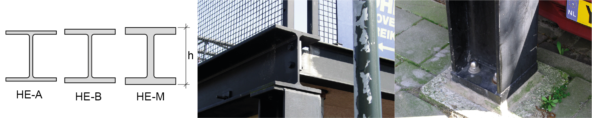
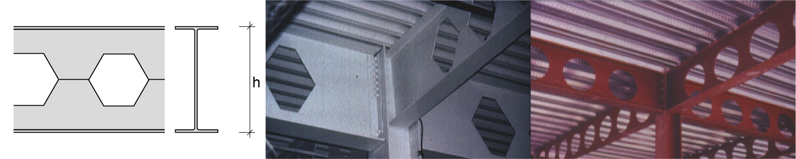
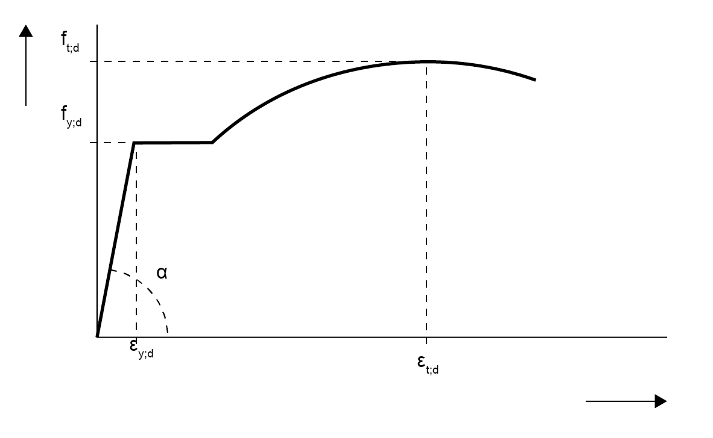
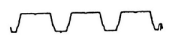

# Staal

## Producten I, warmgewalste profielen
**I-profielen**  
|  | 
| --- |
| IPE en INP profieldoorsneden & aansluiting balk-balk met behulp van een kopplaat & Balk (I-profiel)-kolom (H-profiel) verbinding met een verlengde kopplaat. | 

| type | grootte | h (mm) | b (mm) | $\mathsf{M_{z;el;d}}$ S235 (kNm) | $\mathsf{M_{z;el;d}}$ S355 (kNm) |
| --- | --- | --- | --- | --- | --- |
| IPE | 80 - 600 | 80 - 600 | 42 - 300 | 4,56 - 1076 | 6,89 - 1627 |
| INP | 80 - 750 | 80 - 750 | 46 - 263 | 4,71 - 1467 | 7,71 - 2216 |

**Toepassingen:**  
Licht belaste constructies voor de woning- en utiliteitsbouw. Veel toepassingen bij roostervloeren in de waterbouw, utiliteitsbouw en de procesindustrie. Ook worden hiervan raatliggers gemaakt door de liggers op een bepaalde manier door te snijden over de lengte.

<br>

**H-profielen**  
|  | 
| --- |
| HE-A, HE-B, HE-M profieldoorsneden, bij een serie van deze drie zijn de binnenmaten gelijk & aansluiting tussen HE ligger en IPE ligger op een HE kolom & HE-A kolom oplegging |

| type | grootte | h (mm) | b (mm) | $\mathsf{M_{z;el;d}}$ S235 (kNm) | $\mathsf{M_{z;el;d}}$ S355 (kNm) |
| --- | --- | --- | --- | --- | --- |
| HE A | 100 - 1000 | 96 - 990 | 100 - 300 | 17,1 - 2629 | 25,8 - 3972 |
| HE B | 100 - 1000 | 100 - 1000 | 100 - 300 | 21,1 - 3030 | 31,9 – 4578 |
| HE M | 100 - 1000 | 120 – 1008 | 106 - 302 | 44,8 - 3368 | 67,6 – 5088 |

**Toepassingen:**  
H-ligger voor op druk belaste kolommen en op buiging belaste liggers waarbij de constructiehoogte beperkt dient te worden. Het grotere traagheidsmoment wordt veroorzaakt door de toename van de flensdikte bij gelijkblijvende constructiehoogte. Door de grotere breedte zijn deze profielen zijdelings redelijk vormvast.

<br>

**U-profielen**  
|  | 
| --- |
| UP en UNP profieldoorsneden | 

| type | grootte | h (mm) | b (mm) | $\mathsf{M_{z;el;d}}$ S235 (kNm) | $\mathsf{M_{z;el;d}}$ S355 (kNm) |
| --- | --- | --- | --- | --- | --- |
| UAP | 80 - 400 | 80 - 400 | 45 - 100 | 6,29 - 128 | 9,51 - 193 |
| UNP | 80 - 400 | 80 - 400 | 45 - 100 | 6,22 - 239 | 9,4 - 361 |

**Toepassingen:**  
Vloerranden en bordessen. Moeilijke onderlinge verbindingen bij UNP-profielen door de schuine flenzen. Omdat de profielen niet symmetrisch zijn, treedt bij belasting op buiging vervorming op om beide hoofdtraagheidsassen.

<br>

**Buisprofielen**  
|  | 
| --- |
| CHS (circular hollow section) en RHS (rectangular hollow section) & knooppunt van ruimtelijk vakwerk vervaardigd uit holle buizen & vakwerk van rechthoekige koker-profielen. | 

| type | grootte | h (mm) | t (mm) |
| --- | --- | --- | --- |
| CHS | 42,4 - 610 | 42,4 - 610 | 2,6 - 30 |
| RHS | 40 - 400 | 40 - 400 | 3 - 16 |

**Toepassingen:**  
(ruimtelijke) vakwerken, kolommen.

<br>

**Damwandprofielen**  
|  | 
| --- |
| Toepassingen: | 
| Kelderwanden, funderingen, waterbouw. Damwandprofielen zijn er in uiteenlopende soorten en maten. Wanden van bouwputten en verdiepte objecten (verzonken infrastructuur) en kadewanden behoren tot de mogelijkheden voor grondkerende constructies. Ook verticale belastingen kunnen worden opgenomen. |

## Producten II, koudgewalste profielen
**U en C profielen**  
|  | 
| --- |
| Koudgevormde U met gelijke (eq) of ongelijke (eu) hoogte en breedte en C profielen met en zonder verstijvingen | 

| type | grootte | h (mm) | b (mm) |
| --- | --- | --- | --- |
| $\mathsf{CFU_{eq}}$ | 10 - 100 | 10 - 100 | 10 - 100 |
| $\mathsf{CFU_{ue}}$ | 10 - 160 | 10 - 160 | 10 - 70 |
| CFC | 25 - 100 | 25 - 100 | 25 - 50 |

**Toepassingen:**  
Wordt toegepast in woningbouw, cascobouw, opslagsystemen, afbouw. Staalframe-bouw: dakgordingen, wandliggers, vloerliggers. Wegens de vervormingen tijdens de fabricage zullen de materiaalkarakteristieken afwijken van warmgewalst staal.

<br>

**L en Z profielen**  
|  | 
| --- |
| Koudgevormde L met gelijke (eq) of ongelijke (eu) hoogte en breedte en Z profielen met en zonder verstijvingen | 

| type | grootte | h (mm) | b (mm) |
| --- | --- | --- | --- |
| CFL_{eq} | 15 - 80 | 15 - 80 | 15 - 80 |
| CFL_{ue} | 20 - 100 | 20 - 100 | 15 - 50 |
| CFZ | 30 - 50 | 30 - 50 | 38 - 57 |

**Toepassingen:**  
Zie koudgevormde U en C profielen.

<br>

## Producten III, gelaste profielen
**Raatliggers IPE/HEA/HEB**  
|  | 
| --- |
| Utiliteitsbouw. De onderdelen van een raatligger (met zeshoekige gaten) kunnen met een enkele snijbeweging worden gesneden zonder materiaalverlies. Raatliggers met ronde gaten zijn minder economisch vanwege het extra snijwerk en materiaalverlies | 

| type | grootte | h (mm) | b (mm) |
| --- | --- | --- | --- |
| IPE | 180 - 600 | 270 - 900 | 91 - 220 |
| HEA | 180 - 1000 | 257 - 1485 | 180 - 300 |
| HEB | 180 - 1000 | 270 - 1500 | 180 - 300 |

**Toepassingen:**  
Grote lichte overspanningen, mogelijkheden voor leidingen doorvoer. De doorsnede heeft een toegenomen momentcapaciteit, een hogere stijfheid en sterkte bij gelijkblijvend gewicht. Daarentegen zijn dwarskrachtcapaciteit en kipstabiliteit substantieel afgenomen. (kip is zijwaartse instabiliteit van de flenzen)

<br>

**Hoedliggers**  
|  | 
| --- |
| Gelaste geïntegreerde liggers (hoedliggers) | 

**Toepassingen:**  
Wordt voornamelijk toegepast bij (onder)grondse constructies en overspanningen, met name bij de aanleg van snelwegen.

## Sterkte en stijfheid


<div style="max-height: 400px; overflow-y: auto;">
    <table style="width: 100%; border-collapse: collapse;">
        <thead style="position: sticky; top: 0; background-color: #f2f2f2;">
            <tr>
                <th style="width: 200px;">materiaaleigenschap</th>
                <th> </th>
                <th colspan="5" style="text-align: center;">staalkwaliteit</th>
            </tr>
            <tr>
                <th></th>
                <th style="width: 100px;"></th>
                <th style="width: 100px;">S235</th>
                <th style="width: 100px;">S275</th>
                <th style="width: 100px;">S355</th>
                <th style="width: 100px;">S420*</th>
                <th style="width: 100px;">S460*</th>
            </tr>
        </thead>
        <tbody>
            <tr><td>volumieke massa</td><td>ρ<sub>rep</sub></td><td>7850</td><td>7850</td><td>7850</td><td>7850</td><td>7850</td></tr>
            <tr><td>elasticiteitsmodulus</td><td>E<sub>rep</sub></td><td>210 &middot 10<sup>3</sup></td><td>210 &middot 10<sup>3</sup></td><td>210 &middot 10<sup>3</sup></td><td>210 &middot 10<sup>3</sup></td><td>210 &middot 10<sup>3</sup></td></tr>
            <tr><td>rekenwaarde vloeigrens</td><td>f<sub>y;d</sub></td><td>235</td><td>275</td><td>355</td><td>420</td><td>460</td></tr>
            <tr><td>rekenwaarde treksterkte</td><td>f<sub>t;d</sub></td><td>360</td><td>430</td><td>510</td><td>--</td><td>--</td></tr>
            <tr><td>vloeigrens</td><td>ϵ<sub>y;d</sub></td><td>1,12</td><td>1,31</td><td>1,69</td><td>--</td><td>--</td></tr>
            <tr><td>afschuifmodulus</td><td>G<sub>rep</sub></td><td>8,1 &middot 10<sup>4</sup></td><td>8,1 &middot 10<sup>4</sup></td><td>8,1 &middot 10<sup>4</sup></td><td>8,1 &middot 10<sup>4</sup></td><td>8,1 &middot 10<sup>4</sup></td></tr>
            <tr><td>uitzettingscoëfficient</td><td>α</td><td>12 &middot 10<sup>-6</sup></td><td>12 &middot 10<sup>-6</sup></td><td>12 &middot 10<sup>-6</sup></td><td>12 &middot 10<sup>-6</sup></td><td>12 &middot 10<sup>-6</sup></td></tr>
        </tbody>
    </table>
</div>


```{note}
Volgens de norm 6770 mag men voor de vloeigrens geen hogere waarde aanhouden dan 355 N/mm². Wil men echter gebruik maken van S420 en S460 dan moeten de berekeningen extra getoetst worden. Bovenstaande waarden voor de vloeigrens en de treksterkte zijn van toepassing voor platen, flenzen, etc. met een dikte t<40 mm volgens NEN-EN 10025.
```

<br>

## Spannings-rek diagram

| **Diagram** | | **Toelichting** |
|---|---|---|
|  | $\mathsf{\epsilon_{y;d}}$ <br> $\mathsf{f_{t;d}}$ <br> $\mathsf{f_{y;d}}$ <br> tan $\mathsf{\alpha}$ | : rekenwaarde rek <br> : rekenwaarde treksterkte <br> : rekenwaarde vloeigrens <br> : $\mathsf{E_{d}}$ (elasticiteitsmodulus) |

In eenvoudige berekeningen en toetsing van de constructie wordt er lineair elastisch gerekend. Praktisch gezien betekent dit dat als het staal begint te vloeien, de constructie of het constructieonderdeel als bezweken beschouwd dient te worden. Er wordt dus alleen met het eerste lineaire gedeelte van het spannings-rekdiagram gerekend. Er mogen dus geen grotere rekken optreden dan in de tabel per staalsoort weergegeven.

<br>

## Dimensietabellen

De staalprofielen app van 'Bouwen met Staal' bevat alle gangbare profielafmetingen met bijbehorende doorsnede grootheden. 


## IPE sections 
```{figure} Images/IPE.png
---
---
IPE axo
```


<div style="max-height: 400px; overflow-y: auto;">
    <table style="width: 100%; border-collapse: collapse;">
        <thead style="position: sticky; top: 0; background-color: #f2f2f2;">
            <tr>
                <th style="width: 100px;"> Profiel (IPE) </th>
                <th>G [kg/m]</th>
                <th>h [mm]</th>
                <th>b [mm]</th>
                <th>t<sub>w</sub> [mm]</th>
                <th>t<sub>f</sub> [mm]</th>
                <th>A<sub>tot</sub> · 10² [mm²]</th>
                <th>I<sub>y</sub> · 10⁴ [mm⁴]</th>
                <th>I<sub>z</sub> · 10⁴ [mm⁴]</th>
                <th>W<sub>yej</sub> · 10³ [mm³]</th>
                <th>W<sub>zej</sub> · 10³ [mm³]</th>
                <th>i<sub>y</sub> [mm]</th>
                <th>i<sub>z</sub> [mm]</th>
            </tr>
        </thead>
        <tbody>
            <tr>
                <td>IPE 100A</td>
                <td>6.9</td>
                <td>98.0</td>
                <td>55.0</td>
                <td>3.60</td>
                <td>4.70</td>
                <td>8.78</td>
                <td>141</td>
                <td>13.1</td>
                <td>28.8</td>
                <td>4.77</td>
                <td>40.1</td>
                <td>12.2</td>
            </tr>
            <tr>
                <td>IPE 100</td>
                <td>8.1</td>
                <td>100.0</td>
                <td>55.0</td>
                <td>4.10</td>
                <td>5.70</td>
                <td>10.3</td>
                <td>171</td>
                <td>15.9</td>
                <td>34.2</td>
                <td>5.79</td>
                <td>40.7</td>
                <td>12.4</td>
            </tr>
            <tr>
                <td>IPE 120 A</td>
                <td>8.7</td>
                <td>117.6</td>
                <td>64.0</td>
                <td>3.80</td>
                <td>5.10</td>
                <td>11.0</td>
                <td>257</td>
                <td>22.4</td>
                <td>43.8</td>
                <td>7.00</td>
                <td>48.3</td>
                <td>14.2</td>
            </tr>
            <tr>
                <td>IPE 120</td>
                <td>10.4</td>
                <td>120.0</td>
                <td>64.0</td>
                <td>4.40</td>
                <td>6.30</td>
                <td>13.2</td>
                <td>318</td>
                <td>27.7</td>
                <td>53.0</td>
                <td>8.65</td>
                <td>49.0</td>
                <td>14.5</td>
            </tr>
            <tr>
                <td>IPE 140 A</td>
                <td>10.5</td>
                <td>137.4</td>
                <td>73.0</td>
                <td>3.80</td>
                <td>5.60</td>
                <td>13.4</td>
                <td>435</td>
                <td>36.4</td>
                <td>63.3</td>
                <td>9.98</td>
                <td>57.0</td>
                <td>16.5</td>
            </tr>
            <tr>
                <td>IPE 140</td>
                <td>12.9</td>
                <td>140.0</td>
                <td>73.0</td>
                <td>4.70</td>
                <td>6.90</td>
                <td>16.4</td>
                <td>541</td>
                <td>44.9</td>
                <td>77.3</td>
                <td>12.3</td>
                <td>57.4</td>
                <td>16.5</td>
            </tr>
            <tr>
                <td>IPE 140 R</td>
                <td>14.4</td>
                <td>142.0</td>
                <td>72.0</td>
                <td>5.30</td>
                <td>7.80</td>
                <td>18.4</td>
                <td>611</td>
                <td>48.8</td>
                <td>86.1</td>
                <td>13.5</td>
                <td>57.7</td>
                <td>16.3</td>
            </tr>
            <tr>
                <td>IPE 160 A</td>
                <td>12.7</td>
                <td>157.0</td>
                <td>82.0</td>
                <td>4.00</td>
                <td>5.90</td>
                <td>16.2</td>
                <td>689</td>
                <td>54.4</td>
                <td>87.8</td>
                <td>13.3</td>
                <td>65.3</td>
                <td>18.3</td>
            </tr>
            <tr>
                <td>IPE 160</td>
                <td>15.8</td>
                <td>160.0</td>
                <td>82.0</td>
                <td>5.00</td>
                <td>7.40</td>
                <td>20.1</td>
                <td>869</td>
                <td>68.3</td>
                <td>109</td>
                <td>16.7</td>
                <td>65.8</td>
                <td>18.4</td>
            </tr>
            <tr>
                <td>IPE 160 R</td>
                <td>17.7</td>
                <td>162.0</td>
                <td>81.0</td>
                <td>5.60</td>
                <td>8.50</td>
                <td>22.6</td>
                <td>989</td>
                <td>75.7</td>
                <td>122</td>
                <td>18.7</td>
                <td>66.2</td>
                <td>18.3</td>
            </tr>
            <tr>
                <td>IPE 180 A</td>
                <td>15.4</td>
                <td>177.0</td>
                <td>91.0</td>
                <td>4.30</td>
                <td>6.50</td>
                <td>19.6</td>
                <td>1063</td>
                <td>81.9</td>
                <td>120</td>
                <td>18.0</td>
                <td>73.7</td>
                <td>20.5</td>
            </tr>
                <td>IPE 200 A</td>
                <td>18.4</td>
                <td>197.0</td>
                <td>100.0</td>
                <td>4.50</td>
                <td>7.00</td>
                <td>23.5</td>
                <td>1591</td>
                <td>117</td>
                <td>162</td>
                <td>23.4</td>
                <td>82.3</td>
                <td>22.3</td>
            </tr>
            <tr>
                <td>IPE 200</td>
                <td>22.4</td>
                <td>200.0</td>
                <td>100.0</td>
                <td>5.60</td>
                <td>8.50</td>
                <td>28.5</td>
                <td>1943</td>
                <td>142</td>
                <td>194</td>
                <td>28.5</td>
                <td>82.6</td>
                <td>22.4</td>
            </tr>
            <tr>
                <td>IPE 200 O</td>
                <td>25.1</td>
                <td>202.0</td>
                <td>102.0</td>
                <td>6.20</td>
                <td>9.50</td>
                <td>32.0</td>
                <td>2211</td>
                <td>169</td>
                <td>219</td>
                <td>33.1</td>
                <td>83.2</td>
                <td>23.0</td>
            </tr>
            <tr>
                <td>IPE 200 R</td>
                <td>26.6</td>
                <td>204.0</td>
                <td>98.0</td>
                <td>6.60</td>
                <td>10.5</td>
                <td>33.9</td>
                <td>2363</td>
                <td>166</td>
                <td>232</td>
                <td>33.8</td>
                <td>83.5</td>
                <td>22.1</td>
            </tr>
            <tr>
                <td>IPE 220 A</td>
                <td>22.2</td>
                <td>217.0</td>
                <td>110.0</td>
                <td>5.00</td>
                <td>7.70</td>
                <td>28.3</td>
                <td>2317</td>
                <td>171</td>
                <td>214</td>
                <td>31.2</td>
                <td>90.5</td>
                <td>24.6</td>
            </tr>
            <tr>
                <td>IPE 220</td>
                <td>26.2</td>
                <td>220.0</td>
                <td>110.0</td>
                <td>5.90</td>
                <td>9.20</td>
                <td>33.4</td>
                <td>2772</td>
                <td>205</td>
                <td>252</td>
                <td>37.3</td>
                <td>91.1</td>
                <td>24.8</td>
            </tr>
            <tr>
                <td>IPE 220 O</td>
                <td>29.4</td>
                <td>222.0</td>
                <td>112.0</td>
                <td>6.60</td>
                <td>10.2</td>
                <td>37.4</td>
                <td>3134</td>
                <td>240</td>
                <td>282</td>
                <td>42.8</td>
                <td>91.6</td>
                <td>25.3</td>
            </tr>
            <tr>
                <td>IPE 220 R</td>
                <td>31.6</td>
                <td>225.0</td>
                <td>108.0</td>
                <td>6.70</td>
                <td>11.8</td>
                <td>40.2</td>
                <td>3474</td>
                <td>249</td>
                <td>309</td>
                <td>46.1</td>
                <td>92.9</td>
                <td>24.9</td>
            </tr>
            <tr>
                <td>IPE 240 A</td>
                <td>26.2</td>
                <td>237.0</td>
                <td>120.0</td>
                <td>5.20</td>
                <td>8.30</td>
                <td>33.3</td>
                <td>3290</td>
                <td>240</td>
                <td>278</td>
                <td>40.0</td>
                <td>74.5</td>
                <td>99.4</td>
            </tr>
            <tr>
                <td>IPE 240</td>
                <td>30.7</td>
                <td>240.0</td>
                <td>120.0</td>
                <td>6.20</td>
                <td>9.80</td>
                <td>39.1</td>
                <td>3892</td>
                <td>284</td>
                <td>324</td>
                <td>47.3</td>
                <td>74.4</td>
                <td>99.7</td>
            </tr>
            <tr>
                <td>IPE 240 O</td>
                <td>34.3</td>
                <td>242.0</td>
                <td>122.0</td>
                <td>7.00</td>
                <td>10.8</td>
                <td>43.7</td>
                <td>4369</td>
                <td>329</td>
                <td>361</td>
                <td>53.9</td>
                <td>82.3</td>
                <td>100.0</td>
            </tr>
            <tr>
                <td>IPE 240 R</td>
                <td>37.3</td>
                <td>245.0</td>
                <td>118.0</td>
                <td>7.50</td>
                <td>12.3</td>
                <td>47.5</td>
                <td>4823</td>
                <td>339</td>
                <td>394</td>
                <td>57.4</td>
                <td>82.6</td>
                <td>101.0</td>
            </tr>
            <tr>
                <td>IPE 270 A</td>
                <td>30.7</td>
                <td>267.0</td>
                <td>135.0</td>
                <td>5.50</td>
                <td>8.70</td>
                <td>39.1</td>
                <td>4917</td>
                <td>358</td>
                <td>368</td>
                <td>53.0</td>
                <td>83.2</td>
                <td>112.0</td>
            </tr>
            <tr>
                <td>IPE 270</td>
                <td>36.1</td>
                <td>270.0</td>
                <td>135.0</td>
                <td>6.60</td>
                <td>10.2</td>
                <td>45.9</td>
                <td>5790</td>
                <td>420</td>
                <td>429</td>
                <td>62.2</td>
                <td>83.5</td>
                <td>112.0</td>
            </tr>
            <tr>
                <td>IPE 270 O</td>
                <td>42.3</td>
                <td>274.0</td>
                <td>136.0</td>
                <td>7.50</td>
                <td>12.2</td>
                <td>53.8</td>
                <td>6947</td>
                <td>513</td>
                <td>507</td>
                <td>75.5</td>
                <td>90.5</td>
                <td>114.0</td>
            </tr>
            <tr>
                <td>IPE 270 R</td>
                <td>44.0</td>
                <td>276.0</td>
                <td>133.0</td>
                <td>7.70</td>
                <td>13.1</td>
                <td>56.0</td>
                <td>7312</td>
                <td>516</td>
                <td>530</td>
                <td>77.6</td>
                <td>91.1</td>
                <td>114.0</td>
            </tr>
            <tr>
                <td>IPE 300 A</td>
                <td>36.5</td>
                <td>297.0</td>
                <td>150.0</td>
                <td>6.10</td>
                <td>9.20</td>
                <td>46.5</td>
                <td>7173</td>
                <td>519</td>
                <td>483</td>
                <td>69.2</td>
                <td>91.6</td>
                <td>124.0</td>
            </tr>
            <tr>
                <td>IPE 300</td>
                <td>42.2</td>
                <td>300.0</td>
                <td>150.0</td>
                <td>7.10</td>
                <td>10.7</td>
                <td>53.8</td>
                <td>8356</td>
                <td>604</td>
                <td>557</td>
                <td>80.5</td>
                <td>92.9</td>
                <td>125.0</td>
            </tr>
            <tr>
                <td>IPE 300 O</td>
                <td>49.3</td>
                <td>304.0</td>
                <td>152.0</td>
                <td>8.00</td>
                <td>12.7</td>
                <td>62.8</td>
                <td>9994</td>
                <td>746</td>
                <td>658</td>
                <td>98.1</td>
                <td> </td>
                <td>126.0</td>
            </tr>
            <tr>
                <td>IPE 300 R</td>
                <td>51.7</td>
                <td>306.0</td>
                <td>147.0</td>
                <td>8.50</td>
                <td>13.7</td>
                <td>65.9</td>
                <td>10500</td>
                <td>728</td>
                <td>686</td>
                <td>99.0</td>
                <td> </td>
                <td>126.0</td>
            </tr>
            <tr>
                <td>IPE 330 A</td>
                <td>43.0</td>
                <td>327.0</td>
                <td>160.0</td>
                <td>6.50</td>
                <td>10.0</td>
                <td>54.7</td>
                <td>10230</td>
                <td>685</td>
                <td>626</td>
                <td>85.6</td>
                <td>137.0</td>
                <td>35.4</td>
            </tr>
            <tr>
                <td>IPE 330</td>
                <td>49.1</td>
                <td>330.0</td>
                <td>160.0</td>
                <td>7.50</td>
                <td>11.5</td>
                <td>62.6</td>
                <td>11770</td>
                <td>788</td>
                <td>713</td>
                <td>98.5</td>
                <td>137.0</td>
                <td>35.5</td>
            </tr>
            <tr>
                <td>IPE 330 O</td>
                <td>57.0</td>
                <td>334.0</td>
                <td>162.0</td>
                <td>8.50</td>
                <td>13.5</td>
                <td>72.6</td>
                <td>13910</td>
                <td>960</td>
                <td>833</td>
                <td>119</td>
                <td>138.0</td>
                <td>36.4</td>
            </tr>
            <tr>
                <td>IPE 330 R</td>
                <td>60.3</td>
                <td>336.0</td>
                <td>158.0</td>
                <td>9.20</td>
                <td>14.5</td>
                <td>76.8</td>
                <td>14690</td>
                <td>958</td>
                <td>874</td>
                <td>121</td>
                <td>138.0</td>
                <td>35.3</td>
            </tr>
            <tr>
                <td>IPE 360 A</td>
                <td>50.2</td>
                <td>357.6</td>
                <td>170.0</td>
                <td>6.60</td>
                <td>11.5</td>
                <td>64.0</td>
                <td>14520</td>
                <td>944</td>
                <td>812</td>
                <td>111</td>
                <td>151.0</td>
                <td>38.4</td>
            </tr>
            <tr>
                <td>IPE 360</td>
                <td>57.1</td>
                <td>360.0</td>
                <td>170.0</td>
                <td>8.00</td>
                <td>12.7</td>
                <td>72.7</td>
                <td>16270</td>
                <td>1043</td>
                <td>904</td>
                <td>123</td>
                <td>150.0</td>
                <td>37.9</td>
            </tr>
            <tr>
                <td>IPE 360 O</td>
                <td>66.0</td>
                <td>364.0</td>
                <td>172.0</td>
                <td>9.20</td>
                <td>14.7</td>
                <td>84.1</td>
                <td>19050</td>
                <td>1251</td>
                <td>1047</td>
                <td>145</td>
                <td>150.0</td>
                <td>38.6</td>
            </tr>
            <tr>
                <td>IPE 360 R</td>
                <td>70.3</td>
                <td>366.0</td>
                <td>168.0</td>
                <td>9.90</td>
                <td>16.0</td>
                <td>89.6</td>
                <td>20290</td>
                <td>1270</td>
                <td>1109</td>
                <td>151</td>
                <td>150.0</td>
                <td>37.6</td>
            </tr>
            <tr>
                <td>IPE 400 A</td>
                <td>57.4</td>
                <td>397.0</td>
                <td>180.0</td>
                <td>7.00</td>
                <td>12.0</td>
                <td>73.1</td>
                <td>20290</td>
                <td>1171</td>
                <td>1022</td>
                <td>130</td>
                <td>167.0</td>
                <td>40.0</td>
            </tr>
            <tr>
                <td>IPE 400</td>
                <td>66.3</td>
                <td>400.0</td>
                <td>180.0</td>
                <td>8.60</td>
                <td>13.5</td>
                <td>84.5</td>
                <td>23130</td>
                <td>1318</td>
                <td>1156</td>
                <td>146</td>
                <td>165.0</td>
                <td>39.5</td>
            </tr>
            <tr>
                <td>IPE 400 O</td>
                <td>75.7</td>
                <td>404.0</td>
                <td>182.0</td>
                <td>9.70</td>
                <td>15.5</td>
                <td>96.4</td>
                <td>26750</td>
                <td>1564</td>
                <td>1324</td>
                <td>172</td>
                <td>167.0</td>
                <td>40.3</td>
            </tr>
            <tr>
                <td>IPE 400 R</td>
                <td>81.5</td>
                <td>407.0</td>
                <td>178.0</td>
                <td>10.6</td>
                <td>17.0</td>
                <td>104</td>
                <td>28860</td>
                <td>1606</td>
                <td>1418</td>
                <td>180</td>
                <td>167.0</td>
                <td>39.3</td>
            </tr>
            <tr>
                <td>IPE 400 V</td>
                <td>84.0</td>
                <td>408.0</td>
                <td>182.0</td>
                <td>10.6</td>
                <td>17.5</td>
                <td>107</td>
                <td>30140</td>
                <td>1766</td>
                <td>1477</td>
                <td>194</td>
                <td>168.0</td>
                <td>40.6</td>
            </tr>
                <td>IPE 450 A</td>
                <td>67.2</td>
                <td>447.0</td>
                <td>190.0</td>
                <td>7.60</td>
                <td>13.1</td>
                <td>85.5</td>
                <td>29760</td>
                <td>1502</td>
                <td>1331</td>
                <td>158</td>
                <td>187.0</td>
                <td>41.9</td>
            </tr>
            <tr>
                <td>IPE 450</td>
                <td>77.6</td>
                <td>450.0</td>
                <td>190.0</td>
                <td>9.40</td>
                <td>14.6</td>
                <td>98.8</td>
                <td>33740</td>
                <td>1676</td>
                <td>1500</td>
                <td>176</td>
                <td>185.0</td>
                <td>41.2</td>
            </tr>
            <tr>
                <td>IPE 450 O</td>
                <td>92.4</td>
                <td>456.0</td>
                <td>192.0</td>
                <td>11.0</td>
                <td>17.6</td>
                <td>118</td>
                <td>40920</td>
                <td>2085</td>
                <td>1795</td>
                <td>217</td>
                <td>186.0</td>
                <td>42.1</td>
            </tr>
            <tr>
                <td>IPE 450 R</td>
                <td>95.2</td>
                <td>458.0</td>
                <td>188.0</td>
                <td>11.3</td>
                <td>18.6</td>
                <td>121</td>
                <td>42400</td>
                <td>2070</td>
                <td>1851</td>
                <td>220</td>
                <td>187.0</td>
                <td>41.3</td>
            </tr>
            <tr>
                <td>IPE 450 V</td>
                <td>103.6</td>
                <td>460.0</td>
                <td>194.0</td>
                <td>12.4</td>
                <td>19.6</td>
                <td>132</td>
                <td>46200</td>
                <td>2397</td>
                <td>2009</td>
                <td>247</td>
                <td>187.0</td>
                <td>42.6</td>
            </tr>
            <tr>
                <td>IPE 500 A</td>
                <td>79.4</td>
                <td>497.0</td>
                <td>200.0</td>
                <td>8.40</td>
                <td>14.5</td>
                <td>101</td>
                <td>42930</td>
                <td>1939</td>
                <td>1728</td>
                <td>194</td>
                <td>206.0</td>
                <td>43.8</td>
            </tr>
            <tr>
                <td>IPE 500</td>
                <td>90.7</td>
                <td>500.0</td>
                <td>200.0</td>
                <td>10.2</td>
                <td>16.0</td>
                <td>116</td>
                <td>48200</td>
                <td>2142</td>
                <td>1928</td>
                <td>214</td>
                <td>204.0</td>
                <td>43.1</td>
            </tr>
            <tr>
                <td>IPE 500 O</td>
                <td>107.3</td>
                <td>506.0</td>
                <td>202.0</td>
                <td>12.0</td>
                <td>19.0</td>
                <td>137</td>
                <td>57780</td>
                <td>2622</td>
                <td>2284</td>
                <td>260</td>
                <td>206.0</td>
                <td>43.8</td>
            </tr>
            <tr>
                <td>IPE 500 R</td>
                <td>111.4</td>
                <td>508.0</td>
                <td>198.0</td>
                <td>12.6</td>
                <td>20.0</td>
                <td>142</td>
                <td>59930</td>
                <td>2600</td>
                <td>2360</td>
                <td>263</td>
                <td>205.0</td>
                <td>42.8</td>
            </tr>
            <tr>
                <td>IPE 500 V</td>
                <td>128.8</td>
                <td>514.0</td>
                <td>204.0</td>
                <td>14.2</td>
                <td>23.0</td>
                <td>164</td>
                <td>70720</td>
                <td>3271</td>
                <td>2752</td>
                <td>321</td>
                <td>208.0</td>
                <td>44.7</td>
            </tr>
            <tr>
                <td>IPE 550 A</td>
                <td>92.1</td>
                <td>547.0</td>
                <td>210.0</td>
                <td>9.00</td>
                <td>15.7</td>
                <td>117</td>
                <td>59980</td>
                <td>2432</td>
                <td>2193</td>
                <td>232</td>
                <td>226.0</td>
                <td>45.5</td>
            </tr>
            <tr>
                <td>IPE 550</td>
                <td>105.5</td>
                <td>550.0</td>
                <td>210.0</td>
                <td>11.1</td>
                <td>17.2</td>
                <td>134</td>
                <td>67120</td>
                <td>2668</td>
                <td>2441</td>
                <td>254</td>
                <td>223.0</td>
                <td>44.5</td>
            </tr>
            <tr>
                <td>IPE 550 O</td>
                <td>122.5</td>
                <td>556.0</td>
                <td>212.0</td>
                <td>12.7</td>
                <td>20.2</td>
                <td>156</td>
                <td>79160</td>
                <td>3224</td>
                <td>2847</td>
                <td>304</td>
                <td>225.0</td>
                <td>45.5</td>
            </tr>
            <tr>
                <td>IPE 550 R</td>
                <td>133.7</td>
                <td>560.0</td>
                <td>210.0</td>
                <td>14.0</td>
                <td>22.2</td>
                <td>170</td>
                <td>86600</td>
                <td>3447</td>
                <td>3093</td>
                <td>328</td>
                <td>225.0</td>
                <td>45.0</td>
            </tr>
            <tr>
                <td>IPE 550 V</td>
                <td>158.6</td>
                <td>566.0</td>
                <td>216.0</td>
                <td>17.1</td>
                <td>25.2</td>
                <td>202</td>
                <td>102300</td>
                <td>4265</td>
                <td>3616</td>
                <td>395</td>
                <td>225.0</td>
                <td>46.0</td>
            </tr>
            <tr>
                <td>IPE 600 A</td>
                <td>107.6</td>
                <td>597.0</td>
                <td>220.0</td>
                <td>9.80</td>
                <td>17.5</td>
                <td>137</td>
                <td>82920</td>
                <td>3116</td>
                <td>2778</td>
                <td>283</td>
                <td>246.0</td>
                <td>47.7</td>
            </tr>
            <tr>
                <td>IPE 600</td>
                <td>122.4</td>
                <td>600.0</td>
                <td>220.0</td>
                <td>12.0</td>
                <td>19.0</td>
                <td>156</td>
                <td>92080</td>
                <td>3387</td>
                <td>3069</td>
                <td>308</td>
                <td>243.0</td>
                <td>46.6</td>
            </tr>
            <tr>
                <td>IPE 600 O</td>
                <td>154.5</td>
                <td>610.0</td>
                <td>224.0</td>
                <td>15.0</td>
                <td>24.0</td>
                <td>197</td>
                <td>118300</td>
                <td>4521</td>
                <td>3879</td>
                <td>404</td>
                <td>245.0</td>
                <td>47.9</td>
            </tr>
            <tr>
                <td>IPE 600 R</td>
                <td>144.4</td>
                <td>608.0</td>
                <td>218.0</td>
                <td>14.0</td>
                <td>23.0</td>
                <td>184</td>
                <td>110300</td>
                <td>3993</td>
                <td>3629</td>
                <td>366</td>
                <td>245.0</td>
                <td>46.6</td>
            </tr>
            <tr>
                <td>IPE 600 V</td>
                <td>183.5</td>
                <td>618.0</td>
                <td>228.0</td>
                <td>18.0</td>
                <td>28.0</td>
                <td>234</td>
                <td>141600</td>
                <td>5570</td>
                <td>4582</td>
                <td>489</td>
                <td>246.0</td>
                <td>48.8</td>
            </tr>
            <tr>
                <td>IPE 750 x 137</td>
                <td>137.0</td>
                <td>753.0</td>
                <td>263.0</td>
                <td>11.5</td>
                <td>17.0</td>
                <td>175</td>
                <td>159900</td>
                <td>5166</td>
                <td>4246</td>
                <td>393</td>
                <td>303.0</td>
                <td>54.4</td>
            </tr>
            <tr>
                <td>IPE 750 x 147</td>
                <td>147.2</td>
                <td>753.0</td>
                <td>265.0</td>
                <td>13.2</td>
                <td>17.0</td>
                <td>187</td>
                <td>166100</td>
                <td>5289</td>
                <td>4411</td>
                <td>399</td>
                <td>298.0</td>
                <td>53.1</td>
            </tr>
            <tr>
                <td>IPE 750 x 161</td>
                <td>160.5</td>
                <td>758.0</td>
                <td>266.0</td>
                <td>13.8</td>
                <td>19.3</td>
                <td>204</td>
                <td>186100</td>
                <td>6073</td>
                <td>4909</td>
                <td>457</td>
                <td>302.0</td>
                <td>54.5</td>
            </tr>
            <tr>
                <td>IPE 750 x 174</td>
                <td>173.7</td>
                <td>762.0</td>
                <td>267.0</td>
                <td>14.4</td>
                <td>21.6</td>
                <td>221</td>
                <td>205800</td>
                <td>6873</td>
                <td>5402</td>
                <td>515</td>
                <td>305.0</td>
                <td>55.7</td>
            </tr>
            <tr>
                <td>IPE 750 x 185</td>
                <td>185.0</td>
                <td>766.0</td>
                <td>267.0</td>
                <td>14.9</td>
                <td>23.6</td>
                <td>236</td>
                <td>223000</td>
                <td>7510</td>
                <td>5821</td>
                <td>563</td>
                <td>308.0</td>
                <td>56.5</td>
            </tr>
        </tbody>
    </table>
</div>


## HEA/HEB/HEM sections
```{figure} Images/HEA_HEB_HEM.png
---
---
HEA/HEB/HEM axo
```


<div style="max-height: 400px; overflow-y: auto;">
    <table style="width: 100%; border-collapse: collapse;">
        <thead style="position: sticky; top: 0; background-color: #f2f2f2;">
            <tr>
                <th style="width: 100px;">Profiel (HE)</th>
                <th>G [kg/m]</th>
                <th>h [mm]</th>
                <th>b [mm]</th>
                <th>t<sub>w</sub> [mm]</th>
                <th>t<sub>f</sub> [mm]</th>
                <th>A<sub>tot</sub> · 10² [mm²]</th>
                <th>I<sub>y</sub> · 10⁴ [mm⁴]</th>
                <th>I<sub>z</sub> · 10⁴ [mm⁴]</th>
                <th>W<sub>yej</sub> · 10³ [mm³]</th>
                <th>W<sub>zej</sub> · 10³ [mm³]</th>
                <th>i<sub>y</sub> [mm]</th>
                <th>i<sub>z</sub> [mm]</th>
            </tr>
        </thead>
        <tbody>
            <tr>
                <td>HE 100 AA</td>
                <td>12.2</td>
                <td>91.0</td>
                <td>100.0</td>
                <td>4.20</td>
                <td>5.50</td>
                <td>15.6</td>
                <td>237</td>
                <td>92.1</td>
                <td>52.0</td>
                <td>18.4</td>
                <td>38.9</td>
                <td>24.3</td>
            </tr>
            <tr>
                <td>HE 100 A</td>
                <td>16.7</td>
                <td>96.0</td>
                <td>100.0</td>
                <td>5.00</td>
                <td>8.00</td>
                <td>21.2</td>
                <td>349</td>
                <td>134</td>
                <td>72.8</td>
                <td>26.8</td>
                <td>40.6</td>
                <td>25.1</td>
            </tr>
            <tr>
                <td>HE 100 B</td>
                <td>20.4</td>
                <td>100.0</td>
                <td>100.0</td>
                <td>6.00</td>
                <td>10.0</td>
                <td>26.0</td>
                <td>450</td>
                <td>167</td>
                <td>89.9</td>
                <td>33.5</td>
                <td>41.6</td>
                <td>25.3</td>
            </tr>
            <tr>
                <td>HE 120 AA</td>
                <td>14.6</td>
                <td>109.0</td>
                <td>120.0</td>
                <td>4.20</td>
                <td>5.50</td>
                <td>18.6</td>
                <td>413</td>
                <td>159</td>
                <td>75.8</td>
                <td>26.5</td>
                <td>47.2</td>
                <td>29.3</td>
            </tr>
            <tr>
                <td>HE 120 A</td>
                <td>19.9</td>
                <td>114.0</td>
                <td>120.0</td>
                <td>5.00</td>
                <td>8.00</td>
                <td>25.3</td>
                <td>606</td>
                <td>231</td>
                <td>106</td>
                <td>38.5</td>
                <td>48.9</td>
                <td>30.2</td>
            </tr>
            <tr>
                <td>HE 120 B</td>
                <td>26.7</td>
                <td>120.0</td>
                <td>120.0</td>
                <td>6.50</td>
                <td>11.0</td>
                <td>34.0</td>
                <td>864</td>
                <td>318</td>
                <td>144</td>
                <td>52.9</td>
                <td>50.4</td>
                <td>30.6</td>
            </tr>
            <tr>
                <td>HE 140 AA</td>
                <td>18.1</td>
                <td>128.0</td>
                <td>140.0</td>
                <td>4.30</td>
                <td>6.00</td>
                <td>23.0</td>
                <td>719</td>
                <td>275</td>
                <td>112</td>
                <td>39.3</td>
                <td>55.9</td>
                <td>34.5</td>
            </tr>
            <tr>
                <td>HE 140 A</td>
                <td>24.7</td>
                <td>133.0</td>
                <td>140.0</td>
                <td>5.50</td>
                <td>8.50</td>
                <td>31.4</td>
                <td>1033</td>
                <td>389</td>
                <td>155</td>
                <td>55.6</td>
                <td>57.3</td>
                <td>35.2</td>
            </tr>
            <tr>
                <td>HE 140 B</td>
                <td>33.7</td>
                <td>140.0</td>
                <td>140.0</td>
                <td>7.00</td>
                <td>12.0</td>
                <td>43.0</td>
                <td>1509</td>
                <td>550</td>
                <td>216</td>
                <td>78.5</td>
                <td>59.3</td>
                <td>35.8</td>
            </tr>
            <tr>
                <td>HE 160 AA</td>
                <td>23.8</td>
                <td>148.0</td>
                <td>160.0</td>
                <td>4.50</td>
                <td>7.00</td>
                <td>30.4</td>
                <td>1283</td>
                <td>479</td>
                <td>173</td>
                <td>59.8</td>
                <td>65.0</td>
                <td>39.7</td>
            </tr>
            <tr>
                <td>HE 160 A</td>
                <td>30.4</td>
                <td>152.0</td>
                <td>160.0</td>
                <td>6.00</td>
                <td>9.00</td>
                <td>38.8</td>
                <td>1673</td>
                <td>616</td>
                <td>220</td>
                <td>76.9</td>
                <td>65.7</td>
                <td>39.8</td>
            </tr>
            <tr>
                <td>HE 160 B</td>
                <td>42.6</td>
                <td>160.0</td>
                <td>160.0</td>
                <td>8.00</td>
                <td>13.0</td>
                <td>54.3</td>
                <td>2492</td>
                <td>889</td>
                <td>312</td>
                <td>111</td>
                <td>67.8</td>
                <td>40.5</td>
            </tr>
            <tr>
                <td>HE 160 M</td>
                <td>76.2</td>
                <td>180.0</td>
                <td>166.0</td>
                <td>14.0</td>
                <td>23.0</td>
                <td>97.1</td>
                <td>5098</td>
                <td>1759</td>
                <td>566</td>
                <td>212</td>
                <td>72.5</td>
                <td>41.1</td>
            </tr>
            <tr>
                <td>HE 180 AA</td>
                <td>28.7</td>
                <td>167.0</td>
                <td>180.0</td>
                <td>5.00</td>
                <td>7.50</td>
                <td>36.5</td>
                <td>1967</td>
                <td>730</td>
                <td>236</td>
                <td>81.1</td>
                <td>73.4</td>
                <td>44.7</td>
            </tr>
            <tr>
                <td>HE 180 A</td>
                <td>35.5</td>
                <td>171.0</td>
                <td>180.0</td>
                <td>6.00</td>
                <td>9.50</td>
                <td>45.3</td>
                <td>2510</td>
                <td>925</td>
                <td>294</td>
                <td>103</td>
                <td>74.5</td>
                <td>45.2</td>
            </tr>
            <tr>
                <td>HE 180 B</td>
                <td>51.2</td>
                <td>180.0</td>
                <td>180.0</td>
                <td>8.50</td>
                <td>14.0</td>
                <td>65.3</td>
                <td>3831</td>
                <td>1363</td>
                <td>426</td>
                <td>151</td>
                <td>76.6</td>
                <td>45.7</td>
            </tr>
            <tr>
                <td>HE 180 M</td>
                <td>88.9</td>
                <td>200.0</td>
                <td>186.0</td>
                <td>14.5</td>
                <td>24.0</td>
                <td>113</td>
                <td>7483</td>
                <td>2580</td>
                <td>748</td>
                <td>277</td>
                <td>81.3</td>
                <td>47.7</td>
            </tr>
            <tr>
                <td>HE 200 AA</td>
                <td>34.6</td>
                <td>186.0</td>
                <td>200.0</td>
                <td>5.50</td>
                <td>8.00</td>
                <td>44.1</td>
                <td>2944</td>
                <td>1068</td>
                <td>317</td>
                <td>107</td>
                <td>81.7</td>
                <td>49.2</td>
            </tr>
            <tr>
                <td>HE 200 A</td>
                <td>42.3</td>
                <td>190.0</td>
                <td>200.0</td>
                <td>6.50</td>
                <td>10.0</td>
                <td>53.8</td>
                <td>3692</td>
                <td>1336</td>
                <td>389</td>
                <td>134</td>
                <td>82.8</td>
                <td>49.8</td>
            </tr>
            <tr>
                <td>HE 200 B</td>
                <td>61.3</td>
                <td>200.0</td>
                <td>200.0</td>
                <td>9.00</td>
                <td>15.0</td>
                <td>78.1</td>
                <td>5696</td>
                <td>2003</td>
                <td>570</td>
                <td>200</td>
                <td>85.4</td>
                <td>50.7</td>
            </tr>
            <tr>
                <td>HE 200 M</td>
                <td>103.1</td>
                <td>220.0</td>
                <td>206.0</td>
                <td>15.0</td>
                <td>25.0</td>
                <td>131</td>
                <td>10640</td>
                <td>3651</td>
                <td>967</td>
                <td>354</td>
                <td>90.0</td>
                <td>52.7</td>
            </tr>
            <tr>
                <td>HE 220 AA</td>
                <td>40.4</td>
                <td>205.0</td>
                <td>220.0</td>
                <td>6.00</td>
                <td>8.50</td>
                <td>51.5</td>
                <td>4170</td>
                <td>1510</td>
                <td>407</td>
                <td>137</td>
                <td>90.0</td>
                <td>54.2</td>
            </tr>
            <tr>
                <td>HE 220 A</td>
                <td>50.5</td>
                <td>210.0</td>
                <td>220.0</td>
                <td>7.00</td>
                <td>11.0</td>
                <td>64.3</td>
                <td>5410</td>
                <td>1955</td>
                <td>515</td>
                <td>178</td>
                <td>91.7</td>
                <td>55.1</td>
            </tr>
            <tr>
                <td>HE 220 B</td>
                <td>71.5</td>
                <td>220.0</td>
                <td>220.0</td>
                <td>9.50</td>
                <td>16.0</td>
                <td>91.0</td>
                <td>8091</td>
                <td>2843</td>
                <td>736</td>
                <td>258</td>
                <td>94.3</td>
                <td>55.9</td>
            </tr>
            <tr>
                <td>HE 220 M</td>
                <td>117.3</td>
                <td>240.0</td>
                <td>226.0</td>
                <td>15.5</td>
                <td>26.0</td>
                <td>149</td>
                <td>14600</td>
                <td>5012</td>
                <td>1217</td>
                <td>444</td>
                <td>98.9</td>
                <td>57.9</td>
            </tr>
            <tr>
                <td>HE 240 AA</td>
                <td>47.4</td>
                <td>224.0</td>
                <td>240.0</td>
                <td>6.50</td>
                <td>9.00</td>
                <td>60.4</td>
                <td>5835</td>
                <td>2077</td>
                <td>521</td>
                <td>173</td>
                <td>98.3</td>
                <td>58.7</td>
            </tr>
            <tr>
                <td>HE 240 A</td>
                <td>60.3</td>
                <td>230.0</td>
                <td>240.0</td>
                <td>7.50</td>
                <td>12.0</td>
                <td>76.8</td>
                <td>7763</td>
                <td>2769</td>
                <td>675</td>
                <td>231</td>
                <td>101.0</td>
                <td>60.0</td>
            </tr>
            <tr>
                <td>HE 240 B</td>
                <td>83.2</td>
                <td>240.0</td>
                <td>240.0</td>
                <td>10.0</td>
                <td>17.0</td>
                <td>106</td>
                <td>11260</td>
                <td>3923</td>
                <td>938</td>
                <td>327</td>
                <td>103.0</td>
                <td>60.8</td>
            </tr>
            <tr>
                <td>HE 240 M</td>
                <td>156.7</td>
                <td>270.0</td>
                <td>248.0</td>
                <td>18.0</td>
                <td>32.0</td>
                <td>200</td>
                <td>24290</td>
                <td>8153</td>
                <td>1799</td>
                <td>657</td>
                <td>110.0</td>
                <td>63.9</td>
            </tr>
            <tr>
                <td>HE 260 AA</td>
                <td>54.1</td>
                <td>244.0</td>
                <td>260.0</td>
                <td>6.50</td>
                <td>9.50</td>
                <td>69.0</td>
                <td>7981</td>
                <td>2788</td>
                <td>654</td>
                <td>214</td>
                <td>108.0</td>
                <td>63.6</td>
            </tr>
            <tr>
                <td>HE 260 A</td>
                <td>68.2</td>
                <td>250.0</td>
                <td>260.0</td>
                <td>7.50</td>
                <td>12.5</td>
                <td>86.8</td>
                <td>10450</td>
                <td>3668</td>
                <td>836</td>
                <td>282</td>
                <td>110.0</td>
                <td>65.0</td>
            </tr>
            <tr>
                <td>HE 260 B</td>
                <td>93.0</td>
                <td>260.0</td>
                <td>260.0</td>
                <td>10.0</td>
                <td>17.5</td>
                <td>118</td>
                <td>14920</td>
                <td>5135</td>
                <td>1148</td>
                <td>395</td>
                <td>112.0</td>
                <td>65.8</td>
            </tr>
            <tr>
                <td>HE 260 M</td>
                <td>172.4</td>
                <td>290.0</td>
                <td>268.0</td>
                <td>18.0</td>
                <td>32.5</td>
                <td>220</td>
                <td>31310</td>
                <td>10450</td>
                <td>2159</td>
                <td>780</td>
                <td>119.0</td>
                <td>69.0</td>
            </tr>
            <tr>
                <td>HE 280 AA</td>
                <td>61.2</td>
                <td>264.0</td>
                <td>280.0</td>
                <td>7.00</td>
                <td>10.0</td>
                <td>78.0</td>
                <td>10560</td>
                <td>3664</td>
                <td>800</td>
                <td>262</td>
                <td>116.0</td>
                <td>68.5</td>
            </tr>
            <tr>
                <td>HE 280 A</td>
                <td>76.4</td>
                <td>270.0</td>
                <td>280.0</td>
                <td>8.00</td>
                <td>13.0</td>
                <td>97.3</td>
                <td>13670</td>
                <td>4763</td>
                <td>1013</td>
                <td>340</td>
                <td>119.0</td>
                <td>70.0</td>
            </tr>
            <tr>
                <td>HE 280 B</td>
                <td>103.1</td>
                <td>280.0</td>
                <td>280.0</td>
                <td>10.5</td>
                <td>18.0</td>
                <td>131</td>
                <td>19270</td>
                <td>6595</td>
                <td>1376</td>
                <td>471</td>
                <td>121.0</td>
                <td>70.9</td>
            </tr>
            <tr>
                <td>HE 280 M</td>
                <td>188.5</td>
                <td>310.0</td>
                <td>288.0</td>
                <td>18.5</td>
                <td>33.0</td>
                <td>240</td>
                <td>39550</td>
                <td>13160</td>
                <td>2551</td>
                <td>914</td>
                <td>128.0</td>
                <td>74.0</td>
            </tr>
            <tr>
                <td>HE 300 AA</td>
                <td>69.8</td>
                <td>283.0</td>
                <td>300.0</td>
                <td>7.50</td>
                <td>10.5</td>
                <td>88.9</td>
                <td>13800</td>
                <td>4734</td>
                <td>976</td>
                <td>316</td>
                <td>125.0</td>
                <td>73.0</td>
            </tr>
            <tr>
                <td>HE 300 A</td>
                <td>88.3</td>
                <td>290.0</td>
                <td>300.0</td>
                <td>8.50</td>
                <td>14.0</td>
                <td>113</td>
                <td>18260</td>
                <td>6310</td>
                <td>1260</td>
                <td>421</td>
                <td>127.0</td>
                <td>74.9</td>
            </tr>
            <tr>
                <td>HE 300 B</td>
                <td>117.0</td>
                <td>300.0</td>
                <td>300.0</td>
                <td>11.0</td>
                <td>19.0</td>
                <td>149</td>
                <td>25170</td>
                <td>8563</td>
                <td>1678</td>
                <td>571</td>
                <td>130.0</td>
                <td>75.8</td>
            </tr>
            <tr>
                <td>HE 300 C</td>
                <td>176.7</td>
                <td>320.0</td>
                <td>305.0</td>
                <td>16.0</td>
                <td>29.0</td>
                <td>225</td>
                <td>40950</td>
                <td>13740</td>
                <td>2559</td>
                <td>901</td>
                <td>135.0</td>
                <td>78.1</td>
            </tr>
            <tr>
                <td>HE 300 M</td>
                <td>237.9</td>
                <td>340.0</td>
                <td>310.0</td>
                <td>21.0</td>
                <td>39.0</td>
                <td>303</td>
                <td>59200</td>
                <td>19400</td>
                <td>3482</td>
                <td>1252</td>
                <td>140.0</td>
                <td>80.0</td>
            </tr>
            <tr>
                <td>HE 320 AA</td>
                <td>74.2</td>
                <td>301.0</td>
                <td>300.0</td>
                <td>8.00</td>
                <td>11.0</td>
                <td>94.6</td>
                <td>16450</td>
                <td>4959</td>
                <td>1093</td>
                <td>331</td>
                <td>132.0</td>
                <td>72.4</td>
            </tr>
            <tr>
                <td>HE 320 A</td>
                <td>97.6</td>
                <td>310.0</td>
                <td>300.0</td>
                <td>9.00</td>
                <td>15.5</td>
                <td>124</td>
                <td>22930</td>
                <td>6985</td>
                <td>1479</td>
                <td>466</td>
                <td>136.0</td>
                <td>74.9</td>
            </tr>
            <tr>
                <td>HE 320 B</td>
                <td>126.7</td>
                <td>320.0</td>
                <td>300.0</td>
                <td>11.5</td>
                <td>20.5</td>
                <td>161</td>
                <td>30820</td>
                <td>9239</td>
                <td>1926</td>
                <td>616</td>
                <td>138.0</td>
                <td>75.7</td>
            </tr>
            <tr>
                <td>HE 320 M</td>
                <td>245.0</td>
                <td>359.0</td>
                <td>309.0</td>
                <td>21.0</td>
                <td>40.0</td>
                <td>312</td>
                <td>68130</td>
                <td>19710</td>
                <td>3796</td>
                <td>1276</td>
                <td>148.0</td>
                <td>79.5</td>
            </tr>
            <tr>
                <td>HE 340 AA</td>
                <td>78.9</td>
                <td>320.0</td>
                <td>300.0</td>
                <td>8.50</td>
                <td>11.5</td>
                <td>101</td>
                <td>19550</td>
                <td>5185</td>
                <td>1222</td>
                <td>346</td>
                <td>139.0</td>
                <td>71.8</td>
            </tr>
            <tr>
                <td>HE 340 A</td>
                <td>104.8</td>
                <td>330.0</td>
                <td>300.0</td>
                <td>9.50</td>
                <td>16.5</td>
                <td>133</td>
                <td>27690</td>
                <td>7436</td>
                <td>1678</td>
                <td>496</td>
                <td>144.0</td>
                <td>74.6</td>
            </tr>
            <tr>
                <td>HE 340 B</td>
                <td>134.2</td>
                <td>340.0</td>
                <td>300.0</td>
                <td>12.0</td>
                <td>21.5</td>
                <td>171</td>
                <td>36660</td>
                <td>9690</td>
                <td>2156</td>
                <td>646</td>
                <td>146.0</td>
                <td>75.3</td>
            </tr>
            <tr>
                <td>HE 340 M</td>
                <td>247.9</td>
                <td>377.0</td>
                <td>309.0</td>
                <td>21.0</td>
                <td>40.0</td>
                <td>316</td>
                <td>76370</td>
                <td>19710</td>
                <td>4052</td>
                <td>1276</td>
                <td>156.0</td>
                <td>79.0</td>
            </tr>
            <tr>
                <td>HE 360 AA</td>
                <td>218.0</td>
                <td>837.0</td>
                <td>339.0</td>
                <td>90.0</td>
                <td>120.0</td>
                <td>10700</td>
                <td>23040</td>
                <td>5410</td>
                <td>1359</td>
                <td>361</td>
                <td>147.0</td>
                <td>71.2</td>
            </tr>
            <tr>
                <td>HE 360 A</td>
                <td>143.0</td>
                <td>112.1</td>
                <td>350.0</td>
                <td>100.0</td>
                <td>175.0</td>
                <td>14300</td>
                <td>33090</td>
                <td>7887</td>
                <td>1891</td>
                <td>526</td>
                <td>152.0</td>
                <td>74.3</td>
            </tr>
            <tr>
                <td>HE 360 B</td>
                <td>181.0</td>
                <td>141.8</td>
                <td>360.0</td>
                <td>125.0</td>
                <td>225.0</td>
                <td>18100</td>
                <td>43190</td>
                <td>10140</td>
                <td>2400</td>
                <td>676</td>
                <td>155.0</td>
                <td>74.9</td>
            </tr>
            <tr>
                <td>HE 360 M</td>
                <td>319.0</td>
                <td>250.3</td>
                <td>395.0</td>
                <td>210.0</td>
                <td>400.0</td>
                <td>31900</td>
                <td>84870</td>
                <td>19520</td>
                <td>4297</td>
                <td>1268</td>
                <td>163.0</td>
                <td>78.3</td>
            </tr>
            <tr>
                <td>HE 400 AA</td>
                <td>118.0</td>
                <td>92.4</td>
                <td>378.0</td>
                <td>95.0</td>
                <td>130.0</td>
                <td>12700</td>
                <td>31250</td>
                <td>5861</td>
                <td>1654</td>
                <td>391</td>
                <td>163.0</td>
                <td>70.6</td>
            </tr>
            <tr>
                <td>HE 400 x107</td>
                <td>136.0</td>
                <td>107.2</td>
                <td>384.0</td>
                <td>100.0</td>
                <td>160.0</td>
                <td>13600</td>
                <td>37640</td>
                <td>6998</td>
                <td>1960</td>
                <td>471</td>
                <td>166.0</td>
                <td>71.6</td>
            </tr>
            <tr>
                <td>HE 400 A</td>
                <td>159.0</td>
                <td>124.8</td>
                <td>390.0</td>
                <td>110.0</td>
                <td>190.0</td>
                <td>15900</td>
                <td>45070</td>
                <td>8564</td>
                <td>2311</td>
                <td>571</td>
                <td>168.0</td>
                <td>73.4</td>
            </tr>
            <tr>
                <td>HE 400 B</td>
                <td>198.0</td>
                <td>155.3</td>
                <td>400.0</td>
                <td>135.0</td>
                <td>240.0</td>
                <td>21800</td>
                <td>57680</td>
                <td>10820</td>
                <td>2884</td>
                <td>721</td>
                <td>171.0</td>
                <td>74.0</td>
            </tr>
            <tr>
                <td>HE 400 M</td>
                <td>326.0</td>
                <td>255.7</td>
                <td>432.0</td>
                <td>210.0</td>
                <td>400.0</td>
                <td>33500</td>
                <td>104100</td>
                <td>19340</td>
                <td>4820</td>
                <td>1260</td>
                <td>179.0</td>
                <td>77.0</td>
            </tr>
            <tr>
                <td>HE 450 AA</td>
                <td>99.7</td>
                <td>425.0</td>
                <td>300.0</td>
                <td>10.0</td>
                <td>13.5</td>
                <td>127</td>
                <td>41890</td>
                <td>6088</td>
                <td>1971</td>
                <td>406</td>
                <td>182.0</td>
                <td>69.2</td>
            </tr>
            <tr>
                <td>HE 450 x124</td>
                <td>123.9</td>
                <td>435.0</td>
                <td>300.0</td>
                <td>10.2</td>
                <td>18.5</td>
                <td>158</td>
                <td>55860</td>
                <td>8338</td>
                <td>2568</td>
                <td>556</td>
                <td>188.0</td>
                <td>72.7</td>
            </tr>
            <tr>
                <td>HE 450 A</td>
                <td>139.8</td>
                <td>440.0</td>
                <td>300.0</td>
                <td>11.5</td>
                <td>21.0</td>
                <td>178</td>
                <td>63720</td>
                <td>9465</td>
                <td>2896</td>
                <td>631</td>
                <td>189.0</td>
                <td>72.9</td>
            </tr>
            <tr>
                <td>HE 450 B</td>
                <td>171.1</td>
                <td>450.0</td>
                <td>300.0</td>
                <td>14.0</td>
                <td>26.0</td>
                <td>218</td>
                <td>79890</td>
                <td>11720</td>
                <td>3551</td>
                <td>781</td>
                <td>191.0</td>
                <td>73.3</td>
            </tr>
            <tr>
                <td>HE 450 M</td>
                <td>263.3</td>
                <td>478.0</td>
                <td>307.0</td>
                <td>21.0</td>
                <td>40.0</td>
                <td>335</td>
                <td>131500</td>
                <td>19340</td>
                <td>5501</td>
                <td>1260</td>
                <td>198.0</td>
                <td>75.9</td>
            </tr>
            <tr>
                <td>HE 500 AA</td>
                <td>107.4</td>
                <td>472.0</td>
                <td>300.0</td>
                <td>10.5</td>
                <td>14.0</td>
                <td>137</td>
                <td>54640</td>
                <td>6314</td>
                <td>2315</td>
                <td>421</td>
                <td>200.0</td>
                <td>67.9</td>
            </tr>
            <tr>
                <td>HE 500 A</td>
                <td>155.1</td>
                <td>490.0</td>
                <td>300.0</td>
                <td>12.0</td>
                <td>23.0</td>
                <td>198</td>
                <td>86970</td>
                <td>10370</td>
                <td>3550</td>
                <td>691</td>
                <td>210.0</td>
                <td>72.4</td>
            </tr>
            <tr>
                <td>HE 500 B</td>
                <td>187.3</td>
                <td>500.0</td>
                <td>300.0</td>
                <td>14.5</td>
                <td>28.0</td>
                <td>239</td>
                <td>107200</td>
                <td>12620</td>
                <td>4287</td>
                <td>842</td>
                <td>212.0</td>
                <td>72.7</td>
            </tr>
            <tr>
                <td>HE 500 M</td>
                <td>270.3</td>
                <td>524.0</td>
                <td>306.0</td>
                <td>21.0</td>
                <td>40.0</td>
                <td>344</td>
                <td>161900</td>
                <td>19150</td>
                <td>6180</td>
                <td>1252</td>
                <td>217.0</td>
                <td>74.6</td>
            </tr>
            <tr>
                <td>HE 550 AA</td>
                <td>120.0</td>
                <td>522.0</td>
                <td>300.0</td>
                <td>11.5</td>
                <td>15.0</td>
                <td>153</td>
                <td>72870</td>
                <td>6767</td>
                <td>2792</td>
                <td>451</td>
                <td>218.0</td>
                <td>66.5</td>
            </tr>
            <tr>
                <td>HE 550 A</td>
                <td>166.2</td>
                <td>540.0</td>
                <td>300.0</td>
                <td>12.5</td>
                <td>24.0</td>
                <td>212</td>
                <td>111900</td>
                <td>10820</td>
                <td>4146</td>
                <td>721</td>
                <td>230.0</td>
                <td>71.5</td>
            </tr>
            <tr>
                <td>HE 550 B</td>
                <td>199.4</td>
                <td>550.0</td>
                <td>300.0</td>
                <td>15.0</td>
                <td>29.0</td>
                <td>254</td>
                <td>136700</td>
                <td>13080</td>
                <td>4971</td>
                <td>872</td>
                <td>232.0</td>
                <td>71.7</td>
            </tr>
            <tr>
                <td>HE 550 M</td>
                <td>278.2</td>
                <td>572.0</td>
                <td>306.0</td>
                <td>21.0</td>
                <td>40.0</td>
                <td>354</td>
                <td>198000</td>
                <td>19160</td>
                <td>6923</td>
                <td>1252</td>
                <td>236.0</td>
                <td>73.5</td>
            </tr>
            <tr>
                <td>HE 600 AA</td>
                <td>128.8</td>
                <td>571.0</td>
                <td>300.0</td>
                <td>12.0</td>
                <td>15.5</td>
                <td>164</td>
                <td>91870</td>
                <td>6993</td>
                <td>3218</td>
                <td>466</td>
                <td>237.0</td>
                <td>65.3</td>
            </tr>
            <tr>
                <td>HE 600 x137</td>
                <td>137.4</td>
                <td>575.0</td>
                <td>300.0</td>
                <td>11.8</td>
                <td>17.5</td>
                <td>175</td>
                <td>101500</td>
                <td>7893</td>
                <td>3529</td>
                <td>526</td>
                <td>241.0</td>
                <td>67.2</td>
            </tr>
            <tr>
                <td>HE 600 x151</td>
                <td>151.2</td>
                <td>582.0</td>
                <td>300.0</td>
                <td>11.6</td>
                <td>20.6</td>
                <td>193</td>
                <td>117100</td>
                <td>9287</td>
                <td>4024</td>
                <td>619</td>
                <td>247.0</td>
                <td>69.4</td>
            </tr>
            <tr>
                <td>HE 600 x175</td>
                <td>175.2</td>
                <td>588.0</td>
                <td>300.0</td>
                <td>13.6</td>
                <td>23.9</td>
                <td>223</td>
                <td>136400</td>
                <td>10780</td>
                <td>4639</td>
                <td>719</td>
                <td>247.0</td>
                <td>69.5</td>
            </tr>
            <tr>
                <td>HE 600 A</td>
                <td>177.8</td>
                <td>590.0</td>
                <td>300.0</td>
                <td>13.0</td>
                <td>25.0</td>
                <td>226</td>
                <td>141200</td>
                <td>11270</td>
                <td>4787</td>
                <td>751</td>
                <td>250.0</td>
                <td>70.5</td>
            </tr>
            <tr>
                <td>HE 600 B</td>
                <td>211.9</td>
                <td>600.0</td>
                <td>300.0</td>
                <td>15.5</td>
                <td>30.0</td>
                <td>270</td>
                <td>171000</td>
                <td>13530</td>
                <td>5701</td>
                <td>902</td>
                <td>252.0</td>
                <td>70.8</td>
            </tr>
            <tr>
                <td>HE 600 M</td>
                <td>285.5</td>
                <td>620.0</td>
                <td>305.0</td>
                <td>21.0</td>
                <td>40.0</td>
                <td>364</td>
                <td>237400</td>
                <td>18980</td>
                <td>7660</td>
                <td>1244</td>
                <td>256.0</td>
                <td>72.2</td>
            </tr>
            <tr>
                <td>HE 650 AA</td>
                <td>138.0</td>
                <td>620.0</td>
                <td>300.0</td>
                <td>12.5</td>
                <td>16.0</td>
                <td>176</td>
                <td>113900</td>
                <td>7221</td>
                <td>3676</td>
                <td>481</td>
                <td>255.0</td>
                <td>64.1</td>
            </tr>
            <tr>
                <td>HE 650 A</td>
                <td>189.7</td>
                <td>640.0</td>
                <td>300.0</td>
                <td>13.5</td>
                <td>26.0</td>
                <td>242</td>
                <td>175200</td>
                <td>11720</td>
                <td>5474</td>
                <td>782</td>
                <td>269.0</td>
                <td>69.7</td>
            </tr>
            <tr>
                <td>HE 650 B</td>
                <td>224.8</td>
                <td>650.0</td>
                <td>300.0</td>
                <td>16.0</td>
                <td>31.0</td>
                <td>286</td>
                <td>210600</td>
                <td>13980</td>
                <td>6480</td>
                <td>932</td>
                <td>271.0</td>
                <td>69.9</td>
            </tr>
            <tr>
                <td>HE 650 M</td>
                <td>293.4</td>
                <td>668.0</td>
                <td>305.0</td>
                <td>21.0</td>
                <td>40.0</td>
                <td>374</td>
                <td>281700</td>
                <td>18980</td>
                <td>8433</td>
                <td>1245</td>
                <td>275.0</td>
                <td>71.3</td>
            </tr>
            <tr>
                <td>HE 700 AA</td>
                <td>149.9</td>
                <td>670.0</td>
                <td>300.0</td>
                <td>13.0</td>
                <td>17.0</td>
                <td>191</td>
                <td>142700</td>
                <td>7673</td>
                <td>4260</td>
                <td>512</td>
                <td>273.0</td>
                <td>63.4</td>
            </tr>
            <tr>
                <td>HE 700 x166</td>
                <td>166.2</td>
                <td>678.0</td>
                <td>300.0</td>
                <td>12.5</td>
                <td>21.0</td>
                <td>212</td>
                <td>168900</td>
                <td>9471</td>
                <td>4982</td>
                <td>631</td>
                <td>282.0</td>
                <td>66.9</td>
            </tr>
            <tr>
                <td>HE 700 A</td>
                <td>204.5</td>
                <td>690.0</td>
                <td>300.0</td>
                <td>14.5</td>
                <td>27.0</td>
                <td>260</td>
                <td>215300</td>
                <td>12180</td>
                <td>6241</td>
                <td>812</td>
                <td>288.0</td>
                <td>68.4</td>
            </tr>
            <tr>
                <td>HE 700 B</td>
                <td>240.5</td>
                <td>700.0</td>
                <td>300.0</td>
                <td>17.0</td>
                <td>32.0</td>
                <td>306</td>
                <td>256900</td>
                <td>14440</td>
                <td>7340</td>
                <td>963</td>
                <td>290.0</td>
                <td>68.7</td>
            </tr>
            <tr>
                <td>HE 700 M</td>
                <td>300.7</td>
                <td>716.0</td>
                <td>304.0</td>
                <td>21.0</td>
                <td>40.0</td>
                <td>383</td>
                <td>329300</td>
                <td>18800</td>
                <td>9198</td>
                <td>1237</td>
                <td>293.0</td>
                <td>70.1</td>
            </tr>
            <tr>
                <td>HE 800 AA</td>
                <td>171.5</td>
                <td>770.0</td>
                <td>300.0</td>
                <td>14.0</td>
                <td>18.0</td>
                <td>218</td>
                <td>208900</td>
                <td>8134</td>
                <td>5426</td>
                <td>542</td>
                <td>309.0</td>
                <td>61.0</td>
            </tr>
            <tr>
                <td>HE 800 A</td>
                <td>224.4</td>
                <td>790.0</td>
                <td>300.0</td>
                <td>15.0</td>
                <td>28.0</td>
                <td>286</td>
                <td>303400</td>
                <td>12640</td>
                <td>7682</td>
                <td>843</td>
                <td>326.0</td>
                <td>66.5</td>
            </tr>
            <tr>
                <td>HE 800 B</td>
                <td>262.3</td>
                <td>800.0</td>
                <td>300.0</td>
                <td>17.5</td>
                <td>33.0</td>
                <td>334</td>
                <td>359100</td>
                <td>14900</td>
                <td>8977</td>
                <td>994</td>
                <td>328.0</td>
                <td>66.8</td>
            </tr>
            <tr>
                <td>HE 800 M</td>
                <td>317.3</td>
                <td>814.0</td>
                <td>303.0</td>
                <td>21.0</td>
                <td>40.0</td>
                <td>404</td>
                <td>442600</td>
                <td>18630</td>
                <td>10870</td>
                <td>1230</td>
                <td>331.0</td>
                <td>67.9</td>
            </tr>
            <tr>
                <td>HE 900 AA</td>
                <td>198.0</td>
                <td>870.0</td>
                <td>300.0</td>
                <td>15.0</td>
                <td>20.0</td>
                <td>252</td>
                <td>301100</td>
                <td>9041</td>
                <td>6923</td>
                <td>603</td>
                <td>346.0</td>
                <td>59.9</td>
            </tr>
            <tr>
                <td>HE 900 A</td>
                <td>251.6</td>
                <td>890.0</td>
                <td>300.0</td>
                <td>16.0</td>
                <td>30.0</td>
                <td>321</td>
                <td>422100</td>
                <td>13550</td>
                <td>9485</td>
                <td>903</td>
                <td>363.0</td>
                <td>65.0</td>
            </tr>
            <tr>
                <td>HE 900 B</td>
                <td>291.5</td>
                <td>900.0</td>
                <td>300.0</td>
                <td>18.5</td>
                <td>35.0</td>
                <td>371</td>
                <td>494100</td>
                <td>15820</td>
                <td>10980</td>
                <td>1054</td>
                <td>365.0</td>
                <td>65.3</td>
            </tr>
            <tr>
                <td>HE 900 M</td>
                <td>332.5</td>
                <td>910.0</td>
                <td>302.0</td>
                <td>21.0</td>
                <td>40.0</td>
                <td>424</td>
                <td>570400</td>
                <td>18450</td>
                <td>12540</td>
                <td>1222</td>
                <td>367.0</td>
                <td>66.0</td>
            </tr>
            <tr>
                <td>HE 1000 A</td>
                <td>221.5</td>
                <td>970.0</td>
                <td>300.0</td>
                <td>16.0</td>
                <td>21.0</td>
                <td>282</td>
                <td>406500</td>
                <td>9501</td>
                <td>8380</td>
                <td>633</td>
                <td>380.0</td>
                <td>58.0</td>
            </tr>
            <tr>
                <td>HE 1000 A</td>
                <td>272.3</td>
                <td>990.0</td>
                <td>300.0</td>
                <td>16.5</td>
                <td>31.0</td>
                <td>347</td>
                <td>553800</td>
                <td>14000</td>
                <td>11190</td>
                <td>934</td>
                <td>400.0</td>
                <td>63.5</td>
            </tr>
            <tr>
                <td>HE 1000 B</td>
                <td>314.0</td>
                <td>1000.0</td>
                <td>300.0</td>
                <td>19.0</td>
                <td>36.0</td>
                <td>400</td>
                <td>644700</td>
                <td>16280</td>
                <td>12890</td>
                <td>1085</td>
                <td>401.0</td>
                <td>63.8</td>
            </tr>
            <tr>
                <td>HE 1000 M</td>
                <td>348.7</td>
                <td>1008.0</td>
                <td>302.0</td>
                <td>21.0</td>
                <td>40.0</td>
                <td>444</td>
                <td>722300</td>
                <td>18460</td>
                <td>14330</td>
                <td>1222</td>
                <td>403.0</td>
                <td>64.5</td>
            </tr>
        </tbody>
    </table>
</div>


## CHS-HF: circular hollow sections - hot formed (warmgewalds)

```{figure} Images/CHS.png
---
---
CHS axo
```

<div style="max-height: 600px; overflow-y: auto;">
    <table style="width: 100%; border-collapse: collapse;">
        <thead style="position: sticky; top: 0; background-color: #f2f2f2;">
            <tr>
                <th>D [mm]</th>
                <th>t [mm]</th>
                <th>G [kg/m]</th>
                <th>A<sub>tot</sub> · 10² [mm²]</th>
                <th>I<sub>y</sub> = I<sub>z</sub> · 10⁴ [mm⁴]</th>
                <th>W<sub>y;el</sub> = W<sub>z;el</sub> · 10³ [mm³]</th>
                <th>i<sub>y</sub> = i<sub>z</sub> [mm]</th>
            </tr>
        </thead>
        <tbody>
            <tr>
                <td>26.9</td>
                <td>3.2</td>
                <td>1.87</td>
                <td>2.38</td>
                <td>1.70</td>
                <td>1.27</td>
                <td>8.5</td>
            </tr>
            <tr>
                <td>42.4</td>
                <td>3.2</td>
                <td>3.09</td>
                <td>3.94</td>
                <td>7.62</td>
                <td>3.59</td>
                <td>13.9</td>
            </tr>
            <tr>
                <td>48.3</td>
                <td>3.2</td>
                <td>3.56</td>
                <td>4.53</td>
                <td>11.6</td>
                <td>4.80</td>
                <td>16.0</td>
            </tr>
            <tr>
                <td></td>
                <td>4.0</td>
                <td>4.37</td>
                <td>5.57</td>
                <td>13.8</td>
                <td>5.70</td>
                <td>15.7</td>
            </tr>
            <tr>
                <td></td>
                <td>5.0</td>
                <td>5.34</td>
                <td>6.80</td>
                <td>16.2</td>
                <td>6.69</td>
                <td>15.4</td>
            </tr>
            <tr>
                <td>60.3</td>
                <td>3.2</td>
                <td>4.51</td>
                <td>5.74</td>
                <td>23.5</td>
                <td>7.78</td>
                <td>20.2</td>
            </tr>
            <tr>
                <td></td>
                <td>5.0</td>
                <td>6.82</td>
                <td>8.69</td>
                <td>33.5</td>
                <td>11.1</td>
                <td>19.6</td>
            </tr>
            <tr>
                <td>76.1</td>
                <td>2.9</td>
                <td>5.24</td>
                <td>6.67</td>
                <td>44.7</td>
                <td>11.8</td>
                <td>25.9</td>
            </tr>
            <tr>
                <td></td>
                <td>3.2</td>
                <td>5.75</td>
                <td>7.33</td>
                <td>48.8</td>
                <td>12.8</td>
                <td>25.8</td>
            </tr>
            <tr>
                <td></td>
                <td>4.0</td>
                <td>7.11</td>
                <td>9.06</td>
                <td>59.1</td>
                <td>15.5</td>
                <td>25.5</td>
            </tr>
            <tr>
                <td></td>
                <td>5.0</td>
                <td>8.77</td>
                <td>11.2</td>
                <td>70.9</td>
                <td>18.6</td>
                <td>25.2</td>
            </tr>
            <tr>
                <td>88.9</td>
                <td>3.2</td>
                <td>6.76</td>
                <td>8.62</td>
                <td>79.2</td>
                <td>17.8</td>
                <td>30.3</td>
            </tr>
            <tr>
                <td></td>
                <td>4.0</td>
                <td>8.38</td>
                <td>10.7</td>
                <td>96.3</td>
                <td>21.7</td>
                <td>30.0</td>
            </tr>
            <tr>
                <td></td>
                <td>5.0</td>
                <td>10.4</td>
                <td>13.2</td>
                <td>116</td>
                <td>26.2</td>
                <td>29.7</td>
            </tr>
            <tr>
                <td></td>
                <td>6.3</td>
                <td>12.8</td>
                <td>16.3</td>
                <td>140</td>
                <td>31.5</td>
                <td>29.3</td>
            </tr>
            <tr>
                <td>114.3</td>
                <td>3.2</td>
                <td>8.77</td>
                <td>11.2</td>
                <td>172</td>
                <td>30.2</td>
                <td>39.3</td>
            </tr>
            <tr>
                <td></td>
                <td>3.6</td>
                <td>9.83</td>
                <td>12.5</td>
                <td>192</td>
                <td>33.6</td>
                <td>39.2</td>
            </tr>
            <tr>
                <td></td>
                <td>5.0</td>
                <td>13.5</td>
                <td>17.2</td>
                <td>257</td>
                <td>45.0</td>
                <td>38.7</td>
            </tr>
            <tr>
                <td></td>
                <td>6.3</td>
                <td>16.8</td>
                <td>21.4</td>
                <td>313</td>
                <td>54.7</td>
                <td>38.2</td>
            </tr>
            <tr>
                <td>139.7</td>
                <td>5.0</td>
                <td>16.6</td>
                <td>21.2</td>
                <td>481</td>
                <td>68.8</td>
                <td>47.7</td>
            </tr>
            <tr>
                <td></td>
                <td>6.3</td>
                <td>20.7</td>
                <td>26.4</td>
                <td>589</td>
                <td>84.3</td>
                <td>47.2</td>
            </tr>
            <tr>
                <td></td>
                <td>8.0</td>
                <td>26.0</td>
                <td>33.1</td>
                <td>720</td>
                <td>103</td>
                <td>46.6</td>
            </tr>
            <tr>
                <td></td>
                <td>10.0</td>
                <td>32.0</td>
                <td>40.7</td>
                <td>862</td>
                <td>123</td>
                <td>46.0</td>
            </tr>
            <tr>
                <td>168.3</td>
                <td>5.0</td>
                <td>20.1</td>
                <td>25.7</td>
                <td>856</td>
                <td>102</td>
                <td>57.8</td>
            </tr>
            <tr>
                <td></td>
                <td>6.3</td>
                <td>25.2</td>
                <td>32.1</td>
                <td>1050</td>
                <td>125</td>
                <td>57.3</td>
            </tr>
            <tr>
                <td></td>
                <td>8.0</td>
                <td>31.6</td>
                <td>40.3</td>
                <td>1300</td>
                <td>154</td>
                <td>56.7</td>
            </tr>
            <tr>
                <td></td>
                <td>10.0</td>
                <td>39.0</td>
                <td>49.7</td>
                <td>1560</td>
                <td>186</td>
                <td>56.1</td>
            </tr>
            <tr>
                <td>193.7</td>
                <td>5.0</td>
                <td>23.3</td>
                <td>29.6</td>
                <td>1320</td>
                <td>136</td>
                <td>66.7</td>
            </tr>
            <tr>
                <td></td>
                <td>6.3</td>
                <td>29.1</td>
                <td>37.1</td>
                <td>1630</td>
                <td>168</td>
                <td>66.3</td>
            </tr>
            <tr>
                <td></td>
                <td>8.0</td>
                <td>36.6</td>
                <td>46.7</td>
                <td>2020</td>
                <td>208</td>
                <td>65.7</td>
            </tr>
            <tr>
                <td></td>
                <td>10.0</td>
                <td>45.3</td>
                <td>57.7</td>
                <td>2440</td>
                <td>252</td>
                <td>65.0</td>
            </tr>
            <tr>
                <td>219.1</td>
                <td>5.0</td>
                <td>26.4</td>
                <td>33.6</td>
                <td>1930</td>
                <td>176</td>
                <td>75.7</td>
            </tr>
            <tr>
                <td></td>
                <td>6.3</td>
                <td>33.1</td>
                <td>42.1</td>
                <td>2390</td>
                <td>218</td>
                <td>75.3</td>
            </tr>
            <tr>
                <td></td>
                <td>8.0</td>
                <td>41.6</td>
                <td>53.1</td>
                <td>2960</td>
                <td>270</td>
                <td>74.7</td>
            </tr>
            <tr>
                <td></td>
                <td>10.0</td>
                <td>51.6</td>
                <td>65.7</td>
                <td>3600</td>
                <td>328</td>
                <td>74.0</td>
            </tr>
            <tr>
                <td></td>
                <td>12.5</td>
                <td>63.7</td>
                <td>81.1</td>
                <td>4350</td>
                <td>397</td>
                <td>73.2</td>
            </tr>
            <tr>
                <td>244.5</td>
                <td>12.0</td>
                <td>68.8</td>
                <td>87.7</td>
                <td>5940</td>
                <td>486</td>
                <td>82.3</td>
            </tr>
            <tr>
                <td>273.0</td>
                <td>5.0</td>
                <td>33.0</td>
                <td>42.1</td>
                <td>3780</td>
                <td>277</td>
                <td>94.8</td>
            </tr>
            <tr>
                <td></td>
                <td>6.3</td>
                <td>41.4</td>
                <td>52.8</td>
                <td>4700</td>
                <td>344</td>
                <td>94.3</td>
            </tr>
            <tr>
                <td></td>
                <td>8.0</td>
                <td>52.3</td>
                <td>66.6</td>
                <td>5850</td>
                <td>429</td>
                <td>93.7</td>
            </tr>
            <tr>
                <td></td>
                <td>10.0</td>
                <td>64.9</td>
                <td>82.6</td>
                <td>7150</td>
                <td>524</td>
                <td>93.1</td>
            </tr>
            <tr>
                <td></td>
                <td>12.5</td>
                <td>80.3</td>
                <td>102</td>
                <td>8700</td>
                <td>637</td>
                <td>92.2</td>
            </tr>
            <tr>
                <td></td>
                <td>16.0</td>
                <td>101</td>
                <td>129</td>
                <td>10700</td>
                <td>784</td>
                <td>91.0</td>
            </tr>
            <tr>
                <td>323.9</td>
                <td>6.3</td>
                <td>49.3</td>
                <td>62.9</td>
                <td>7930</td>
                <td>490</td>
                <td>112.0</td>
            </tr>
            <tr>
                <td></td>
                <td>8.0</td>
                <td>62.3</td>
                <td>79.4</td>
                <td>9910</td>
                <td>612</td>
                <td>112.0</td>
            </tr>
            <tr>
                <td></td>
                <td>10.0</td>
                <td>77.4</td>
                <td>98.6</td>
                <td>12200</td>
                <td>751</td>
                <td>111.0</td>
            </tr>
            <tr>
                <td></td>
                <td>12.5</td>
                <td>96.0</td>
                <td>122</td>
                <td>14800</td>
                <td>917</td>
                <td>110.0</td>
            </tr>
            <tr>
                <td></td>
                <td>16.0</td>
                <td>122</td>
                <td>155</td>
                <td>18400</td>
                <td>1140</td>
                <td>109.0</td>
            </tr>
            <tr>
                <td>406.4</td>
                <td>6.3</td>
                <td>62.2</td>
                <td>79.2</td>
                <td>15900</td>
                <td>780</td>
                <td>141.0</td>
            </tr>
            <tr>
                <td></td>
                <td>8.0</td>
                <td>78.6</td>
                <td>100</td>
                <td>19900</td>
                <td>978</td>
                <td>141.0</td>
            </tr>
            <tr>
                <td></td>
                <td>10.0</td>
                <td>97.8</td>
                <td>125</td>
                <td>24500</td>
                <td>1210</td>
                <td>140.0</td>
            </tr>
            <tr>
                <td></td>
                <td>12.5</td>
                <td>121</td>
                <td>155</td>
                <td>30000</td>
                <td>1480</td>
                <td>139.0</td>
            </tr>
            <tr>
                <td></td>
                <td>16.0</td>
                <td>154</td>
                <td>196</td>
                <td>37500</td>
                <td>1840</td>
                <td>138.0</td>
            </tr>
            <tr>
                <td>457.0</td>
                <td>8.0</td>
                <td>88.6</td>
                <td>113</td>
                <td>28500</td>
                <td>1250</td>
                <td>159.0</td>
            </tr>
            <tr>
                <td></td>
                <td>10.0</td>
                <td>110</td>
                <td>140</td>
                <td>35100</td>
                <td>1540</td>
                <td>158.0</td>
            </tr>
            <tr>
                <td></td>
                <td>12.5</td>
                <td>137</td>
                <td>175</td>
                <td>43100</td>
                <td>1890</td>
                <td>157.0</td>
            </tr>
            <tr>
                <td></td>
                <td>16.0</td>
                <td>174</td>
                <td>222</td>
                <td>54000</td>
                <td>2360</td>
                <td>156.0</td>
            </tr>
            <tr>
                <td>508.0</td>
                <td>8.0</td>
                <td>98.6</td>
                <td>126</td>
                <td>39300</td>
                <td>1550</td>
                <td>177.0</td>
            </tr>
            <tr>
                <td></td>
                <td>10.0</td>
                <td>123</td>
                <td>156</td>
                <td>48500</td>
                <td>1910</td>
                <td>176.0</td>
            </tr>
            <tr>
                <td></td>
                <td>12.5</td>
                <td>153</td>
                <td>195</td>
                <td>59800</td>
                <td>2350</td>
                <td>175.0</td>
            </tr>
            <tr>
                <td></td>
                <td>16.0</td>
                <td>194</td>
                <td>247</td>
                <td>74900</td>
                <td>2950</td>
                <td>174.0</td>
            </tr>
            <tr>
                <td></td>
                <td>20.0</td>
                <td>241</td>
                <td>307</td>
                <td>91400</td>
                <td>3600</td>
                <td>173.0</td>
            </tr>
        </tbody>
    </table>
</div>


## RHS: rectangular hollow sections (square)

```{figure} Images/RHS.png
---
---
RHS ax0
```


<div style="max-height: 400px; overflow-y: auto;">
    <table style="width: 100%; border-collapse: collapse;">
        <thead style="position: sticky; top: 0; background-color: #f2f2f2;">
            <tr>
                <th>b x h <br> [mm x mm]</th>
                <th>t [mm]</th>
                <th>G [kg/m]</th>
                <th>A<sub>tot</sub> · 10² [mm²]</th>
                <th>I<sub>y</sub> = I<sub>z</sub> · 10⁴ [mm⁴]</th>
                <th>W<sub>yej</sub> = W<sub>zej</sub> · 10³ [mm³]</th>
                <th>i<sub>y</sub>= i<sub>z</sub> [mm]</th>
            </tr>
        </thead>
        <tbody>
            <tr>
                <td>40x40</td>
                <td>3.0</td>
                <td>3.41</td>
                <td>4.34</td>
                <td>9.78</td>
                <td>4.89</td>
                <td>15.0</td>
            </tr>
            <tr>
                <td>40x40</td>
                <td>3.2</td>
                <td>3.61</td>
                <td>4.60</td>
                <td>10.2</td>
                <td>5.11</td>
                <td>14.9</td>
            </tr>
            <tr>
                <td>40x40</td>
                <td>4.0</td>
                <td>4.39</td>
                <td>5.59</td>
                <td>11.8</td>
                <td>5.91</td>
                <td>14.5</td>
            </tr>
            <tr>
                <td>40x40</td>
                <td>5.0</td>
                <td>5.28</td>
                <td>6.73</td>
                <td>13.4</td>
                <td>6.68</td>
                <td>14.1</td>
            </tr>
            <tr>
                <td>50x50</td>
                <td>3.0</td>
                <td>4.35</td>
                <td>5.54</td>
                <td>20.2</td>
                <td>8.08</td>
                <td>19.1</td>
            </tr>
            <tr>
                <td>50x50</td>
                <td>3.2</td>
                <td>4.62</td>
                <td>5.88</td>
                <td>21.2</td>
                <td>8.49</td>
                <td>19.0</td>
            </tr>
            <tr>
                <td>50x50</td>
                <td>4.0</td>
                <td>5.64</td>
                <td>7.19</td>
                <td>25.0</td>
                <td>9.99</td>
                <td>18.6</td>
            </tr>
            <tr>
                <td>50x50</td>
                <td>5.0</td>
                <td>6.85</td>
                <td>8.73</td>
                <td>28.9</td>
                <td>11.6</td>
                <td>18.2</td>
            </tr>
            <tr>
                <td>50x50</td>
                <td>6.3</td>
                <td>8.31</td>
                <td>10.6</td>
                <td>32.8</td>
                <td>13.1</td>
                <td>17.6</td>
            </tr>
            <tr>
                <td>60x60</td>
                <td>3.0</td>
                <td>5.29</td>
                <td>6.74</td>
                <td>36.2</td>
                <td>12.1</td>
                <td>23.2</td>
            </tr>
            <tr>
                <td>60x60</td>
                <td>3.2</td>
                <td>5.62</td>
                <td>7.16</td>
                <td>38.2</td>
                <td>12.7</td>
                <td>23.1</td>
            </tr>
            <tr>
                <td>60x60</td>
                <td>4.0</td>
                <td>6.90</td>
                <td>8.79</td>
                <td>45.4</td>
                <td>15.1</td>
                <td>22.7</td>
            </tr>
            <tr>
                <td>60x60</td>
                <td>5.0</td>
                <td>8.42</td>
                <td>10.7</td>
                <td>53.3</td>
                <td>17.8</td>
                <td>22.3</td>
            </tr>
            <tr>
                <td>60x60</td>
                <td>6.3</td>
                <td>10.3</td>
                <td>13.1</td>
                <td>61.6</td>
                <td>20.5</td>
                <td>21.7</td>
            </tr>
            <tr>
                <td>60x60</td>
                <td>8.0</td>
                <td>12.5</td>
                <td>16.0</td>
                <td>69.7</td>
                <td>23.2</td>
                <td>20.9</td>
            </tr>
            <tr>
                <td>70x70</td>
                <td>3.6</td>
                <td>7.40</td>
                <td>9.42</td>
                <td>68.6</td>
                <td>19.6</td>
                <td>27.0</td>
            </tr>
            <tr>
                <td>70x70</td>
                <td>5.0</td>
                <td>9.99</td>
                <td>12.7</td>
                <td>88.5</td>
                <td>25.3</td>
                <td>26.4</td>
            </tr>
            <tr>
                <td>70x70</td>
                <td>6.3</td>
                <td>12.3</td>
                <td>15.6</td>
                <td>104</td>
                <td>29.7</td>
                <td>25.8</td>
            </tr>
            <tr>
                <td>70x70</td>
                <td>8.0</td>
                <td>15.0</td>
                <td>19.2</td>
                <td>120</td>
                <td>34.2</td>
                <td>25.0</td>
            </tr>
            <tr>
                <td>80x80</td>
                <td>3.6</td>
                <td>8.53</td>
                <td>10.9</td>
                <td>105</td>
                <td>26.2</td>
                <td>31.1</td>
            </tr>
            <tr>
                <td>80x80</td>
                <td>4.0</td>
                <td>9.41</td>
                <td>12.0</td>
                <td>114</td>
                <td>28.6</td>
                <td>30.9</td>
            </tr>
            <tr>
                <td>80x80</td>
                <td>5.0</td>
                <td>11.6</td>
                <td>14.7</td>
                <td>137</td>
                <td>34.2</td>
                <td>30.5</td>
            </tr>
            <tr>
                <td>80x80</td>
                <td>6.3</td>
                <td>14.2</td>
                <td>18.1</td>
                <td>162</td>
                <td>40.5</td>
                <td>29.9</td>
            </tr>
            <tr>
                <td>80x80</td>
                <td>8.0</td>
                <td>17.5</td>
                <td>22.4</td>
                <td>189</td>
                <td>47.3</td>
                <td>29.1</td>
            </tr>
            <tr>
                <td>90x90</td>
                <td>3.6</td>
                <td>9.66</td>
                <td>12.3</td>
                <td>152</td>
                <td>33.8</td>
                <td>35.2</td>
            </tr>
            <tr>
                <td>90x90</td>
                <td>4.0</td>
                <td>10.7</td>
                <td>13.6</td>
                <td>166</td>
                <td>37.0</td>
                <td>35.0</td>
            </tr>
            <tr>
                <td>90x90</td>
                <td>5.0</td>
                <td>13.1</td>
                <td>16.7</td>
                <td>200</td>
                <td>44.4</td>
                <td>34.5</td>
            </tr>
            <tr>
                <td>90x90</td>
                <td>6.3</td>
                <td>16.2</td>
                <td>20.7</td>
                <td>238</td>
                <td>53.0</td>
                <td>34.0</td>
            </tr>
            <tr>
                <td>90x90</td>
                <td>8.0</td>
                <td>20.1</td>
                <td>25.6</td>
                <td>281</td>
                <td>62.6</td>
                <td>33.2</td>
            </tr>
            <tr>
                <td>100x100</td>
                <td>4.0</td>
                <td>11.9</td>
                <td>15.2</td>
                <td>232</td>
                <td>46.4</td>
                <td>39.1</td>
            </tr>
            <tr>
                <td>100x100</td>
                <td>5.0</td>
                <td>14.7</td>
                <td>18.7</td>
                <td>279</td>
                <td>55.9</td>
                <td>38.6</td>
            </tr>
            <tr>
                <td>100x100</td>
                <td>6.3</td>
                <td>18.2</td>
                <td>23.2</td>
                <td>336</td>
                <td>67.1</td>
                <td>38.0</td>
            </tr>
            <tr>
                <td>100x100</td>
                <td>8.0</td>
                <td>22.6</td>
                <td>28.8</td>
                <td>400</td>
                <td>79.9</td>
                <td>37.3</td>
            </tr>
            <tr>
                <td>100x100</td>
                <td>10.0</td>
                <td>27.4</td>
                <td>34.9</td>
                <td>462</td>
                <td>92.4</td>
                <td>36.4</td>
            </tr>
            <tr>
                <td>120x120</td>
                <td>5.0</td>
                <td>17.8</td>
                <td>22.7</td>
                <td>498</td>
                <td>83.0</td>
                <td>46.8</td>
            </tr>
            <tr>
                <td>120x120</td>
                <td>6.3</td>
                <td>22.2</td>
                <td>28.2</td>
                <td>603</td>
                <td>100</td>
                <td>46.2</td>
            </tr>
            <tr>
                <td>120x120</td>
                <td>8.0</td>
                <td>27.6</td>
                <td>35.2</td>
                <td>726</td>
                <td>121</td>
                <td>45.5</td>
            </tr>
            <tr>
                <td>120x120</td>
                <td>10.0</td>
                <td>33.7</td>
                <td>42.9</td>
                <td>852</td>
                <td>142</td>
                <td>44.6</td>
            </tr>
            <tr>
                <td>120x120</td>
                <td>12.5</td>
                <td>40.9</td>
                <td>52.1</td>
                <td>982</td>
                <td>164</td>
                <td>43.4</td>
            </tr>
            <tr>
                <td>140x140</td>
                <td>5.0</td>
                <td>21.0</td>
                <td>26.7</td>
                <td>807</td>
                <td>115</td>
                <td>55.0</td>
            </tr>
            <tr>
                <td>140x140</td>
                <td>6.3</td>
                <td>26.1</td>
                <td>33.3</td>
                <td>984</td>
                <td>141</td>
                <td>54.4</td>
            </tr>
            <tr>
                <td>140x140</td>
                <td>8.0</td>
                <td>32.6</td>
                <td>41.6</td>
                <td>1200</td>
                <td>171</td>
                <td>53.6</td>
            </tr>
            <tr>
                <td>140x140</td>
                <td>10.0</td>
                <td>40.0</td>
                <td>50.9</td>
                <td>1420</td>
                <td>202</td>
                <td>52.7</td>
            </tr>
            <tr>
                <td>140x140</td>
                <td>12.5</td>
                <td>48.7</td>
                <td>62.1</td>
                <td>1650</td>
                <td>236</td>
                <td>51.6</td>
            </tr>
            <tr>
                <td>150x150</td>
                <td>5.0</td>
                <td>22.6</td>
                <td>28.7</td>
                <td>1000</td>
                <td>134</td>
                <td>59.0</td>
            </tr>
            <tr>
                <td>150x150</td>
                <td>6.3</td>
                <td>28.1</td>
                <td>35.8</td>
                <td>1220</td>
                <td>163</td>
                <td>58.5</td>
            </tr>
            <tr>
                <td>150x150</td>
                <td>8.0</td>
                <td>35.1</td>
                <td>44.8</td>
                <td>1490</td>
                <td>199</td>
                <td>57.7</td>
            </tr>
            <tr>
                <td>150x150</td>
                <td>10.0</td>
                <td>43.1</td>
                <td>54.9</td>
                <td>1770</td>
                <td>236</td>
                <td>56.8</td>
            </tr>
            <tr>
                <td>150x150</td>
                <td>12.5</td>
                <td>52.7</td>
                <td>67.1</td>
                <td>2080</td>
                <td>277</td>
                <td>55.7</td>
            </tr>
            <tr>
                <td>150x150</td>
                <td>16.0</td>
                <td>65.2</td>
                <td>83.0</td>
                <td>2430</td>
                <td>324</td>
                <td>54.1</td>
            </tr>
            <tr>
                <td>160x160</td>
                <td>5.0</td>
                <td>24.1</td>
                <td>30.7</td>
                <td>1230</td>
                <td>153</td>
                <td>63.1</td>
            </tr>
            <tr>
                <td>160x160</td>
                <td>6.3</td>
                <td>30.1</td>
                <td>38.3</td>
                <td>1500</td>
                <td>187</td>
                <td>62.6</td>
            </tr>
            <tr>
                <td>160x160</td>
                <td>8.0</td>
                <td>37.6</td>
                <td>48.0</td>
                <td>1830</td>
                <td>229</td>
                <td>61.8</td>
            </tr>
            <tr>
                <td>160x160</td>
                <td>10.0</td>
                <td>46.3</td>
                <td>58.9</td>
                <td>2190</td>
                <td>273</td>
                <td>60.9</td>
            </tr>
            <tr>
                <td>160x160</td>
                <td>12.5</td>
                <td>56.6</td>
                <td>72.1</td>
                <td>2580</td>
                <td>322</td>
                <td>59.8</td>
            </tr>
            <tr>
                <td>180x180</td>
                <td>6.3</td>
                <td>34.0</td>
                <td>43.3</td>
                <td>2170</td>
                <td>241</td>
                <td>70.7</td>
            </tr>
            <tr>
                <td>180x180</td>
                <td>8.0</td>
                <td>42.7</td>
                <td>54.4</td>
                <td>2660</td>
                <td>296</td>
                <td>70.0</td>
            </tr>
            <tr>
                <td>180x180</td>
                <td>10.0</td>
                <td>52.5</td>
                <td>66.9</td>
                <td>3190</td>
                <td>355</td>
                <td>69.1</td>
            </tr>
            <tr>
                <td>180x180</td>
                <td>12.5</td>
                <td>64.4</td>
                <td>82.1</td>
                <td>3790</td>
                <td>421</td>
                <td>68.0</td>
            </tr>
            <tr>
                <td>180x180</td>
                <td>16.0</td>
                <td>80.2</td>
                <td>102</td>
                <td>4500</td>
                <td>500</td>
                <td>66.4</td>
            </tr>
            <tr>
                <td>200x200</td>
                <td>5.0</td>
                <td>30.4</td>
                <td>38.7</td>
                <td>2450</td>
                <td>245</td>
                <td>79.5</td>
            </tr>
            <tr>
                <td>200x200</td>
                <td>6.3</td>
                <td>38.0</td>
                <td>48.4</td>
                <td>3010</td>
                <td>301</td>
                <td>78.9</td>
            </tr>
            <tr>
                <td>200x200</td>
                <td>8.0</td>
                <td>47.7</td>
                <td>60.8</td>
                <td>3710</td>
                <td>371</td>
                <td>78.1</td>
            </tr>
            <tr>
                <td>200x200</td>
                <td>10.0</td>
                <td>58.8</td>
                <td>74.9</td>
                <td>4470</td>
                <td>447</td>
                <td>77.2</td>
            </tr>
            <tr>
                <td>200x200</td>
                <td>12.5</td>
                <td>72.3</td>
                <td>92.1</td>
                <td>5340</td>
                <td>534</td>
                <td>76.1</td>
            </tr>
            <tr>
                <td>200x200</td>
                <td>16.0</td>
                <td>90.3</td>
                <td>115</td>
                <td>6390</td>
                <td>639</td>
                <td>74.6</td>
            </tr>
            <tr>
                <td>250x250</td>
                <td>6.3</td>
                <td>47.9</td>
                <td>61.0</td>
                <td>6010</td>
                <td>481</td>
                <td>99.3</td>
            </tr>
            <tr>
                <td>250x250</td>
                <td>8.0</td>
                <td>60.3</td>
                <td>76.8</td>
                <td>7460</td>
                <td>596</td>
                <td>98.6</td>
            </tr>
            <tr>
                <td>250x250</td>
                <td>10.0</td>
                <td>74.5</td>
                <td>94.9</td>
                <td>9060</td>
                <td>724</td>
                <td>97.7</td>
            </tr>
            <tr>
                <td>250x250</td>
                <td>12.5</td>
                <td>91.9</td>
                <td>117</td>
                <td>10900</td>
                <td>873</td>
                <td>96.6</td>
            </tr>
            <tr>
                <td>250x250</td>
                <td>16.0</td>
                <td>115</td>
                <td>147</td>
                <td>13300</td>
                <td>1060</td>
                <td>95.0</td>
            </tr>
            <tr>
                <td>300x300</td>
                <td>6.3</td>
                <td>57.8</td>
                <td>73.6</td>
                <td>10500</td>
                <td>703</td>
                <td>120.0</td>
            </tr>
            <tr>
                <td>300x300</td>
                <td>8.0</td>
                <td>72.8</td>
                <td>92.8</td>
                <td>13100</td>
                <td>875</td>
                <td>119.0</td>
            </tr>
            <tr>
                <td>300x300</td>
                <td>10.0</td>
                <td>90.2</td>
                <td>115</td>
                <td>16000</td>
                <td>1070</td>
                <td>118.0</td>
            </tr>
            <tr>
                <td>300x300</td>
                <td>12.5</td>
                <td>112</td>
                <td>142</td>
                <td>19400</td>
                <td>1300</td>
                <td>117.0</td>
            </tr>
            <tr>
                <td>300x300</td>
                <td>16.0</td>
                <td>141</td>
                <td>179</td>
                <td>23900</td>
                <td>1590</td>
                <td>115.0</td>
            </tr>
            <tr>
                <td>350x350</td>
                <td>8.0</td>
                <td>85.4</td>
                <td>109</td>
                <td>21100</td>
                <td>1210</td>
                <td>139.0</td>
            </tr>
            <tr>
                <td>350x350</td>
                <td>10.0</td>
                <td>106</td>
                <td>135</td>
                <td>25900</td>
                <td>1480</td>
                <td>139.0</td>
            </tr>
            <tr>
                <td>350x350</td>
                <td>12.5</td>
                <td>131</td>
                <td>167</td>
                <td>31500</td>
                <td>1800</td>
                <td>137.0</td>
            </tr>
            <tr>
                <td>350x350</td>
                <td>16.0</td>
                <td>166</td>
                <td>211</td>
                <td>38900</td>
                <td>2230</td>
                <td>136.0</td>
            </tr>
            <tr>
                <td>400x400</td>
                <td>10.0</td>
                <td>122</td>
                <td>155</td>
                <td>39100</td>
                <td>1960</td>
                <td>159.0</td>
            </tr>
            <tr>
                <td>400x400</td>
                <td>12.5</td>
                <td>151</td>
                <td>192</td>
                <td>47800</td>
                <td>2390</td>
                <td>158.0</td>
            </tr>
            <tr>
                <td>400x400</td>
                <td>16.0</td>
                <td>191</td>
                <td>243</td>
                <td>59300</td>
                <td>2970</td>
                <td>156.0</td>
            </tr>
            <tr>
                <td>400x400</td>
                <td>20.0</td>
                <td>235</td>
                <td>300</td>
                <td>71500</td>
                <td>3580</td>
                <td>154.0</td>
            </tr>
        </tbody>
    </table>
</div>


## RHS-HF: rectangular hollow section - hot formed (warmgewalsd)


```{figure} Images/RHS.png
---
---
RHS ax0
```


<div style="max-height: 400px; overflow-y: auto;">
    <table style="width: 100%; border-collapse: collapse;">
        <thead style="position: sticky; top: 0; background-color: #f2f2f2;">
            <tr>
                <th>b x h <br> [mm x mm]</th>
                <th>t [mm]</th>
                <th>G [kg/m]</th>
                <th>A<sub>tot</sub> · 10² [mm²]</th>
                <th>I<sub>y</sub> = I<sub>z</sub> · 10⁴ [mm⁴]</th>
                <th>I<sub>z</sub> · 10⁴ [mm⁴]</th>
                <th>W<sub>yej</sub> = W<sub>zej</sub> · 10³ [mm³]</th>
                <th>W<sub>yej</sub> = W<sub>zej</sub> · 10³ [mm³]</th>
                <th>i<sub>y [mm]</sub></th>
                <th>i<sub>z</sub> [mm]</th>
            </tr>
        </thead>
        <tbody>
            <tr>
                <td>50x30</td>
                <td>3.2</td>
                <td>3.61</td>
                <td>4.13</td>
                <td>14.2</td>
                <td>6.20</td>
                <td>5.68</td>
                <td>4.13</td>
                <td>17.6</td>
                <td>11.6</td>
            </tr>
            <tr>
                <td>60x40</td>
                <td>3.0</td>
                <td>4.35</td>
                <td>6.95</td>
                <td>26.5</td>
                <td>13.9</td>
                <td>8.82</td>
                <td>6.95</td>
                <td>21.8</td>
                <td>15.8</td>
            </tr>
            <tr>
                <td>60x40</td>
                <td>4.0</td>
                <td>5.64</td>
                <td>8.52</td>
                <td>32.8</td>
                <td>17.0</td>
                <td>10.9</td>
                <td>8.52</td>
                <td>21.4</td>
                <td>15.4</td>
            </tr>
            <tr>
                <td>60x40</td>
                <td>5.0</td>
                <td>6.85</td>
                <td>9.77</td>
                <td>38.1</td>
                <td>19.5</td>
                <td>12.7</td>
                <td>9.77</td>
                <td>20.9</td>
                <td>15.0</td>
            </tr>
            <tr>
                <td>80x40</td>
                <td>3.2</td>
                <td>5.62</td>
                <td>9.46</td>
                <td>57.2</td>
                <td>18.9</td>
                <td>14.3</td>
                <td>9.46</td>
                <td>28.3</td>
                <td>16.3</td>
            </tr>
            <tr>
                <td>80x40</td>
                <td>4.0</td>
                <td>6.90</td>
                <td>11.1</td>
                <td>68.2</td>
                <td>22.2</td>
                <td>17.1</td>
                <td>11.1</td>
                <td>27.9</td>
                <td>15.9</td>
            </tr>
            <tr>
                <td>80x40</td>
                <td>5.0</td>
                <td>8.42</td>
                <td>12.9</td>
                <td>80.3</td>
                <td>25.7</td>
                <td>20.1</td>
                <td>12.9</td>
                <td>27.4</td>
                <td>15.5</td>
            </tr>
            <tr>
                <td>80x40</td>
                <td>6.3</td>
                <td>10.3</td>
                <td>14.6</td>
                <td>93.3</td>
                <td>29.2</td>
                <td>23.3</td>
                <td>14.6</td>
                <td>26.7</td>
                <td>14.9</td>
            </tr>
            <tr>
                <td>80x40</td>
                <td>8.0</td>
                <td>12.5</td>
                <td>16.1</td>
                <td>106</td>
                <td>32.1</td>
                <td>26.5</td>
                <td>16.1</td>
                <td>25.8</td>
                <td>14.2</td>
            </tr>
            <tr>
                <td>90x50</td>
                <td>3.6</td>
                <td>7.40</td>
                <td>15.5</td>
                <td>98.3</td>
                <td>38.7</td>
                <td>21.8</td>
                <td>15.5</td>
                <td>32.3</td>
                <td>20.3</td>
            </tr>
            <tr>
                <td>90x50</td>
                <td>5.0</td>
                <td>9.99</td>
                <td>19.7</td>
                <td>127</td>
                <td>49.2</td>
                <td>28.3</td>
                <td>19.7</td>
                <td>31.6</td>
                <td>19.7</td>
            </tr>
            <tr>
                <td>90x50</td>
                <td>6.3</td>
                <td>12.3</td>
                <td>22.8</td>
                <td>150</td>
                <td>57.0</td>
                <td>33.3</td>
                <td>22.8</td>
                <td>31.0</td>
                <td>19.1</td>
            </tr>
            <tr>
                <td>100x50</td>
                <td>3.0</td>
                <td>6.71</td>
                <td>14.7</td>
                <td>110</td>
                <td>36.8</td>
                <td>21.9</td>
                <td>14.7</td>
                <td>35.8</td>
                <td>20.8</td>
            </tr>
            <tr>
                <td>100x50</td>
                <td>3.2</td>
                <td>7.13</td>
                <td>15.5</td>
                <td>116</td>
                <td>38.8</td>
                <td>23.2</td>
                <td>15.5</td>
                <td>35.7</td>
                <td>20.7</td>
            </tr>
            <tr>
                <td>100x50</td>
                <td>5.0</td>
                <td>10.8</td>
                <td>21.7</td>
                <td>167</td>
                <td>54.3</td>
                <td>33.3</td>
                <td>21.7</td>
                <td>34.8</td>
                <td>19.9</td>
            </tr>
            <tr>
                <td>100x50</td>
                <td>6.3</td>
                <td>13.3</td>
                <td>25.2</td>
                <td>197</td>
                <td>63.0</td>
                <td>39.4</td>
                <td>25.2</td>
                <td>34.2</td>
                <td>19.3</td>
            </tr>
            <tr>
                <td>100x50</td>
                <td>8.0</td>
                <td>16.3</td>
                <td>31.4</td>
                <td>230</td>
                <td>71.7</td>
                <td>46.0</td>
                <td>28.7</td>
                <td>33.3</td>
                <td>18.6</td>
            </tr>
            <tr>
                <td>100x50</td>
                <td>10.0</td>
                <td>19.6</td>
                <td>37.8</td>
                <td>259</td>
                <td>78.4</td>
                <td>51.8</td>
                <td>31.4</td>
                <td>32.2</td>
                <td>17.7</td>
            </tr>
            <tr>
                <td>100x60</td>
                <td>3.6</td>
                <td>8.53</td>
                <td>21.6</td>
                <td>145</td>
                <td>64.8</td>
                <td>28.9</td>
                <td>21.6</td>
                <td>36.5</td>
                <td>24.4</td>
            </tr>
            <tr>
                <td>100x60</td>
                <td>5.0</td>
                <td>11.6</td>
                <td>27.9</td>
                <td>189</td>
                <td>83.6</td>
                <td>37.8</td>
                <td>27.9</td>
                <td>35.8</td>
                <td>23.8</td>
            </tr>
            <tr>
                <td>100x60</td>
                <td>6.3</td>
                <td>14.2</td>
                <td>32.7</td>
                <td>225</td>
                <td>98.1</td>
                <td>45.0</td>
                <td>32.7</td>
                <td>35.2</td>
                <td>23.3</td>
            </tr>
            <tr>
                <td>100x60</td>
                <td>8.0</td>
                <td>17.5</td>
                <td>37.8</td>
                <td>264</td>
                <td>113</td>
                <td>52.8</td>
                <td>37.8</td>
                <td>34.4</td>
                <td>22.5</td>
            </tr>
            <tr>
                <td>120x60</td>
                <td>3.6</td>
                <td>9.70</td>
                <td>12.3</td>
                <td>227</td>
                <td>76.3</td>
                <td>37.9</td>
                <td>25.4</td>
                <td>43.0</td>
                <td>24.9</td>
            </tr>
            <tr>
                <td>120x60</td>
                <td>5.0</td>
                <td>13.1</td>
                <td>16.7</td>
                <td>299</td>
                <td>98.8</td>
                <td>49.9</td>
                <td>32.9</td>
                <td>42.3</td>
                <td>24.3</td>
            </tr>
            <tr>
                <td>120x60</td>
                <td>6.3</td>
                <td>16.2</td>
                <td>20.7</td>
                <td>358</td>
                <td>116</td>
                <td>59.7</td>
                <td>38.8</td>
                <td>41.6</td>
                <td>23.7</td>
            </tr>
            <tr>
                <td>120x60</td>
                <td>8.0</td>
                <td>20.1</td>
                <td>25.6</td>
                <td>425</td>
                <td>135</td>
                <td>70.8</td>
                <td>45.0</td>
                <td>40.8</td>
                <td>23.0</td>
            </tr>
            <tr>
                <td>120x80</td>
                <td>5.0</td>
                <td>14.7</td>
                <td>18.7</td>
                <td>365</td>
                <td>193</td>
                <td>60.9</td>
                <td>48.2</td>
                <td>44.2</td>
                <td>32.1</td>
            </tr>
            <tr>
                <td>120x80</td>
                <td>6.3</td>
                <td>18.2</td>
                <td>23.2</td>
                <td>440</td>
                <td>230</td>
                <td>73.3</td>
                <td>57.6</td>
                <td>43.6</td>
                <td>31.5</td>
            </tr>
            <tr>
                <td>120x80</td>
                <td>8.0</td>
                <td>22.6</td>
                <td>28.8</td>
                <td>525</td>
                <td>273</td>
                <td>87.5</td>
                <td>68.1</td>
                <td>42.7</td>
                <td>30.8</td>
            </tr>
            <tr>
                <td>120x80</td>
                <td>10.0</td>
                <td>27.4</td>
                <td>34.9</td>
                <td>609</td>
                <td>313</td>
                <td>102</td>
                <td>78.1</td>
                <td>41.8</td>
                <td>29.9</td>
            </tr>
            <tr>
                <td>150x100</td>
                <td>5.0</td>
                <td>18.6</td>
                <td>23.7</td>
                <td>739</td>
                <td>392</td>
                <td>98.5</td>
                <td>78.5</td>
                <td>55.8</td>
                <td>40.7</td>
            </tr>
            <tr>
                <td>150x100</td>
                <td>6.3</td>
                <td>23.1</td>
                <td>29.5</td>
                <td>898</td>
                <td>474</td>
                <td>120</td>
                <td>94.8</td>
                <td>55.2</td>
                <td>40.1</td>
            </tr>
            <tr>
                <td>150x100</td>
                <td>8.0</td>
                <td>28.9</td>
                <td>36.8</td>
                <td>1090</td>
                <td>569</td>
                <td>145</td>
                <td>114</td>
                <td>54.4</td>
                <td>39.4</td>
            </tr>
            <tr>
                <td>150x100</td>
                <td>10.0</td>
                <td>35.3</td>
                <td>44.9</td>
                <td>1280</td>
                <td>665</td>
                <td>171</td>
                <td>133</td>
                <td>53.4</td>
                <td>38.5</td>
            </tr>
            <tr>
                <td>150x100</td>
                <td>12.5</td>
                <td>42.8</td>
                <td>54.6</td>
                <td>1490</td>
                <td>763</td>
                <td>198</td>
                <td>153</td>
                <td>52.2</td>
                <td>37.4</td>
            </tr>
            <tr>
                <td>160x80</td>
                <td>4.0</td>
                <td>14.4</td>
                <td>18.4</td>
                <td>612</td>
                <td>207</td>
                <td>76.5</td>
                <td>51.7</td>
                <td>57.7</td>
                <td>33.5</td>
            </tr>
            <tr>
                <td>160x80</td>
                <td>5.0</td>
                <td>17.8</td>
                <td>22.7</td>
                <td>744</td>
                <td>249</td>
                <td>93.0</td>
                <td>62.3</td>
                <td>57.2</td>
                <td>33.1</td>
            </tr>
            <tr>
                <td>160x80</td>
                <td>6.3</td>
                <td>22.2</td>
                <td>28.2</td>
                <td>903</td>
                <td>299</td>
                <td>113</td>
                <td>74.8</td>
                <td>56.6</td>
                <td>32.6</td>
            </tr>
            <tr>
                <td>160x80</td>
                <td>8.0</td>
                <td>27.6</td>
                <td>35.2</td>
                <td>1090</td>
                <td>356</td>
                <td>136</td>
                <td>89.0</td>
                <td>55.7</td>
                <td>31.8</td>
            </tr>
            <tr>
                <td>160x80</td>
                <td>10.0</td>
                <td>33.7</td>
                <td>42.9</td>
                <td>1280</td>
                <td>411</td>
                <td>161</td>
                <td>103</td>
                <td>54.7</td>
                <td>31.0</td>
            </tr>
            <tr>
                <td>200x100</td>
                <td>5.0</td>
                <td>22.6</td>
                <td>28.7</td>
                <td>1500</td>
                <td>505</td>
                <td>149</td>
                <td>101</td>
                <td>72.1</td>
                <td>41.9</td>
            </tr>
            <tr>
                <td>200x100</td>
                <td>6.3</td>
                <td>28.1</td>
                <td>35.8</td>
                <td>1830</td>
                <td>613</td>
                <td>183</td>
                <td>123</td>
                <td>71.5</td>
                <td>41.4</td>
            </tr>
            <tr>
                <td>200x100</td>
                <td>8.0</td>
                <td>35.1</td>
                <td>44.8</td>
                <td>2230</td>
                <td>739</td>
                <td>223</td>
                <td>148</td>
                <td>70.6</td>
                <td>40.6</td>
            </tr>
            <tr>
                <td>200x100</td>
                <td>10.0</td>
                <td>43.1</td>
                <td>54.9</td>
                <td>2660</td>
                <td>869</td>
                <td>266</td>
                <td>174</td>
                <td>69.6</td>
                <td>39.8</td>
            </tr>
            <tr>
                <td>200x100</td>
                <td>12.5</td>
                <td>52.7</td>
                <td>67.1</td>
                <td>3140</td>
                <td>1000</td>
                <td>314</td>
                <td>201</td>
                <td>68.4</td>
                <td>38.7</td>
            </tr>
            <tr>
                <td>200x120</td>
                <td>5.0</td>
                <td>24.1</td>
                <td>30.7</td>
                <td>1690</td>
                <td>762</td>
                <td>168</td>
                <td>127</td>
                <td>74.0</td>
                <td>49.8</td>
            </tr>
            <tr>
                <td>200x120</td>
                <td>6.3</td>
                <td>30.1</td>
                <td>38.3</td>
                <td>2070</td>
                <td>929</td>
                <td>207</td>
                <td>155</td>
                <td>73.4</td>
                <td>49.2</td>
            </tr>
            <tr>
                <td>200x120</td>
                <td>8.0</td>
                <td>37.6</td>
                <td>48.0</td>
                <td>2530</td>
                <td>1130</td>
                <td>253</td>
                <td>188</td>
                <td>72.6</td>
                <td>48.5</td>
            </tr>
            <tr>
                <td>200x120</td>
                <td>10.0</td>
                <td>46.3</td>
                <td>58.9</td>
                <td>3030</td>
                <td>1340</td>
                <td>303</td>
                <td>223</td>
                <td>71.7</td>
                <td>47.6</td>
            </tr>
            <tr>
                <td>200x150</td>
                <td>8.0</td>
                <td>41.4</td>
                <td>52.8</td>
                <td>2970</td>
                <td>1890</td>
                <td>297</td>
                <td>253</td>
                <td>75.0</td>
                <td>59.9</td>
            </tr>
            <tr>
                <td>200x150</td>
                <td>10.0</td>
                <td>51.0</td>
                <td>64.9</td>
                <td>3570</td>
                <td>2260</td>
                <td>357</td>
                <td>302</td>
                <td>74.1</td>
                <td>59.1</td>
            </tr>
            <tr>
                <td>250x100</td>
                <td>10.0</td>
                <td>51.0</td>
                <td>64.9</td>
                <td>4730</td>
                <td>1070</td>
                <td>379</td>
                <td>214</td>
                <td>85.4</td>
                <td>40.6</td>
            </tr>
            <tr>
                <td>250x100</td>
                <td>12.5</td>
                <td>62.5</td>
                <td>79.6</td>
                <td>5620</td>
                <td>1250</td>
                <td>450</td>
                <td>249</td>
                <td>84.1</td>
                <td>39.6</td>
            </tr>
            <tr>
                <td>250x150</td>
                <td>5.0</td>
                <td>30.4</td>
                <td>38.7</td>
                <td>3360</td>
                <td>1530</td>
                <td>269</td>
                <td>204</td>
                <td>93.1</td>
                <td>62.8</td>
            </tr>
            <tr>
                <td>250x150</td>
                <td>6.3</td>
                <td>38.0</td>
                <td>48.4</td>
                <td>4140</td>
                <td>1870</td>
                <td>331</td>
                <td>250</td>
                <td>92.5</td>
                <td>62.2</td>
            </tr>
            <tr>
                <td>250x150</td>
                <td>8.0</td>
                <td>47.7</td>
                <td>60.8</td>
                <td>5110</td>
                <td>2300</td>
                <td>409</td>
                <td>306</td>
                <td>91.7</td>
                <td>61.5</td>
            </tr>
            <tr>
                <td>250x150</td>
                <td>10.0</td>
                <td>58.8</td>
                <td>74.9</td>
                <td>6170</td>
                <td>2760</td>
                <td>494</td>
                <td>367</td>
                <td>90.8</td>
                <td>60.6</td>
            </tr>
            <tr>
                <td>250x150</td>
                <td>12.5</td>
                <td>72.3</td>
                <td>92.1</td>
                <td>7390</td>
                <td>3270</td>
                <td>591</td>
                <td>435</td>
                <td>89.6</td>
                <td>59.6</td>
            </tr>
            <tr>
                <td>250x150</td>
                <td>16.0</td>
                <td>90.3</td>
                <td>115</td>
                <td>8880</td>
                <td>3870</td>
                <td>710</td>
                <td>516</td>
                <td>87.9</td>
                <td>58.0</td>
            </tr>
            <tr>
                <td>300x100</td>
                <td>8.0</td>
                <td>47.7</td>
                <td>60.8</td>
                <td>6310</td>
                <td>1080</td>
                <td>420</td>
                <td>216</td>
                <td>102.0</td>
                <td>42.1</td>
            </tr>
            <tr>
                <td>300x100</td>
                <td>10.0</td>
                <td>58.8</td>
                <td>74.9</td>
                <td>7610</td>
                <td>1280</td>
                <td>508</td>
                <td>255</td>
                <td>101.0</td>
                <td>41.3</td>
            </tr>
            <tr>
                <td>300x200</td>
                <td>6.3</td>
                <td>47.9</td>
                <td>61.0</td>
                <td>7830</td>
                <td>4190</td>
                <td>522</td>
                <td>419</td>
                <td>113.0</td>
                <td>82.9</td>
            </tr>
            <tr>
                <td>300x200</td>
                <td>8.0</td>
                <td>60.3</td>
                <td>76.8</td>
                <td>9720</td>
                <td>5180</td>
                <td>648</td>
                <td>518</td>
                <td>113.0</td>
                <td>82.2</td>
            </tr>
            <tr>
                <td>300x200</td>
                <td>10.0</td>
                <td>74.5</td>
                <td>94.9</td>
                <td>11800</td>
                <td>6280</td>
                <td>788</td>
                <td>628</td>
                <td>112.0</td>
                <td>81.3</td>
            </tr>
            <tr>
                <td>300x200</td>
                <td>12.5</td>
                <td>91.9</td>
                <td>117</td>
                <td>14300</td>
                <td>7540</td>
                <td>952</td>
                <td>754</td>
                <td>110.0</td>
                <td>80.2</td>
            </tr>
            <tr>
                <td>300x200</td>
                <td>16.0</td>
                <td>115</td>
                <td>147</td>
                <td>17400</td>
                <td>9110</td>
                <td>1160</td>
                <td>911</td>
                <td>109.0</td>
                <td>78.7</td>
            </tr>
            <tr>
                <td>400x200</td>
                <td>8.0</td>
                <td>72.8</td>
                <td>92.8</td>
                <td>19600</td>
                <td>6660</td>
                <td>978</td>
                <td>666</td>
                <td>145.0</td>
                <td>84.7</td>
            </tr>
            <tr>
                <td>400x200</td>
                <td>10.0</td>
                <td>90.2</td>
                <td>115</td>
                <td>23900</td>
                <td>8080</td>
                <td>1200</td>
                <td>808</td>
                <td>144.0</td>
                <td>83.9</td>
            </tr>
            <tr>
                <td>400x200</td>
                <td>12.5</td>
                <td>112</td>
                <td>142</td>
                <td>29100</td>
                <td>9740</td>
                <td>1450</td>
                <td>974</td>
                <td>143.0</td>
                <td>82.8</td>
            </tr>
            <tr>
                <td>400x200</td>
                <td>16.0</td>
                <td>141</td>
                <td>179</td>
                <td>35700</td>
                <td>11800</td>
                <td>1790</td>
                <td>1180</td>
                <td>141.0</td>
                <td>81.3</td>
            </tr>
            <tr>
                <td>450x250</td>
                <td>8.0</td>
                <td>85.4</td>
                <td>109</td>
                <td>30100</td>
                <td>12100</td>
                <td>1340</td>
                <td>971</td>
                <td>166.0</td>
                <td>106.0</td>
            </tr>
            <tr>
                <td>450x250</td>
                <td>10.0</td>
                <td>106</td>
                <td>135</td>
                <td>36900</td>
                <td>14800</td>
                <td>1640</td>
                <td>1190</td>
                <td>165.0</td>
                <td>105.0</td>
            </tr>
            <tr>
                <td>450x250</td>
                <td>12.5</td>
                <td>131</td>
                <td>167</td>
                <td>45000</td>
                <td>18000</td>
                <td>2000</td>
                <td>1440</td>
                <td>164.0</td>
                <td>104.0</td>
            </tr>
            <tr>
                <td>450x250</td>
                <td>16.0</td>
                <td>166</td>
                <td>211</td>
                <td>55700</td>
                <td>22000</td>
                <td>2480</td>
                <td>1760</td>
                <td>162.0</td>
                <td>102.0</td>
            </tr>
            <tr>
                <td>500x300</td>
                <td>8.0</td>
                <td>98.0</td>
                <td>125</td>
                <td>43700</td>
                <td>20000</td>
                <td>1750</td>
                <td>1330</td>
                <td>187.0</td>
                <td>126.0</td>
            </tr>
            <tr>
                <td>500x300</td>
                <td>10.0</td>
                <td>122</td>
                <td>155</td>
                <td>53800</td>
                <td>24400</td>
                <td>2150</td>
                <td>1630</td>
                <td>186.0</td>
                <td>126.0</td>
            </tr>
            <tr>
                <td>500x300</td>
                <td>12.5</td>
                <td>151</td>
                <td>192</td>
                <td>65800</td>
                <td>29800</td>
                <td>2630</td>
                <td>1990</td>
                <td>185.0</td>
                <td>125.0</td>
            </tr>
            <tr>
                <td>500x300</td>
                <td>16.0</td>
                <td>191</td>
                <td>243</td>
                <td>81800</td>
                <td>36800</td>
                <td>3270</td>
                <td>2450</td>
                <td>183.0</td>
                <td>123.0</td>
            </tr>
            <tr>
                <td>500x300</td>
                <td>20.0</td>
                <td>235</td>
                <td>300</td>
                <td>98800</td>
                <td>44100</td>
                <td>3950</td>
                <td>2940</td>
                <td>182.0</td>
                <td>121.0</td>
            </tr>
        </tbody>
    </table>
</div>


## UNP sections

```{figure} Images/UNP.png
---
---
UNP axo
```


<div style="max-height: 600px; overflow-y: auto;">
    <table style="width: 100%; border-collapse: collapse;">
        <thead style="position: sticky; top: 0; background-color: #f2f2f2;">
            <tr>
                <th>b x h <br> [mm x mm]</th>
                <th>t [mm]</th>
                <th>G [kg/m]</th>
                <th>A<sub>tot</sub> · 10² [mm²]</th>
                <th>I<sub>y</sub> = I<sub>z</sub> · 10⁴ [mm⁴]</th>
                <th>I<sub>z</sub> · 10⁴ [mm⁴]</th>
                <th>W<sub>yej</sub> = W<sub>zej</sub> · 10³ [mm³]</th>
                <th>W<sub>yej</sub> = W<sub>zej</sub> · 10³ [mm³]</th>
            </tr>
        </thead>
        <tbody>
            <tr>
                <td>80x45</td>
                <td>6</td>
                <td>8.7</td>
                <td>11.0</td>
                <td>105.9</td>
                <td>19.36</td>
                <td>26.5</td>
                <td>6.36</td>
            </tr>
            <tr>
                <td>100x50</td>
                <td>6</td>
                <td>10.6</td>
                <td>13.5</td>
                <td>205.3</td>
                <td>29.15</td>
                <td>41.2</td>
                <td>8.49</td>
            </tr>
            <tr>
                <td>120x55</td>
                <td>7</td>
                <td>13.4</td>
                <td>17.0</td>
                <td>364.3</td>
                <td>43.06</td>
                <td>60.7</td>
                <td>11.1</td>
            </tr>
            <tr>
                <td>140x60</td>
                <td>7</td>
                <td>16.0</td>
                <td>20.4</td>
                <td>604.8</td>
                <td>62.48</td>
                <td>86.4</td>
                <td>14.8</td>
            </tr>
            <tr>
                <td>150x65</td>
                <td>7.5</td>
                <td>18.8</td>
                <td>24.0</td>
                <td>924.7</td>
                <td>85.04</td>
                <td>116</td>
                <td>18.3</td>
            </tr>
            <tr>
                <td>180x70</td>
                <td>8</td>
                <td>22.0</td>
                <td>28.0</td>
                <td>1350</td>
                <td>113.5</td>
                <td>150</td>
                <td>22.4</td>
            </tr>
            <tr>
                <td>200x75</td>
                <td>8.5</td>
                <td>25.3</td>
                <td>32.2</td>
                <td>1910</td>
                <td>147.7</td>
                <td>191</td>
                <td>27</td>
            </tr>
            <tr>
                <td>220x80</td>
                <td>9</td>
                <td>29.4</td>
                <td>37.4</td>
                <td>2690</td>
                <td>195.5</td>
                <td>245</td>
                <td>33.6</td>
            </tr>
            <tr>
                <td>240x85</td>
                <td>9.5</td>
                <td>33.2</td>
                <td>42.3</td>
                <td>3600</td>
                <td>247.4</td>
                <td>300</td>
                <td>39.6</td>
            </tr>
            <tr>
                <td>260x90</td>
                <td>10</td>
                <td>37.9</td>
                <td>48.3</td>
                <td>4820</td>
                <td>317.3</td>
                <td>371</td>
                <td>47.7</td>
            </tr>
            <tr>
                <td>280x95</td>
                <td>10</td>
                <td>41.8</td>
                <td>53.4</td>
                <td>6280</td>
                <td>398.2</td>
                <td>448</td>
                <td>57.2</td>
            </tr>
            <tr>
                <td>300x100</td>
                <td>10</td>
                <td>46.2</td>
                <td>58.8</td>
                <td>8030</td>
                <td>493.1</td>
                <td>535</td>
                <td>67.8</td>
            </tr>
            <tr>
                <td>320x100</td>
                <td>14</td>
                <td>59.5</td>
                <td>75.8</td>
                <td>10870</td>
                <td>596.6</td>
                <td>679</td>
                <td>80.6</td>
            </tr>
            <tr>
                <td>350x100</td>
                <td>14</td>
                <td>60.6</td>
                <td>77.3</td>
                <td>12840</td>
                <td>570.9</td>
                <td>734</td>
                <td>75</td>
            </tr>
            <tr>
                <td>380x102</td>
                <td>13.5</td>
                <td>63.1</td>
                <td>80.4</td>
                <td>15760</td>
                <td>615.2</td>
                <td>829</td>
                <td>78.7</td>
            </tr>
            <tr>
                <td>400x110</td>
                <td>14</td>
                <td>71.8</td>
                <td>91.5</td>
                <td>20350</td>
                <td>851.0</td>
                <td>1020</td>
                <td>102</td>
            </tr>
        </tbody>
    </table>
</div>


### Geprofileerde staalplaten

| Vorm | $h \\ [mm]$ | $t \\ [mm]$ | $\\sigma \\ [N/mm^2]$ | $I_y \\ [mm^4]$ | $W_{y;el} \\\cdot 10^4 [mm^4]$ |
|-----|-------|------------|------|--------------|------|
|  | 40    | 0.88       | 94   | 30     | 9.1   |
| |       | 1.00       | 107  | 33     | 10.4  |
|  | 70    | 0.88       | 107  | 96     | 22.7  |
| |       | 1.00       | 122  | 110    | 26.6  |
|  | 96    | 0.88       | 121  | 195    | 21.7  |
| |       | 1.00       | 138  | 223    | 24.8  |
|  | 106   | 0.88       | 115  | 213    | 26.9  |
| |       | 1.00       | 130  | 243    | 31.8  |
|  | 120   | 0.88       | 136  | 320    | 43.0  |
| |       | 1.00       | 154  | 365    | 55.0  |


```{Note}
De profielplaten hebben een variabele breedte. Weerstandsmomenten en traagheidsmomenten worden gegeven per meter breedte.
```

```{figure} Images/corrugated_sheets_sections.png
---
scale: 80%
---
Geprofileerde staalplaten
```
