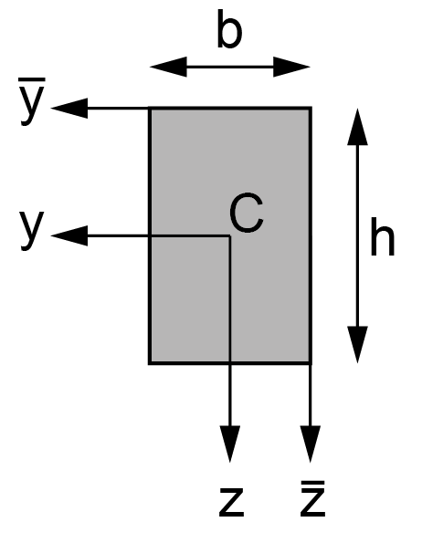
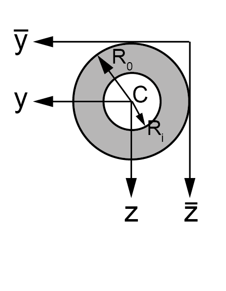
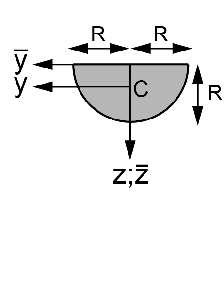
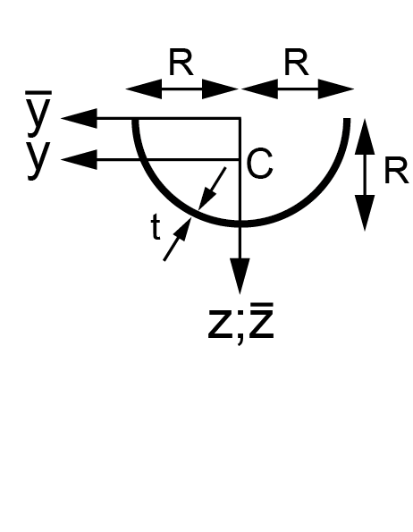

# Doorsnedegrootheden

## Definitie doorsnedegrootheden

| oppervlakte | statische   moment | traagheids-   moment | polair traagheids-  moment | verschuivingsregel van   Steiner | 
|-------------|-----------|--------------|---------------------|-----------------------| 
| $\mathsf{A = \int _{A} dA}$ | $\mathsf{S_y = \int_A y \cdot dA}$ | $\mathsf{I_{yy} = \int_A y^2 \cdot dA}$ | $\mathsf{I_p=\int_A r^2 \cdot dA = I_{yy} + I_{zz}}$ | $\mathsf{I_{\overline{y}\overline{y}} = I_{yy(eigen)} + \overline{y}^2_C \cdot A}$ |
|             | $\mathsf{S_z = \int_A z \cdot dA}$ | $\mathsf{I_{yz} = I_{zy} = \int_{A}y \cdot z \cdot dA  }$ |                     | $\mathsf{I_{\overline{y}\overline{z}} = I_{\overline{z}\overline{y}} = I_{yz(eigen)} + \overline{y}_C \cdot \overline{Z}_C \cdot A}$ |
|             |           | $\mathsf{I_{zz} = \int_{A}z^2 \cdot dA}$ |                     | $\mathsf{I_{\overline{z}\overline{z}} = I_{zz(eigen)} + \overline{z}^2_C \cdot A}$ |

## Doorsnedegrootheden

| vorm | oppervlakte, coördinaat   zwaartepunt C | traagheidsmoment   eigen | traagheidsmoment   andere |
|------|-------------------------|------------------|------------------|
| rechthoek    | $\mathsf{A=bh}$   $\mathsf{\overline{y}_C = \frac{1}{2}b}$   $\mathsf{\overline{z}_C = \frac{1}{2}h}$ | $\mathsf{I_{yy}=\frac{1}{12}b^3h}$   $\mathsf{I_{zz} = \frac{1}{12}bh^3}$   $\mathsf{I_{yz} = 0}$| $\mathsf{I_{\overline{y}\overline{y}}=\frac{1}{3}b^3h}$   $\mathsf{I_{\overline{z}\overline{z}}=\frac{1}{3}bh^3}$   $\mathsf{I_{\overline{y}\overline{z}}=\frac{1}{4}b^2h^2}$ |
| parallelogram    | $\mathsf{A=bh}$   $\mathsf{\overline{y}_C = \frac{1}{2}(a+b)}$   $\mathsf{\overline{z}_C = \frac{1}{2}h}$ | $\mathsf{I_{yy}=\frac{1}{12}(a^2+b^2)bh}$   $\mathsf{I_{zz} = \frac{1}{12}bh^3}$ | $\mathsf{I_{\overline{z}\overline{z}}=\frac{1}{3}bh^3}$   $\mathsf{I_{yz} = \frac{1}{12}abh^2}$ |
| driehoek    | $\mathsf{A=\frac{1}{2}bh}$   $\mathsf{\overline{y}_C = \frac{1}{3}(2a-b)}$   $\mathsf{\overline{z}_C = \frac{2}{3}h}$ | $\mathsf{I_{yy}=\frac{1}{36}(a^2-ab+b^2)bh}$   $\mathsf{I_{zz} = \frac{1}{36}bh^3}$ | $\mathsf{I_{\overline{z}\overline{z}}=\frac{1}{4}bh^3}$   $\mathsf{I_{\overline{y}\overline{z}}=\frac{1}{8}(2a-b)bh^2}$   $\mathsf{I_{yz} = \frac{1}{72}(2a-b)abh^2}$   $\mathsf{I_{\overline{\overline{z}}\overline{\overline{z}}}=\frac{1}{12}bh^3}$ |
| trapezium    | $\mathsf{A=\frac{1}{2}(a+b)h}$   $\mathsf{\overline{z}_C = \frac{1}{3}\frac{a+2b}{a+b}h}$ | $\mathsf{I_{zz}=\frac{1}{36}\frac{a^2+4ab+b^2}{a+b}h^3}$ | $\mathsf{I_{\overline{z}\overline{z}}=\frac{1}{12}(a+3b)h^3}$   $\mathsf{I_{\overline{\overline{z}}\overline{\overline{z}}}=\frac{1}{17}(3a+b)h^3}$ |
| cirkel    | $\mathsf{A=\pi R^2}$ | $\mathsf{I_{yy}=I_{zz}=\frac{1}{4}\pi R^4}$ | $\mathsf{I_{\overline{y}\overline{y}}=I_{\overline{z}\overline{z}}=\frac{5}{4}\pi R^4}$   $\mathsf{I_{yz}=0}$   $\mathsf{I_{\overline{y}\overline{z}}=\pi R^4}$   $\mathsf{I_p=\frac{1}{2}\pi R^4}$ |
| dikwandige ring    | $\mathsf{A=\pi (R_0^2-R^2_i)}$ | $\mathsf{I_{yy}=I_{zz}=\frac{1}{4}\pi (R^4_0-R^4_i)}$ | $\mathsf{I_{yz} = 0}$   $\mathsf{I_p = \frac{1}{2}\pi (R^4_0 - R^4_i)}$ |
| dunwandige ring    | $\mathsf{A=2\pi Rt}$ | $\mathsf{I_{yy}=I_{zz}=\pi R^3t }$ | $\mathsf{I_{\overline{y}\overline{y}}=I_{\overline{z}\overline{z}}=3\pi R^3t}$   $\mathsf{I_{yz} = 0}$   $\mathsf{I_p = 2\pi R^3t}$ |
| halve cirkel    | $\mathsf{A=\frac{1}{2}\pi R^2}$   $\mathsf{\overline{y}_C = 0}$   $\mathsf{\overline{z}_C = \frac{4}{3\pi}R}$ | $\mathsf{I_{yy}=\frac{1}{8}\pi R^4 }$   $\mathsf{I_{zz}=(\frac{\pi}{8}-\frac{8}{9\pi})R^4}$ | $\mathsf{I_{\overline{y}\overline{y}}=I_{\overline{z}\overline{z}}=\frac{1}{8}\pi R^4}$   $\mathsf{I_{\overline{y}\overline{z}}=0}$   $\mathsf{I_{yz} = 0}$ |
| halve dunwandige ring    | $\mathsf{A=\pi Rt}$   $\mathsf{\overline{y}_C = 0}$   $\mathsf{\overline{z}_C = \frac{2}{\pi}R}$ | $\mathsf{I_{yy}=\frac{1}{2}\pi R^3t }$   $\mathsf{I_{zz}=(\frac{\pi}{2}-\frac{4}{\pi})R^3t}$ | $\mathsf{I_{\overline{y}\overline{y}}=I_{\overline{z}\overline{z}}=\frac{1}{2}\pi R^3t}$   $\mathsf{I_{\overline{y}\overline{z}}=0}$   $\mathsf{I_{yz} = 0}$ |

