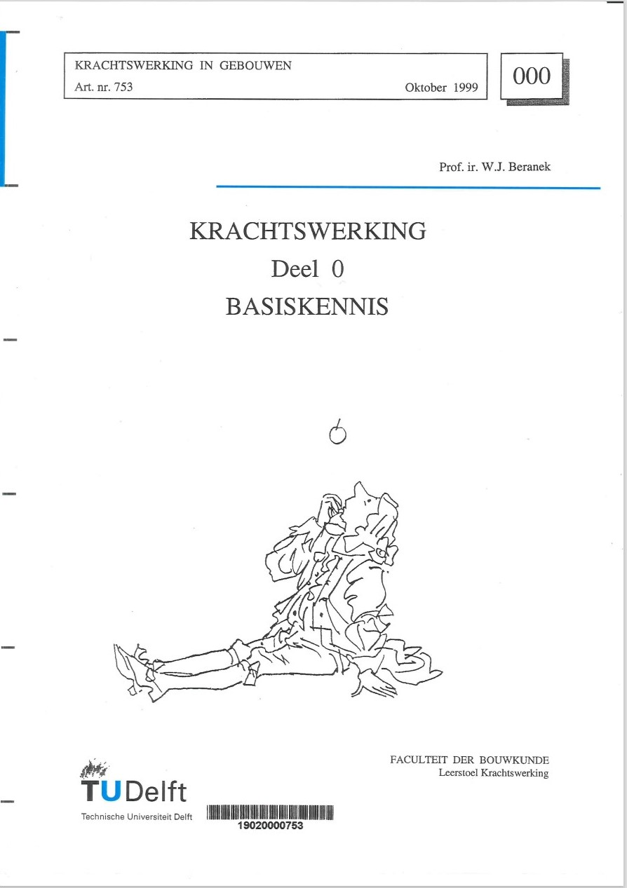
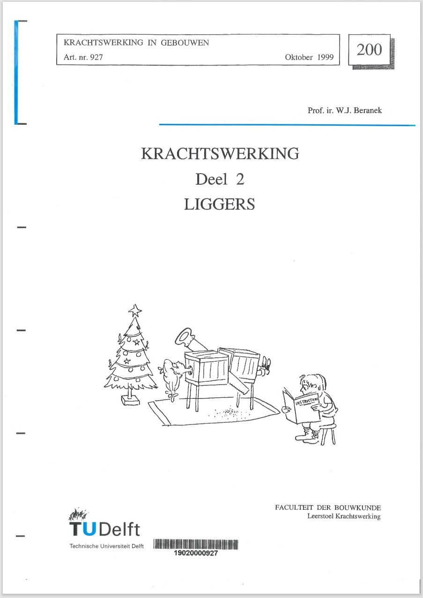

# Mechanica

In dit hoofdstuk worden de meestgebruikte formules gepresenteerd. Om te begrijpen wat de formules betekenen kunnen de dictaten Krachtswerking van Beranek geraadpleegd worden.

De volgende onderdelen zijn in dit hoofdstuk te vinden:

- Symbolen zoals gebruikt in de Eurocodes.
- Formules voor het bepalen van doorsnedegrootheden.
- Formules voor het bepalen van krachten in, en vervorming van balken in een aantal standaardgevallen.
- Formules voor het bepalen van de knikkracht van kolommen in een aantal standaardgevallen.

## Dictaten Krachtswerking

[Krachtswerking deel 0 Basiskennis](Krachtswerking_deel_0_Basiskennis.pdf)

 

[Krachtswerking deel 2 Liggers](Krachtswerking_deel_2_Liggers.pdf)

 

[Krachtswerking deel 3 Vakwerken Standzekerheid](Krachtswerking_deel_3_Vakwerken_Standzekerheid.pdf)

 

[Krachtswerking deel 4 Spanningen](Krachtswerking_deel_4_Spanningen.pdf)

 

[Krachtswerking deel 5 Vervormingen](Krachtswerking_deel_5_vervormingen.pdf)
