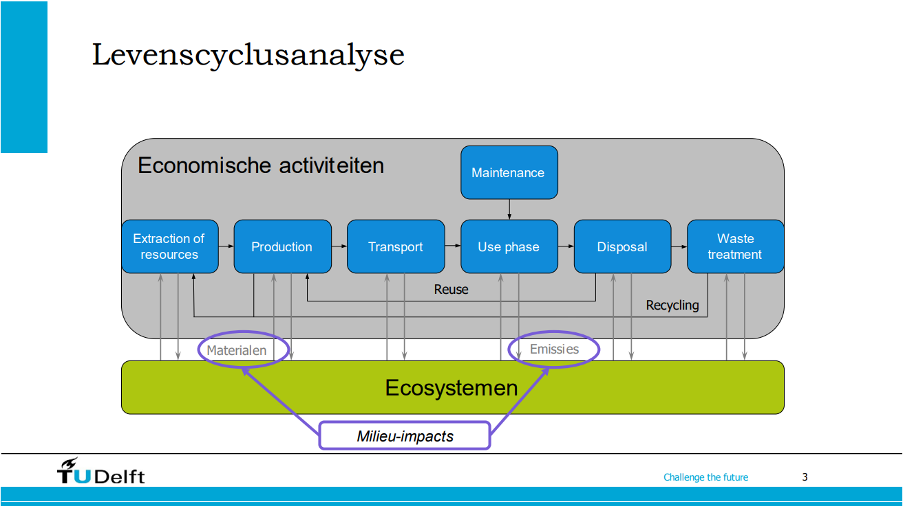
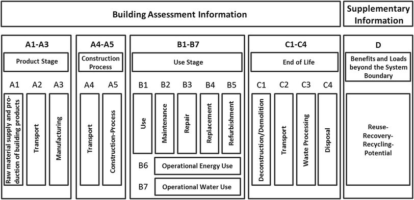
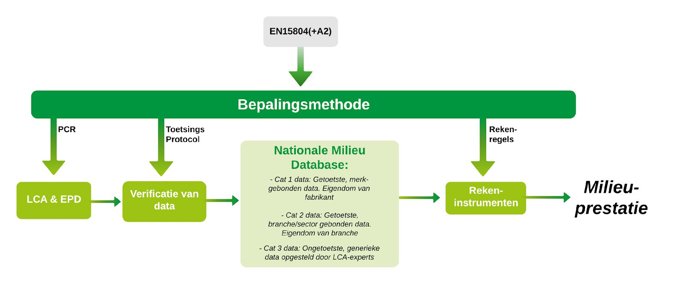

# LCA (levenscyclusanalyse)

In een LCA wordt een product geanalyseerd van wieg tot graf (cradle-2-grave). Dat betekent dat alle processtappen voor de productie, transport, toepassing en afvalverwerking van dat product worden meegenomen in de analyse. 

 

 

 

- **A1-A3 productie**: Dit betreft de winning van de grondstoffen tot de aanlevering bij de fabriekspoort - ‘cradle to gate’. 

- **A4**: Transport bouwplaats: Deze module betreft het transport naar de bouwplaats.

- **A5**: Constructie en installatie: Deze module betreft het aanbrengen van de producten in het bouwwerk (nieuwbouw of productvervanging bij planmatig onderhoud of renovatie).

- **B1**: Gebruik: Deze module betreft de emissies die vrijkomen in de gebruiksmodule van het bouwwerk. <!-- Voorbeeld toevoegen -->

- **B2**: Onderhoud: Deze module betreft de onderhoudswerkzaamheden gedurende de gebruiksmodule van het bouwwerk. De milieu-impact gedurende de gehele levenscyclus van de onderhoudsmiddelen wordt meegenomen, dus als gevolg van de productie, de aanvoer, applicatie, verwijdering en afvalverwerking van de onderhoudsmiddelen (inclusief bouwafval).

- **B3**: Reparatie: Het betreft ad hoc activiteiten in de toekomst, die lastig in een scenario zijn te vangen. 

- **B4**: Vervanging:  Deze module betreft de vervangingen van productonderdelen tijdens de productlevensduur.

- **B5**: Renovatie: Reparatie is er op het moment van bouwen nog zicht op een eventuele ad hoc ingrepen, zoals de renovatie of transformatie, of een kleinere kwaliteitsverbetering. Omdat deze aanpak een reactie op de dan geldende omstandigheden is, is B5 slecht in een scenario te vangen. Voor deze module wordt geen milieu-impact berekend.

- **B6**: Energiegebruik: De milieuprestatieberekening is afgebakend tot de materiaalgebonden milieu-impact. Binnen de milieuprestatieberekening, waarop deze rekenregels betrekking hebben, wordt voor deze module geen milieu-impact berekend

- **B7**: Watergebruik: Binnen de milieuprestatieberekening, waarop deze rekenregels betrekking hebben, wordt voor deze module geen milieu-impact berekend.

- **C1**: Verwijdering: Deze module betreft de verwijdering van het productonderdeel aan het einde van de productlevensduur. 

- **C2**: Afvaltransport: Deze module betreft alleen het transport van de verwijderde materialen aan het eind van de productlevensduur.

- **C3**: Afvalverwerking: Deze module betreft alleen de verwerking van de verwijderde materialen aan het eind van de productlevensduur.

- **C4**: Finale afvalverwerking: Deze module betreft alleen de verwijderde materialen aan het eind van de productlevensduur

- **D**: Buiten-levensloop: Module D betreft de milieu-impact die buiten de systeemgrens van het bouwwerk is gealloceerd. Dit kunnen zowel positieve als negatieve posten zijn. <!-- Voorbeeld toevoegen -->

> Voorbeeld: **een stalen H-profiel**
> - Voor dit stalen profiel wordt de productie van de balk uit ruw staal meegenomen, 
> - maar ook de winning van het ijzererts, 
> - de productie van staal in een hoogoven, 
> - het transport van ijzererts naar de hoogoven, van hoogoven naar staalproducent en transport van het H-profiel naar de bouwplaats. 
> - Daarbij worden ook alle bijbehorende materialen en processen meegenomen, zoals de productie van de kolen voor de hoogoven en de productie van diesel voor het transport. 
> - Ook de afvalverwerking na gebruik wordt meegenomen, zoals hergebruik, recycling of afvalverbranding.

## Bepalingsmethode

Het **Besluit bouwwerken leefomgeving (Bbl)** stelt eisen aan de milieuprestatie van een woonfunctie, een kantoorgebouw en neven gebruiksfuncties daarvan (artikel 4.159 Bbl). De milieuprestatie wordt bepaald volgens de Bepalingsmethode Milieuprestatie Bouwwerken.
De Bepalingsmethode Milieuprestatie Bouwwerken, is een uniforme meetmethode om de milieuprestatie van bouwwerken eenduidig, controleerbaar en reproduceerbaar te berekenen. Het creëert hiermee een gelijk speelveld voor alle betrokken partijen. De milieuprestatie van diverse bouwontwerpen kan worden vergeleken, met als doel de uiteindelijke milieu-impact van een bouwwerk te verlagen. 

