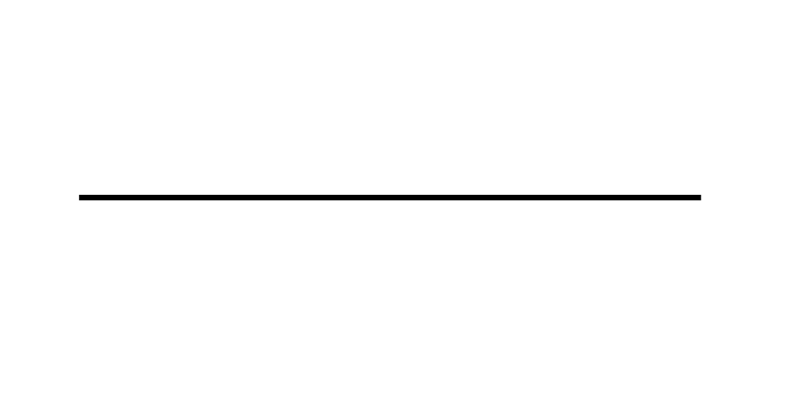
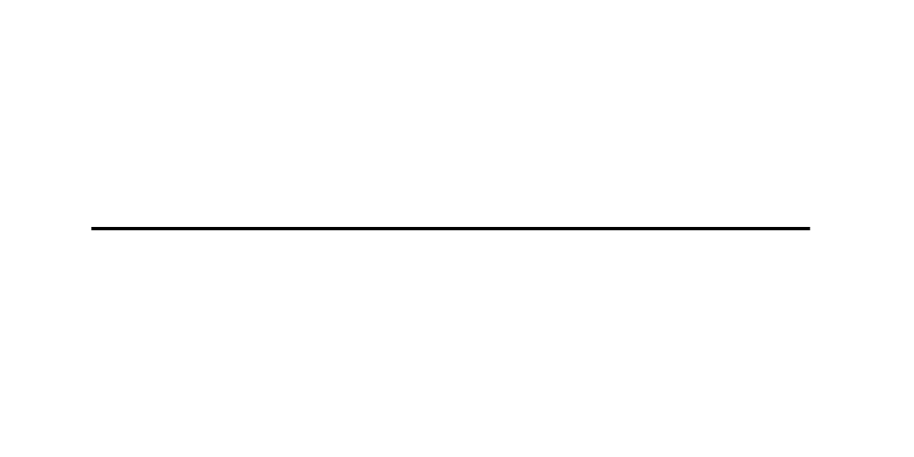
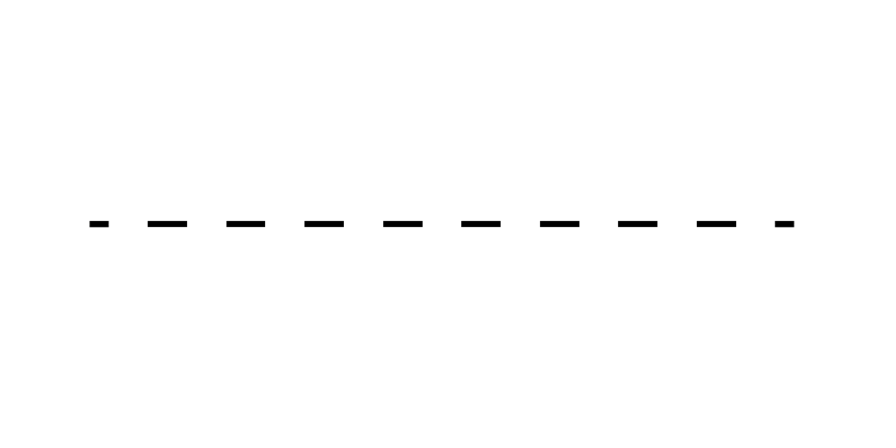
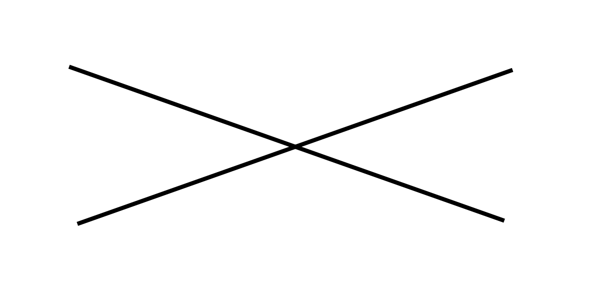
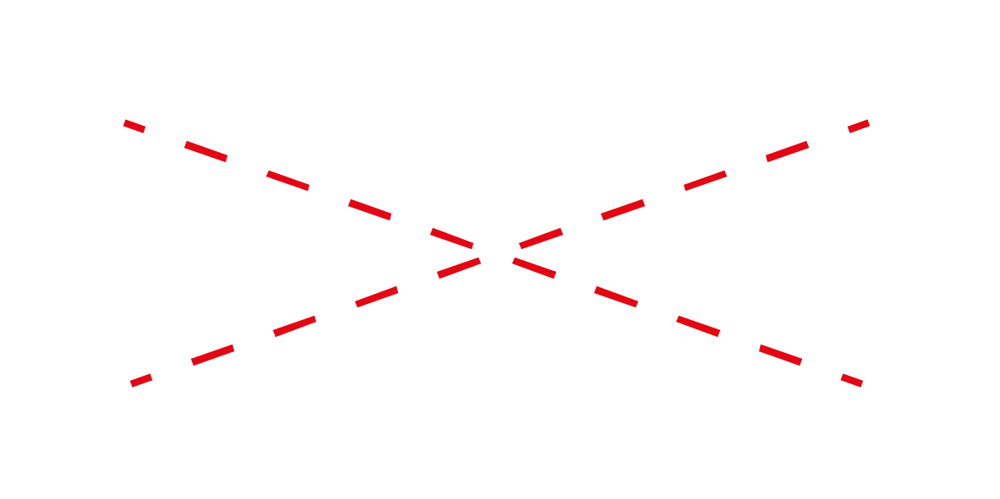
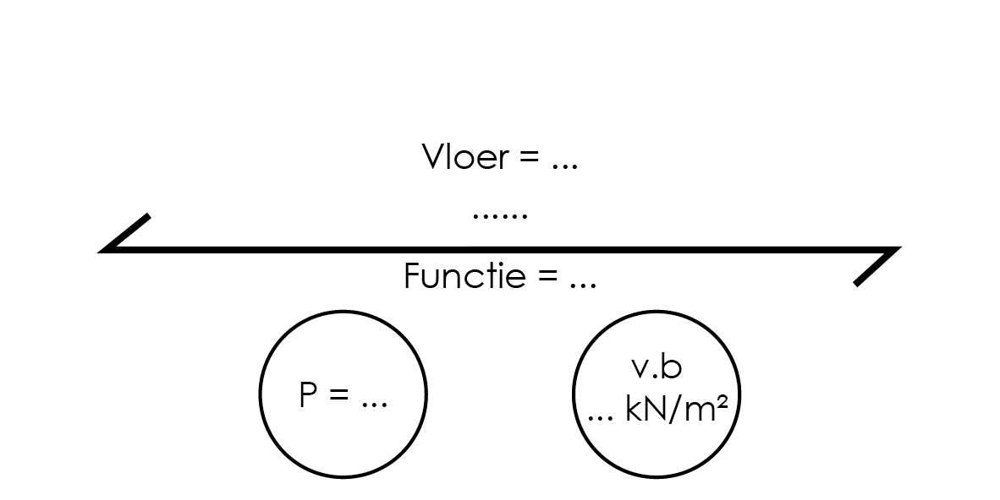
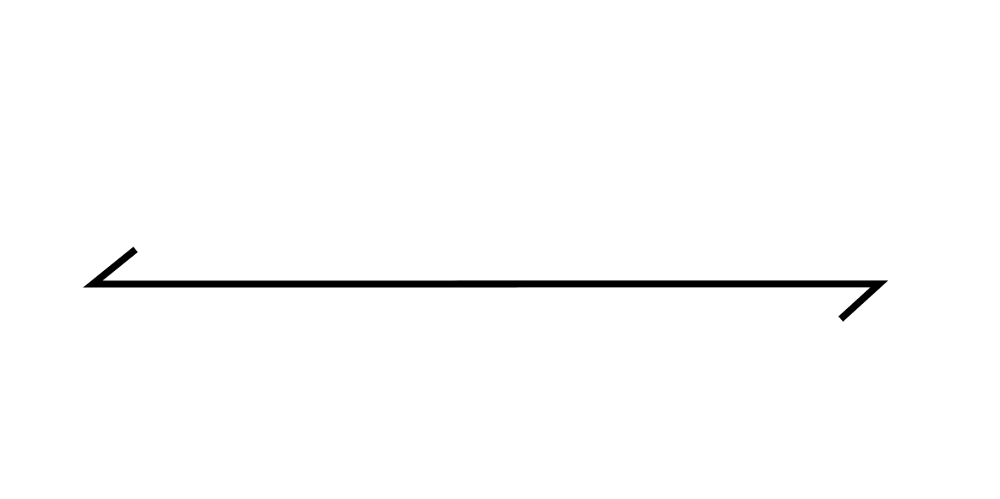
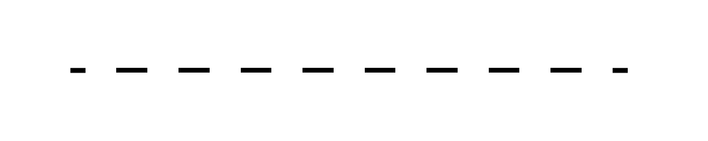

# Constructie tekeningen

## Draagconstructie plattegronden

Teken alleen de onderdelen die onderdeel zijn van de hoofddraagconstructie. Over het algemeen zijn dit de vloeren, balken, kolommen, dragende wanden en windverbanden.

In de draagconstructie plattegrond, zie [Voorbeelden](../voorbeelden/staal/staal_intro.md), tekenen we de constructie waar we doorheen snijden (op ongeveer 1 meter boven de vloer) zoals bij een reguliere plattegrond, met de juiste arcering. De draagconstructie plattegrond is toch anders dan een reguliere plattegrond omdat we ook (vooral) de constructie onder de vloer tekenen. Omdat we deze constructie delen niet direct zien tekenen we die met een streeplijn. Vaak zullen bijvoorbeeld kolommen direct boven elkaar staan, dan zien we uiteraard de streeplijn niet meer, omdat we met een doorgetrokken lijn de doorgesneden kolom boven de vloer tekenen.

Bij het tekenen van een draagconstructie plattegrond kan je onderstaande tekenvolgorde en lijndiktes als richtlijn aanhouden:

- Teken de omtrek van de vloer incl. trap/lift gaten, vides, enz. (doorgetrokken lijn 0.3mm)

- Teken de stramien lijnen (gemengde streeplijn 0.15mm, evt in andere kleur), letter/nummer deze.

- Teken de kolommen en muren **op** de vloer. (doorgetrokken lijn 0.3mm)

- Arceer de kolommen en muren **op** de vloer. (0.1mm pen of inkleuren met stift)

- Teken de kolommen en muren **onder** de vloer. (streeplijn 0.13 mm)

- Teken de dragende balken **onder** de vloer. Gebruik een dubbele lijn om de dikte aan te geven. (streeplijn 0.13 mm)

- Teken overspanningspijlen in de vloer velden. Gebruik een lijn met enkele pijlkop om uitkragingen aan te geven. (doorgetrokken lijn 0.13 mm)

- Teken kruisen in gaten in de vloer. (doorgetrokken lijn 0.13mm)

- Teken eventuele stabiliteitskruizen in de constructies als andreaskruis naast het vak waarin het stabiliteitskruis zich bevind. (streeplijn 0.2mm, evt in een andere kleur)

- Een schoor teken je als één schuine lijn.

- Plaats tekstuele aanduiding bij de stabiliteits-elementen: w.v.b of schoor, materiaal en sterkteklasse, profielaanduiding.

 

- Plaats tekstuele aanduiding bij de vloeroverspanningen: materiaal en type, dikte, peil, gebruiksfunctie en veranderlijke belasting.

- Plaats tekstuele aanduiding bij de balken: materiaal en sterkteklasse, profiel aanduiding.

 

- Plaats tekstuele aanduiding bij de kolommen: materiaal en sterkteklasse, profiel aanduiding.

 

- Plaats tekstuele aanduiding bij de muren: materiaal en sterkteklasse, dikte.

 

- Teken de afmetingen tussen de stramienlijnen. (doorgetrokken lijn 0.13mm)

- Uitzonderlijke constructie elementen zoals hang kolommen moeten naar eigen inzicht zo duidelijk mogelijk in de tekening worden verwerkt met extra tekst ter verduidelijking.

 

- Vermeld de schaal van de tekening en het verdiepingsnummer. (doorgetrokken lijn 0.13mm)

## Geëxplodeerde axonometrie

De Axonometrische tekening is een overzicht van de totale draagconstructie, zie [Voorbeelden](../voorbeelden/staal/staal_intro.md). Het geeft inzicht in de ruimtelijke ordening in zowel het horizontale als verticale vlak. De verticale en horizontale krachtsafdracht van de constructie is vaak goed af te zien aan de Axo omdat alle constructieve delen in een enkel overzicht zijn gegeven. De tweede belangrijke functie van de Axo is om te laten zien hoe de draagconstructie past bij de architectonische ontwerpintentie. Daarom zet je de axo vaak op de presentatieposter.

- Plaats de plattegronden van de draagconstructie boven elkaar onder een hoek van 45°, met voldoende ruimte ertussen (geen overlap).

 

- Teken de verticale constructieve onderdelen onder elke vloer (kolommen, wanden, enz.) (doorgetrokken lijn 0.13mm)

- Maak dichte vloeren half transparant in kleur en teken overspanningspijlen in de vloer velden. (doorgetrokken lijn 0.13 mm)

- Zorg ervoor dat de uiterste punten van de plattegronden verbonden zijn met verticale lijnen. (streeplijn 0.2 mm zwart)

- Teken alleen op de begane grond plattegrond de stramienlijnen. (gemengde streeplijn 0.13 mm)

- Teken eventueel de fundering onder de begane grond.

 

- Duid alle constructieve elementen tekstueel aan.

## Constructie details

In het hoofdstuk [Ontwerp](../ontwerp/ontwerp_intro.md) zijn standaardverbindingen van de verschillende materialen gegeven. Deze kan je ofwel direct gebruiken, of aanpassen naar gelang de specifieke eisen aan de verbinding. Verbindingen kunnen erg beeldbepalend zijn in een gebouw. In zulke gevallen is het belangrijk om, als ontwerper, aandacht te geven aan de vormgeving ervan. In andere gevallen is de verbinding niet beeldbepalend in het gebouw, dan wordt het ontwerp ervan vaak overgelaten aan de constructeur of aannemer.

- Bepaal of het een scharnierende of ingeklemde verbinding is.

 

- Teken de hartlijn (vaak stramienlijn) van de te verbinden constructiedelen. (gemengde streeplijn 0.3 mm)

- Teken de constructiedelen op schaal met de juiste afmetingen (doorgetrokken lijn 0.8mm) laat alle niet-constructieve delen achterwege.

- Teken hoe de delen zijn verbonden (lassen, bouten, lijmen, stortnaden, enz.) (doorgetrokken lijn 0.8mm)

- teken ook de onderdelen die niet zichtbaar zijn. (streeplijn 0.3 mm grijs)

- Benoem relevante materialen en afmetingen. (doorgetrokken lijn 0.1mm)

