# Lijnsoorten en arcering

De gegeven benaming van de lijnsoorten en arceringen gelden voor constructie-tekeningen en zijn gebaseerd op de NEN2302.

## Lijnsoorten

| Lijnsoort | Benaming |
|-----------|----------|
| ----------- | Getrokken lijn |
| - - - - - - | Streeplijn |
| -- - -- - -- | Gemengde streeplijn |
| ............... | Stippellijn |

## Arceringen

### Steenachtige materialen

| Beschrijving       | Arcering                                           | 1:100 | 1:50 | 1:20 | 1:10 | 1:5 | 1:1 | Opmerking                                        |
|-------------------|----------------------------------------------------|-------|------|------|------|-----|-----|--------------------------------------------------|
| Baksteen           |  | ✓     | ✓    |      |      |     |     |                                                  |
|                   | 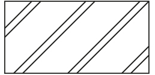 |       | ✓    | ✓    | ✓    | ✓   | ✓   |                                                  |
| Steenachtig        | 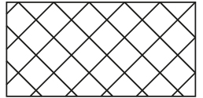 | ✓     | ✓    | ✓    | ✓    | ✓   | ✓   | Bijv. brand bestendig materiaal, dakpannen, etc. |
| Metselwerk overige  | 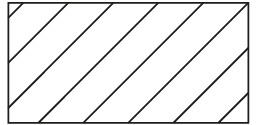 | ✓     | ✓    | ✓    | ✓    | ✓   | ✓   | Bijv. kalkzandsteen, betonsteen.                  |
| Beton             |  | ✓     | ✓    |      |      |     |     |                                                  |
|                   |  |       | ✓    | ✓    | ✓    | ✓   | ✓   |                                                  |
| Beton prefab      |  | ✓     | ✓    |      |      |     |     |                                                  |
|                   |  |       | ✓    | ✓    | ✓    | ✓   | ✓   |                                                  |

### Hout

| Beschrijving           | Arcering                                           | 1:100 | 1:50 | 1:20 | 1:10 | 1:5 | 1:1 | Opmerking                               |
|-----------------------|----------------------------------------------------|-------|------|------|------|-----|-----|-----------------------------------------|
| Hout                  |      |       |      | ✓    | ✓    | ✓   | ✓   |                                         |
| Hardhout              |  |       |      | ✓    | ✓    | ✓   | ✓   |                                         |
| Hout plaatmateriaal    | 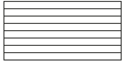 |       |      |      | ✓    | ✓   | ✓   |                                         |
| Lijmverbinding        |  |       |      |      | ✓    | ✓   | ✓   | Tussen houten onderdelen.               |

### Staal

| Beschrijving           | Arcering                                           | 1:100 | 1:50 | 1:20 | 1:10 | 1:5 | 1:1 | Opmerking                               |
|-----------------------|----------------------------------------------------|-------|------|------|------|-----|-----|-----------------------------------------|
| Staal                 |  | ✓     | ✓    | ✓    | ✓    | ✓   | ✓   | In constructie tekeningen mag het open worden gelaten. |
|                       | 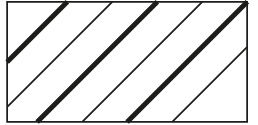 |       |      |      |      | ✓   | ✓   |                                         |
| Metalen overige        | 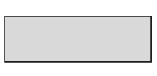 |       |      | ✓    | ✓    | ✓   | ✓   |                                         |
| Lood                  | 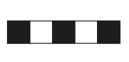     |       |      | ✓    | ✓    | ✓   | ✓   | Dichtheid benoemen.                    |
| Zink                  |      |       |      | ✓    | ✓    | ✓   | ✓   | Materiaalnummer vermelden.             |

### Overig

| Beschrijving           | Arcering                                           | 1:100 | 1:50 | 1:20 | 1:10 | 1:5 | 1:1 | Opmerking                               |
|-----------------------|----------------------------------------------------|-------|------|------|------|-----|-----|-----------------------------------------|
| Glas                  | 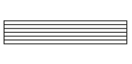     |       |      |      | ✓    | ✓   | ✓   |                                         |
| Maaiveld              | 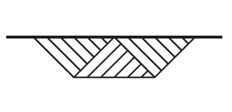 | ✓     | ✓    | ✓    | ✓    | ✓   | ✓   | In doorsnede.                          |
| Water                 | 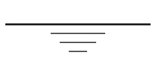   | ✓     | ✓    | ✓    | ✓    | ✓   | ✓   | In doorsnede.                          |
| Zand                  | 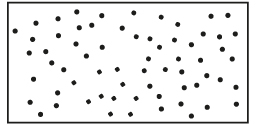     | ✓     | ✓    | ✓    | ✓    | ✓   | ✓   |                                         |

Bron: Lecture Notes Technical Drawings (CT1052-09), ir. T.L.J. van Rij, J. Vries.

