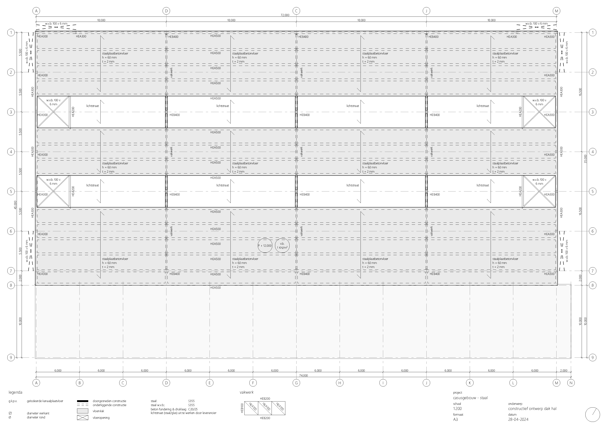

# Teken instructies

In dit hoofdstuk zijn de teken regels en -conventies voor constructies van gebouwen beschreven.

Voor architecten zijn de volgende drie tekeningen van de constructie het meest interessant:

**Geëxplodeerde axonometrische tekening (ook wel Axo):** Hierin is de constructie in zijn geheel te zien en de kan de samenhang met het architectonisch ontwerp worden overgevbracht. Ook de stabiliteit van de constructie kan hierin goed inzichtelijk worden gemaakt.

Onderstaand is een voorbeeld gegeven. In hoofdstuk [voorbeelden](../voorbeelden/staal/staal_intro.md) zijn voorbeelden van Axo's van houten, stalen en betonnen draagconstructies gegeven.

**Draagconstructie plattegronden (ook wel DC plattegronden):** Deze tekeningen laten zien hoe verticale krachtsafdracht in het gebouw werkt en bevatten meer gedetailleerde informatie dan de axonometrische tekening zoals materialen, afmetingen, overspanningen en profielen.

Onderstaand is een voorbeeld gegeven. In hoofdstuk [voorbeelden](../voorbeelden/staal/staal_intro.md) zijn voorbeelden van DC plattegronden van houten, stalen en betonnen draagconstructies gegeven.

**Verbindingsdetail:** Hier teken je alleen de constructieve delen. Dit kan in een 3D of een aantal 2D tekeningen. In het hoofdstuk [Vuistregels](../ontwerp/ontwerp_intro.md) zijn een aantal voorbeelden van tekeningen van verbindingen gegeven.
