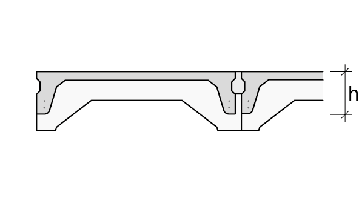
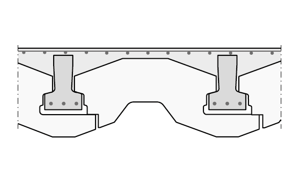
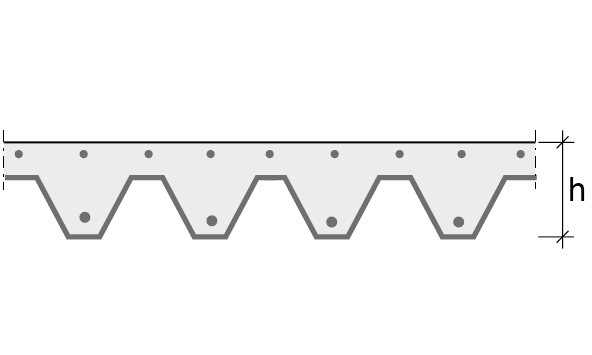
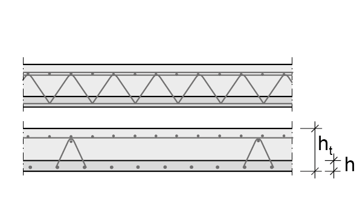
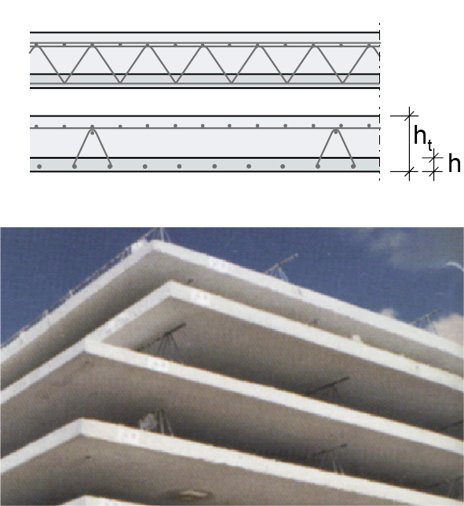

# Vloeren

## Kanaalplaten

  
*Doorsneden van kanaalplaten, geprefabriceerd, voorgespannen*

**Toepassingen:**  
In alle gebouwen kunnen kanaalplaten toegepast worden als vloerelementen en dakvloeren. Leidingen en uitsparingen zijn eenvoudig in de fabricage mee te nemen. Interessant is de combinatie met hoedliggers.  

- [www.vbi.nl](http://www.vbi.nl)  
- [www.dycore.nl](http://www.dycore.nl)  
- [www.belton.nl/_betonboek/deel5-3-1.pdf](http://www.belton.nl/_betonboek/deel5-3-1.pdf)

## Ribbenvloer

  
*Ribbenvloer met geïntegreerde isolatie, geprefabriceerd, naden worden aangestort met betonmortel*

**Toepassingen:**  
Toepassing als beganegrondvloer boven kruipruimten in de utiliteitsbouw en woningbouw.  

- [www.vbi.nl](http://www.vbi.nl)  
- [www.dycore.nl](http://www.dycore.nl)  
- [www.belton.nl/_betonboek/deel5-3-2.pdf](http://www.belton.nl/_betonboek/deel5-3-2.pdf)

## Combinatievloeren

  
*De combinatievloer, prefab balkjes met EPS isolatie en in het werk gestort beton*

**Toepassingen:**  
Dit vloertype wordt veelvuldig gebruikt als beganegrondvloer (boven kruipruimtes) in de woningbouw wegens de eenvoudige constructie en de gunstige isolerende eigenschappen.

- [www.vbi.nl (PS-Isolatievloeren)](http://www.vbi.nl)  
- [www.koraton.be](http://www.koraton.be)  
- [www.belton.nl/_betonboek/deel5-3-4.pdf](http://www.belton.nl/_betonboek/deel5-3-4.pdf)

## Staalplaatbetonvloer

  
*De geprofileerde staalplaten worden gebruikt als werkvloer, bekisting en uiteindelijk wapening*

**Toepassingen:**  
Veelgebruikt vloersysteem bij (hoogbouw) staalconstructies. Al dan niet onderstempeld tijdens het storten. Kunnen met aanzienlijke overspanningen en grote flexibiliteit worden gerealiseerd.

- [www.dutchengineering.nl](http://www.dutchengineering.nl)  
- [www.corusconstruction.com (slimdek)](http://www.corusconstruction.com)  
- [www.hody.nl](http://www.hody.nl)

## Bekistingsplaatvloer (breedplaatvloer)

  
*Een dunne prefab betonnen schil met wapening wordt in het werk met een constructieve druklaag afgewerkt.*

**Toepassingen:**  
Vloeren van betonnen constructies in de woning en utiliteitsbouw.

- [www.dycore.nl](http://www.dycore.nl)  
- [www.belton.nl/_betonboek/deel5-3-4.pdf](http://www.belton.nl/_betonboek/deel5-3-4.pdf)

## Dubbel T platen (TT-platen)

  
*Prefab voorgespannen TT-balk*

**Toepassingen:**  
Voorgespannen, prefab vloerbalksysteem voor grote overspanningen en grote vloerlasten, gebruikt in utiliteitsbouw zoals parkeergarages en kantoren.

- [www.spanbeton.nl (parkeergarages)](http://www.spanbeton.nl)  
- [www.haitsma.nl (parkeergarages)](http://www.haitsma.nl)

# Kanaalplaatvloer

Kanaalplaatvloeren zijn fabrieksmatig vervaardigde vrijdragende woningscheidende plaatvloeren voor gestapelde woningbouw en de utiliteitsbouw. Deze holle vloerplaten zijn eenzijdig voorgespannen en worden volledig geprefabriceerd. Hiermee wordt een aanzienlijke gewichtsreductie behaald ten opzichte van de massieve vloer, wat kan oplopen tot circa 50%. Door deze gewichtsbesparing kan het totaalgewicht van de draagconstructie aanzienlijk worden verminderd. 

**Uitgangspunten voor de toepassing van deze vloer zijn:**
- Geen sparingen.
- Geen geconcentreerde lasten.
- Vrije opleggingen (geen inklemming).
- Standaard brandwerendheid.
- Een bijkomende doorbuiging van maximaal 0.003 lt.

[www.vbi.nl](http://www.vbi.nl)
[www.dycore.nl](http://www.dycore.nl)
[www.heembetonvloersystemen.nl](http://www.heembetonvloersystemen.nl)

## Toepassingen

In tegenstelling tot wat men zou verwachten, bieden kanaalplaten ook mogelijkheden voor vrije plattegrondvormen. Niet alleen de in de woningbouw en kantoorbouw bekende rechthoekige plattegrond zijn mogelijk, maar ook rondvormen en afschuinende vlakken. Het is belangrijk te realiseren dat kanaalplaten onder een hoek zijn af te zagen. Onderstaand enkele legplannen van kanaalplaten voor vloeren met afwijkende vormen. De tussenruimtes (grijze arcering in onderstaande tekeningen) worden bekist, gewapend en aangestort.

| Mogelijkheden | |
| --- | --- |
|  |  |
|  |  |
|  |  |

## Uitvoeringsaspecten

Kleine sparingen kunnen fabrieksmatig worden opgenomen. De vloerplaten kunnen ook met ingestorte centraaldozen worden geleerd.

Bij de toepassing van deze platen moet men rekening houden met de voorspanning die een zekere “opbuiging” veroorzaakt, met name bij grote overspanningen. Voor de grootte van de toog kan bij het ontwerp worden aangehouden:
- 1/1000 L bij een lichte voorspanning.
- 3/1000 L bij een zware voorspanning.

Afhankelijk van de stijfheid van de vloerplaat, het oplegdetail en de mate van vlakheid van de onderliggende constructie kunnen de vloerplaten op verschillende manieren worden opgelegd:
- “Koud” opgelegd.
- In de specie.
- Op vilt.
- Op een elastomeren oplegstrip.

Voor veranderlijke belastingen tot 3 kN/m² en overspanningen tot 6,5 m zijn voor lagere gebouwen alle oplegvarianten mogelijk. In alle overige gevallen wordt het gebruik van een elastomeren oplegstrip aanbevolen. De gebruikelijke opleglengte in de woningbouw is 100 mm, in de utiliteitsbouw wordt 150 mm aangehouden (zie ook voorschriften van de leveranciers).

De schijfwerking van de vloeren kan op meerdere manieren worden gerealiseerd, oplopend van een lichte tot een zware belasting:
- Voegvulling van de langsnaden met toevoeging van wapening.
- Koppelingen van de vloerplaten onderling en koppeling aan de draagconstructie door middel van sparingen en stekeinden.
- Toepassing van een druklaag met trekband en een koppeling aan de constructie.
- Een combinatie van voorgaande voorzieningen met een ingestorte ringbalk waarin de trekbandwapening is opgenomen.

De horizontale belastingen vanuit de vloer worden door middel van “betonnen” deuvels overgebracht op de stabiliserende elementen van de draagconstructie van het gebouw.

  
  
*Schijfwerking in kanaalplaatvloer.*

## Product Specificaties VBI Isolatieplaatvloer A200

| Kenmerk | Specificatie |
| --- | --- |
| Gewicht inclusief voegvulling | 303 kg/m² |
| Brandwerendheid | 60-90 minuten |
| Maximum plaatlengte |  |
| - Utiliteitsbouw | 10,00 m |
| - Verdiepingsvloer woningbouw | 7,60 m |
| - Dakvloer woningbouw | 9,00 m |
| Pasplaatbreedte |  |
| - Woningbouw | 300 + n x 100 mm (AL200) |
| - Utiliteitsbouw | 300 + n x 150 mm |
| Voegvulling | 7,3 l/m |
| Sterkteklasse | C45/55 |
| Betondoorsnede | 144623 mm² |
| Zwaartepunt betondoorsnede | 99,3 mm |
| Traagheidsmoment | 680,0 E+06 mm⁴ |
| Betonpuingranulaat | 20% op aanvraag |

## Overspanningen

## Aansluitdetails (alle typen kanaalplaten)

De opleglengte a moet, indien er vanuit wordt gegaan dat in vloerbelastingsklasse II altijd een SBR centreerstrip (o.g.) wordt toegepast, voldoen aan de voorwaarde:

| Kenmerk | Specificatie |
| --- | --- |
| a | 40 + 0,004 L (vloeren) |
|  | 30 + 0,004 L (daken) |

L = dagmaat in mm.  
a = aₗ + aₒ  
aₒ = zie figuur  
aₗ = afstand van rand tussenlaag tot rand oplegging, voor aₗ mag geen grotere waarde dan 25 mm in rekening worden gebracht. Voorkeursmaat: beton/metselwerk: 25 mm

### SBR Centreerstrips

Centreerstrips hebben afhankelijk van de toepassing de volgende functie:
- Centrieren van de belasting.
- Voorkomen van ‘afboeren’ van de onderliggende constructie.
- Voorkomen of beperken van inklemmingsmomenten.

Centreerstrips worden toegepast in de volgende situaties:
- Indien de vloer is ingeklemd.
- Bij opleggingen op beton en metselwerk in vloerbelastingsklasse II.
- Bij opleggingen op staalconstructies waar de belasting gecentreerd dient te worden.

## Product Specificaties VBI Isolatieplaatvloer A320

| Kenmerk | Specificatie |
| --- | --- |
| Gewicht inclusief voegvulling | 443 kg/m² |
| Brandwerendheid | 90-120 minuten |
| Maximum plaatlengte | 14,70 m |
| Pasplaatbreedte | 300 + n x 150 mm |
| Voegvulling | 11,9 l/m |
| Sterkteklasse | C45/55 |
| Betondoorsnede | 209918 mm² |
| Zwaartepunt betondoorsnede | 153,8 mm |
| Traagheidsmoment | 2568,1 E+06 mm⁴ |
| Oppervlakte bovenzijde | Normaal of ruw |
| Betonpuingranulaat | 20% op aanvraag |

## Overspanningen

## Aansluitdetails (alle typen kanaalplaten)

Oplegging op spouwmuur: bij woningscheidende wanden de kanalen ter plaatse van alle vloeropeningen zoals leidingdoorvoeren, trapgaten, etc., afdichten met mortel, minerale wol of kunststofschuim.  
Oplegging op console.

## Product Specificaties Dycore Kanaalplaatvloeren

| Kenmerk | Specificatie |
| --- | --- |
| Brandwerendheid | 60-90 minuten |
| Volumieke massa | 2400 kg/m³ |
| Voorspanstaal | FeP 1860 |

| Type | Hoogte | Gewicht | Voegen | Doorsnede |  | Pasplaten |
| --- | --- | --- | --- | --- | --- | --- |
|  | h | G | - | A | Iₗₗ | max. lengte |
|  | [mm] | [kN/m²] | [l/m] | [mm²] | [mm⁴] | [m] |
| W | 150 | 2,4 | 4,4 | 0,11 | 297 | 6 |
| N | 200 | 2,7 | 5,7 | 0,13 | 643 | 9 |
| U | 200 | 3,1 | 5,7 | 0,15 | 666 | 9 |
| T | 255 | 3,7 | 7,2 | 0,17 | 1364 | 12 |
| H | 320 | 4,3 | 8,7 | 0,20 | 2517 | 15 |
| K | 400 | 5,0 | 10,9 | 0,23 | 4625 | 18 |

## Overspanningen

  
De grafiek is een indicatie van de toelaatbare gelijkmatig verdeelde belasting in kN/m² boven het eigen gewicht voor platen op twee steunpunten bij verschillende overspanningen.

## Aansluitdetails (alle typen kanaalplaten)

## Bekistingsplaatvloer

De bekistingplaatvloer is een systeemvloer van geprefabriceerde betonnen bekistingelementen waarop een constructief meewerkende betonlaag wordt gestort. Hij is geschikt als een vrijdragende vloer in de woning- en utiliteitsbouw. De bekistingplaten hebben gebruikelijk een dikte van 50 tot 90 mm, een maximale plaatlengte van 8500 mm en een onderwapening aangevuld met tralieliggers. De dimensionering van de tralieliggers wordt door de vloerbelasting bepaald en per project berekend. De hoofdwapening en de tralieliggers liggen evenwijdig aan de overspanningrichting van de vloer. 

Leidingen kunnen worden ingestort en de constructieve druklaag kan van zowel een boven- als onderwapening worden voorzien. De constructieve druklaag is minimaal van een betonsoort B25. Sparingen kunnen fabrieksmatig worden aangebracht en begane grondvloeren kunnen aan de onderzijde worden voorzien van isolatiemateriaal. De onderstempeling dient overeen te komen met een vooraf door de producent goedgekeurd legplan. Het geheel is een samenwerkende betonvloer, die een redelijke mate van ontwerpvrijheid heeft.

[www.dycore.nl](http://www.dycore.nl)
[www.heembetonvloersystemen.nl](http://www.heembetonvloersystemen.nl)

## Product Specificaties Dycore Bekistingsplaatvloer

| Kenmerk | Specificatie |
| --- | --- |
| Elementlengte tot ca. | 0,25 - 10 m |
| Standaardbreedte | 2697 / 2997 mm (effectieve breedte 2700 / 3000 mm) |
| Breedte pas-elementen | 250 - 2920 mm |
| Voorspanstaal | FeP 1860 conform NEN 3868 |
| Dikte / massa | 50 mm / 1,2 kN/m² |
|  | 60 mm / 1,44 kN/m² |
|  | 70 mm / 1,68 kN/m² |
|  | 80 mm / 1,92 kN/m² |

## Aansluitdetails

