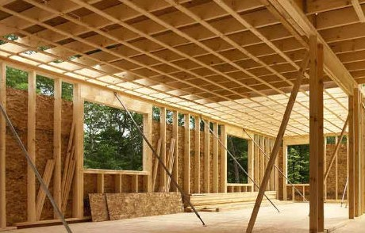

# Hout

## Producten

| Rondhout | | |
|---|---|---|
|  |  | 

**Rondhout** wordt gebruikt voor uiteenlopende constructies, zoals bruggen, houten torens, gebouwen en heipalen. In de architectuur van deze tijd zijn stammen terug te vinden in bijvoorbeeld de eiken kolommen van het expogebouw van MVRDV in Hannover.

 

| Gezaagd hout | | |
|---|---|---|
|  |  |  |

**Gezaagd hout** wordt in allerlei toepassingen gevonden, zoals kleinere constructies, daken van woningen, vloeren (balken en gordingen), en vakwerken. Hout wordt ook veel toegepast vanwege de gunstige eigenschappen bij brand (isolerend verkoolde laag).

 

| Gelijms gelamineerd hout | | |
|---|---|---|
|  |  |  |

**Gelijmd gelamineerd hout** wordt veel gebruikt vanwege de vele vormen en bijna oneindige lengtematen die te fabriceren zijn. Overigens moet altijd rekening gehouden worden met het vervoer van dergelijke lange elementen. Grote overspanningen, driescharnierspanten, en portaalspanten zijn mogelijk in hout.

 

| Cross Laminated Timber (CLT) | | |
|---|---|---|
|  |  |  |

**Cross Laminated Timber (CLT)** bestaat uit kruislings gelijmde houten delen en is geschikt als constructieve en woningscheidende wanden, binnenspouwblad en woningscheidende vloeren.

 

| Houtskeletbouw (HSB) | | |
|---|---|---|
|  |  |  |

**Houtskeletbouw (HSB)** bestaat uit houten frames met isolatie erin, geschikt om te gebruiken als constructieve, woningscheidende wanden en binnenspouwblad.

HSB-elementen zijn vaak een stuk goedkoper dan CLT, maar vanwege de geringere stabiliteit kan een gebouw met een HSB-constructie vaak niet uit meer dan 3 lagen bestaan.

Een combinatie van HSB en CLT is daarom zeer geschikt voor de seriematige woningbouw:

- Tot en met 4 lagen: HSB constructie met CLT vloeren
- Vanaf 4 lagen: “tunnelen” met CLT en de gevels dichtzetten met (prefab) HSB.
