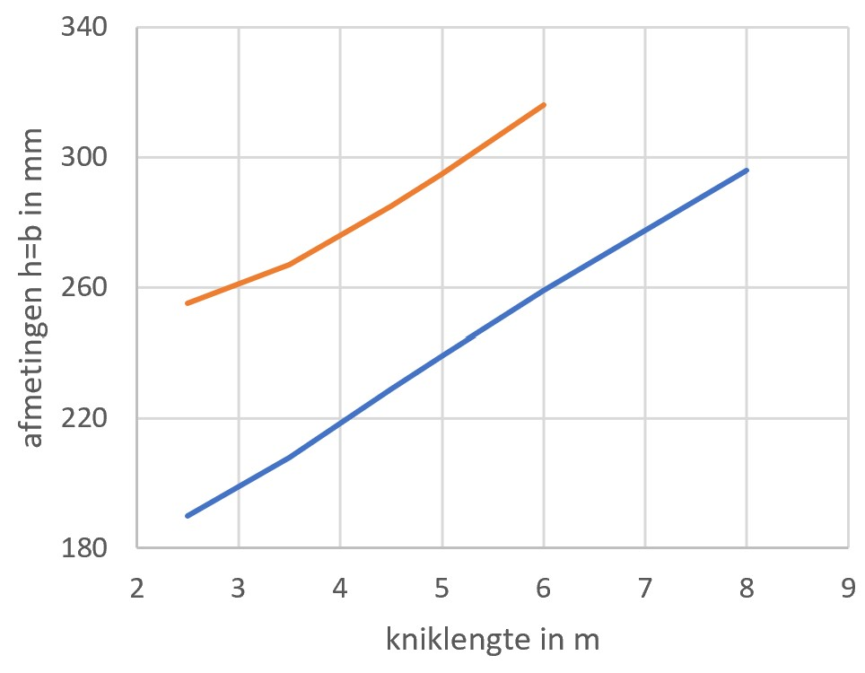
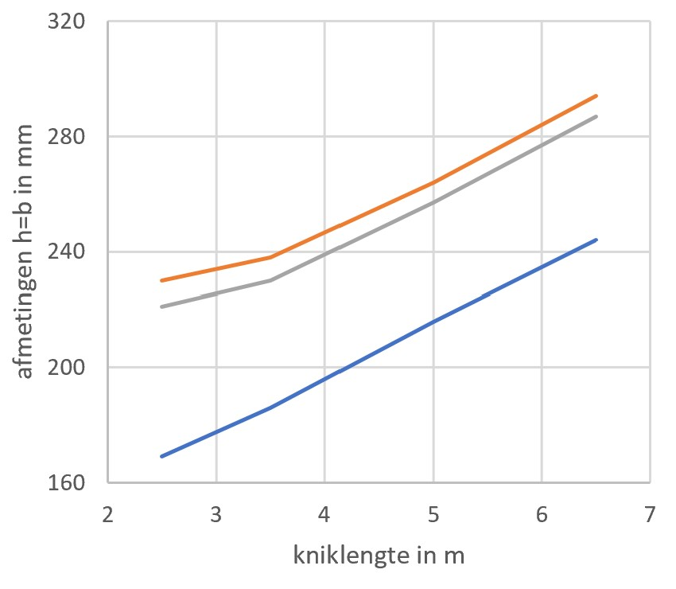

 # Kolommen

**Houten kolommen**  
Schattingsregels voor kolommen zijn minder nauwkeurig dan voor vloeren en liggers. De belasting is namelijk in hoge mate afhankelijk van de hart-op-hart afstand van de kolommen en de hoeveelheid gedragen verdiepingen. Ook de kniklengte van de kolom is erg bepalend voor de vereiste doorsnede van de kolom. Met onderstaande ontwerpgrafieken kan de benodigde doorsnede afmeting van de kolom geschat worden. De ontwerpgrafiek geldt voor:

- Kolommen van hout C24 of meer.
- Een kolommen grid van maximaal 6 bij 6 meter.
- Een lichte houten vloer G=2 kN/m².
- Een veranderlijke belasting q=2 kN/m².
- Gevolgklasse CC2.
- Een geschoorde constructie (dat wil zeggen dat de standzekerheid van het gebouw wordt gewaarborgd door de wanden of windverbanden en niet door momentvaste verbindingen).

>**Houten kolom**
>
>
>
>* Rode lijn (boven): Tot max. 5 bouwlagen
>* Blauwe lijn (onder): Tot max. 3 bouwlagen
>
>* De kolomafmeting die gevonden wordt geldt voor de richting waarin de kolom zal uitknikken. Dit is gewoonlijk de zwakke richting, tenzij knikverkorters zijn toegepast. In de grafiek is uitgegaan van een vierkante kolom.
>* De kniklengte van de kolom is doorgaans gelijk aan de verdiepingshoogte.

**Gelamineerde kolommen**  
De ontwerpgrafiek geldt voor:

- Kolommen van gelamineerd hout GL24h of meer.
- Een kolommen grid van maximaal 6 bij 6 meter.
- Een lichte houten vloer G=2 kN/m².
- Gevolgklasse CC2.
- Een geschoorde constructie (dat wil zeggen dat de standzekerheid van het gebouw wordt gewaarborgd door de wanden of windverbanden en niet door momentvaste verbindingen).

>**Gelamineerde kolom**
>
>
>
>
>* Oranje lijn (boven): q=2 kN/m² en tot max. 5 bouwlagen
>* Grijze lijn (midden): q=5 kN/m² en tot max. 5 bouwlagen
>* Blauwe lijn (onder): q=2 kN/m² en tot max. 3 bouwlagen
>
>* De kolomafmeting die gevonden wordt geldt voor de richting waarin de kolom zal uitknikken. Dit is gewoonlijk de zwakke richting, tenzij knikverkorters zijn toegepast. In de grafiek is uitgegaan van een vierkante kolom.
>* De kniklengte van de kolom is doorgaans gelijk aan de verdiepingshoogte.
