# Liggers

**Gelamineerde ligger**  
De ontwerpgrafiek geldt voor:

- Liggers van gelamineerd hout GL24h of meer.
- Een hart-op-hart afstand van 4 meter.
- Gevolgklasse CC2.
- Een lichte houten vloer G=2 kN/m².
- Liggerbreedte is ca. 1/3 van de liggerhoogte.


`````{admonition} Gelamineerde ligger
:class: tip


* Grijze lijn: q=5 kN/m² (bijeenkomstruimte)
* Oranje lijn: q=2,5 kN/m² (kantoorfunctie)
* Blauwe lijn: q=1,75 kN/m² (woonfunctie)

`````

## Houtconstructies met liggers

<!DOCTYPE html>
<html lang="nl">
<head>
    <meta charset="UTF-8">
    <meta name="viewport" content="width=device-width, initial-scale=1.0">
    <style>
        /* Verwijder focusoutline van afbeeldingen */
        img:focus {
            outline: none;
        }
        
        /* Verwijder borders van de tabel en afbeeldingen */
        table, th, td {
            border: none;
        }
        
        table td img {
            border: none;
        }
    </style>
</head>
<body>

<div style="overflow-y: auto;">
    <table style="width: 100%; border-collapse: collapse;">
        <thead style="position: sticky; top: 0; background-color: #f2f2f2;">
            <tr>
                <th></th>
                <th colspan="2">Rechte ligger (eventueel met toog)</th>
                <th></th>
            </tr>
        </thead>
        <tbody>
            <tr>
                <td></td>
                <td colspan="2">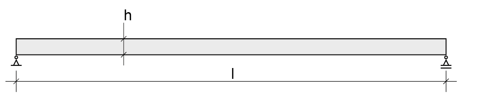</td>
                <td><strong>gezaagde balken</strong><br>l=2 tot 6m<br>h=l/15 à l/20 <br> <strong>gelamineerd hout</strong><br>l=6 à 30m<br>h.o.h<5m<br>h=l/17<br>h.o.h=5-8m<br>h=l/16</td>
            </tr>
            <tr>
                <td>Verschijningsvormen</td>
                <td></td>
                <td>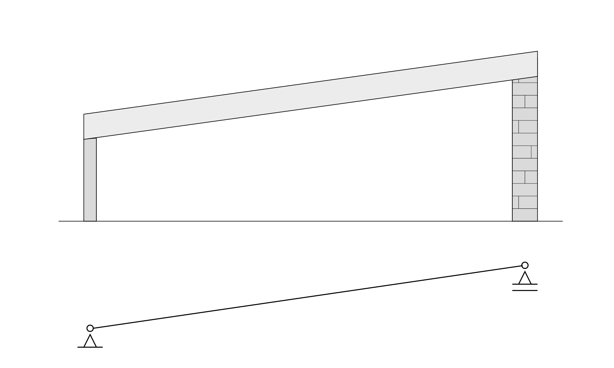</td>
                <td></td>
            </tr>
            <tr>
                <td>Details</td>
                <td></td>
                <td>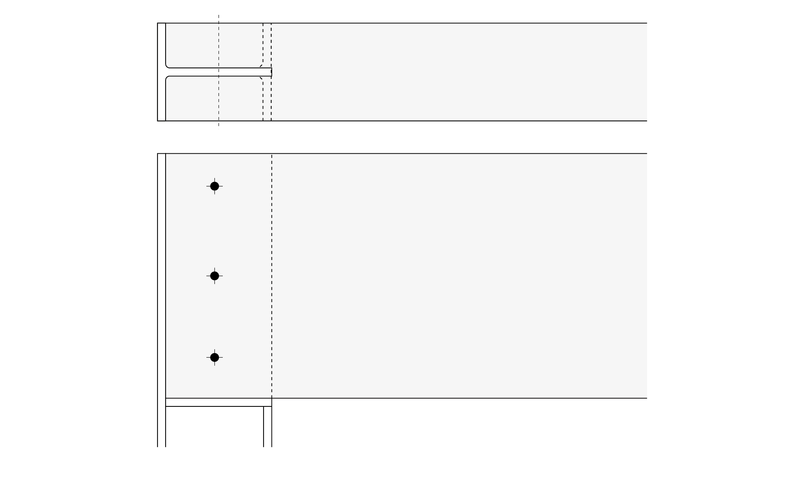</td>
                <td></td>
            </tr>
            <tr>
                <td></td>
                <td>oplegging op betonnen wand</td>
                <td>oplegging op stalen kolom</td>
                <td>oplegging op een dubbelen houten kolom (op een blok)</td>
            </tr>
        </tbody>
    </table>
</div>

</body>
</html>


<div style="overflow-y: auto;">
    <table style="width: 100%; border-collapse: collapse;">
        <thead style="position: sticky; top: 0; background-color: #f2f2f2;">
            <tr>
                <th></th>
                <th colspan="2">Rechte ligger (eventueel met toog)</th>
                <th></th>
            </tr>
        </thead>
        <tbody>
            <tr>
                <td></td>
                <td colspan="2"></td>
                <td><strong>gezaagde balken</strong><br>l=2 tot 6m<br>h=l/15 à l/20 <br> <strong>gelamineerd hout</strong><br>l=6 à 30m<br>h.o.h<5m<br>h=l/17<br>h.o.h=5-8m<br>h=l/16</td>
            </tr>
            <tr>
                <td>Verschijningsvormen</td>
                <td></td>
                <td></td>
                <td></td>
            </tr>
            <tr>
                <td>Details</td>
                <td></td>
                <td></td>
                <td></td>
            </tr>
            <tr>
                <td></td>
                <td>oplegging op betonnen wand</td>
                <td>oplegging op stalen kolom</td>
                <td>oplegging op een dubbelen houten kolom (op een blok)</td>
            </tr>
        </tbody>
    </table>
</div>


<br>


<div style="overflow-y: auto;">
    <table style="width: 100%; border-collapse: collapse;">
        <thead style="position: sticky; top: 0; background-color: #f2f2f2;">
            <tr>
                <th></th>
                <th colspan="2">Rechte ligger (eventueel met overstek)</th>
                <th></th>
            </tr>
        </thead>
        <tbody>
            <tr>
                <td></td>
                <td colspan="2"></td>
                <td><strong>gelamineerd hout</strong><br>l=6 tot 30m <br> h.o.h.=3,6 à 5,4 <br> a=0,25 · l <br> h=l/16 à l/21 <br> h.o.h.=3 à 5m <br> a=0,4 · l <br> h=l/18 à l/24</td>
            </tr>
            <tr>
                <td>Verschijningsvormen</td>
                <td></td>
                <td></td>
                <td></td>
            </tr>
            <tr>
                <td>Details</td>
                <td></td>
                <td>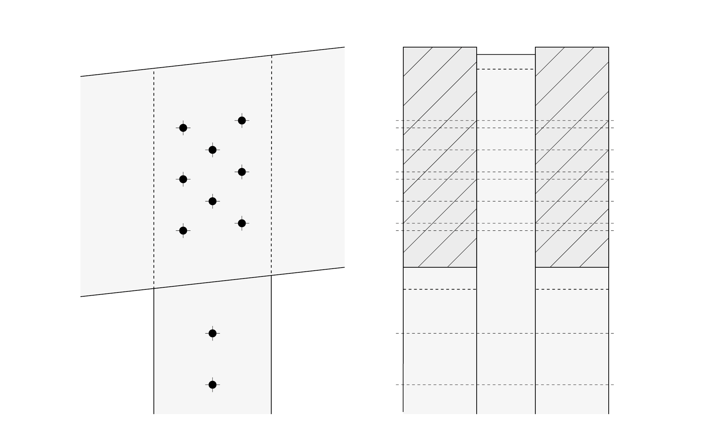</td>
                <td>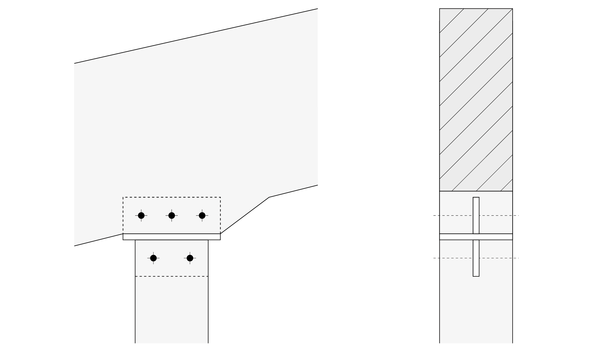</td>
            </tr>
            <tr>
                <td></td>
                <td>oplegging gordingen op hoofdligger, Z stalen</td>
                <td>dubbele ligger op een dubbele houten kolom, gebout</td>
                <td>ligger op houten kolom, ingefreesde stalen plaat en oplegplaat, gebout</td>
            </tr>
        </tbody>
    </table>
</div>


<br>


<div style="overflow-y: auto;">
    <table style="width: 100%; border-collapse: collapse;">
        <thead style="position: sticky; top: 0; background-color: #f2f2f2;">
            <tr>
                <th></th>
                <th colspan="2">zadeldak ligger met hellende bovenrand (gelamineerd)</th>
                <th></th>
            </tr>
        </thead>
        <tbody>
            <tr>
                <td></td>
                <td colspan="2"></td>
                <td><strong>gelamineerd hout</strong><br>l=6 tot 30m <br> h<sub>1</sub>=l/14 à l/18 <br> h<sub>2</sub>=l/18 à l/22</td>
            </tr>
            <tr>
                <td>Verschijningsvormen</td>
                <td></td>
                <td></td>
                <td></td>
            </tr>
            <tr>
                <td>Details</td>
                <td>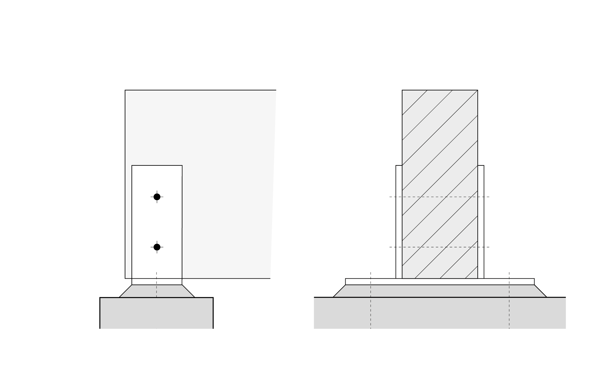</td>
                <td></td>
                <td></td>
            </tr>
            <tr>
                <td></td>
                <td>ligger op wand, gelaste stalen oplegging</td>
                <td>verbinding ligger-dubbele kolom, gebout</td>
                <td>ligger-ligger verbinding doorgaande ligger, stalen schoen (gerberligger)</td>
            </tr>
            <tr>
                <td>Toelichting</td>
                <td>de bovenranden moeten zijdelings worden gesteund</td>
                <td></td>
                <td></td>
            </tr>
        </tbody>
    </table>
</div>


<br>


<div style="overflow-y: auto;">
    <table style="width: 100%; border-collapse: collapse;">
        <thead style="position: sticky; top: 0; background-color: #f2f2f2;">
            <tr>
                <th></th>
                <th colspan="2">zadeldak ligger met hellende of gebogen boven- en onderrand (gelamineerd)</th>
                <th></th>
            </tr>
        </thead>
        <tbody>
            <tr>
                <td></td>
                <td colspan="2"></td>
                <td><strong>gelamineerd hout</strong><br> l=7 tot 40m <br> h.o.h.=5 à 7m <br> h=l/14 à l/18<br> f=l/5 à l/10 <br> r>6m</td>
            </tr>
            <tr>
                <td>Verschijningsvormen</td>
                <td></td>
                <td></td>
                <td></td>
            </tr>
            <tr>
                <td>Details</td>
                <td>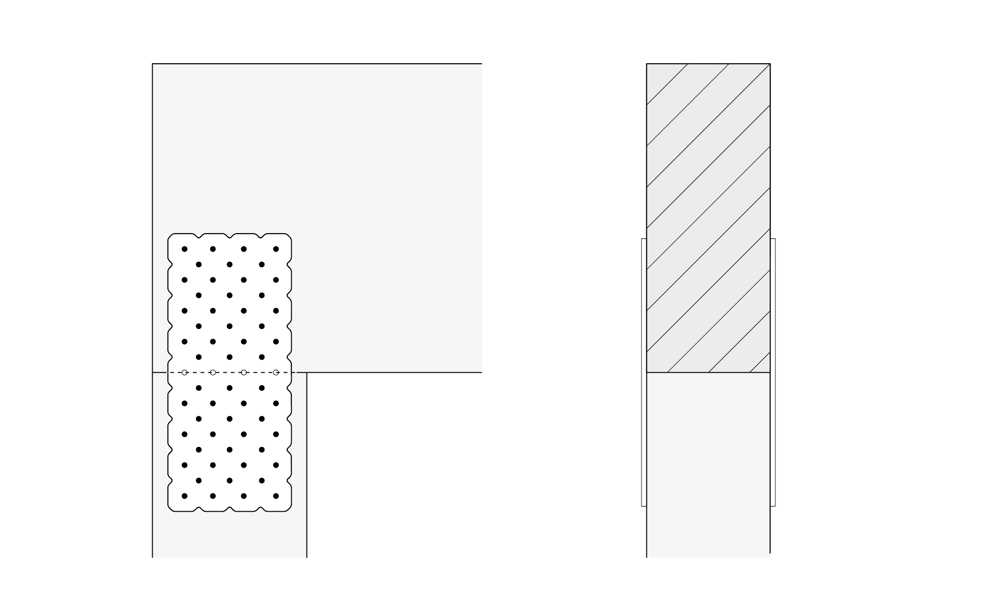</td>
                <td></td>
                <td></td>
            </tr>
            <tr>
                <td></td>
                <td>ligger-kolom verbinding, genagelde platen</td>
                <td>oplegging op wand, zuiver scharnier, met slobgat, geschroefde stalen plaat</td>
                <td>gording-hoofdligger verbinding middels stalen schoen. belasting afdracht bovenop hoofdligger</td>
            </tr>
            <tr>
                <td>Toelichting</td>
                <td>De bovenranden moeten zijdelings worden gesteund <br> <strong>LET OP</strong>: Door de gebogen vorm van de ligger ontstaan er trekspanningen loodrecht op de houtvezels: Kans op scheuren</td>
                <td></td>
                <td></td>
            </tr>
        </tbody>
    </table>
</div>


<br>


<div style="overflow-y: auto;">
    <table style="width: 100%; border-collapse: collapse;">
        <thead style="position: sticky; top: 0; background-color: #f2f2f2;">
            <tr>
                <th></th>
                <th colspan="2">ligger op meerdere steupunten</th>
                <th></th>
            </tr>
        </thead>
        <tbody>
            <tr>
                <td></td>
                <td colspan="2"></td>
                <td><strong>gelamineerd hout</strong><br> l=6 tot 30m <br> h.o.h. (<)5m <br> h=l/34 <br> h.o.h.=5 à 8m <br> h=l/30</td>
            </tr>
            <tr>
                <td>Verschijningsvormen</td>
                <td></td>
                <td>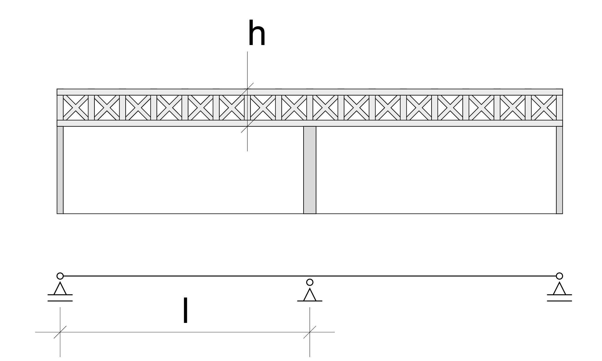</td>
                <td><strong>vakwerkliggers gelamineerd hout</strong><br> l=10 tot 80m <br> h.o.h.=2 à 5m <br> h=l/16 à l/18</strong></td>
            </tr>
            <tr>
                <td>Details</td>
                <td>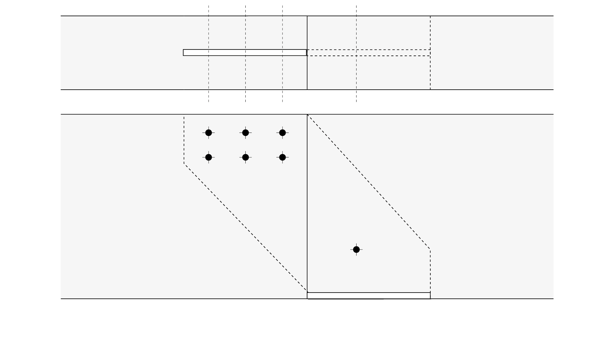</td>
                <td></td>
                <td>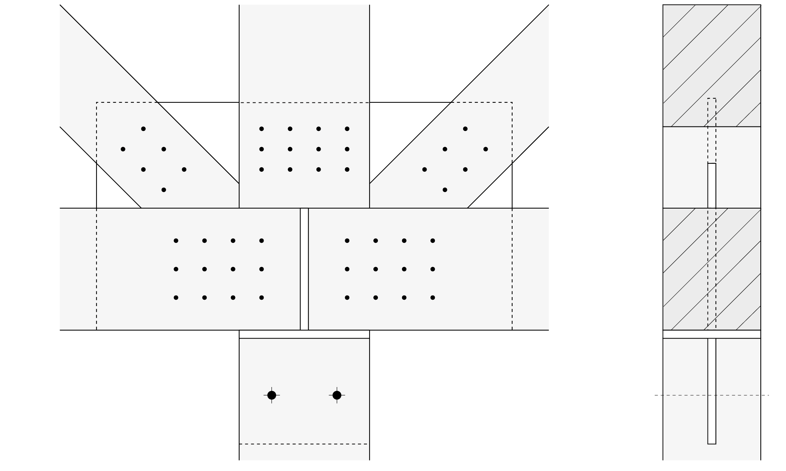</td>
            </tr>
            <tr>
                <td></td>
                <td>ligger-ligger verbinding, ingefreesde stalen plaat</td>
                <td>oplegging voor zware lasten, gelast</td>
                <td>verbinding in vakwerk (en kolom) m.b.v. koppelplaat, ingefreesd, stiften</td>
            </tr>
            <tr>
                <td>Toelichting</td>
                <td>De bovenranden moeten zijdelings worden gesteund</td>
                <td></td>
                <td></td>
            </tr>
        </tbody>
    </table>
</div>


<br>


<div style="overflow-y: auto;">
    <table style="width: 100%; border-collapse: collapse;">
        <thead style="position: sticky; top: 0; background-color: #f2f2f2;">
            <tr>
                <th></th>
                <th colspan="2">rechte vakwerkligger</th>
                <th></th>
            </tr>
        </thead>
        <tbody>
            <tr>
                <td></td>
                <td colspan="2">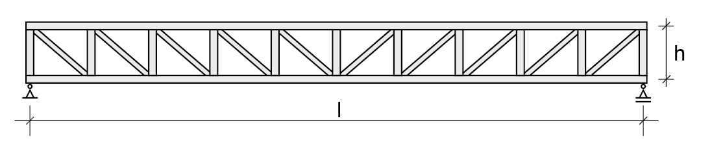</td>
                <td><strong>gezaagd hout</strong><br> l=5 tot 25m <br> h.o.h.=2,5 à 6m <br> h=l/10 à l/14 <br> <br> <strong>gelamineerd hout</strong> <br> l=20 tot 80m <br> h.o.h.=2,5 à 6m <br> h=l/10 à l/15 </td>
            </tr>
            <tr>
                <td>Verschijningsvormen</td>
                <td></td>
                <td>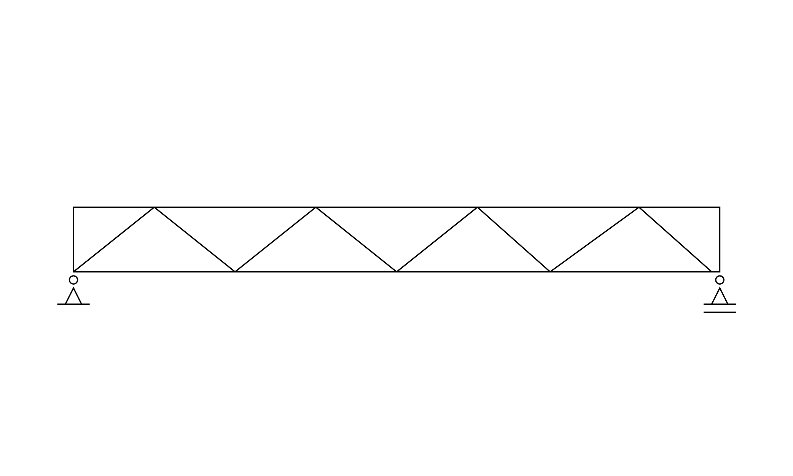</td>
                <td>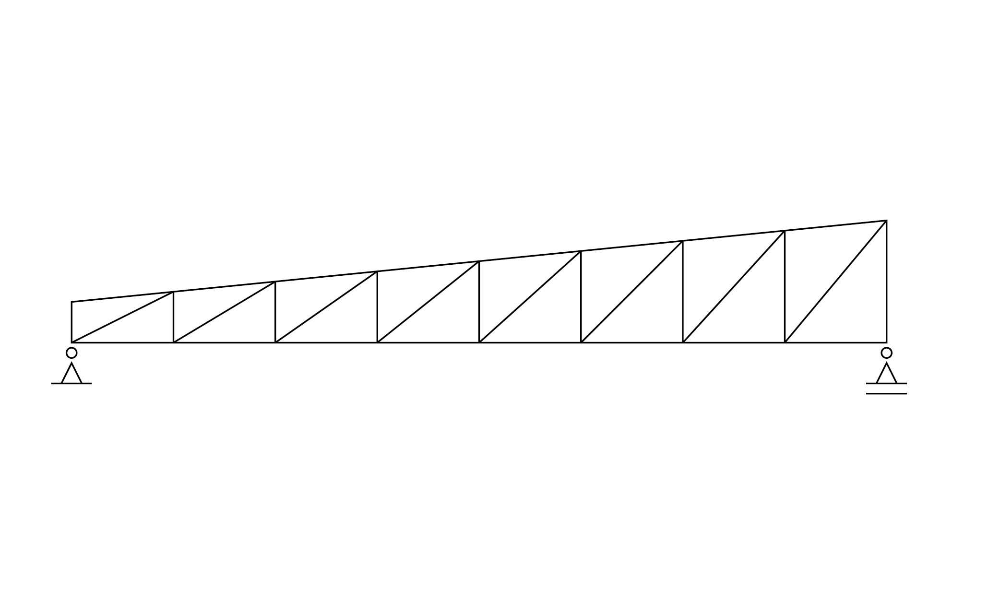</td>
            </tr>
            <tr>
                <td>Details</td>
                <td>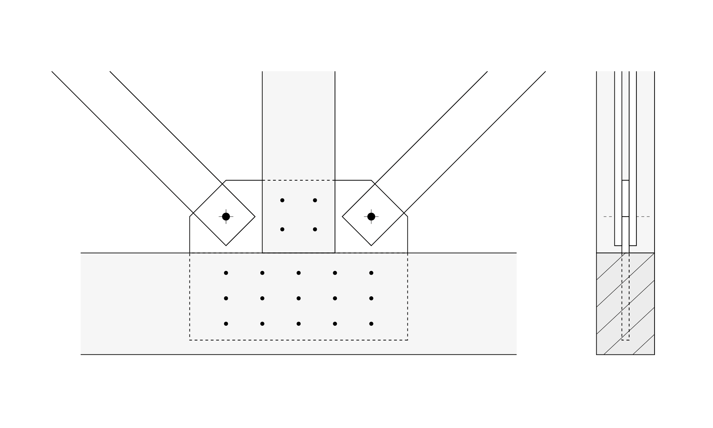</td>
                <td></td>
                <td></td>
            </tr>
            <tr>
                <td></td>
                <td>verbinding trekstaven (stalen strip), onderrand en drukstaaf (koppelplaat)</td>
                <td>verbinding onderrand en diagonalen, geschroevde stalen platen, stalen as</td>
                <td>verbinding onderrand en diagonalen, geschroevde stalen platen, stalen</td>
            </tr>
            <tr>
                <td>Toelichting</td>
                <td>De (gedrukte) bovenranden moeten zijdelings worden gesteund bij alle vakwerken. Bij vakwerken van het type 1 moet ook de onderrand zijdelings worden gesteund omdat de trekband weg kan klappen.</td>
                <td></td>
                <td></td>
            </tr>
        </tbody>
    </table>
</div>


<br>


<div style="overflow-y: auto;">
    <table style="width: 100%; border-collapse: collapse;">
        <thead style="position: sticky; top: 0; background-color: #f2f2f2;">
            <tr>
                <th></th>
                <th colspan="2">driehoekig- en trapeziumvormig vakwerk</th>
                <th></th>
            </tr>
        </thead>
        <tbody>
            <tr>
                <td></td>
                <td colspan="2"></td>
                <td><strong>gelamineerd hout</strong><br> l=7,5 tot 30m <br> h.o.h.=3 à 7m <br> h=l/10 à l/15</td>
            </tr>
            <tr>
                <td>Verschijningsvormen</td>
                <td>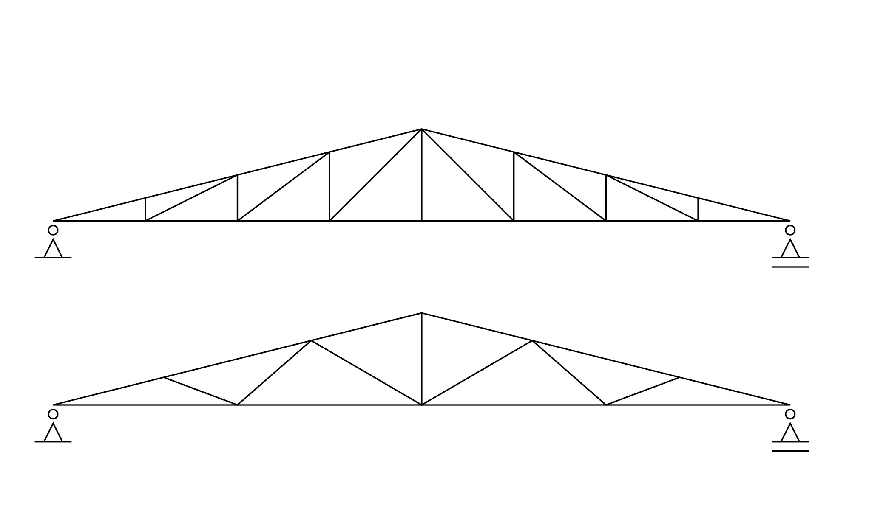</td>
                <td>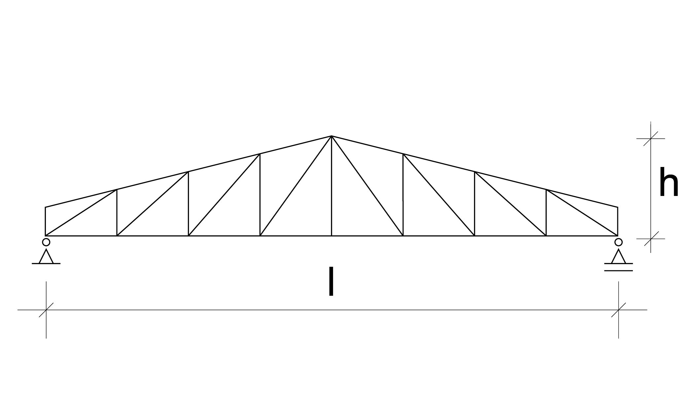</td>
                <td><strong>zadeldak gelamineerd hout</strong><br> l=7,5 tot 35m <br> h.o.h.=4 tot 10m <br> h=l/12</td>
            </tr>
            <tr>
                <td>Details</td>
                <td></td>
                <td>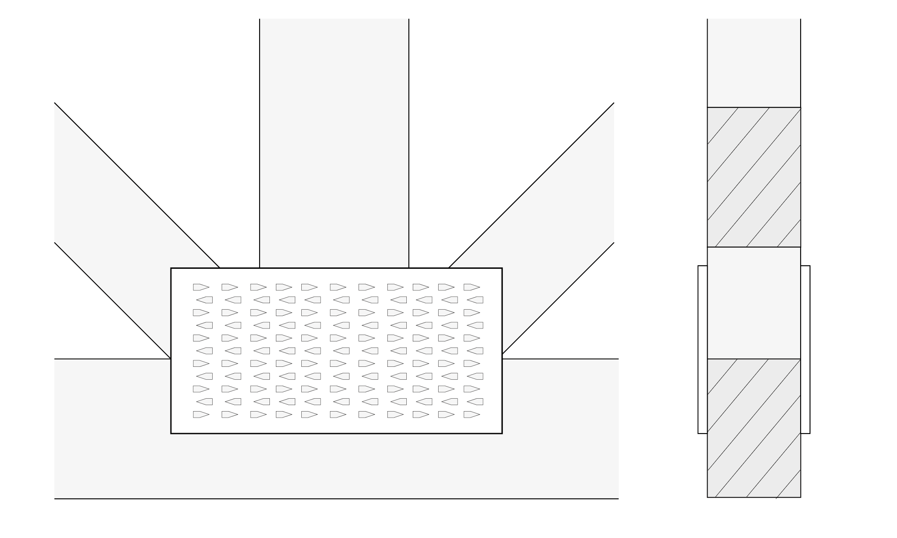</td>
                <td>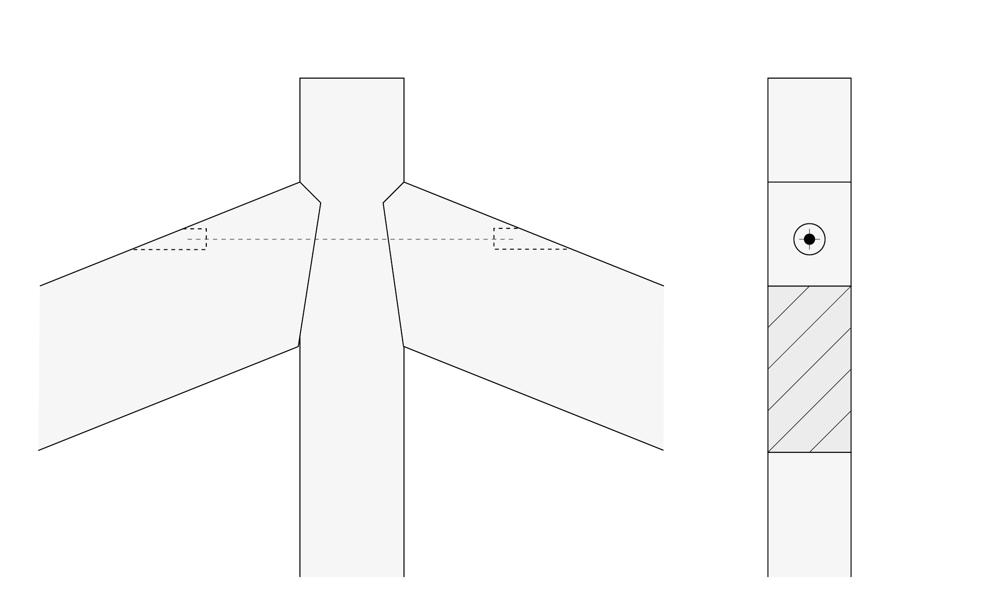</td>
            </tr>
            <tr>
                <td>Toelichting</td>
                <td>De bovenranden moeten zijdelings worden gesteund</td>
                <td></td>
                <td></td>
            </tr>
        </tbody>
    </table>
</div>


<br>


<div style="overflow-y: auto;">
    <table style="width: 100%; border-collapse: collapse;">
        <thead style="position: sticky; top: 0; background-color: #f2f2f2;">
            <tr>
                <th></th>
                <th colspan="2">onderspannen ligger</th>
                <th></th>
            </tr>
        </thead>
        <tbody>
            <tr>
                <td></td>
                <td colspan="2">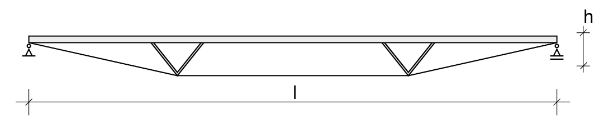</td>
                <td><strong>gelamineerd hout</strong> <br> l=8 tot 80m <br> h=l/15 à 1/20 </td>
            </tr>
            <tr>
                <td>Verschijningsvormen</td>
                <td></td>
                <td></td>
                <td></td>
            </tr>
            <tr>
                <td>Details</td>
                <td></td>
                <td>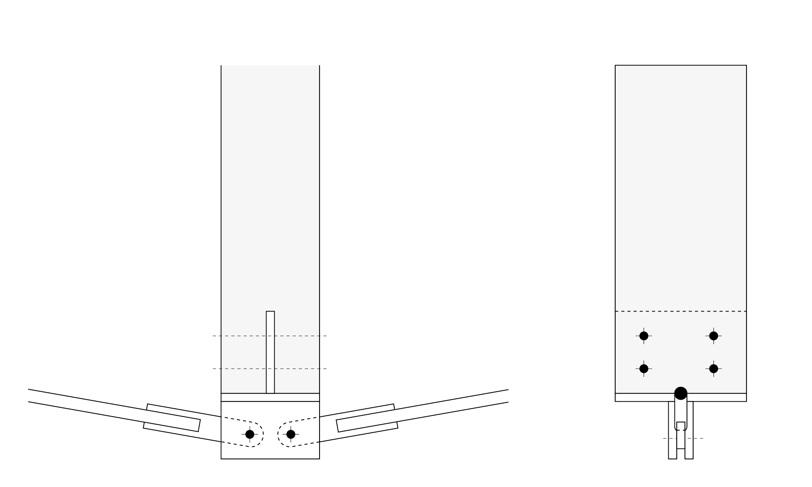</td>
                <td>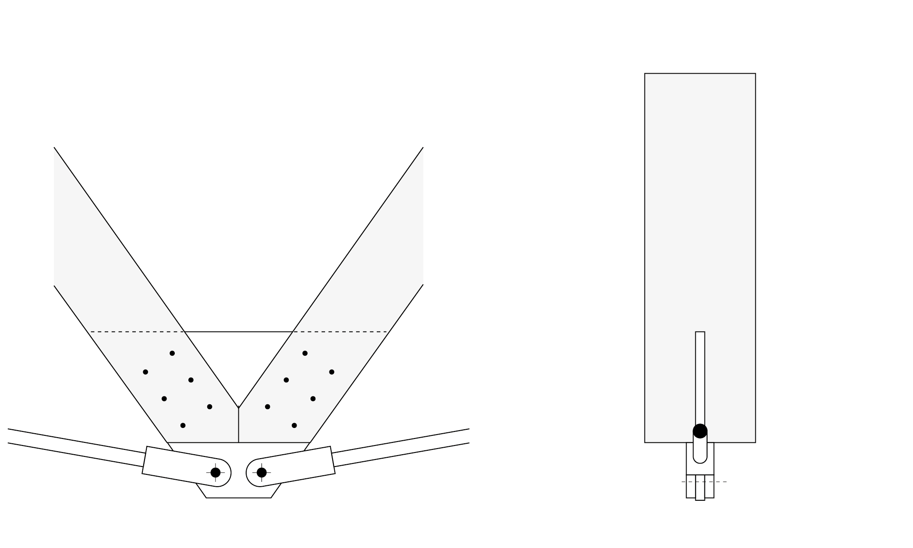</td>
            </tr>
            <tr>
                <td></td>
                <td>trekband bij de oplegging</td>
                <td>aansluiting trekstaven en drukstaaf, ingefreesde gelaste platen</td>
                <td>aansluiting trekstaven diagonalen, koppelplaat, stiften</td>
            </tr>
            <tr>
                <td>Toelichting</td>
                <td>De bovenranden moeten zijdelings worden gesteund. Ook moet de onderrand zijdelings worden gesteund, of in de bovenrand worden ingeklemd omdat de trekband anders weg kan klappen.</td>
                <td></td>
                <td></td>
            </tr>
        </tbody>
    </table>
</div>


<br>


<div style="overflow-y: auto;">
    <table style="width: 100%; border-collapse: collapse;">
        <thead style="position: sticky; top: 0; background-color: #f2f2f2;">
            <tr>
                <th></th>
                <th colspan="2">portaalspant</th>
                <th></th>
            </tr>
        </thead>
        <tbody>
            <tr>
                <td></td>
                <td colspan="2"></td>
                <td><strong>gelamineerd hout</strong> <br> l=10 tot 40m <br> h.o.h.=4 à 8m <br> h=l/15 à l/23</td>
            </tr>
            <tr>
                <td>Verschijningsvormen</td>
                <td></td>
                <td></td>
            </tr>
            <tr>
                <td>Details</td>
                <td>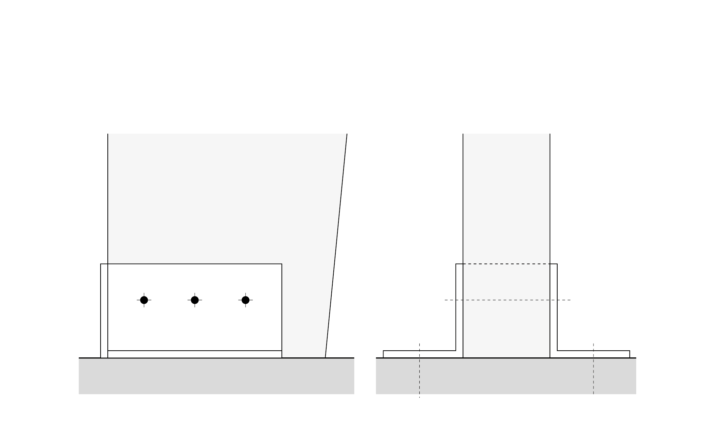</td>
                <td>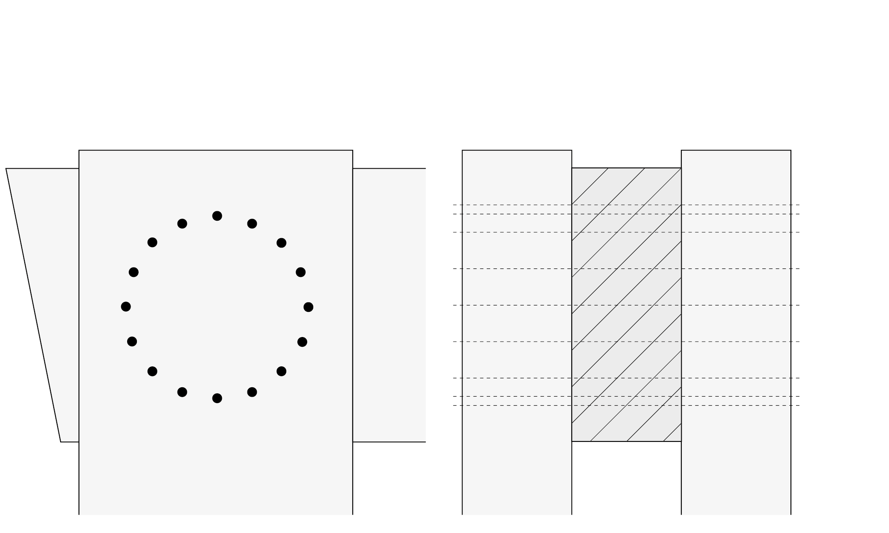</td>
                <td></td>
            </tr>
            <tr>
                <td></td>
                <td>kolom-vloer oplegging, hoekprofielen met opgelaste achterplaat, gebout</td>
                <td>momentvaste verbinding ligger kolom, stiften</td>
                <td>akolom-vloer oplegging, ingestorte beugels, gebout</td>
            </tr>
            <tr>
                <td>Toelichting</td>
                <td>Deze vloerverbinding is enkel geschikt voor kleine spatkrachten</td>
                <td></td>
                <td></td>
            </tr>
        </tbody>
    </table>
</div>


<br>


<div style="overflow-y: auto;">
    <table style="width: 100%; border-collapse: collapse;">
        <thead style="position: sticky; top: 0; background-color: #f2f2f2;">
            <tr>
                <th></th>
                <th colspan="2">drie scharnieren spant (rechte ligger)</th>
                <th></th>
            </tr>
        </thead>
        <tbody>
            <tr>
                <td></td>
                <td colspan="2"></td>
                <td><strong>gelamineerd hout, zonder trekband</strong> <br> l=15 tot 50m <br> f=l/3 <br> h.o.h.=5 à 8m <br> h=l/30 à l/50 <br> <br> <strong>gelamineerd hout, met trekband</strong> <br> l=15 à 50m <br> f=l/6 <br> h.o.h.=5 à 8m <br> h=l/30 à l/50</td>
            </tr>
            <tr>
                <td>Verschijningsvormen</td>
                <td>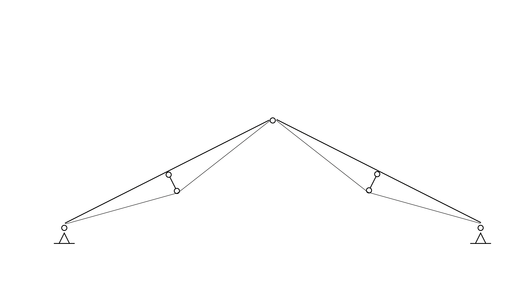</td>
                <td>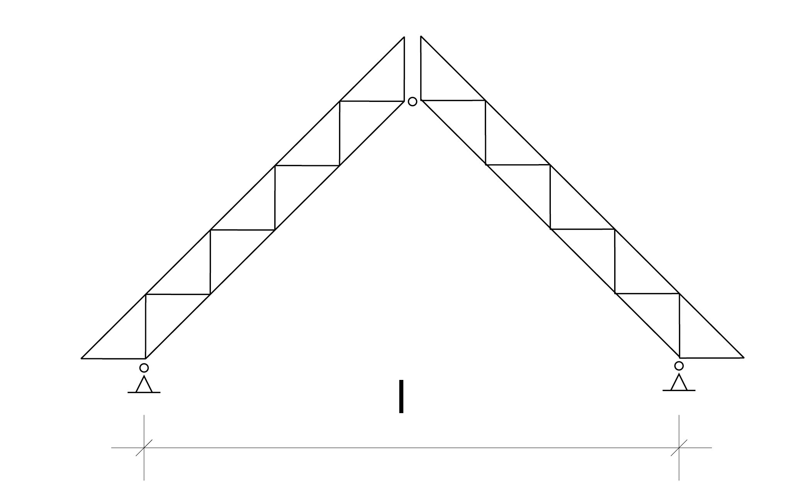</td>
            </tr>
            <tr>
                <td>Details</td>
                <td></td>
                <td></td>
                <td>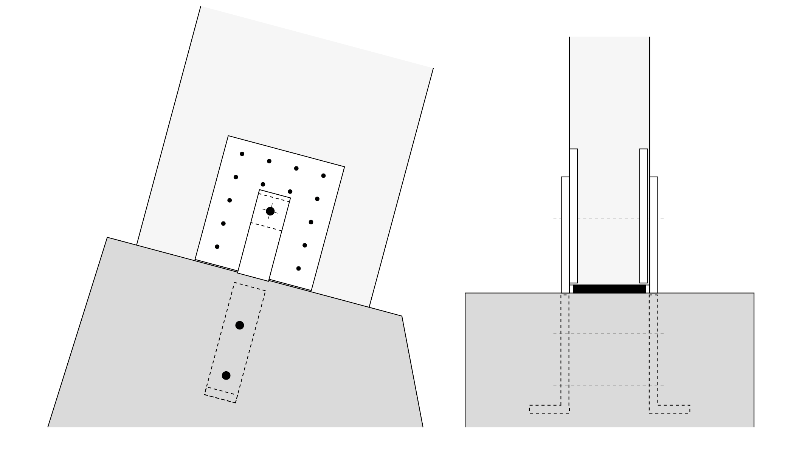</td>
            </tr>
            <tr>
                <td></td>
                <td>eenvoudige vloeroplegging, betonnen voet met elastomeer</td>
                <td>aansluiting dubbele trekband, oplegging op dubbele kolom</td>
                <td>kolom-vloer oplegging op betonnen voet, ingestorte beugels, geschroefde plaat</td>
            </tr>
            <tr>
                <td>Toelichting</td>
                <td>Deze verbinding is enkel geschikt voor kleine spatkrachten</td>
                <td></td>
                <td></td>
            </tr>
        </tbody>
    </table>
</div>


<br>


<div style="overflow-y: auto;">
    <table style="width: 100%; border-collapse: collapse;">
        <thead style="position: sticky; top: 0; background-color: #f2f2f2;">
            <tr>
                <th></th>
                <th colspan="2">drie scharnieren spant (gebogen/geknikt spantbeen)</th>
                <th></th>
            </tr>
        </thead>
        <tbody>
            <tr>
                <td></td>
                <td colspan="2">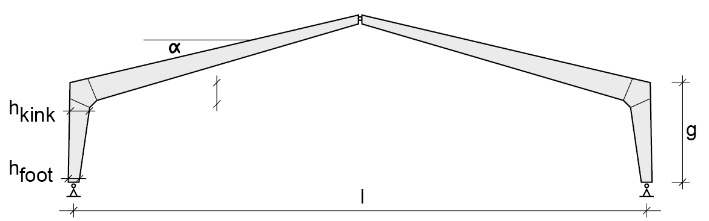</td>
                <td><strong>spant met geknikte hoeken</strong> <br> l=15 tot 50m <br> <alpha> <approx> 20<sup><circ></sup> <br> h.o.h.=4 à 5m <br> h<sub>knik</sub> = (l+g)/28 <br> h<sub>voet</sub> = 0,4 <cdot> h<sub>knik</sub></td>
            </tr>
            <tr>
                <td>Verschijningsvormen</td>
                <td>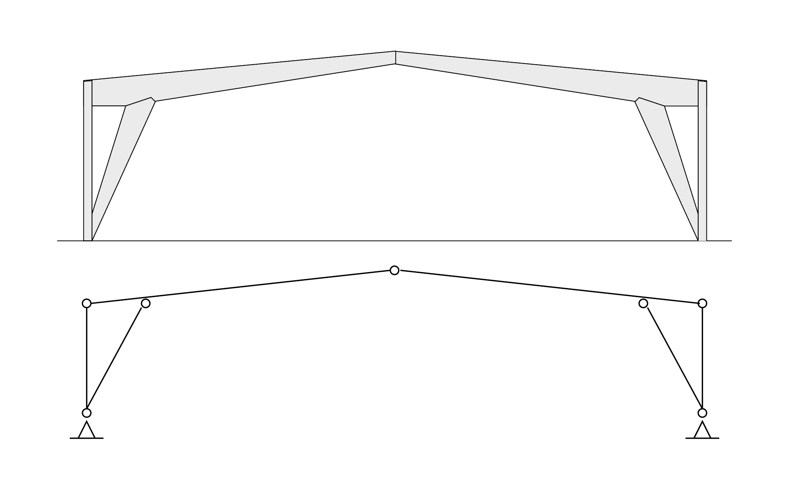</td>
                <td>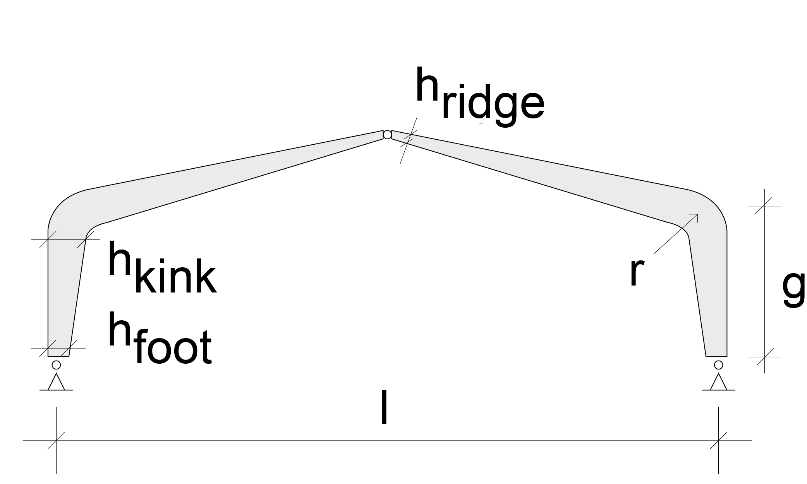</td>
                <td><strong>spant met gebogen hoeken</strong> <br> l=15 tot 50m <br> <alpha> <approx> 20<sup><circ></sup> <br> h.o.h.=4 à 5m <br> h<sub>knik</sub> = (l+g)/28 <br> h<sub>voet</sub> = 0,4 <cdot> h<sub>knik</sub></td>
            </tr>
            <tr>
                <td>Details</td>
                <td>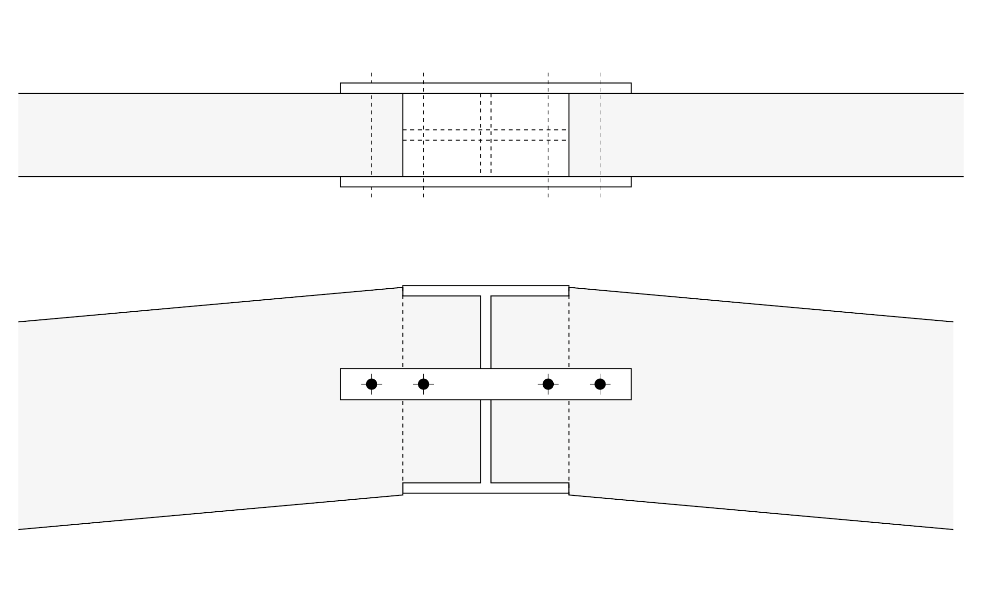</td>
                <td></td>
                <td></td>
            </tr>
            <tr>
                <td></td>
                <td>nokverbinding met trek zekering, ingefreesd I-profiel</td>
                <td>nokverbinding, gebout</td>
                <td>oplegging kolom op betonnen voet, gelaste stalen plaat</td>
            </tr>
            <tr>
                <td>Toelichting</td>
                <td>Deze verbinding is enkel geschikt voor kleine spatkrachten</td>
                <td></td>
                <td></td>
            </tr>
        </tbody>
    </table>
</div>


<br>


<div style="overflow-y: auto;">
    <table style="width: 100%; border-collapse: collapse;">
        <thead style="position: sticky; top: 0; background-color: #f2f2f2;">
            <tr>
                <th></th>
                <th colspan="2">boogspant (massieve en vakwerk ligger)</th>
                <th></th>
            </tr>
        </thead>
        <tbody>
            <tr>
                <td></td>
                <td colspan="2"></td>
                <td><strong>gelamineerd hout</strong> <br> l=20 tot 100m <br> f=l/5 à l/7 <br> h.o.h. (<)5m <br> h=l/45 <br> h.o.h.=5 tot 9m <br> h=l/40</td>
            </tr>
            <tr>
                <td>Verschijningsvormen</td>
                <td></td>
                <td></td>
                <td><strong>vakwerk gelamineerd hout</strong> <br> l=50 tot 120m <br> f=l/5 à l/8 <br> h.o.h.=5 tot 10m <br> h=l/20 à h=l/40</td>
            </tr>
            <tr>
                <td>Details</td>
                <td></td>
                <td></td>
                <td></td>
            </tr>
            <tr>
                <td></td>
                <td>nokverbinding, stalen schoenen (met pin)</td>
                <td>oplegging boogspant, gelaste stalen delen</td>
                <td>oplegging boogspant</td>
            </tr>
            <tr>
                <td>Toelichting</td>
                <td>Deze verbinding is enkel geschikt voor kleine spatkrachten</td>
                <td></td>
                <td></td>
            </tr>
        </tbody>
    </table>
</div>

