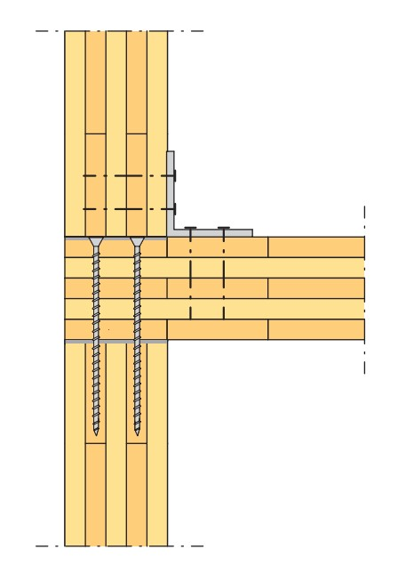
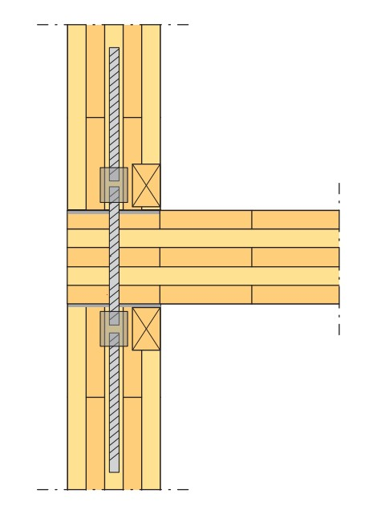

# Verbindingen

| **Voorbeelden van verbinding met liggers** | |
|--------------------------------------------|--|
|  |  |

 

| **Voorbeelden van verbinding met de fundering** | |
|------------------------------------------------|--|
|  |  |

 

| **Voorbeelden van verbinding tussen CLT wanden en vloeren** | | |
|-------------------------------------------------------------|--|--|
|  |  |  |

 

| **Voorbeeld van detail** |
|--------------------------|
|  |

 

| **Voorbeeld van detail** |
|--------------------------|
|  |
