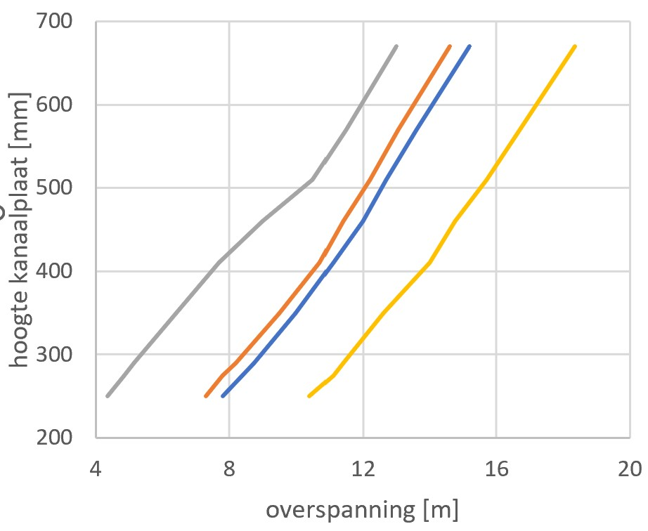
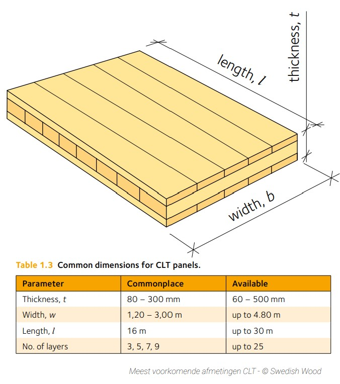
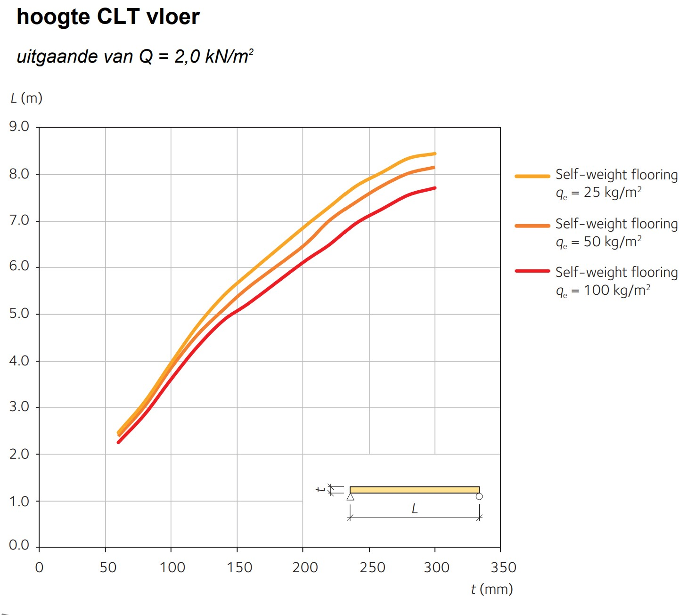

# Vloeren


**Houten kanaalplaatvloer**  
Een houtenkanaalplaat vloer is een vloerdeel bestaande uit verlijmde houten delen. Het is een betrekkelijk licht vloersysteem. Met onderstaande grafiek kan de benodigde hoogte van de plaat horend bij een bepaalde overspanning geschat worden.


`````{admonition} Houten kanaalplaat
:class: tip





Van links naar rechts:

* Grijze lijn: q=5 kN/m² (bijeenkomstruimte)
* Oranje lijn: q=2,5 kN/m² (kantoorfunctie)
* Blauwe lijn: q=1,75 kN/m² (woonfunctie)
* Gele lijn: q=1 kN/m² (dak)


`````


**CLT**  
CLT staat voor ‘Cross Laminated Timber’, in het Nederlands ‘kruislaaghout’. Het is een constructiemateriaal opgebouwd uit ten minste drie kruislings verlijmde enkel laags latten die haaks op elkaar zijn geplaatst, toepasbaar als wanden als vloeren. Bouwen met hout wordt daarom ook wel ‘massieve houtbouw’ genoemd.

Het kruislings verlijmen van de latten heeft een aantal voordelen:

- CLT-panelen dragen in twee richtingen.
- Er is geen uitzet, krimp of vervorming.
- Qua sterkte en stijfheid komen CLT-panelen in de buurt van beton.
- Er is enkel folie/tape nodig om de naden van aansluitende panelen te dichten.

De meeste gebruikte afmetingen van CLT panelen zijn:

- Breedte: tot 3.000 mm
- Lengte: tot 16.000 mm
- Dikte: tot 300 mm

Andere afmetingen zijn mogelijk, maar dan kom je al snel in de ‘specials’. De gebruikelijke diktes voor CLT panelen zijn:

- 160 mm voor de vloer
- 110 mm voor de wand

Dit is niet de totale dikte van de vloer- of wandopbouw, maar enkel het CLT-paneel. De dikte van de panelen is afhankelijk van de constructieve belasting en de akoestische- en brandveiligheidseisen.


`````{admonition} Meest voorkomende afmetingen CLT
:class: tip





`````

Voor de middenlagen van CLT wordt hout gebruikt wat anders afgekeurd zou worden; knoesten, verkleuring of beschadigd hout. Het is nooit de kern van de boom.

Er zijn 3 zichtklassen:

- Klasse A: Woon-zichtkwaliteit
- Klasse B: Industrie-zichtkwaliteit
- Klasse C: Niet-zichtkwaliteit

In CLT panelen wordt lijm gebruikt. Veelal wordt gebruikt gemaakt van twee soorten lijm: PUR-lijm of MUF-lijm. PUR is een lijm op basis van polyurethaan, MUF is gebaseerd op melamin-ureum-formaldehyde. Doorgaans wordt de voorkeur gegeven aan PUR-lijm; deze lijm is vrij van oplosmiddelen en formaldehyde en daarmee beter voor toekomstig hergebruik of recycling. Lijm is over het algemeen niet duurzaam, maar maakt slechts 1-2 procent van het product uit. Er zijn ook leveranciers die CLT panelen leveren met houtverbindingen in plaats van lijm. Dit is duurzamer, maar gaat ten koste van de stabiliteit van een paneel.


`````{admonition} Hoogte CLT vloer
:class: tip





© Swedish Wood


`````