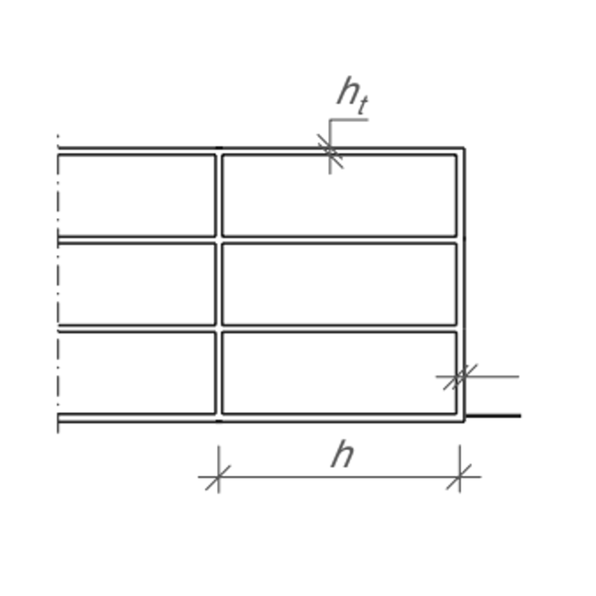
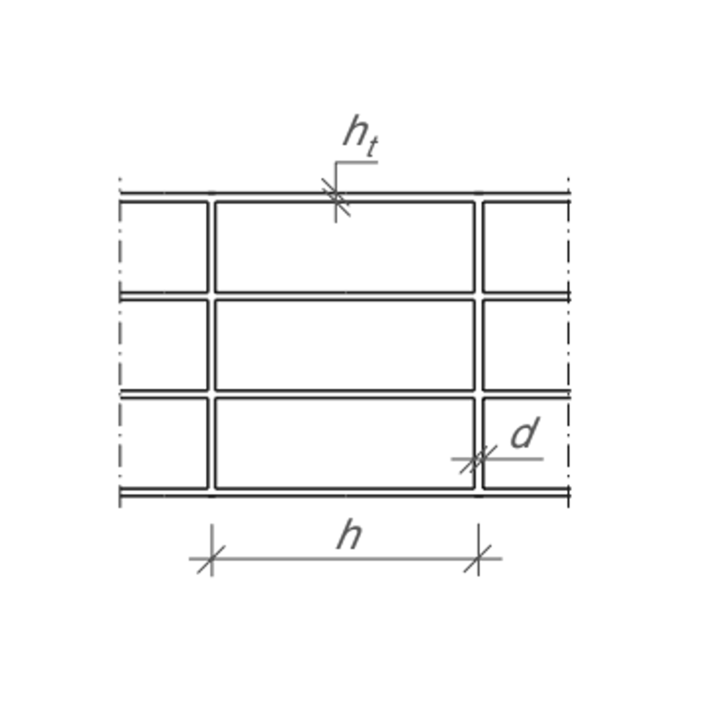

# Kalkzandsteen

## Minimale constructieve wanddikte d enkele eindgevel in mm (onderste bouwlaag)

| Aantal bouwlagen | 4 m   (ht = 180 mm) | 5 m   (ht = 200 mm) | 6 m   (ht = 220 mm) | 7 m   (ht = 240 mm) |
|---|---|---|---|---|
| 1 | 100 | 100 | 100 | 100 | 
| 2 | 100 | 100 | 100 | 100 | 
| 3 | 100 | 100 | 120 | 120 | 
| 4 | 100 | 120 | 120 | 120 | 
| 5 | 150 | 120 | 120 | 120 | 

$^{*}$ Beukmaat l in m (met dikte constructieve vloer = ht)

## Minimale constructieve wanddikte d enkele tussenwand in mm (onderste bouwlaag)

| Aantal bouwlagen | 4 m   (ht = 180 mm) | 5 m   (ht = 200 mm) | 6 m   (ht = 220 mm) | 7 m   (ht = 240 mm) |
|---|---|---|---|---|
| 1 | 100 | 100 | 100 | 100 | 
| 2 | 120 | 120 | 120 | 120 | 
| 3 | 120 | 120 | 150 | 120 | 
| 4 | 150 | 150 | 150 | 214 | 
| 5 | 150 | 214 | 214 | 214 | 

$^{*}$ Beukmaat l in m (met dikte constructieve vloer = ht)

*Bron: gebaseerd op NPR 6791*