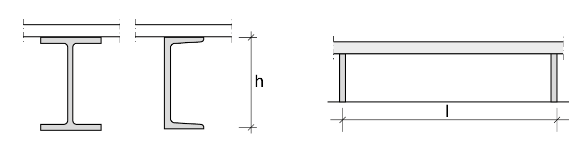
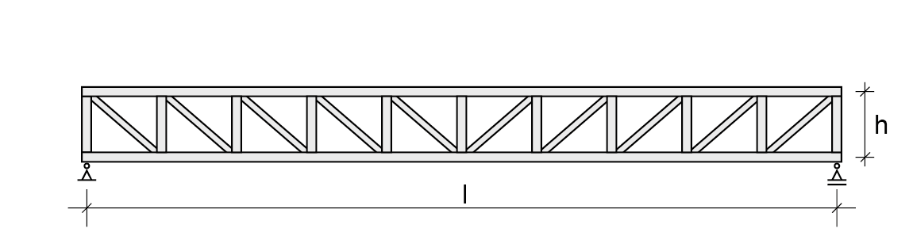
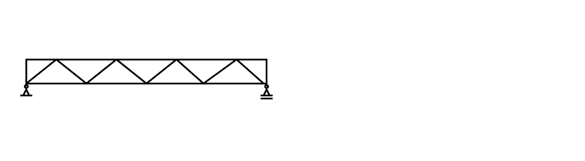
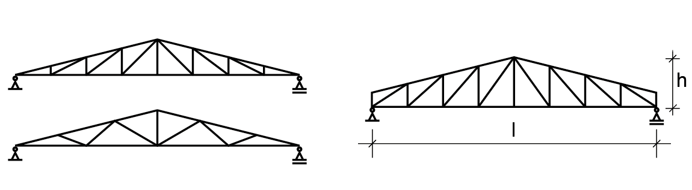
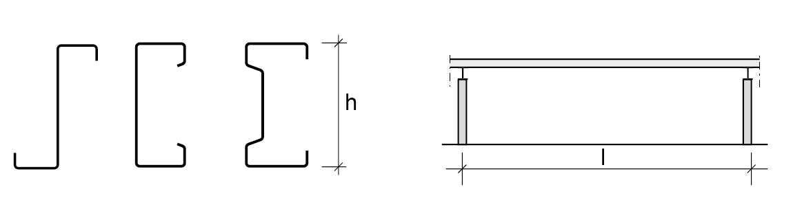
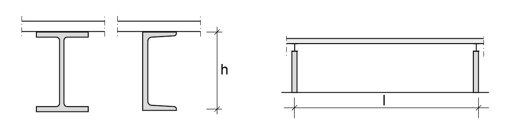

# Liggers

## Hoofdliggers van Verdiepingsvloeren

| **H-profielen en kokers** |  |
|---|---|
|    Breedflens (H-)profielen en kokers | $ l = 4 \; \text{m} $   $ h = 100 \; \text{mm} $   $ h = \frac{l}{18} \; \text{of} \; \frac{l}{28} $ |

| **I- en U-profielen** |  |
|---|---|
|    I- en U-profielen als hoofdliggers | $ l = 6 \; \text{m} $   $ h = 200 \; \text{mm} $   $ h = \frac{l}{15} \; \text{of} \; \frac{l}{20} $ |

| **Vakwerkliggers** |  |
|---|---|
|  | $ l = 12 \; \text{m} $   $ h = 1000 \; \text{mm} $   $ h = \frac{l}{8} \; \text{of} \; \frac{l}{15} $ |

## Hoofdliggers Dakconstructies

| **H-profielen en kokers** |  |
|---|---|
|  | $ l = 6 \; \text{m} $   $ h = 100 \; \text{mm} $   $ h = \frac{l}{20} \; \text{of} \; \frac{l}{30} $ |

| **Vakwerkligger I** |  |
|---|---|
|  | $ l = 12 \; \text{m} $   $ h = \frac{l}{10} \; \text{of} \; \frac{l}{18} $ |

| **Vakwerkligger II** |  |
|---|---|
|  | $ l = 5 \; \text{m} $   $ h = 300 \; \text{mm} $   $ h = \frac{l}{15} \; \text{of} \; \frac{l}{25} $ |

| **Driehoekdakligger** |  |
|---|---|
|  | $ l = 8 \; \text{m} $   $ h = 300 \; \text{mm} $   $ h = \frac{l}{5} \; \text{of} \; \frac{l}{10} $ |

## Gordingen Dakconstructies

| **Koudgewalst profiel** |  |
|---|---|
|  | $l = 3 \; \text{m}$   $h = 120 \; \text{mm}$   $h = \frac{l}{25} \; \text{of} \; \frac{l}{35}$ |

| **Warmgewalst profiel** |  |
|---|---|
|  | $l = 6 \; \text{m}$   $h = 200 \; \text{mm}$   $h = \frac{l}{18} \; \text{of} \; \frac{l}{26}$ |
