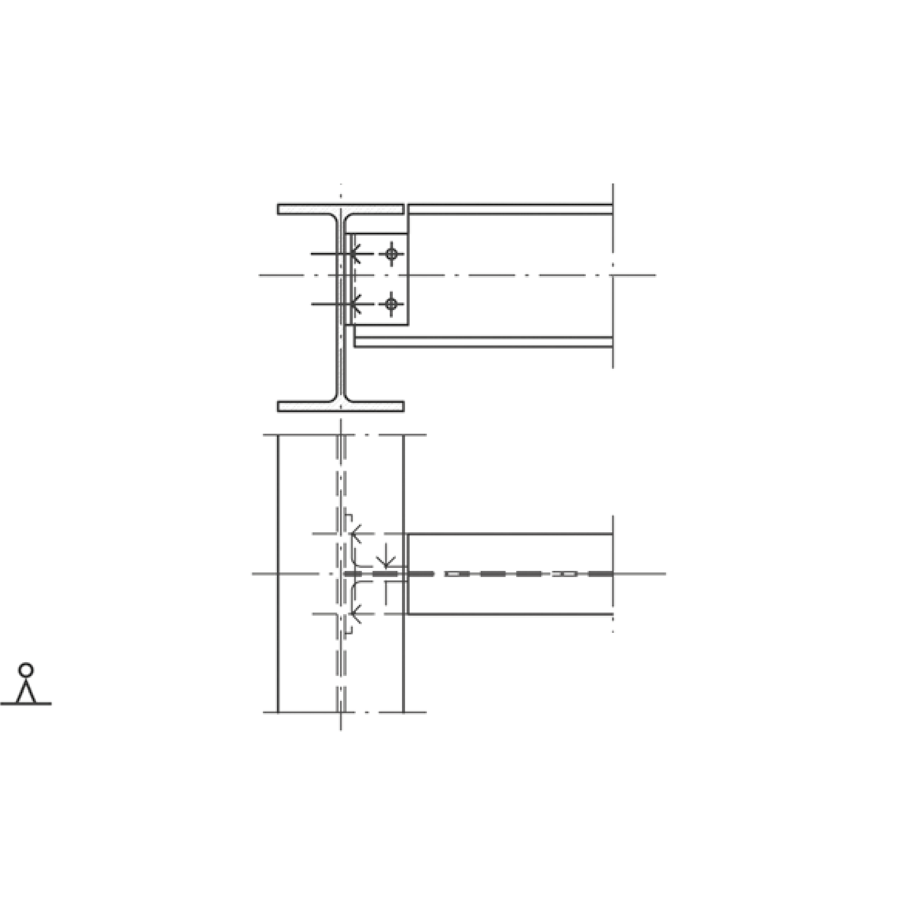

# Verbindingen

## Verbindingsdetails (matrix)

Deze matrix geeft een beeld van verschillende verbindingsdetails van stalen constructies. De details zijn ten opzichte van elkaar gerangschikt op basis van de stijfheid van de verbinding. De matrix geeft dus alleen maar een indicatie van de stijfheid van de verbinding. Men zal altijd moeten nagaan of de verbinding zich gedraagt zoals bij de berekening van de constructie aangenomen.

**Middenkolom-ligger**

**Eindkolom-ligger**

**Doorg. kolom-ligger**

**Kolomvoet**

**Ligger-ligger**

**Ligger-wand**

## Verbindingsdetails

**Scharnierende verbinding** 

**Stijve verbinding** 

 

| **Middenkolom-ligger** |  |  |
|---|---|---|
|  |  |  |
|Opgelaste kopplaat met vier bouten | Opgelaste plaat met vier bouten,   met ingelaste verstijvingen van het liggerlijf | Grote opgelaste plaat met acht   bouten, met ingelaste verstijvingen |

| **Middenkolom-ligger** |  |  |
|---|---|---|
|  |  |  |
| Opgelaste kopplaat met vier bouten | Opgelaste kopplaat met   ingelaste verstijvingen van het liggerlijf | Gelaste plaat, gebout, met ingelaste verstijvingen |

| **Middenkolom-ligger plaatjes** |  |
|---|---|
|  |  |
| Eenvoudige verbinding met opgelaste plaat,   tijdens de montage is de ligger vastgebout   (parkeergarage nabij openbare bibliotheek Delft) | Opgelaste kopplaat met vier bouten buiten   het profiel geplaatst |

| **Eindkolom-ligger** |  |  |
|---|---|---|
|  |  |  |
| Opgelaste kopplaat met twee bouten | Twee hoekprofielen met negen bouten | Grote opgelaste plaat, bovenplaat   voor trekspanning met ingelaste verstijvingen |

| **Eindkolom-ligger** |  |  |
|---|---|---|
|  |  |  |
| Opgelaste kopplaat met twee bouten | Opgelaste plaat met zes bouten | Grote opgelaste plaat met zestien   bouten, met ingelaste verstijvingen |

| **Eindkolom-ligger** |  |
|---|---|
|  |  |
| Opgelaste kopplaat met twee bouten | Opgelaste plaat met vier bouten, met ingelaste   verstijvingen van het liggerlijf |

| **Eindkolom-ligger** |  |
|---|---|
|  |  |
| Raatligger balk-kolomverbindingen worden ontworpen zoals bij conventionele balken. Let op dwarskrachten en de schuifspanningen in het liggerlijf. | Balk-kolom verbinding gebruikmakend van hoekprofielen die gebout zijn aan het lijf van de ligger en het lijf of de flens van de kolom. |

| **Doorg. kolom-ligger** |  |  |
|---|---|---|
|  |  |  |
| Aansluiting met geboute hoekprofielen | Aansluiting met opgelaste kopplaat, daarna gebout | Nokaansluiting met opgelaste platen, gebout, kolomflens extra verstrijfd |

| **Doorg. kolom-ligger** |  |  |
|---|---|---|
|  |  |  |
| Balk-kolom verbinding met kopplaten. De kopplaat is in de werkplaats op de kop van de balk gelast en wordt bij de montage vastgebout aan de kolom. | Balk kolom verbinding met geboute kopplaten. De balken zijn doorverbonden op het lijf van de kolom. | Een verstijfde balk kolom verbinding. Zo ontstaat een stijf staalskelet. Bij soortgelijke constructies kun je een plastische berekening uitvoeren. |

| **Kolomvoet** |  |  |
|---|---|---|
|  |  |  |
| Kolomvoet, opgelaste plaat met dubbele bout |  Kolomvoet, opgelaste plaat met vier bouten | Kolomvoet, bouten buiten het profiel, levert een stijvere verbinding |

| **Kolomvoet** |  |  |
|---|---|---|
|  |  |  |
| Kolomvoet opgelaste plaat met enkele rij bouten | Overeenkomstig met tekening | Overeenkomstig met tekening |

| **Ligger-ligger** |  |  |
|---|---|---|
|  |  |  |
| Aansluiting met geboute hoekstalen | Aansluiting met opgelaste plaat daarna gebout | Nokaansluiting met opgelaste platen, daarna gebout,   onder extra verstijfd |

| **Ligger-ligger** |  |  |
|---|---|---|
|  |  |  |
| Aansluiting met geboute hoekstalen | Overeenkomstig met tekening | Nokverbinding van een portaal.   De verstijving verhoogt de moment   weerstand en dus de stijfheid |

| **Ligger-wand** |  |  |
|---|---|---|
|  |  |  |
| Oplegging op elastomeer,   bout fungeert om afschuiven   te voorkomen | Aansluiting op wand met   dubbele bout | Oplegging met stalen as |
