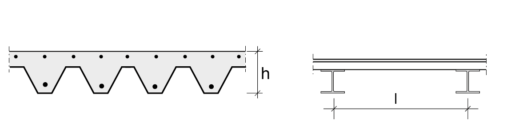
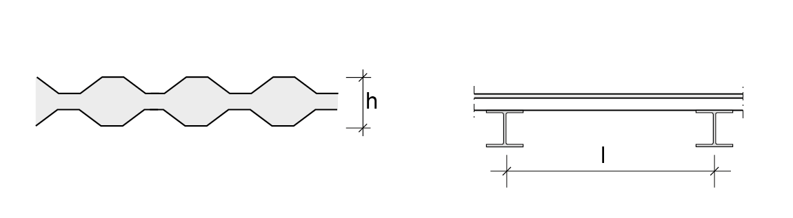

# Vloeren

| **Staal-betonvloeren** |  |
|---|---|
|    Hoedliggers met opgestorte druklaag, met of zonder deuvels | $ l = 7 \; à \; 15 \; \text{m} $   $ h = 300 \; à \; 1000 \; \text{mm} $   $ h = \frac{l}{20} \; à \; \frac{l}{25} $ |

| **Staalplaatbetonvloer** |  |
|---|---|
|    Staalplaatbetonvloer met extra wapening | $ l = 2 \; à \; 4 \; \text{m} $   $ h = 100 \; à \; 150 \; \text{mm} $   $ h = \frac{l}{25} \; à \; \frac{l}{30} $ |

| **Ruimtevakwerk** |  |
|---|---| 
|  | $ l = 30 \; à \; 150 \; \text{m} $   $ h = \frac{l}{15} \; à \; \frac{l}{30} $ |

## Dakplaten dakconstructies

| **Koudgewalste plaat** |  |
|---|---| 
|    Koudgewalste geprofileerde verzinkte plaat | $l = 2 \; à \; 6 \; \text{m}$   $h = 25 \; à \; 120 \; \text{mm}$   $h = \frac{l}{40} \; à \; \frac{l}{70}$ |

| **Koudgewalst profiel** |  |
|---|---|  
|    Sandwichpanelen met koudgewalste stalen platen | $l = 2 \; à \; 30 \; \text{m}$   $h = 75 \; \text{mm}$   $h = \frac{l}{25} \; à \; \frac{l}{30}$ |
