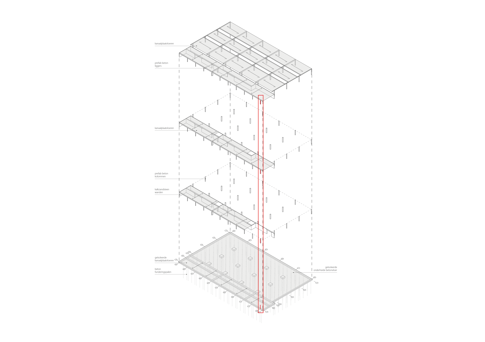

# Dimensioneren met vuistregels





## Vloer

>
>We dimensioneren de breedplaatvloer. De overspanning van deze vloer is 6 meter.
>De vuistregel die we gebruiken: 
>
>$ h = \frac{l}{30} $
>
>$ h = \frac{6000}{30} = 200 mm$
>
>Volgens de vuistregel moet de vloer dus minimaal 200 mm dik zijn. Er is gekozen om een vloer met dikte 250 mm toe te passen
>


## Ligger

>
>We dimensioneren de prefab ligger. De overspanning is 7,2 meter.
>De vuistregel die we gebruiken: 
>
>$ h = \frac{l}{20} $
>
>$ h = \frac{7200}{20} = 360 mm$
>
>Volgens de vuistregel moet de ligger dus minimaal 360 mm zijn. Er is gekozen voor een ligger van 500 x 200 mm toe te passen
>


## Kolom

>
>We dimensioneren de prefab kolom. De verdiepingshoogte is 3 meter.
>De vuistregel die we gebruiken: 
>
>$ h = \frac{l}{10} $
>
>$ h = \frac{3000}{10} = 300 mm$
>
>Volgens de vuistregel moet de kolom dus minimaal 300 mm zijn. Er is gekozen voor een kolom van 200 mm toe te passen, dit voldoet dus **niet** aan de eisen.
>


`````{admonition} Tip
:class: tip
De vuistregels voor beton vind je [hier](../../ontwerp/beton/beton_intro.md)
`````
