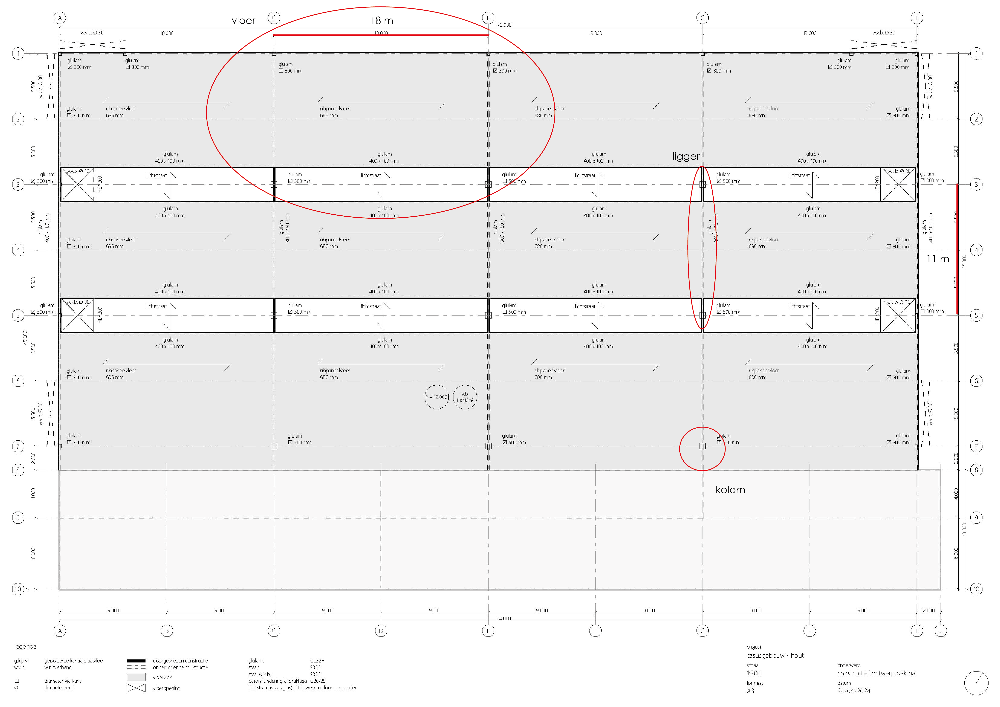

# Berekeningen




## Vloer

>
>We voeren de berekening uit voor de ribpaneelvloer. De overspanning van deze vloer is 18 meter.
>Uit de grafiek te lezen: 
>
>Gele lijn $ q = 1 kN/m^2 $ (dak) kruist op een overspanning van 18 meter met de hoogte voor 600 mm
>
>Dus:
>
>De ribpaneelvloer heeft een hoogte van 686 mm, dus de vloer voldoet aan de eisen.
>
>`````{admonition} Tip
>:class: tip
>De vuistregels voor vloeren van hout vind je [hier](../../ontwerp/hout/vloeren.md)
>`````
>


## Ligger

>
>We voeren de berekening uit voor de gluelam ligger. De overspanning is 11 meter.
>
>$ h = \frac{l}{16} $
>
>Dus:
>
>$ h = \frac{11000}{16} = 700 mm$
>
>De ligger is 800 x 150 mm en moet minimaal 700 mm zijn, dus voldoet aan de eisen.
>
>`````{admonition} Tip
>:class: tip
>De vuistregels voor liggers van hout vind je [hier](../../ontwerp/hout/liggers.md)
>`````
>


## Kolom

>
>We voeren de berekening uit voor de gluelam kolom. De verdiepingshoogte is 3 meter.
>Uit de grafiek te lezen: 
>
>De grafiek gaat tot 8 meter, maar laten we het dubbele nemen van de kruising met 6 meter = 460 mm
>
>Dus:
>
>De kolom moet minimaal 460 mm zijn en is 500, dus voldoet ruim aan de eisen.
>
>`````{admonition} Tip
>:class: tip
>De vuistregels voor kolommen van hout vind je [hier](../../ontwerp/hout/kolommen.md)
>`````
>
