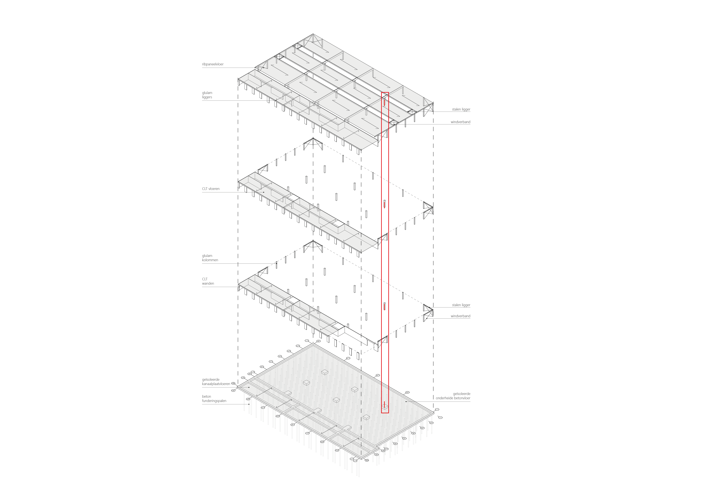

# Dimensioneren met vuistregels





## Vloer

>
>We dimensioneren de ribpaneelvloer. De overspanning van deze vloer is 18 meter.
>Uit de grafiek te lezen: 
>
>Gele lijn $ q = 1 kN/m^2 $ (dak) kruist op een overspanning van 18 meter met de hoogte voor 600 mm
>
>Volgens de vuistregel moet de vloer dus minimaal 600 mm dik zijn. Er is gekozen om een vloer met dikte 686 mm toe te passen
>


## Ligger

>
>We dimensioneren de gluelam ligger. De overspanning is 11 meter.
>
>$ h = \frac{l}{16} $
>
>$ h = \frac{11000}{16} = 700 mm$
>
>Volgens de vuistregel moet de ligger dus minimaal 700 mm zijn. Er is gekozen om een ligger van 800 x 150 mm toe te passen
>


## Kolom

>
>We dimensioneren de gluelam kolom. De verdiepingshoogte is 3 meter.
>Uit de grafiek te lezen: 
>
>De grafiek gaat tot 8 meter, maar laten we het dubbele nemen van de kruising met 6 meter = 460 mm
>
>Volgens de vuistregel moet de kolom dus minimaal 460 mm zijn. Er is gekozen om een kolom met dikte 500 mm toe te passen
>


`````{admonition} Tip
:class: tip
De vuistregels voor hout vind je [hier](../../ontwerp/hout/hout_intro.md)
`````

