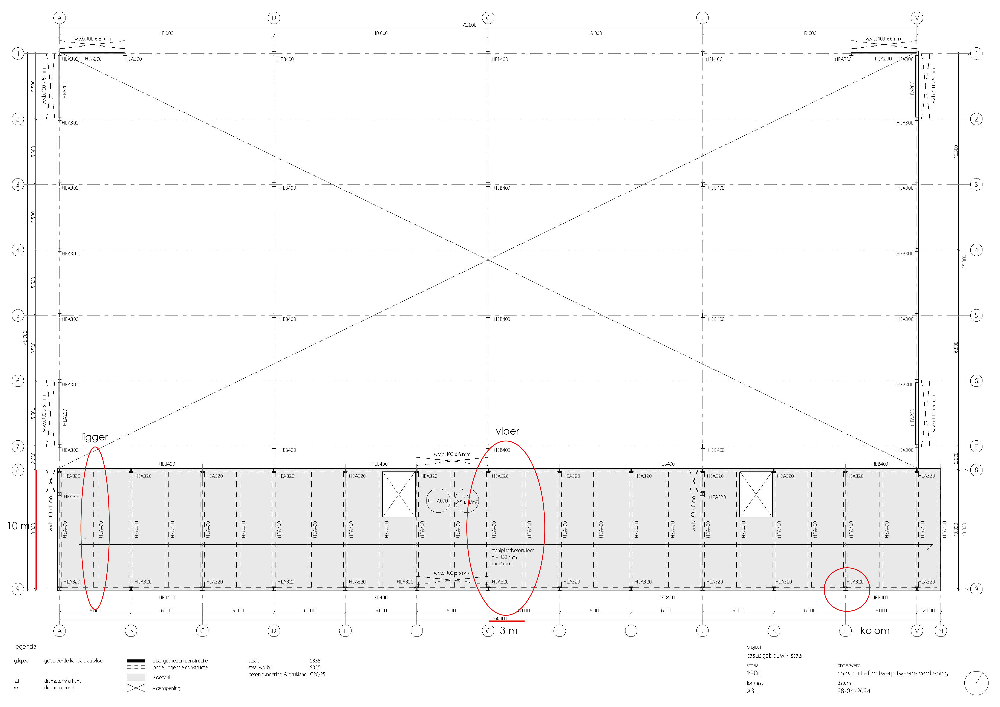
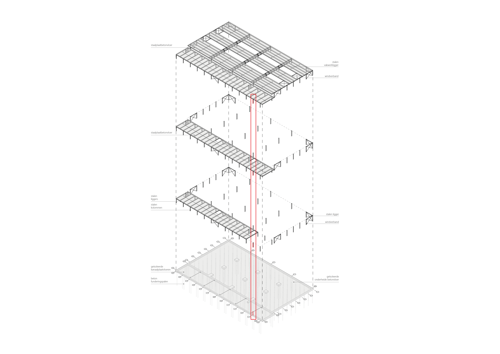

# Dimensioneren met vuistregels





## Vloer

>
>We dimensioneren de staalplaatbetonvloer. De overspanning van deze vloer is 3 meter.
>De vuistregel die we gebruiken: 
>
>$ h = \frac{l}{20} $
>
>$ h = \frac{3000}{20} = 120 mm$
>
>Volgens de vuistregel moet de vloer dus minimaal 120 mm dik zijn. Er is gekozen om een vloer met dikte 150 mm toe te passen
>


## Ligger

>
>We dimensioneren de HEA400 ligger. De overspanning is 10 meter.
>De vuistregel die we gebruiken: 
>
>$ h = \frac{l}{25} $
>
>$ h = \frac{10000}{25} = 400 mm$
>
>Volgens de vuistregel moet de ligger dus minimaal 400 mm zijn. Er is gekozen om een ligger HEA400 toe te passen
>


## Kolom

>
>We dimensioneren de HEA320 kolom. De verdiepingshoogte is 3 meter.
>De vuistregel die we gebruiken voor L < 4 meter: 
>
>$ kolom = \frac{l}{20} $
>
>$ kolom = \frac{3000}{20} = 150 mm$
>
>Volgens de vuistregel moet de kolom dus minimaal 150 mm zijn. Er is gekozen om een kolom HEA320 toe te passen
>


`````{admonition} Tip
:class: tip
De vuistregels voor staal vind je [hier](../../ontwerp/staal/staal_intro.md)
`````
