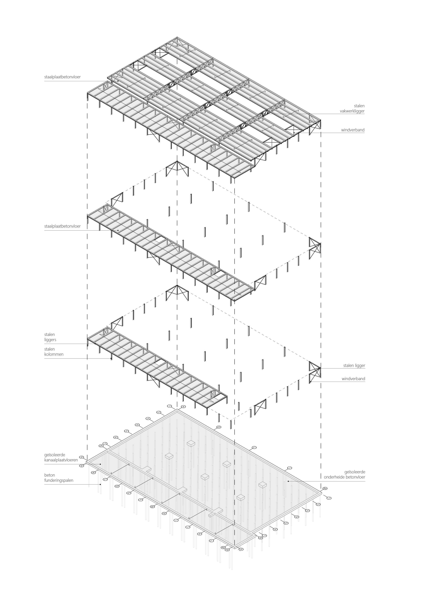

# Tekeningen



<p style="text-align:center;"><b><i>Fig 1.6</i></b> Axonometry of the Octatube building in steel</p>


```{figure} Images/staal2.jpg
---
---
Section 1 in steel
```

```{figure} Images/staal3.jpg
---
---
Section 2 in steel
```

```{figure} Images/staal4.jpg
---
---
Section 3 in steel
```

```{figure} Images/staal5.jpg
---
---
Section 4 in steel
```

```{figure} Images/staal6.jpg
---
---
Section 5 in steel
```